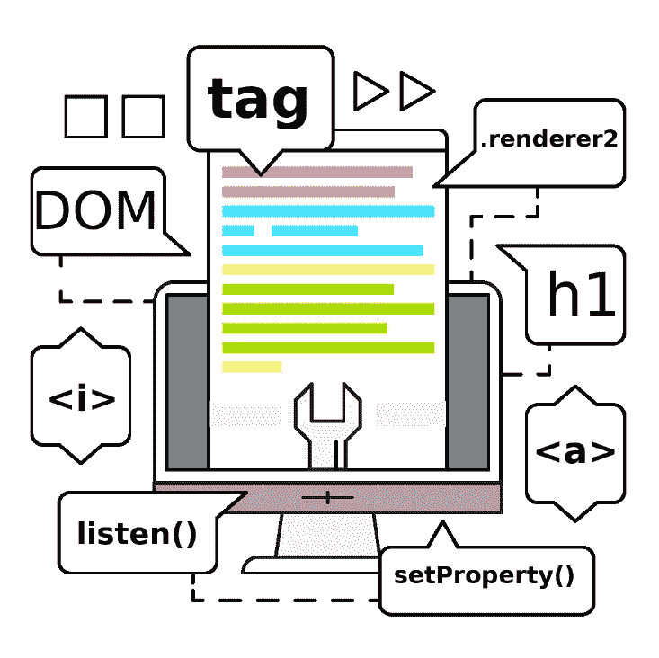

# 在角度中使用渲染器 2

> 原文：<https://itnext.io/using-renderer2-in-angular-8f80da6756f8?source=collection_archive---------1----------------------->

## 这就是我们在 Angular 中操作 DOM 的方式



如果你开始作为一名前端开发人员工作，你发现自己在浏览器上做了数千种动画，弹跳按钮，模拟日周期，感觉自己像个半神，即使你还不擅长 Javascript，不知何故你发现自己有勇气切换到 Angular 这样的框架。你心里会有疑问。其中一个问题是:“如果我想修改 DOM，除了原生 JS 方法，我还能使用什么？”

此时，您可以最终使用 Renderer2 来满足您的一些需求。因为说到 DOM 操作，Renderer2 是我们可以使用的最准确的方法之一。

当然，VanillaJS 为我们提供了 DOM 操作选项，用“document.querySelector”从 DOM 中选择元素，并从 DOM 中添加、删除、移除元素。非常基本的方法，总而言之，这是一个 Javascript 应用程序。然而，如果我们使用本地方法，我们就失去了许多重要的机会，例如 Angular 的 DOM 抽象方法，以及在非 DOM 环境中执行，例如服务器端渲染、Web-Worker、移动应用和桌面应用。

如果你带着嫉妒和羡慕的眼光看网站，你可以利用 Renderer2 的易用性和美观性。如果您需要“createElement”、“addClass”、“removeClass ”,第一个选项应该是 Renderer2。
(尽管如此，Angular 可能不是我上面提到的例子中使用的第一个框架)

Renderer2 主要用于创建自定义指令。因为指令是所有组件和用 Angular 开发应用程序的每个人使用的构建块。所有组件实际上都是指令。我们可以用一个简单的例子来说明这些基本知识:

您可能对这个 Stackblitz 示例有更好的看法:

[](https://stackblitz.com/edit/renderer2-animate?embed=1&file=src/app/animate.directive.ts) [## 渲染 2-动画-堆栈

### 导出到 Angular CLI 的 Angular 应用程序的启动项目

stackblitz.com](https://stackblitz.com/edit/renderer2-animate?embed=1&file=src/app/animate.directive.ts) 

这就是 Renderer2 作为指令使用的方式。但是我们也可以在组件内部使用它！

在下面的例子中，在`ViewChild`装饰器的帮助下，我们可以创建一个`button`:

我们可以通过这个 Stackblitz 示例详细了解这一点:

[](https://stackblitz.com/edit/angular-renderer2-incomponent-usage?embed=1&file=src/app/app.component.html) [## 角度渲染器 2-不一致-使用-堆叠

### 导出到 Angular CLI 的 Angular 应用程序的启动项目

stackblitz.com](https://stackblitz.com/edit/angular-renderer2-incomponent-usage?embed=1&file=src/app/app.component.html) 

Renderer2 有 19 个方法。从这里使用它们相当容易。

# **createElement()**

大多数 Renderer2 方法都是不言自明的。`createElement()`创建宿主元素的一个实例，并期望两个输入(一个可选)

```
createElement(name: string, namespace?: string):any
```

但是如果您打开浏览器控制台并搜索所创建的元素，您将找不到任何内容。首先，你必须把它放在某个地方。可以用`appendChild()`。

# **appendChild()**

向 Host 元素中的给定父节点追加一个子节点。期望 2 个输入，一个用于父节点，一个用于子节点，这是您之前用`createElement()`创建的。

```
appendChild(parent: any, newChild: any):
```

现在你创建了一个元素，比如说一个按钮。并将它放在父标签之间。但是你在屏幕上看不到任何东西。为什么？

因为那些开始和结束标签里面什么都没有写！

不要担心。这也有一个方法。

# 创建文本()

创建一个文本并添加到主机元素的 [DOM](https://www.w3.org/TR/DOM-Level-2-Core/introduction.html) 中。需要一个输入

```
createText(value: string)
```

用这三种方法，我们可以创建一个元素并追加它。

如果我想在上面的按钮上添加评论，我可以使用:`createComment()`创建评论，使用`insertBefore()`在元素前添加评论。

# createComment()

`createComment`创建一个注释并将其添加到宿主元素的 DOM 中。

```
createComment(value: string)
```

接受一个输入。

# insertBefore()

`insertBefore()`在目标元素之前和父元素内部添加子节点。

```
insertBefore(parent: any, newChild: any, refChild: any)
```

需要 3 个输入，第一个输入用于父元素，第二个输入用于新创建的元素，第三个输入用于引用元素。

考虑到`insertBefore()`和`createComment()`方法，我们更新上面的例子:

这当然不是最整洁的例子，但是非常简单。查看以下内容，了解它的实际应用。

[](https://stackblitz.com/edit/renderer2-el-ct-cc-ac-ib-incomponent?embed=1&file=src/app/app.component.ts) [## 组件内部示例- StackBlitz

### 导出到 Angular CLI 的 Angular 应用程序的启动项目

stackblitz.com](https://stackblitz.com/edit/renderer2-el-ct-cc-ac-ib-incomponent?embed=1&file=src/app/app.component.ts) [](https://stackblitz.com/edit/renderer2-el-ct-cc-ac-ib?embed=1&file=src/app/create-button.directive.ts) [## 作为自定义指令示例- StackBlitz

### 导出到 Angular CLI 的 Angular 应用程序的启动项目

stackblitz.com](https://stackblitz.com/edit/renderer2-el-ct-cc-ac-ib?embed=1&file=src/app/create-button.directive.ts) 

而如果我们想给一个元素添加一个新的样式，创建一个新的类，添加一个属性，删除它，`setStyle` / `removeStyle`，`addClass` / `removeClass`，`setAttribute` / `removeAttribute`，`setProperty`方法可能会派上用场。

所以，我需要输入一个用户名，

# **setStyle()**

为宿主元素创建内联样式。需要 4 个输入，但其中一个输入是可选的。

```
setStyle(el: any, style: string, value: any, flags?: RendererStyleFlags2)
```

在这里，flags 属性用于样式变化。默认值为`*undefined*`。

我们还可以在这个输入中添加一个类。

# addClass()

向宿主元素添加一个类。需要 2 个输入。

```
addClass(el: any, name: string)
```

如果我想给这个输入增加值，我可以使用`setAttribute`方法。

# setAttribute()

为主体元素设置属性值。需要 4 个输入。

```
setAttribute(el: any, name: string, value: string, namespace?: string)
```

最后，我们可以用`setProperty`方法添加一个属性。

# setProperty()

将带有值的属性设置为元素。看起来类似于`setAttribute`属性，但是属性是由 HTML 定义的，而属性是由 DOM 定义的。

```
setProperty(el: any, name: string, value: any)
```

使用这些方法的“remove”副本几乎是相同的。

```
removeClass(el: any, name: string)removeAttribute(el: any, name: string, namespace?: string)removeStyle(el: any, style: string, flags?: RendererStyleFlags2)
```

没有 removeProperty 属性。setProperty 对每个元素都显式有效。所以为了“移除”一个属性，你可以把它设置为一个空字符串或者简单地改变它。

下面你可以看到这些方法在起作用:

[](https://stackblitz.com/edit/angular-attributes-andclasses-temp?embed=1&file=src/app/beautiful-input.directive.ts) [## 角度属性和类别温度堆栈

### 导出到 Angular CLI 的 Angular 应用程序的启动项目

stackblitz.com](https://stackblitz.com/edit/angular-attributes-andclasses-temp?embed=1&file=src/app/beautiful-input.directive.ts) 

# nextSibling()

`nextSibling`将给定节点的下一个兄弟节点给用户。

```
nextSibling(node: any)
```

# parentNode()

`parentNode`的工作方式类似于`nextSibling`，它给用户提供了主机元素的父节点。

```
parentNode(node: any)
```

# selectRootElement()

这可能是最难正确理解的问题之一。至少在我看来是这样。在 [Angular.io](https://angular.io/) 上写着:

```
Implement this callback to prepare an element to be bootstrapped as a root element, and return the element instance.
```

这看起来很简单，但是当您使用`selectRootElement`方法并选择一个根元素时，它会删除您选择的元素中的所有内容。为了保留根元素中的元素，需要选择可选的`preserveContent`输入`true`。*

```
selectRootElement(selectorOrNode: any, preserveContent?: boolean)
```

您还可以通过类或标签来选择根元素。

下面你可以看到这三种方法

[](https://stackblitz.com/edit/nextsibling-parent-rootselect?embed=1&file=src/app/app.component.html) [## 指令 StackBlitz 中的 nextSibling、selectRootElement 和 parentNode 方法

### 导出到 Angular CLI 的 Angular 应用程序的启动项目

stackblitz.com](https://stackblitz.com/edit/nextsibling-parent-rootselect?embed=1&file=src/app/app.component.html) 

# 听()

```
listen(target: any, eventName: string, callback: (event: any) => boolean | void): () => void
```

[](https://stackblitz.com/edit/listen?embed=1&file=src/app/app.component.ts) [## 听着-斯塔克布里兹

### 导出到 Angular CLI 的 Angular 应用程序的启动项目

stackblitz.com](https://stackblitz.com/edit/listen?embed=1&file=src/app/app.component.ts) 

谢谢你看我的帖子。如果你有任何建议，问题，请不要犹豫，在评论里说出来。

> 你也可以在 twitter 上关注 NgTurkey，以获得 Twitter 上最大的土耳其 Angular 社区的更新。


[https://twitter.com/ngturkiye](https://twitter.com/ngturkiye)

*我要特别感谢 [Arman Ozak](https://medium.com/@ozak) 的贡献。