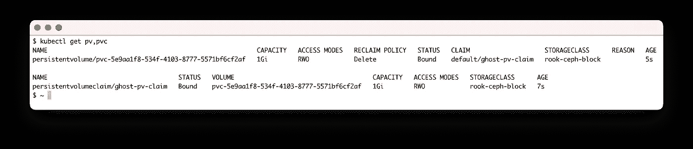
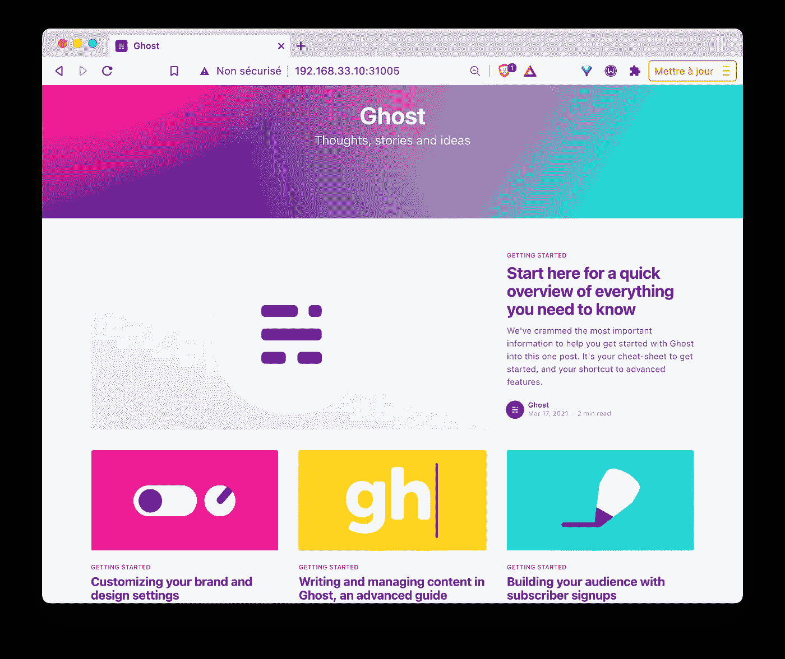
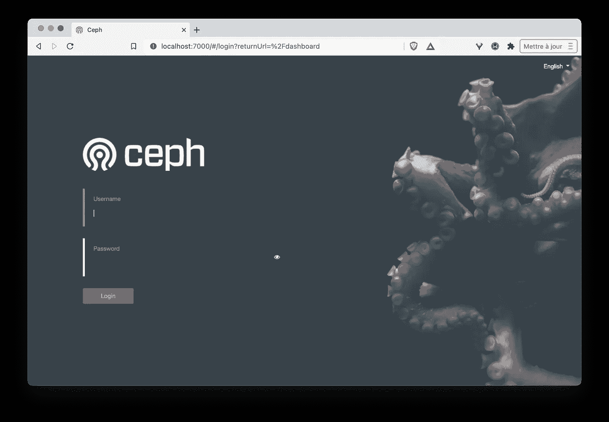
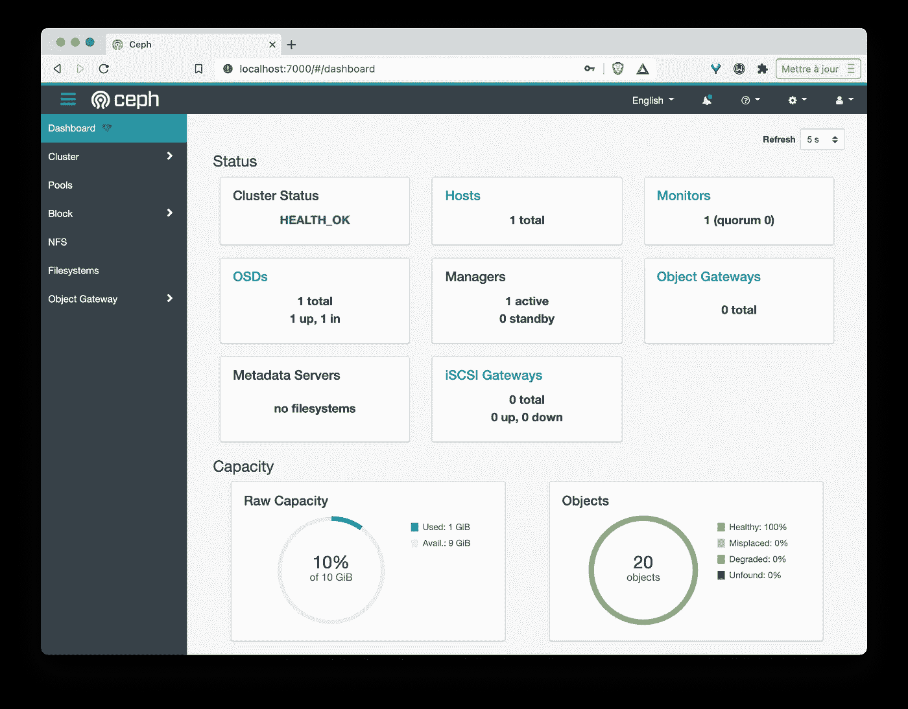

# 在 K3s 集群上使用车

> 原文：<https://itnext.io/using-rook-on-a-k3s-cluster-8a97a75ba25e?source=collection_archive---------0----------------------->

## 在本地机器上发现和玩车的简单方法


照片由 [Unsplash](/s/photos/storage?utm_source=unsplash&utm_medium=referral&utm_content=creditCopyText) 上的[尼克·费因斯](https://unsplash.com/@jannerboy62?utm_source=unsplash&utm_medium=referral&utm_content=creditCopyText)拍摄

在[的上一篇文章](/deploy-a-ceph-cluster-on-kubernetes-with-rook-d75a20c3f5b1)中，我们展示了[车](https://rook.io)，并使用它建立了一个 HA Ceph 集群。在这篇新文章中，我们将在单节点 [K3s](https://k3s.io) 集群上安装 Rook，因为这是开始这个伟大的 [CNCF](https://cncf.io) 项目的好方法。

## **k3s 集群的设置**

出于本文的目的，我们将使用在 [VirtualBox](https://virtualbox.org) 上通过[vagger](https://vagrantup.com)提供的本地虚拟机。下面的流浪者文件定义了:

*   将要创建的虚拟机的配置:使用的 Linux 发行版、其 IP 地址(192.168.33.10)、RAM 的数量(2G)、添加一个容量为 10G 的磁盘
*   设置 K3s 并恢复相关的 kubeconfig 文件

🔥重要的是将一个未格式化的磁盘(原始设备)连接到将要创建的虚拟机。下面我们将告诉 Rook 使用这个磁盘来保存 Ceph 集群的数据。

```
# -*- mode: ruby -*-
# vi: set ft=ruby :

Vagrant.configure("2") do |config|
  config.vm.box = "hashicorp/bionic64"
  config.vm.network "private_network", ip: "192.168.33.10"
  config.vm.disk :disk, size: "10GB", name: "osd"
  config.vm.provider "virtualbox" do |vb|
    vb.memory = "2048"
  end
  config.vm.provision "shell", inline: <<-SHELL
    curl https://get.k3s.io | sh
    sudo cp /etc/rancher/k3s/k3s.yaml /vagrant/kubeconfig.k3s
    sed -i "s/127.0.0.1/192.168.33.10/" /vagrant/kubeconfig.k3s
  SHELL
end
```

🔥config.vm.disk 指令是一个实验性的特性，需要使用环境变量 lavour _ EXPERIMENTAL 来创建这个虚拟机:

```
$ VAGRANT_EXPERIMENTAL="disks" vagrant up
```

一旦创建了 VMs 并设置了集群，我们就可以使用在本地文件夹中创建的 kubeconfig.k3s 文件来配置本地 kubectl 二进制文件:

```
$ export KUBECONFIG=$PWD/kubeconfig.k3s
```

然后，我们可以与群集通信并列出其节点(在本例中只有一个):

```
$ kubectl get nodes
NAME      STATUS   ROLES                  AGE   VERSION
vagrant   Ready    control-plane,master   31s   v1.20.4+k3s1
```

同时，我们确保 10G 磁盘已经连接到虚拟机。该磁盘应该显示为 device /dev/sdb，如以下命令所示:

```
$ vagrant ssh -- sudo fdisk -l | grep 'Disk /dev/sd*'
Disk /dev/sda: 64 GiB, 68719476736 bytes, 134217728 sectors
Disk /dev/sdb: 10 GiB, 10737418240 bytes, 20971520 sectors
```

## **车安装**

首先，需要检索 GitHub 上 Rook 项目最后一个标签对应的分支，并导航到*Rook/cluster/examples/kubernetes/ceph*目录:

注:Rook 目前的最新版本是 v 1 . 5 . 8(2021 年 3 月)

```
$ git clone --branch v1.5.8 [https://github.com/rook/rook.git](https://github.com/rook/rook.git)$ cd rook/cluster/examples/kubernetes/ceph
```

然后，我们部署专门用于设置 Ceph 集群的操作器以及它所依赖的资源:

```
kubectl apply -f crds.yaml -f common.yamlkubectl apply -f operator.yaml
```

> 注意:operator 是一个在 Pod 中运行的进程，它将负责根据稍后提供的规范配置 Ceph 集群

然后，我们确保操作员的 Pod 处于**运行**状态:

```
$ kubectl get pod -n rook-ceph
NAME                                 READY  STATUS  RESTARTS   AGE
rook-ceph-operator-6b8b9958c5-2xf5z  1/1    Running 0          48s
```

## **Ceph 集群创建**

我们现在将创建一个类型为 **CephCluster** 的资源。我们之前部署的操作符将自动检测这个资源，并从中创建一个 Ceph 集群。对于这个例子，我们使用 *cluster-test.yaml* 中可用的规范来创建 **CephCluster** 资源:

```
$ kubectl apply -f cluster-test.yaml
```

> 注:cluster-test.yaml 中指定的资源用于在测试环境中建立一个 Ceph 集群。对于生产环境，我们将使用 cluster.yaml 文件以及多节点 Kubernetes 集群

几分钟后，负责 Ceph 存储的吊舱将被部署。然后，我们可以使用以下命令检查它们是否运行正常:

> 注意:所有与 Ceph 相关的元素都是在名称空间 rook-ceph 中创建的

```
$ kubectl get pod -n rook-ceph
NAME                                 READY  STATUS   RESTARTS   AGE
rook-ceph-operator-6b8b9958c5-2xf5z  1/1    Running   0          12m
rook-ceph-mon-a-6d6fd795f6-bqqj2     1/1    Running   0          71s
rook-ceph-mgr-a-67fd7cdf4-vggs7      1/1    Running   0          59s
rook-ceph-osd-prepare-vagrant-kh44x  0/1    Completed 0          57s
rook-ceph-osd-0-84f59c9898-wkk8l     1/1    Running   0          33s
csi-cephfsplugin-dwptn               3/3    Running   0          20s
csi-rbdplugin-vj7zt                  3/3    Running   0          21s
csi-rbdplugin-provisioner-6b...      6/6    Running   0          20s
csi-cephfsplugin-provisioner-86...   6/6    Running   0          19s
```

🔥在安装过程中，Rook 能够检测到连接到虚拟机的未格式化驱动器。它自动使用这个磁盘作为 Ceph 集群的存储介质。我们可以通过查看 Pod 日志来确认这一点。

在几个命令行中，我们部署了一个 Rook 操作符，并使用它在 K3s 中建立了一个 Ceph 集群！很酷，对吧？

Ceph 是一种广泛使用的解决方案，提供不同类型的存储:

*   分时用外存储器系统
*   存储对象
*   块存储器

在下文中，我们将使用块存储为一个简单的应用程序保存数据。

## **存储类**

为了能够自动调配块存储，我们首先创建一个 StorageClass。为此，我们使用在*cluster/examples/kubernetes/ceph/CSI/rbd/storage class . YAML-test*中定义的规范:

```
**$ kubectl apply -f ./csi/rbd/storageclass-test.yaml** cephblockpool.ceph.rook.io/replicapool created
storageclass.storage.k8s.io/rook-ceph-block created
```

> 注意:顾名思义，storageclass-test.yaml 文件适用于测试环境。不应在生产环境中使用它，因为此配置不允许数据复制。文件 storageclass.yaml 专用于为生产设置 storageclass，即允许不同节点之间的数据复制

现在，我们的集群中定义了两个存储类:

*   local-path:这是在 k3s 安装期间创建的，如果在 PersistentVolumeClaim 中没有指定 StorageClass，则默认使用它
*   rook-ceph-block:这个是刚刚创建的

```
$ kubectl get sc
NAME                   PROVISIONER ...
local-path **(default)**   rancher.io/local-path
rook-ceph-block        rook-ceph.rbd.csi.ceph.com
```

使用以下命令，我们将使 **rook-ceph-block** 成为默认的存储类，而不是本地路径。这只是在每个资源中修改注释的问题:

```
$ kubectl patch storageclass local-path -p '{"metadata": {"annotations":{"storageclass.kubernetes.io/is-default-class":"false"}}}'$ kubectl patch storageclass rook-ceph-block -p '{"metadata": {"annotations":{"storageclass.kubernetes.io/is-default-class":"true"}}}'
```

然后，我们可以检查是否进行了更改:

```
$ kubectl get sc
NAME                        PROVISIONER ...
local-path                  rancher.io/local-path
rook-ceph-block **(default)**   rook-ceph.rbd.csi.ceph.com
```

## 测试应用

我们现在将基于 Ghost 部署一个简单的应用程序，Ghost 是一个开源的博客平台。该应用程序由以下 3 种资源组成:

*   基于 Ghost 映像的部署
*   NodePort 类型的服务，在端口 31005 上公开应用程序
*   使用默认存储类请求 1G 存储的 PersistentVolumeClaim

该应用的规格定义如下。在 ghost 部署中使用了 PersistentVolumeClaim*ghost-PV-claim*:与此 PVC 关联的存储将挂载在 ghost 容器中的 */var/lib/ghost/content* 中，这是 Ghost 保存其数据的目录。

```
apiVersion: apps/v1
kind: Deployment
metadata:
  name: ghost
spec:
  selector:
    matchLabels:
      app: ghost
  template:
    metadata:
      labels:
        app: ghost
    spec:
      containers:
      - name: ghost
        image: ghost
        ports:
        - containerPort: 2368
        volumeMounts:
        - name: ghost-data
          mountPath: /var/lib/ghost/content
      volumes:
      - name: ghost-data
        persistentVolumeClaim:
          claimName: ghost-pv-claim
---
apiVersion: v1
kind: PersistentVolumeClaim
metadata:
  name: ghost-pv-claim
spec:
  accessModes:
    - ReadWriteOnce
  resources:
    requests:
      storage: 1Gi
---
apiVersion: v1
kind: Service
metadata:
  name: ghost
spec:
  selector:
    app: ghost
  type: NodePort
  ports:
  - port: 80
    targetPort: 2368
    nodePort: 31005
```

我们使用以下命令安装应用程序:

```
**$ kubectl apply -f https://luc.run/ghost-with-pvc.yaml** deployment.apps/ghost created
persistentvolumeclaim/ghost-pv-claim created
service/ghost created
```

几秒钟后，我们可以看到已经创建了一个 PersistentVolume，并将其与之前创建的 PersistentVolumeClaim 相关联:



一个新的 PV 被创建并绑定到 PVC

Ghost 应用程序在端口 31005 上可用:



Ghost 界面

所有 ghost Pod 数据都存储在连接到集群节点的附加磁盘中。

## Ceph 仪表板和车工具箱

Ceph 的安装还设置了一个 web 管理界面。可以针对 *rook-ceph-mgr-dashboard* 服务使用 **port-forward** 命令来访问它:

```
$ kubectl port-forward svc/rook-ceph-mgr-dashboard 7000:7000 -n rook-ceph
```



Ceph 仪表板

用户名是 **admin，**可以使用以下命令检索密码:

```
$ kubectl -n rook-ceph get secret rook-ceph-dashboard-password \
  -o jsonpath="{['data']['password']}" | base64 --decode && echo
```

通过该界面，我们可以非常详细地了解存储集群，如下面的屏幕截图所示。不要犹豫导航，这是一个伟大的信息来源。



Ceph 集群的详细视图

Rook 还提供了一个工具箱，允许您从命令行与 Ceph 集群进行交互。我们可以使用以下命令安装该工具箱:

```
$ kubectl apply -f [https://luc.run/rook/toolbox.yaml](https://luc.run/rook/toolbox.yaml)
```

正确创建 Pod 后，我们可以在其中启动 shell:

```
$ kubectl -n rook-ceph exec -it deploy/rook-ceph-tools -- bash
```

在 Ceph 集群中可以使用许多命令，例如:

*   ceph 状态
*   ceph osd 状态
*   ceph df

## **关键要点**

Rook 使得在我们的 Kubernetes 集群中建立 Ceph 集群只需要几分钟的时间。我们还能够使用块存储来保存来自 Ghost 应用程序的数据。

在这个例子中，我们使用了一个节点来说明 Rook 的设置。但是，在生产环境中，有必要使用几个节点来确保它们之间的数据复制。

Rook 允许协调不同的储物解决方案，包括:

*   Ceph(稳定)
*   卡桑德拉(阿尔法)
*   NFS(阿尔法)

这是 CNCF 的毕业项目，请不要犹豫，用提供的其他存储解决方案之一来测试它。