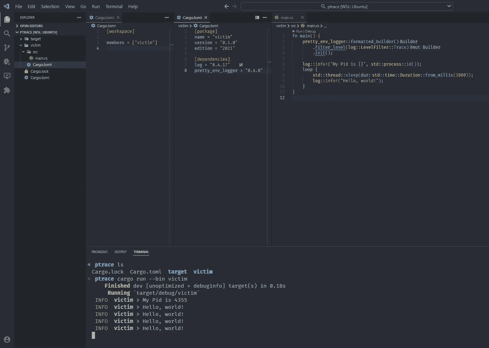
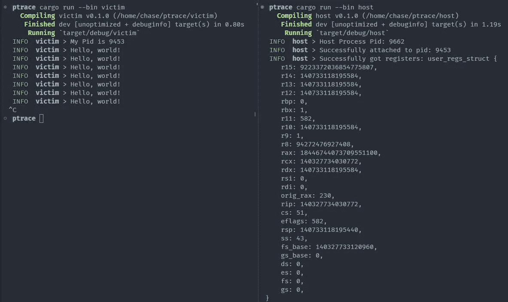
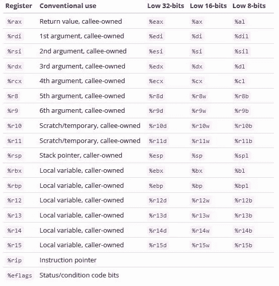
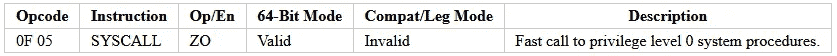
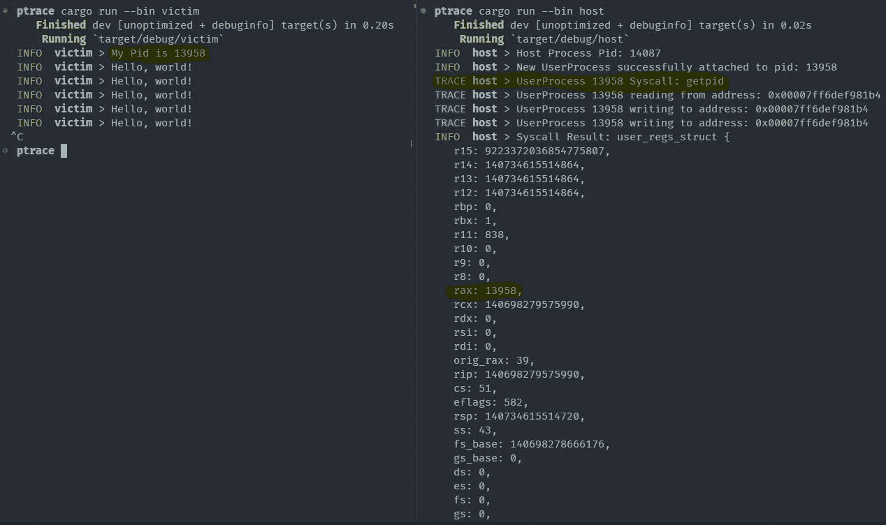
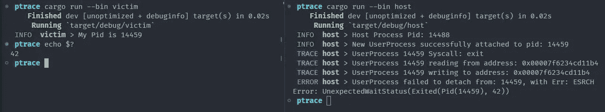
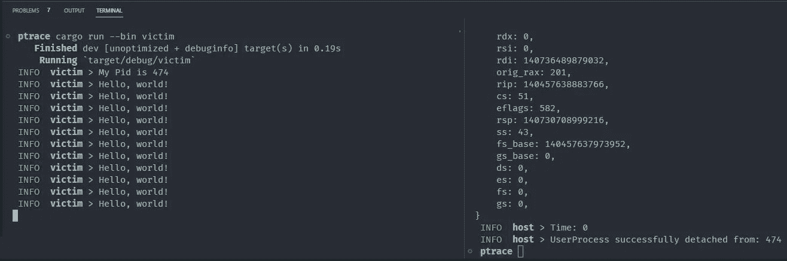
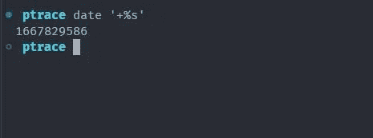
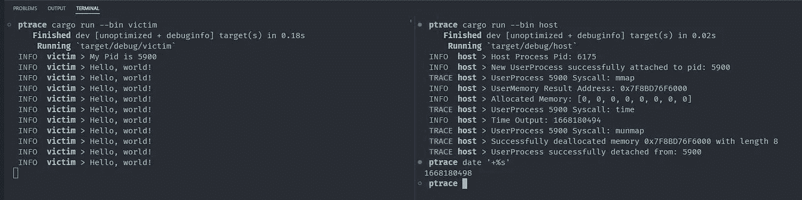
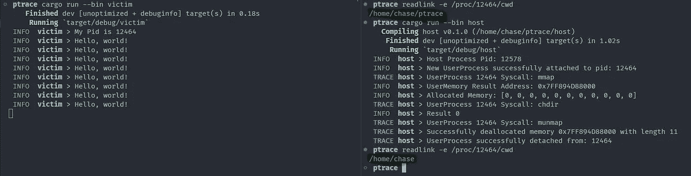

# 使用 Rust 和 Ptrace 调用系统调用

> 原文：<https://itnext.io/using-rust-and-ptrace-to-invoke-syscalls-262dc585fcd3?source=collection_archive---------0----------------------->


# 🔊介绍

**预先警告本文将直接针对 Linux** 🐧 **x86_64 CPU 架构发行版。** **x86_32、ARM32 和 ARM64 CPU 架构将无法工作** *，但只要对代码稍加修改就绝对可行，以概括架构的特定寄存器结构和指令编码*。接下来，我在本教程中的设置将是一台 windows 机器，我将使用 [WSL](https://learn.microsoft.com/en-us/windows/wsl/install) 加载一个我将要使用的 **Ubuntu 20.04.4 LTS** 发行版。本文选择的语言将是 [**Rust**](https://www.rust-lang.org/) **。**在撰写本文时，Rust 的最新稳定版本是我将使用的 **1.65.0** 。我使用的 Rust Crate 依赖项将引用它们各自的版本。如果你想跳过前面或者只看结果代码，完整的项目可以在[https://github.com/0xFounders/ptrace_syscalls](https://github.com/0xFounders/ptrace_syscalls)找到

# 📚旅程

1.  创建我们的测试受害者流程
2.  创建我们的宿主进程
3.  在受害者进程中调用系统调用
4.  指针参数
5.  资源转储/未来阅读，未来工作

# 🧪创建了我们的测试受害者流程

对于这个项目，我们需要一个过程来作为我们的测试。我们的测试过程最好是一个长时间运行的过程，用一些正常控制流的指示器来确认我们在增强后没有破坏任何东西。因此，由打印到控制台的简单无限 while 循环组成的程序将成为完美的测试受害者。

## 日志—[https://crates.io/crates/log](https://crates.io/crates/log)

日志箱只是一个轻型的[祝福](https://blessed.rs/crates)日志箱，我们将使用它来收集日志数据。它允许我们收集不同级别的可读性日志数据:跟踪、日志、信息、警告、错误。

## 漂亮 _ 环境 _ 记录者—[https://crates.io/crates/pretty_env_logger](https://crates.io/crates/pretty_env_logger)

日志箱只是一个薄薄的门面，pretty_env_logger 将实际处理收集的数据，并为我们输出到控制台。它也开箱即用，提供了很好的格式和颜色编码的文本。

## 履行

下面是我对测试的理想受害者过程的简单实现。请注意，我将与[货物工作区](https://doc.rust-lang.org/book/ch14-03-cargo-workspaces.html)一起工作，受害者箱和主人箱将一起在工作区。如果你想追求一个不同的工作流程，只要知道你如何运行你的货物应用程序可能会有所不同。

为了检查完整性，下面是 Visual Studio 代码中的项目结构。请注意目标文件夹在父目录中，而不是在受害者文件夹下。这是因为我们的工作区工作流将所有成员构建输出收集到一个公共目标文件夹中。



# 🏠创建我们的宿主进程

## Ptrace 概述

从 Linux 手册页文档开始，我们可以快速了解 Ptrace 接口的一般设计意图。

[https://man7.org/linux/man-pages/man2/ptrace.2.html](https://man7.org/linux/man-pages/man2/ptrace.2.html)

> **ptrace** ()系统调用提供了一种方法，通过这种方法，一个进程
> (“跟踪器”)可以观察和控制另一个
> 进程(“被跟踪者”)的执行，并检查和更改被跟踪者的
> 内存和寄存器。主要用于实现
> 断点调试和系统调用跟踪。

我们将挑战 Ptrace 的极限，以便在远程进程中从外部调用系统调用。例如，到本文结束时，我们将能够使用[mmap](https://man7.org/linux/man-pages/man2/mmap.2.html)/[mun map](https://man7.org/linux/man-pages/man3/munmap.3p.html)syscalls 在用户空间进程中分配内存，并控制用户空间应用程序的指令指针和寄存器来调用任何任意的 syscall。现在，我们将设置我们的主机简单地连接到进程，并检查当前控制流的寄存器。我们需要更多的板条箱来完成这项工作。

## 这个错误—[https://crates.io/crates/thiserror](https://crates.io/crates/thiserror)

另一个[受祝福的](https://blessed.rs/crates)板条箱

> 为标准库的`[std::error::Error](https://doc.rust-lang.org/std/error/trait.Error.html)`特征提供了一个方便的衍生宏。

我们将使用此错误来促进错误处理，以提供一个没有恐慌的体验。

## sysinfo—[https://crates.io/crates/sysinfo](https://crates.io/crates/sysinfo)

sysinfo 板条箱为我们提供了一个生活质量函数，通过名称而不是 Pid 来查找进程。这在快速构建原型时很有用，因为我们可以将目标流程名硬编码为“受害者”。你可以争论这是特性膨胀，包括整个机箱的依赖，仅仅通过名字获得一个进程的 pid。我同意。但是，懒惰的🦥在实验时占上风…

## https://crates.io/crates/nix

nix crate 将为我们提供一些对 ptrace 的生活质量绑定，这些绑定抽象了一些功能，提供了更容易处理错误的结果类型。它还为页面和内存映射/保护提供了常量，我们将在后面的*指针参数*部分中用到。

## 履行

## 示范

好极了，我们能够连接到受害者进程并截获它的当前寄存器，将它们打印到控制台。



加入战斗，拦截记录

如果这对您毫无意义，我鼓励您看一看 x86_64 寄存器的结构。特别要注意 rip 寄存器，它是我们当前的指令指针，rax 寄存器是返回值寄存器。一旦我们开始试图劫持受害者进程的控制流，rip 寄存器就会引起我们的特别兴趣😈



【https://web.stanford.edu/class/cs107/guide/x86-64.html 

# 🖥️在受害者进程中调用系统调用

## 概观

1.  使用 ptrace 拦截进程控制流并获取当前寄存器
2.  缓存当前寄存器、当前指令指针和当前指令
3.  将调用系统调用的汇编指令写入当前指令指针
4.  为 syscall 设置所有相应的寄存器参数
5.  单步执行进程，期待 SIGTRAP 作为下一个信号
6.  缓存结果寄存器作为系统调用的结果
7.  恢复原始寄存器和原始指令，以继续正常的应用程序执行

## 系统调用程序集

x86_64 中 syscall 的操作码是 0x0F05。因此，我们需要当前指令指针指向该操作码，以便将控制流转移到系统调用。我们不能简单地用 ptrace 写两个字节，因为它需要一个*字*，这个字很容易混淆，因为它实际上意味着 x86_64 上的 u64。根据我在 Windows 生态系统中的经验，W ORD 通常指的是 u16。这让我在这个项目中有些困惑。无论如何，我们可以轻松地将 2 字节操作码扩展为 8 字节，而无需任何操作指令 NOP (0x90)。用 NOP 扩展指令以对齐它的技术有时被称为“NOP Sled”。



[https://www.felixcloutier.com/x86/syscall.html](https://www.felixcloutier.com/x86/syscall.html)


https://c9x.me/x86/html/file_module_x86_id_217.html

## 系统调用—【https://crates.io/crates/syscalls 

系统调用箱将为相应的系统调用号/rax 提供常量。请参考 Sysno 枚举在实现中的用法。

## 履行

对于我们精明的读者来说，您将立即获得结果寄存器的 rax 值。rax 寄存器将对应于 syscall 返回参数。在本例中，受害者进程的 pid 为 13958，主机 getpid syscall 在 rax 寄存器中正确返回相同的 PID 13958。我真的很感激你的理智检查，🧠.



getpid 系统调用

现在系统调用接受一个参数怎么样，我将使用 exit，其中第一个参数对应于应用程序退出代码。

```
sys_call(Sysno::exit, 42, 0, 0, 0, 0, 0)?;
```



主机崩溃，受害者退出，但这是意料之中的，我们毕竟退出了。注意，退出代码是我们指定的整数 42，所以参数被卡住了。

嗯，一个自变量是输出变量的例子怎么样？我们可以使用[时间](https://man7.org/linux/man-pages/man2/time.2.html)系统调用。它需要一个指向 time_t 变量的指针来写入当前的 unix 时间戳。

```
// tyepdef time_t int64
time_t time(time_t *tloc);
```

设置系统调用并提供输出变量

```
// Call time syscall
let mut output = 0i64;
let result = user_process.sys_call
 (Sysno::time, &mut output as *mut _ as u64, 0, 0, 0, 0, 0)?;
log::info!("Syscall Result: {:#?}", result);
log::info!("Time: {}", output);
```

还有…什么都没有？看起来不太对的时间是零。



带有本地指针的时间系统调用



预期时间响应，unix i64 时间戳

如果我们运行 date 命令来输出当前的 unix 时间戳，我们可以注意到非常不同的输出。时间结果应该至少接近日期命令输出。除非我们在发烧的梦里😴回到 1970 年 1 月 1 日的午夜，时间不应该是 0…

> Unix 时间是自 1970 年 1 月 1 日 00:00:00 UTC 以来经过的秒数，不包括闰秒。这个时间被命名为 Unix 纪元，因为它是 Unix 时间的开始。


# ↪️指针参数

运行 times syscall 时出现问题的根本原因是我们在主机进程内存空间中指定了一个内存地址。同样，如果不使用特定的操作函数，我们就无法写入受害者进程内存，如果不使用这些操作，受害者也无法写入我们的主机进程内存。我们可以通过直接在受害者进程中分配内存并使用该空间的地址作为参数，然后从该内存中读取以检索输出来解决这个问题。毫不奇怪，我们将使用 mmap 和 munmap 系统调用来处理受害者进程中的数据管理。

## [Mmap](https://man7.org/linux/man-pages/man2/mmap.2.html)

> mmap()在
> 调用进程的虚拟地址空间中创建新的映射。新映射的起始地址是 addr 中指定的
> 。length 参数指定映射的
> 长度(必须大于 0)。
> 
> 如果 addr 为空，那么内核选择(页面对齐)
> 地址来创建映射；这是创建新映射最方便的
> 方法。

```
void *mmap(void *addr, size_t length, int prot, int flags,
                  int fd, off_t offset);
```

## Munmap

> 函数 munmap()应删除包含进程
> 地址空间任何部分的整个
> 页面的任何映射，从 addr 开始，一直到 len 字节。对这些页面的进一步引用
> 将导致产生一个 SIGSEGV 信号
> 给该过程。如果在指定的
> 地址范围内没有映射，则 munmap()无效。
> 
> 实现可能要求 addr 是 sysconf()返回的
> 页面大小的倍数。

```
int munmap(void *addr, size_t len);
```

## 解决办法

1.  使用 mmap syscall 在受害者进程中保留虚拟内存
2.  根据需要读取或写入虚拟内存
3.  从对我们在受害者中保留的虚拟内存的引用中提供 syscall 指针参数

## 履行

我们读写进程内存的⚠️How 已经被重构为直接从进程的内存文件中读取。这将我们从 ptrace 的*字*大小限制*的要求中解放出来。*由于 linux 中的一切本质上都是文件，Rust 的标准文件功能可以用来与进程的内存文件进行交互。这种实现上的改变将使我们与 mmap 内存的交互变得更加容易。这一变化的灵感来自牛逼的 crate [pete](https://crates.io/crates/pete) 提供了更加详尽的安全 rust ptrace api。pete 板条箱的衍生代码将被相应地引用。


强制性 Linux 一切都是一个文件笑话

⚠️In 为了提供一个比较完整、正确的 api，我们需要将大部分代码转移到一个单独的 lib 文件中，这样我们就有了一个 namespace/mod 文件来利用可见性修饰符。通过 main.rs 中的所有代码，main 函数可以访问在实现中应该真正被视为私有的函数，因为它们是在同一个文件中定义的。



真棒时间输出是现实的，而不是零 d:)

现在还有一个场景我们没有讨论，syscall 中的输入指针参数怎么样。 [chdir sycall](https://linux.die.net/man/2/chdir) 应该足够了。

```
int chdir(const char *path);
```

并且，对 main.rs wallah 进行了一些小的编辑。

```
use std::ffi::CString;

use host::{HostError, HostResult, UserProcess};
use nix::{
    libc::{MAP_ANONYMOUS, MAP_PRIVATE, PROT_READ, PROT_WRITE},
    unistd::Pid,
};
use syscalls::Sysno;
use sysinfo::{ProcessExt, System, SystemExt};

fn main() -> HostResult<()> {
    pretty_env_logger::formatted_builder()
        .filter_level(log::LevelFilter::Trace)
        .init();

    let process_name = "victim";
    log::info!("Host Process Pid: {}", std::process::id());

    // Create sysinfo object and refresh to collect current os state
    let mut sys = System::new_all();
    sys.refresh_all();

    // Find our target process or die
    let process = sys
        .processes_by_name(process_name)
        .take(1)
        .next()
        .ok_or_else(|| HostError::ProcessNotFound(process_name.to_string()))?;

    // Cast our sysinfo::Pid into a nix::unistd::Pid
    let pid = Pid::from_raw(process.pid().into());

    // Attach to the process
    let user_process = UserProcess::attach(pid)?;

    // Refactor out the expect later, but the input should never fail because we know the input does not contain an internal 0 byte.
    let output_message = CString::new("/home/chase").expect("CString::new failed");

    // We want the bytes of the Cstring.
    let output_message = output_message.as_bytes();

    // Allocate 8 bytes of data, i64 is 8 bytes
    let mut user_memory = user_process.allocate_memory(
        0,
        output_message.len() as u64,
        (PROT_READ | PROT_WRITE) as u64,
        (MAP_PRIVATE | MAP_ANONYMOUS) as u64,
        u64::MAX,
        0,
    )?;
    log::info!("UserMemory Result Address: {:#X}", user_memory.address());

    // Read the memory and demonstrate it is zero'd out
    let read = user_process.read_user_memory(&user_memory, user_memory.len() as usize)?;
    log::info!("Allocated Memory: {:?}", read);

    // Write to the memory out cstring
    user_process.write_user_memory(&mut user_memory, 0, output_message)?;

    // We can check if the call succeeded by the resultant rax value.
    let result = user_process
        .sys_call(Sysno::chdir, user_memory.address(), 0, 0, 0, 0, 0)?
        .rax;

    log::info!("Result {result:?}");

    Ok(())
}
```



在运行我们的程序后，进程的当前工作目录被改变，并显示我们期望的/home/chase

# 结论

我们已经为在 x86_64 上使用 ptrace 在远程进程中调用 syscall 设计了一个相当不错的 api。这很酷，但是我们目前受限于所提供的系统调用的能力。如果将来我们可以在受害者进程中调用用户空间函数，比如 libc puts，这样我们就可以输出到受害者的控制台，这将非常有用。在下一篇文章中，我们将这样做，并学习如何识别外部进程中用户空间函数的地址，在受害者进程中使用调用 [dlopen](https://man7.org/linux/man-pages/man3/dlopen.3.html) 来将任意共享对象加载到其地址空间中，这种技术被称为进程注入💉。

# 资源转储/未来阅读，未来工作

## 最终项目 Github 项目

*   【https://github.com/0xFounders/ptrace_syscalls 

## 资源

*   [https://man7.org/linux/man-pages/man5/proc.5.html](https://man7.org/linux/man-pages/man5/proc.5.html)
*   [https://hackeradam.com/x86-64-linux-syscalls/](https://hackeradam.com/x86-64-linux-syscalls/)
*   [https://stack overflow . com/questions/2535989/what-the-calling-conventions-for-UNIX-Linux-system-calls-and-user-space-f](https://stackoverflow.com/questions/2535989/what-are-the-calling-conventions-for-unix-linux-system-calls-and-user-space-f)
*   [https://blog . package cloud . io/the-definitive-guide-to-Linux-system-calls/](https://blog.packagecloud.io/the-definitive-guide-to-linux-system-calls/)

## 未来的工作

*   支持 x86_32
*   支撑臂 32
*   支撑臂 64
*   (可能？)支持堆栈参数，例如，具有多于寄存器参数数量的 syscall 调用。我相对确定 x86_64 没有需要堆栈参数的系统调用，例如超过 6 个参数，尽管我不确定其他架构是否也是如此。