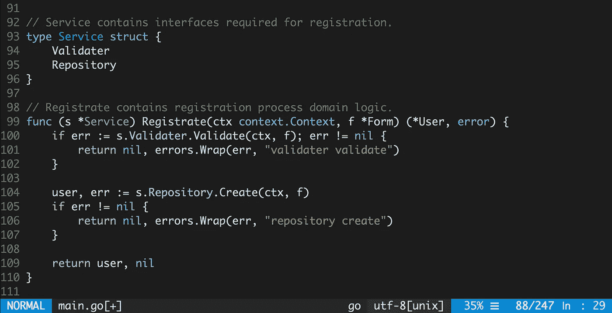

# 在 Go 中使用服务对象

> 原文：<https://itnext.io/using-service-objects-in-go-d899dc599335?source=collection_archive---------0----------------------->

在 Ruby on Rails 中，服务对象是一种高度可用的模式，它提供了保持控制器精简、模型清晰以及从两者中移除域逻辑的能力。在我看来，服务对象是单一责任原则和通过依赖注入分配责任的一个很好的例子。

一般来说，SOLID 及其背后的思想允许编写可测试的代码，这对于变化是高度灵活的。这些原则是由罗伯特“鲍勃叔叔”马丁倡导的。在他 2000 年的论文[设计原则和设计模式](https://fi.ort.edu.uy/innovaportal/file/2032/1/design_principles.pdf)中介绍了坚实原则的理论。戴夫·切尼有一篇关于它的文章 [SOLID Go Design](https://dave.cheney.net/2016/08/20/solid-go-design) 。

Robert Martin 在他的书*Clean Architecture:A craftman ' s Guide to Software Structure and Design*中也提出了一种架构，它包括四个层次的职责:实体、用例、接口适配器、框架和驱动程序。这个架构引入*用例*的原因与 Ruby on Rails 中的*服务对象*相同——封装业务逻辑。

接口和依赖注入的广泛使用可以使代码独立于 UI、框架和驱动程序。这种方法还提供了用所提供的 UI 和存储的模拟实现来测试业务逻辑的能力。

举个例子，让我们看看下面的代码，看看使用 SRP 和引入*用例*级别后会有多好。

正如您所看到的，除了这个处理程序形成对传入请求的响应之外，它还保存了用户注册过程的所有业务逻辑。每当前一个步骤失败时，这段代码都会编写响应并中断其他步骤。

当变化来临时，粘性症状会上升，因为没有明显的设计要保留，代码的每次变化都是某种形式的黑客攻击。如果需要向注册用户发送通知来验证他们的电子邮件，代码将变得更加难以理解和测试。

*完整代码示例见*[*github*](https://github.com/romanyx/service_object)*。*

所提供的代码示例的优点是，之前的开发人员为注册请求创建了集成测试，它不是遗留代码，这意味着它可以被重构。

所以让我们开始一些重构，并应用*用例*级别。第一步是将注册流程逻辑封装到服务对象中。

`Registrate`方法需要两个步骤在系统中注册用户:

1.  传入表单的验证。
2.  将模型插入到存储中。

随着*服务对象*的引入，以前晦涩难懂的代码变得更加清晰易懂。如果发生了变化，工程师很可能会理解并保留现有的设计。

*变化* [*拉动请求*](https://github.com/romanyx/service_object/pull/1/files) *。*

现代 web 开发提出了很多要求，其中之一就是可观察性。可观察性由日志记录、度量和跟踪组成，它提供了不猜测任务性能和问题来源的能力，而是跟踪和修复它们。

然而，为了达到这个目标，给定的代码应该通过将上下文传播到*服务对象*中来接受重要的更改，这样就可以跟踪传入的请求，并且与它相关的日志可以绑定到特定的 TraceID。

Sameer Ajmari 在 [Go 博客](https://blog.golang.org/context)中撰写的关于`context`的文章描述了上下文的好处，以及为什么它应该在传入和传出请求的调用路径上的所有函数中传播。

*变化* [*拉动请求*](https://github.com/romanyx/service_object/pull/2/files) *。*

通过这种方式，我们现在可以用 Decorator 扩展*服务对象*,并应用日志记录、跟踪和其他我们需要的扩展。你可以直接写这样的装饰器，或者用一些工具生成。已经有一个允许修饰接口的生成器— [gowrap](https://github.com/hexdigest/gowrap) 。作者 Max Chechel 在 GoWayFest 2.0 的演讲“[代码生成生存](https://www.youtube.com/watch?v=pFFfurrCEcM)”中解释了为什么你可能需要这样一个工具。

*示例在* [*拉动请求*](https://github.com/romanyx/service_object/pull/3/files) *。*

在*服务对象*之上应用装饰模式，使我们能够扩展它并达到许多目标，如度量、跟踪和将我们的代码移动到现代微服务时代。

尽管 Go 不是通常意义上的 OOP 语言，但用它编写的代码也应该是直观的，并且有明确的结构。可以使用 SOLID 缩写中包含的原则编写这样的代码，SOLID 缩写包含一组适用于许多编程语言的通用方法。

这篇文章的目的是表达我对用 Go 编写的代码应该是什么样子的理解，我希望它包含的积极方面多于消极方面。