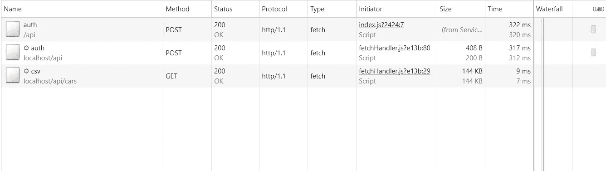

# 使用服务人员作为身份验证中继

> 原文：<https://itnext.io/using-service-worker-as-an-auth-relay-5abc402878dd?source=collection_archive---------3----------------------->

[*点击这里在 LinkedIn* 上分享这篇文章](https://www.linkedin.com/cws/share?url=https%3A%2F%2Fitnext.io%2Fusing-service-worker-as-an-auth-relay-5abc402878dd)

我偶尔听说服务人员被用于缓存、推送通知或后台同步。很长一段时间，我一直在想，他们没有带来任何新的东西来补偿他们的复杂性。那是直到最近。

我在通过*授权头*交换 [JWT](https://jwt.io/introduction/) 的单页应用程序上工作。在 AngularJS 中添加这种功能的标准方式是实现一个拦截器:

当我们这样做时，使用 *$http* 执行的每个请求都将透明地添加授权。

对于 Ajax 来说，这是一个很好的解决方案，但是有时我们也需要下载文件。这是可能的，但是很痛苦:

大多数时候，我对这样的解决方案还满意，但我内心深处有一种想法，试图以增加复杂性为代价让它变得更好。我心目中的最终目标是让下载文件变得简单，就像:

```
<a href='/api/file'>Download file</a>
```

堆上没有任何响应缓冲。

这是如何做到这一点的想法:

*   我们可以使用*授权服务*来持有 *JWT* 并执行登录和注销
*   服务人员将拦截对 */api* 的所有请求，并动态添加报头

会不会很难实施？让我们来了解一下！

# Webpack 配置(3.11.0 版)

服务人员不同于我们在网上找到的大多数资源。这甚至在构建配置中也能体现出来。对于所有资产，我们应该尝试添加散列来使缓存破坏变得自然，但是对于服务人员，我们应该很少这样做。为什么？

如果在某个时候，我们决定实现离线第一页和缓存*index.html*，我们将永远不会获取一个新的服务工作者，因为页面将指向它的旧版本。因此，最好保持相同的网址为软件和浏览器会检查自己，如果没有更新的版本。除非在过去 24 小时内已经进行了检查，否则在导航到软件或功能事件(推送、同步和获取)范围内的页面时会发生这种情况。

为了避免服务工作者文件名中的散列，构建它们的标准方式依赖于外部插件:

# 服务行业人员

让我们直接跳到代码:

现在，我们已经完成了基本的设置，我们可以专注于身份验证和拦截请求。这部分可以分为三个主要模块:

*   我们的 *fetchHandler* 模块的默认导出将检查目标资源是否被 *API* 公开
*   *getAuthTokenHeader* 方法将与页面中执行的 js 通信，以获取当前令牌
*   *getResponse* 将使用授权令牌丰富请求并获取响应

最后一部分是在页面中注册*服务人员*并响应 *sw:* 发送的 *getAuthTokenHeader* 动作

我们可以检查网络图来验证我们服务人员的行为。让我们看一下整个流程，从使用 API 进行身份验证到文件下载:



第一个请求是由页面中执行的 javascript 创建的。我们可以通过查看启动器列来发现这一点。

大齿轮总是表示请求是由服务人员提出的。在我们的例子中，它是日志请求的转发(参见复制的 *auth* 请求)和最终的文件下载。我们没有将 *csv* 端点作为服务工作人员转发的浏览器导航事件的额外请求，该事件由点击 html 链接触发。

今天到此为止。如果你在寻找更多关于服务人员的信息，我建议你看看[网络基础](https://developers.google.com/web/fundamentals/primers/service-workers/lifecycle)和[https://serviceworke.rs/](https://serviceworke.rs/)的现成食谱。

感谢阅读！

> 本文的所有代码都可以在我的 Github repo[https://Github . com/bartekbp/blog/tree/master/service-worker-auth](https://github.com/bartekbp/blog/tree/master/service-worker-auth)中找到。