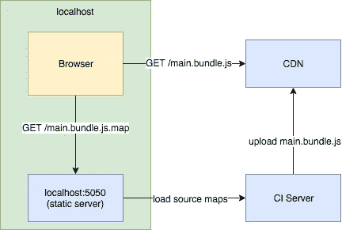

# 在不公开源代码的情况下在生产中使用 source maps🕵️‍

> 原文：<https://itnext.io/using-sourcemaps-on-production-without-revealing-the-source-code-%EF%B8%8F-d41e78e20c89?source=collection_archive---------2----------------------->


现在大多数 web 开发人员使用 webpack 和 babel 等工具来构建他们的前端代码。它允许编写现代的 javascript，同时支持过时的浏览器。但这也是有代价的。你的代码在编译和缩小过程中被大量修改，在生产中几乎不可能调试。

这个问题有一个很好的解决方案——[source maps](https://developer.mozilla.org/en-US/docs/Tools/Debugger/How_to/Use_a_source_map)。它允许你调试缩小的代码，就像它没有被修改一样。这不是一个理想的解决方案，但它在大多数情况下是有效的。

使用 webpack 可以很容易地配置 Sourcemaps，你所需要做的就是将你的`webpack.config.js`中的`[devTool](https://webpack.js.org/configuration/devtool/)`属性设置为`'sourcemap'`或`'hidden-sourcemap'`。听起来很简单，对吧？你可能已经用过了。但是这种方法仍然有一个问题— **源地图需要和精简代码一起上传**,以便浏览器的开发工具可以下载和使用它。

这将允许任何访问者调试你的网站，并看到源代码，这并不总是可取的。

我们可以做几件事来解决这个问题:

1.  如果您使用的是 AWS S3 或类似的存储设备，请将资源上传到 S3，并使用 ACL 来限制特定用户对 sourcemaps 的访问。这种解决方案有一定的局限性，因为如果你在 S3 上使用 CDN，它就不起作用。
2.  不要将 sourcemaps 暴露在互联网上，而是让开发工具从开发人员的机器上加载它们。

第二种选择对我来说更有趣。在深入研究实现细节之前，让我们回顾一下源地图通常是如何工作的。

当 babel 编译您的 javascript 代码时，它会生成一个 sourcemap 文件以及 javascript 包，这同样适用于 minifier (UglifyJS 或 smth else)。稍后，wepback 在生成的 javascript 文件的末尾添加了一个特殊的 pragma，如下所示:

```
//# sourceMappingURL=main.js.map
```

这个 pragma 帮助浏览器找到特定包的源映射。在这个例子中，url 是相对的，所以 sourcemap 文件应该存储在 js 包本身的旁边。好消息是我们可以指定一个指向本地开发环境的绝对 URL。但是我们怎么做呢？🤔

嗯，这并不复杂，但它确实需要一些额外的 webpack 调优。还记得`devTool`属性吗？原来它是`[SourceMapDevToolPlugin](https://webpack.js.org/plugins/source-map-dev-tool-plugin/)`的简写，可以对源地图生成过程进行更细粒度的控制。这个插件将一个配置对象作为参数，这允许我们指定一个自定义的`sourceMappingUrl`杂注。因此，我们将使用`SourceMapDevToolPlugin`代替`devTool`，就像这样:

现在，我们需要做的就是:

1.  配置 CI 服务器，将 sourcemaps 存储为一个工件，您可以在以后下载。
2.  启动一个静态 http 服务器来服务生成的源地图。

让我们来看看这一切是如何协同工作的:



这只是一个可能用法的例子，您可以修改它以适应您的工作流，例如，您可以将这个静态服务器部署在某个地方，并且只能通过内部网络访问。

## 主要的好处是，您可以指定加载 sourcemaps 的 url，这允许您在生产中调试简化的应用程序，而无需向外界公开源代码🙂。

顺便提一下，还有另一种方法来指定 sourcemaps 的位置— [SourceMap](https://developer.mozilla.org/en-US/docs/Web/HTTP/Headers/SourceMap) HTTP header，这在某些情况下也很有用。

我猜，可能有更好的方法来达到同样的结果，但谷歌没有帮我找到它，所以我想出了这个方法，并希望分享它。如果你知道更好的方法，请在评论中告诉我。

谢谢，祝编码愉快！😉