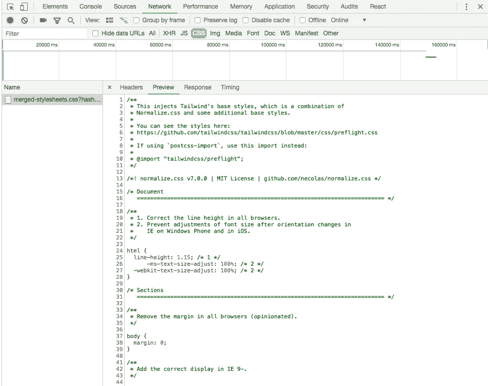

# 在流星项目中使用 Tailwind.css

> 原文：<https://itnext.io/using-tailwind-css-in-a-meteor-project-6a7634dc8e0c?source=collection_archive---------1----------------------->


流星和顺风 CSS

我最近一直在摆弄 Meteor，一个全栈 JavaScript 框架。

很好玩！由于我更习惯 WordPress 和 Laravel，所以深入节点世界很有意思。在 Meteor 中，前端和后端之间的双向数据绑定真的很酷！

然而，这个勇敢的新世界带来了你不习惯的不同解决方案。例如，由于有了 [Laravel Mix](https://laravel.com/docs/5.6/mix) ，SCSS 编译在 Laravel 中开箱即用。

> 但是在《流星》中这样的东西是如何工作的呢？

最近，我开始成为实用框架 Tailwind CSS 的忠实粉丝。

[](https://tailwindcss.com) [## 顺风 CSS

### 实用程序优先的 CSS 框架，用于快速构建自定义用户界面。

tailwindcss.com](https://tailwindcss.com) 

那么我如何将顺风纳入流星呢？我当然可以添加一个`<link>`标签并从 CDN 下载，但是，嘿，那是作弊！😎我当然应该用 NPM！

# 1.安装顺风

顺风文件说明如下:

> 对于大多数项目来说，您会希望将 Tailwind 作为 PostCSS 插件添加到您的构建链中。

好吧，所以我想我需要给 Meteor 的构建系统增加一个 PostCSS 步骤…？😳

但是让我们先从安装顺风开始:

```
$ meteor npm install tailwindcss --save-dev
```

并生成`tailwind.js`配置文件:

```
$ ./node_modules/.bin/tailwind init
```

然后，将[顺风 CSS](https://tailwindcss.com/docs/installation#3-use-tailwind-in-your-css) 添加到`client/main.css`文件中:

# 2.PostCSS

好吧，让我们试着把 PostCSS 做好。Meteor 文档中有一节是关于 PostCSS 的，所以这是一个很好的起点:

 [## 建筑系统|流星指南

### 如何使用 Meteor 的 build 系统编译你的 app？

guide.meteor.com](https://guide.meteor.com/build-tool.html#postcss) 

## 2.1.安装 PostCSS 包

这很简单:

```
$ meteor remove standard-minifier-css
$ meteor add juliancwirko:postcss
```

但是如果你看一下 PostCSS 包的[文档，你会发现这个第三步没有包含在 Meteor 文档中:](https://atmospherejs.com/juliancwirko/postcss)

```
$ meteor npm install --save-dev postcss@6.0.22 postcss-load-config@1.2.0
```

## 2.2.使用 PostCSS 导入

如果您向下滚动文档页面，您会看到一个讨论导入的部分。这也是我们需要的！

 [## Julian wirko:post CSS 包|氛围

### 使用 Autoprefixer 和其他工具很容易

atmospherejs.com](https://atmospherejs.com/juliancwirko/postcss#imports-with-postcss) 

让我们安装它:

```
$ meteor npm install postcss-import --save-dev
```

# 3.Package.json

快到了！现在我们需要给`package.json`文件添加一些 PostCSS 配置。

```
{
  ...
  "postcss": {
    "plugins": {
      "postcss-import": {},
      "tailwindcss": {}
    }
  }
  ...
}
```

然后运行:

```
$ npm update
$ meteor #(You have to restart meteor)
```

我认为这意味着我们告诉 PostCSS 包在构建步骤中使用`postcss-import`和`tailwindcss`插件。`postcss-import`允许我们将组件导入样式表。但是我是新手，对什么都不确定…🙄🤷🏻‍♂️

这让我想起了最后一步…

# 4.更新 main.css

顺风 CSS 在评论中说了以下内容:

```
/*
 * If using `postcss-import`, use this import instead:
 * 
 * @import "tailwindcss/preflight"
 */
@tailwind preflight;
```

等等！我们用的是`postcss-import`！因此，让我们更新样式表，使其看起来像这样:

这里是`package.json`的文件:

现在，你的`client/main.css`文件应该编译并包含了所有的顺风 CSS！



我不知道这是否是将 Tailwind 包含到您的 Meteor 应用程序中的最佳方式，但它确实有效！我花了相当长的时间让它工作，所以我希望这可以帮助别人！😃