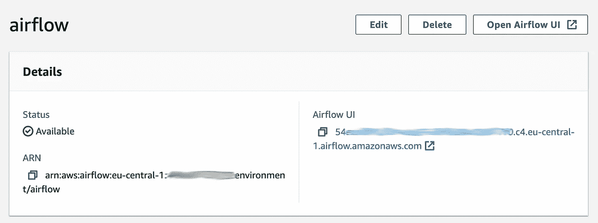
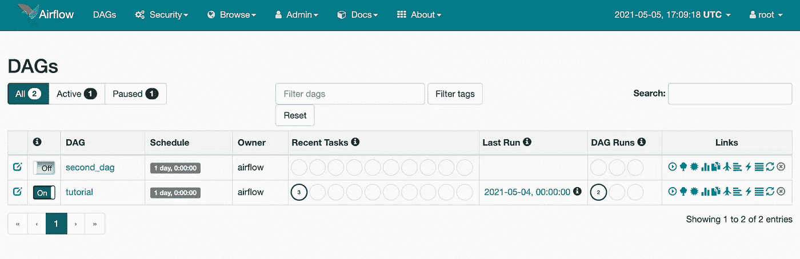
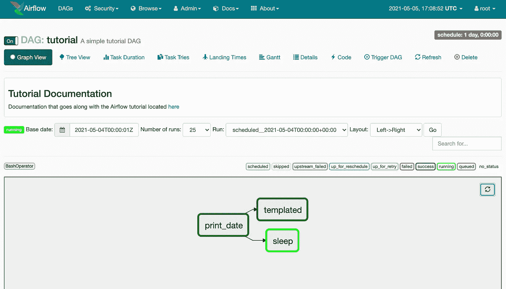
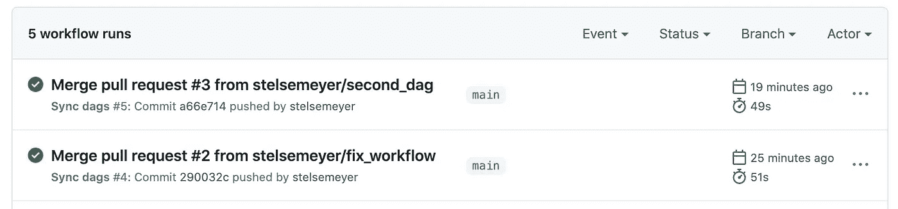

# 使用 Terraform 通过 Amazon 管理的工作流和使用 GitHub 操作的自动 DAG 同步构建无服务器气流

> 原文：<https://itnext.io/using-terraform-to-build-a-serverless-airflow-via-amazon-managed-workflows-and-automatic-dag-sync-261bf1803874?source=collection_archive---------1----------------------->

在这篇文章中，我们将再次通过 Terraform 建立无服务器基础设施:使用[亚马逊管理的工作流](https://aws.amazon.com/managed-workflows-for-apache-airflow/)的[气流](http://airflow.apache.org/)部署，加上 [GitHub 动作](https://docs.github.com/en/actions)自动将 DAG 代码同步到 S3。

作为基线，我们将派生 [Claudio Bizzotto](https://github.com/claudiobizzotto/) 的伟大知识库[claudiobizzotto/AWS-mwaa-terraform](https://github.com/claudiobizzotto/aws-mwaa-terraform)，它已经包含了所有亚马逊管理的工作流 terra form 代码。我们将在顶部添加 S3 同步。这将允许我们将 GitHub 代码部署到 Airflow 服务中。你可以在这里找到分叉的资源库:[stelsemeyer/AWS-mwaa-terraform](https://github.com/stelsemeyer/aws-mwaa-terraform)。

# 地形设置

使用 Terraform 大约需要 30 分钟来产生可控气流。该设置不在免费层内，每小时将产生大约 1 美元的成本！

我们将在`terraform.tfvars`中使用以下变量:

```
region   = "eu-central-1"
profile  = "airflow"  # we use an AWS profile in ~/.aws/credentials
prefix   = "airflow"
vpc_cidr = "10.192.0.0/16"
public_subnet_cidrs = [
  "10.192.10.0/24",
  "10.192.11.0/24"
]
private_subnet_cidrs = [
  "10.192.20.0/24",
  "10.192.21.0/24"
]
mwaa_max_workers = 2
```

我们可以使用`terraform plan`来规划我们的基础设施，如果我们对结果满意，我们可以`terraform apply`它:

```
Plan: 31 to add, 0 to change, 0 to destroy.

Changes to Outputs:
  + access_key_id        = (known after apply)
  + mwaa_environment_arn = (known after apply)
  + mwaa_webserver_url   = (known after apply)
  + private_subnets_ids  = [
      + (known after apply),
      + (known after apply),
    ]
  + public_subnets_ids   = [
      + (known after apply),
      + (known after apply),
    ]
  + region               = "eu-central-1"
  + s3_bucket_id         = (known after apply)
  + s3_bucket_name       = (known after apply)
  + secret_access_key    = (known after apply)
  + vpc_id               = (known after apply)
```

# Airflow 服务器

一旦所有东西都创建好了，我们就可以访问我们的 Airflow 服务器实例了。为此，我们需要登录 AWS 控制台。然后，我们可以通过`Amazon Managed Workflows`访问它，或者使用来自`terraform output`的链接。



亚马逊在 AWS 控制台中管理工作流，包括 Airflow UI 的 URL 图片由作者完成。

我们应该看到气流 UI，包括`dags`文件夹中的两个 Dag，它们最初是由 Terraform 上传到 S3 的。



带有激活教程 DAG 的气流用户界面—图像由作者完成。

如果我们单击 DAG，我们可以看到图形视图。一旦我们通过轻触开关将 DAG 设置为 active，任务将开始运行以跟上。



单个 DAG 视图—由作者制作的图像。

# 使用 GitHub 操作进行 DAG 同步

要设置 GitHub 动作来自动将包含实际 DAG 代码的`dags`文件夹同步到 S3，我们可以使用`terraform output`中的`access_key_id`、`secret_access_key`、`region`和`s3_bucket_name`。我们将这些值作为`Secrets`添加到存储库中:

工作流 yaml 文件`.github/workflows/sync.yml`定义了我们想要执行的动作:一旦我们合并到`main`分支，我们就使用[Jake Jarvis/S3-sync-action](https://github.com/jakejarvis/s3-sync-action)将文件夹`dags`同步到 S3。我们可以定制触发器，只对标签或类似的东西执行操作。

```
name: Sync dagson:
  push:
    branches:
    - mainjobs:
  deploy:
    runs-on: ubuntu-latest
    steps:
    - uses: actions/checkout@master
    - uses: jakejarvis/s3-sync-action@master
      with:
        args: --follow-symlinks --delete
      env:
        AWS_S3_BUCKET: ${{ secrets.AWS_S3_BUCKET }}
        AWS_ACCESS_KEY_ID: ${{ secrets.AWS_ACCESS_KEY_ID }}
        AWS_SECRET_ACCESS_KEY: ${{ secrets.AWS_SECRET_ACCESS_KEY }}
        AWS_REGION: ${{ secrets.AWS_REGION }}
        SOURCE_DIR: 'dags'
        DEST_DIR: 'dags'
```

通过 GitHub 上的`Workflow`选项卡，我们可以查看工作流程状态。每当我们合并到`main`时，文件将被同步到 S3，我们应该能够在几秒钟内在我们的 Airflow UI 中看到更新的 Dag(您可能需要点击刷新按钮)。



# 破坏

要销毁基础架构，您需要首先删除存储桶中的所有文件:

```
# BUCKET_NAME = $(terraform output -json | jq -r .s3_bucket_name.value)
# aws s3 rm s3://${BUCKET_NAME} --recursive
```

然后我们可以通过`terraform destroy`摧毁所有的基础设施，这也需要大约 20-30 分钟。

```
# terraform destroy
```

# 结论

通常，当使用无服务器基础设施时，我们需要在维护、控制和成本之间进行折衷。[这篇文章](https://towardsdatascience.com/managed-apache-airflow-on-aws-new-aws-service-for-data-pipelines-91908ee9e5fc)很好地讨论了亚马逊管理的工作流的优点和缺点，我们可以总结如下:

## 优势

*   易于与其他 AWS 服务集成(如 Redshift、EMR、SageMaker)
*   自动扩展，节省时间和成本
*   使用 CloudWatch 进行监控和记录
*   AWS 管理安全性，包括 VPC
*   通过 Fargate 的容器化工作流

## 不足之处

*   我们不能 ssh 到我们的气流实例或访问气流数据库本身
*   依靠 AWS 提供的气流版本
*   仅限于云提供商

总而言之，在我们自己的硬件或云实例上部署 Airflow 比 MWAA 设置更复杂，但它允许我们更容易地定制，使用`KubernetesPodOperator`在 Kubernetes 上运行任务等等。对于单个用例，我们必须权衡利弊。如果您想先测试 Airflow，使用受管版本可能是个好主意，因为一旦您想从部署中迁移，您可以轻松地将 Dag 移动到您自己的部署中。

*最初发表于*[*【https://blog.telsemeyer.com】*](https://blog.telsemeyer.com/2021/07/20/using-terraform-to-build-a-serverless-airflow-via-amazon-managed-workflows-and-automatic-dag-sync-using-github-actions/)*。*