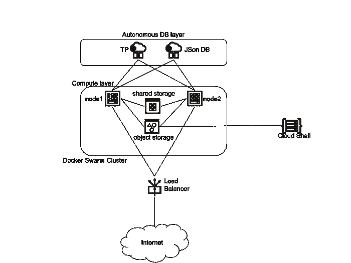
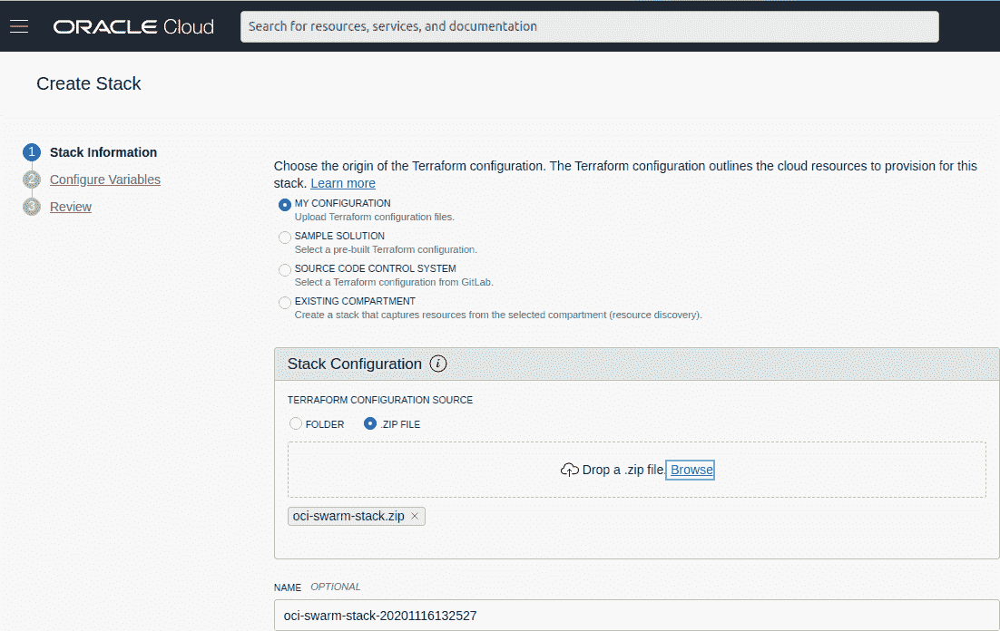
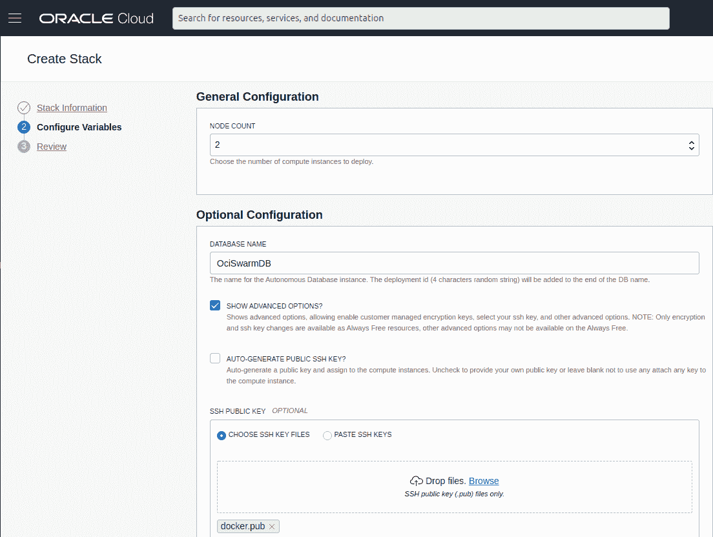
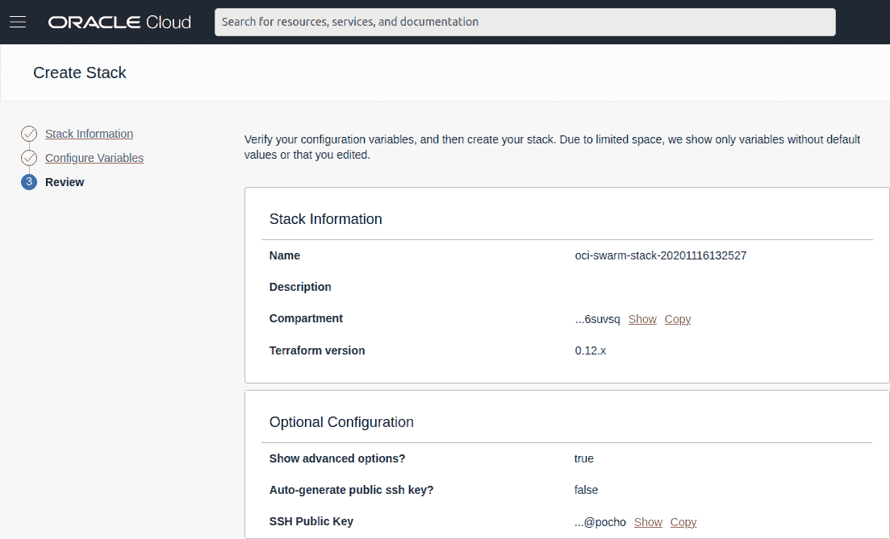
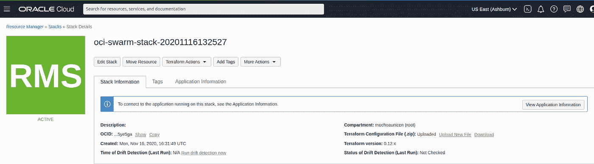
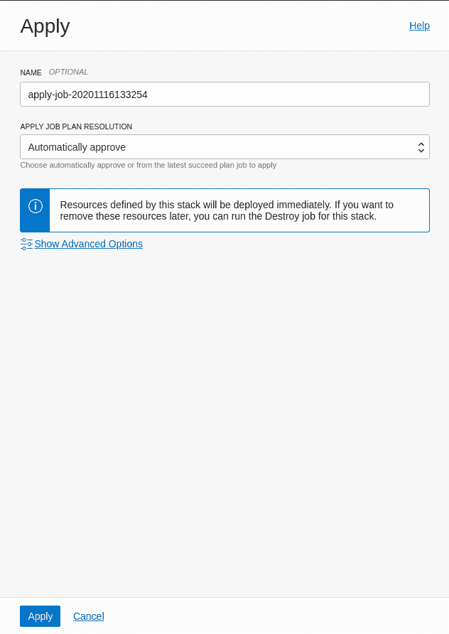
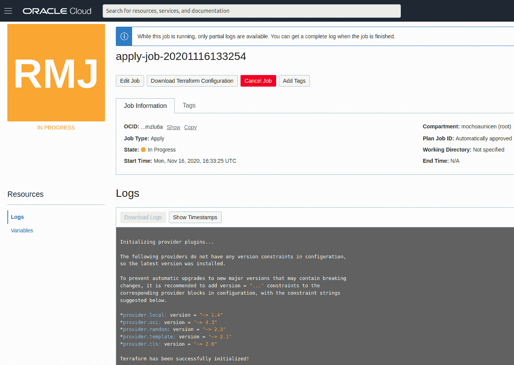
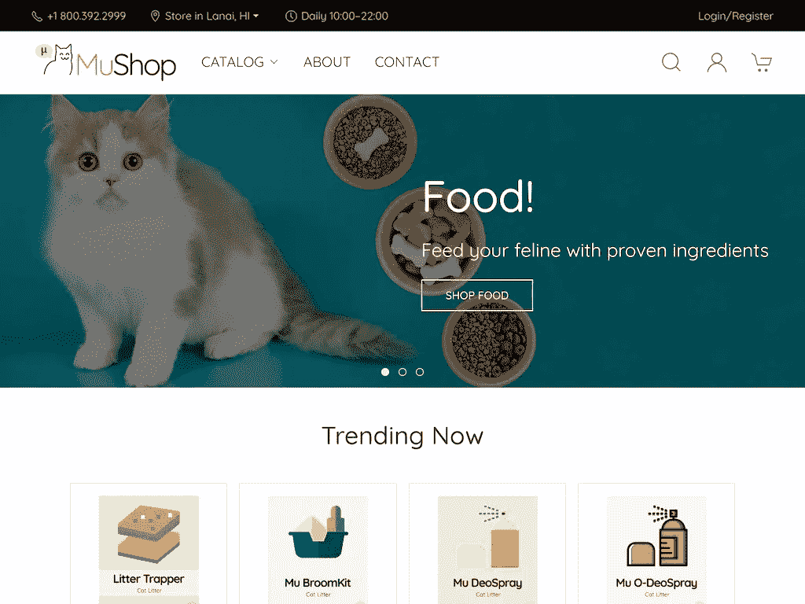
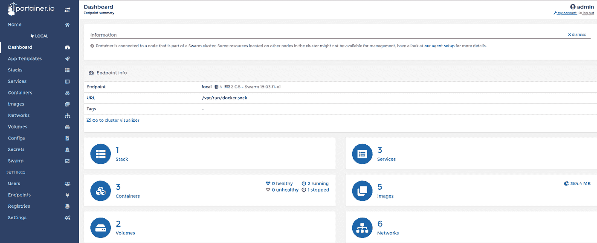

# 使用 Terraform 在 OCI 部署 Docker Swarm 堆栈

> 原文：<https://itnext.io/using-terraform-to-deploy-a-docker-swarm-stack-on-oci-8b7caa6876a1?source=collection_archive---------3----------------------->

Oracle 云基础设施(OCI)是一种 IaaS，可提供内部部署的高性能计算能力来运行云本地和企业公司的 IT 工作负载。OCI 通过结合 Oracle 的自主服务、集成安全性和无服务器计算，为企业应用程序提供实时弹性。适用于公共云。

本文是以下系列相关帖子的延续:

*   [Oracle 始终释放 HA 配置中的云实例](/oracle-always-free-cloud-instances-in-ha-configuration-e1d3dd59d3b1)
*   [我自己的开发/测试云环境使用 Oracle Always 免费实例](/my-own-dev-test-cloud-environment-using-oracle-always-free-instances-598695cc3a10)
*   [我自己在 Oracle Cloud 使用自主数据库和 ML 免费部署物联网](https://marcelo-ochoa.medium.com/my-own-iot-deployment-at-oracle-cloud-free-using-autonomous-db-and-ml-f0632e240a29)
*   [使用 Oracle 云负载平衡器加密证书——包括自动更新功能](/using-lets-encrypt-certs-with-oracle-cloud-load-balancer-including-auto-renew-feature-7ae87e6d207b)
*   [使用 Oracle 云对象存储作为 Docker 卷](https://marcelo-ochoa.medium.com/using-oracle-cloud-object-storage-as-docker-volume-3ec7882f51b7)

但是，这篇文章不是描述如何按照一步一步的说明进行部署，而是关于使用基础设施作为使用 [Terraform](https://es.wikipedia.org/wiki/Terraform_(software)) 和 [Oracle Resource Manager](https://docs.cloud.oracle.com/en-us/iaas/Content/ResourceManager/Concepts/resourcemanager.htm) 的代码，在文章的最后，只需点击几下鼠标，您就会有一个运行在 Oracle Always Free 实例上的双节点 Swarm 集群。

让我们首先介绍我们的测试环境，参见部署图:



Docker 群堆栈部署图

我们在上面看到了共享存储，这种共享存储是使用 VM 块存储实现的，并使用 GlusterFS 进行复制，该存储是为 MongoDB 或 MySQL 等块级 IO 而设计的，我们的 Docker 容器有一个新的共享存储，它是使用为存储 HTML 页面、图像、配置文件或 Docker 注册表 blob 对象而设计的对象存储实现的。

> 注意:通过为 Oracle 对象存储添加 Docker 插件，我们也可以从 [Oracle Cloud Shell](https://docs.cloud.oracle.com/en-us/iaas/Content/API/Concepts/devcloudshellgettingstarted.htm) 以常规文件系统的方式进行访问。

# 部署文件

在我的 GitHub 库 [oci-swarm-cluster](https://github.com/marcelo-ochoa/oci-swarm-cluster) 中可以找到示例脚本和配置文件，只需克隆并执行:

```
$ git clone [https://github.com/marcelo-ochoa/oci-swarm-cluster](https://github.com/marcelo-ochoa/oci-swarm-cluster)
$ cd oci-swarm-cluster
$ docker build -t oci-swarm -f Dockerfile .
$ docker run -v $PWD:/transfer --rm --entrypoint cp oci-swarm:latest /package/***oci-swarm-stack.zip*** /transfer/***oci-swarm-stack.zip***
```

仅此而已，***OCI-swarm-Stack . zip***是用来创建 Swarm 栈的文件。

# 部署 Docker 群堆栈

按照使用 Oracle 云控制台的四次点击指南，资源管理器->堆栈菜单


堆栈欢迎页面

选择创建堆栈、ZIP 文件配置并浏览生成的***OCI-swarm-Stack . ZIP***文件



创建堆栈选项

单击下一步，取消选中自动生成的公共 SSH 密钥，从您的计算机上传一个公共密钥，该公共密钥将允许您访问为群集创建的计算实例。



创建堆栈选项(选择 SSH 公钥)

单击下一步，查看公钥和堆栈信息



创建堆栈审核窗格

点击创建，你的地形堆栈将被创建，从 ***地形动作*** 菜单选择 ***应用***



堆栈已创建

显示应用确认操作，点击应用按钮。



应用确认操作

您的堆栈正在部署中…



堆叠日志

在日志的末尾，您会看到类似这样的内容:

```
Outputs:autonomous_database_password = random_generated_atp_pwdcomments = The application URL will be unavailable for a few minutes after provisioning, while the application is configureddeploy_id = MQutdeployed_to_region = us-ashburn-1dev = Made with ❤ by Marcelo Ochoagenerated_private_key_pem = No Keys Auto Generatedlb_public_url = [http://nn.nn.nn.nn](http://nn.nn.nn.nn)oci_swarm_basic_source_code = [https://github.com/marcelo-ochoa/oci-swarm-cluster](https://github.com/marcelo-ochoa/oci-swarm-cluster)
```

# 一些调整

这个项目就像是一个部署更复杂的堆栈的模板，例如 Oracle 开发的 MuShop 应用程序的修改版本:[https://github.com/marcelo-ochoa/oci-cloudnative](https://github.com/marcelo-ochoa/oci-cloudnative)



MuShop 演示应用程序

要部署这个示例堆栈，只需执行与上面相同的操作:

```
$ git clone [https://github.com/marcelo-ochoa/oci-cloudnative](https://github.com/marcelo-ochoa/oci-cloudnative)
$ cd oci-cloudnative
$ docker build -t mushop-basic -f deploy/basic/Dockerfile .
$ docker run -v $PWD:/transfer --rm --entrypoint cp mushop-basic:latest /package/mushop-basic-stack.zip /transfer/mushop-basic-stack.zip
```

并使用 Oracle 云资源管理器部署***mushop-basic-stack . zip***。

另一个简单的测试调整是用 [PortainerIO](https://www.portainer.io/) 应用程序添加服务，用以下代码编辑您的[terraform/scripts/docker-compose . yml](https://github.com/marcelo-ochoa/oci-swarm-cluster/blob/main/terraform/scripts/docker-compose.yml)文件:

一旦你的栈部署完毕，你就可以访问 Portainer 控制台并开始图形化管理你的 Docker Swarm 栈，如下图所示



PortainerIO 控制台

与 OCI 的 Docker Swarm 玩得开心，下一篇文章可能是一个具有更多节点的大型集群的 Terraform 部署，但它需要一个云付费帐户才能工作。