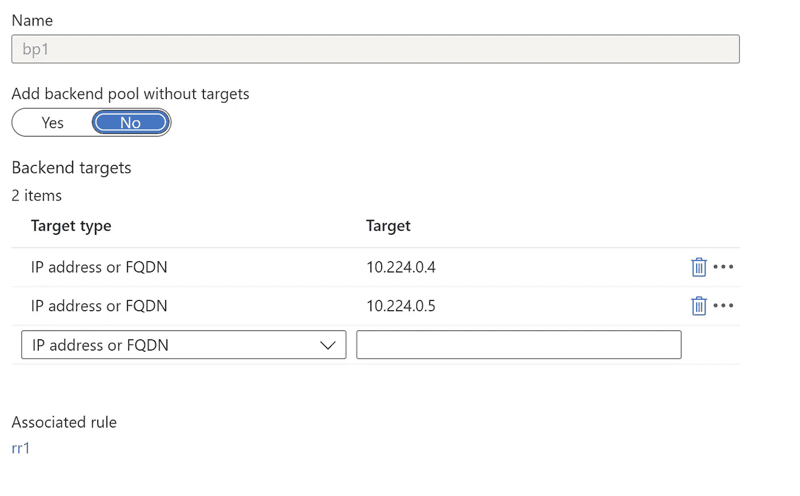
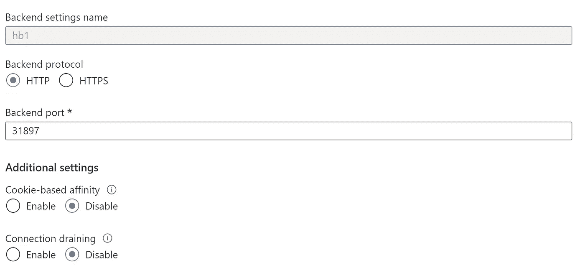
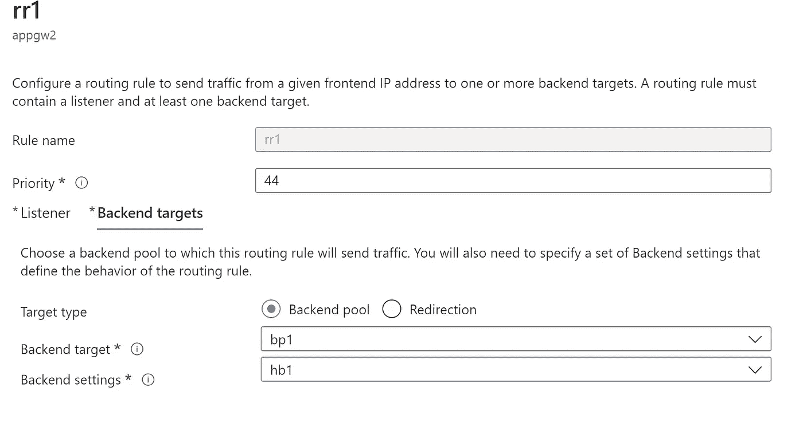
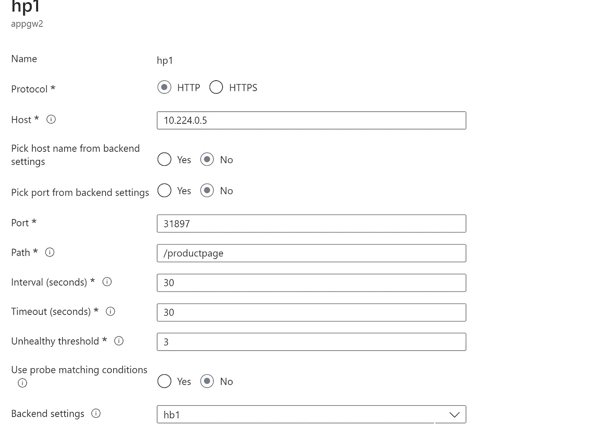
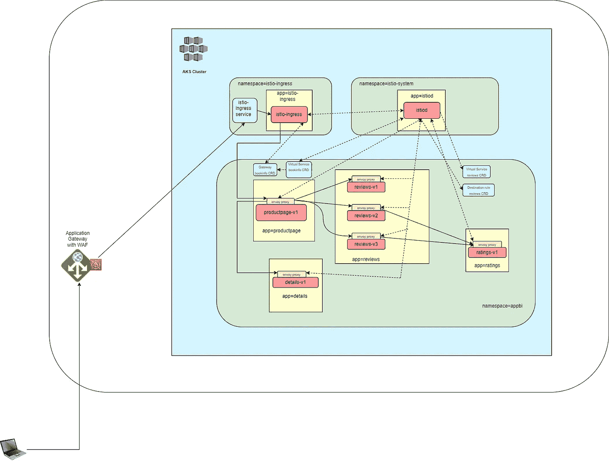

# 将 Azure 应用程序网关 WAF 与 Istio-2 一起使用

> 原文：<https://itnext.io/using-the-azure-application-gateway-waf-with-istio-2-eb5af5b697c6?source=collection_archive---------5----------------------->

# 简介和先决条件

在你开始之前，我想让你浏览一下[我之前的帖子](https://harinderjitss.medium.com/using-application-gateway-waf-with-istio-315b907b8ed7)关于相同的主题，在那里我用 Istio 使用了典型的 AKS-AGIC 配置。这篇文章将提供你想要达到的目标的背景，以及你为什么考虑尝试另一种方法。这种配置可以工作，但**你无法享受到** [**Istio 网关的特性**](https://istio.io/latest/docs/reference/config/networking/gateway/) **加上入口流量在第一次访问时直接到达 pod 后进入服务网格**。您可以查看上一篇[帖子](/using-application-gateway-waf-with-istio-315b907b8ed7)中的“入口请求流”图来理解它。

# 替代配置

**您可以避免使用应用网关入口控制器，而是使用 Istio 入口网关。您可以手动配置应用程序网关，使其像普通的第 4 层 TCP 负载平衡器一样工作，同时仍然利用应用程序网关的优势。您可以在“后端池”中将 AKS VMSS 私有 IP 配置为后端，并在应用网关的“后端设置”中将 istio-ingress 服务的端口 80 对应的“节点端口”配置为目标端口，以进行此配置。**

为此，您需要执行以下步骤:

## 创建和配置应用程序网关

*   假设 AKS 和 Istiod 按照前一篇文章中[描述的设置工作。](/using-application-gateway-waf-with-istio-315b907b8ed7)
*   如果在 AKS 上启用了 AGIC，请将其禁用，并删除现有的应用程序网关实例。
*   应用程序网关必须有不同的子网。创建并配置[应用网关实例](https://docs.microsoft.com/en-us/azure/application-gateway/quick-create-portal)，以便它使用我们在后端池的上一步中配置的 AKS 节点的私有 IP。



图 2 后端池

*   配置后端健康设置，以便目标端口是对应于 istio-ingress 名称空间中 istio-ingress 服务的端口 80 的节点端口

```
kubectl get svc istio-ingress -n istio-ingress
```



图 2 后端设置

*   配置一个使用您之前配置的后端池和后端设置的规则



图 3 规则

*   相应地配置健康探测器。



图 4 健康探针

## 安装和配置 Istio-ingress 网关

*   运行以下命令，使用 helm 安装 istio gateway

```
kubectl create namespace istio-ingress
kubectl label namespace istio-ingress istio-injection=enabled
## helm install istio-ingress for traffic management
helm install istio-ingress istio/gateway -n istio-ingress --wait
```

*   通过执行以下命令来配置网关和虚拟服务

bookinfo-gateway-v2.yaml

```
kubectl apply -f bookinfo-gateway-v2.yaml -n appbi
```

# 测试

*   获取应用程序网关的公共 IP，并将其作为“bookinfo.app.io”添加到客户机上的 hosts 文件中。观察书评区显示不同的“书评”用户界面，即 v1 没有星星，v2 有黑星，v3 有红星。经常查看刷新应用程序页面时显示的 UI。
*   您可以添加故障注入(参考我的旧帖子来了解这一点),并看看它如何影响应用程序

# 入口请求流

下图显示了流量如何通过应用程序网关、Istio 入口网关和服务于 web 应用程序的服务网格从客户端流向 pods。



图 5 不带标签的应用程序

**观察流量通过 Istio 入口网关通过服务网格到达 productpage 应用的端点 pod。**

# 结果呢

*   将应用网关(无 AGIC)与带有 Istio 服务网格的 WAF 配合使用是一种有效的配置。
*   一旦到达 Istio 入口网关，您就可以进入 Istio 服务网格。
*   在我看来，这种配置比以前更好，因为我们也可以利用 Istio 网关的优势。
*   您使用[应用网关 WAF](https://docs.microsoft.com/en-us/azure/web-application-firewall/ag/ag-overview) 保护了流量。

## 阻滞剂

*   如果您注意到 bookinfo-gateway-v2.yaml、gateway.spec.servers.hosts 和 VirtualService.spec.hosts 列表的值为“*”，而不是域名。如果设置为“bookinfo.app.io”(域名)，理想情况下应该可以，但实际上不行。您将在 Istio 入口网关日志中遇到类似下面的内容。

```
[2022-09-01T21:40:23.309Z] "GET /productpage HTTP/1.1" 404 NR route_not_found - "-" 0 0 0 - "10.244.0.1" "-" "00d34de6-39fe-4b2d-ac36-7fd30f31b599" "10.224.0.5" "-" - - 10.244.0.12:80 10.244.0.1:10634 - -
[2022-09-01T21:40:23.314Z] "GET /productpage HTTP/1.1" 404 NR route_not_found - "-" 0 0 0 - "10.224.0.4" "-" "87ae7407-7671-4bed-b523-0d8065ec76be" "10.224.0.5" "-" - - 10.244.0.12:80 10.224.0.4:50552 -
```

*   在使用 Istio 101 post 的[流量管理中，当您将 TCP 负载平衡器与 Istio 入口网关一起使用时，您没有观察到此行为。](/traffic-management-using-istio-b49663da3e8d)
*   不幸的是，这限制了我们使用 Istio 的大多数网关功能。

## 周围的工作

*   我在 GCP 测试了相同的配置，遇到了相同的问题，即每当我在 gateway.spec.server.hosts 中使用特定的主机名时，应用程序都无法访问。
*   我按照与不同拓扑相关的[文档应用了建议的配置，问题仍然存在。](https://istio.io/latest/docs/ops/configuration/traffic-management/network-topologies/)
*   然后我在 GCP 使用了 TCP(不是 HTTP)作为**健康检查类型，并且工作正常。我能够在 Istio 入口网关前使用 [GCP 装甲](https://cloud.google.com/blog/products/identity-security/new-waf-capabilities-in-cloud-armor)和 GCP HTTP 负载平衡器(OSI 第 7 层)。**
*   Azure 应用程序网关没有给我们设置 TCP 类型的健康探测器的选项，所以我创建了一个简单的 nginx 节点端口服务来服务 nginx pod。然后，我在 Health Probe(应用程序网关)中使用了 nginx 服务的节点端口，而不是 Istio Ingress 服务的节点端口。
*   **因此，问题出在健康探测器上，显然 Istio 网关会检查每个请求的主机报头，如果不是针对网关中定义的主机之一，就会拒绝。应用网关健康探测器设置为使用 AKS 节点的 IP，这就是为什么网关会拒绝来自健康探测器的请求，一旦健康探测器失败，就不会将来自应用网关的请求路由到 Istio 入口网关。现在，您可以将 bookinfo-gateway-v2.yaml 中的“*”替换为“bookinfo.app.io ”,应用配置并重新测试。**
*   我在 Gateway 中对多台主机进行了进一步测试，一切正常。

请阅读我的其他文章，并分享您的反馈。如果你喜欢分享的内容，请点赞、评论并订阅新文章。