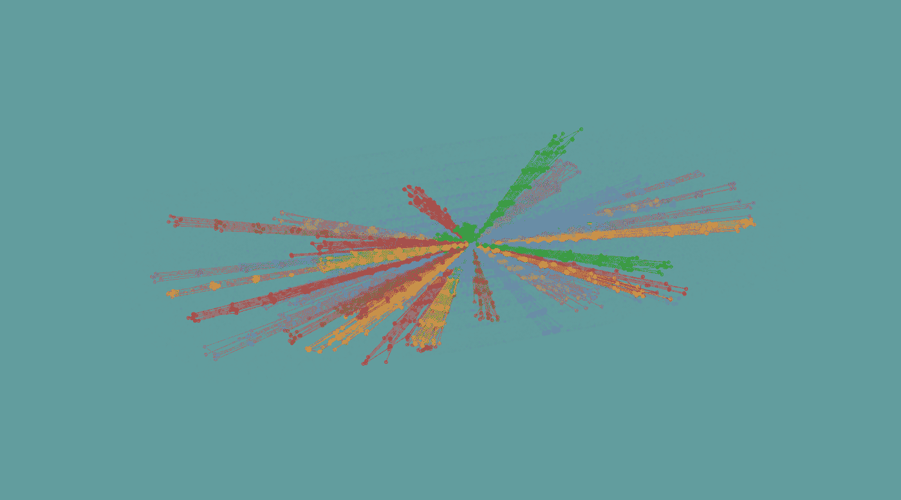
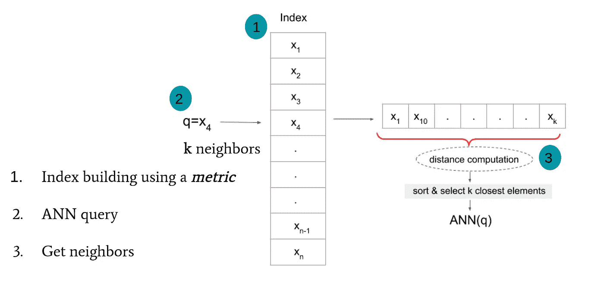
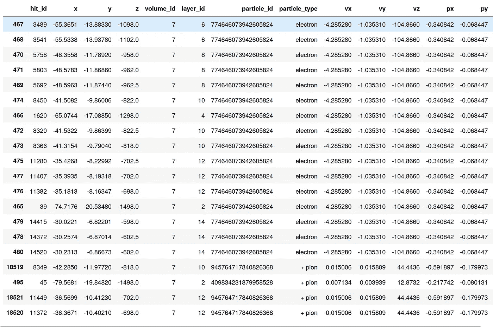
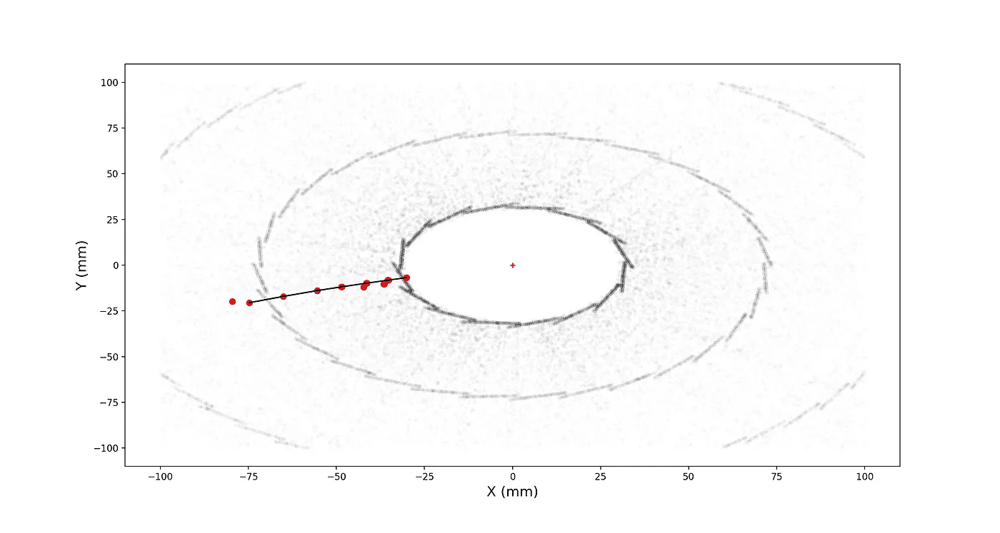
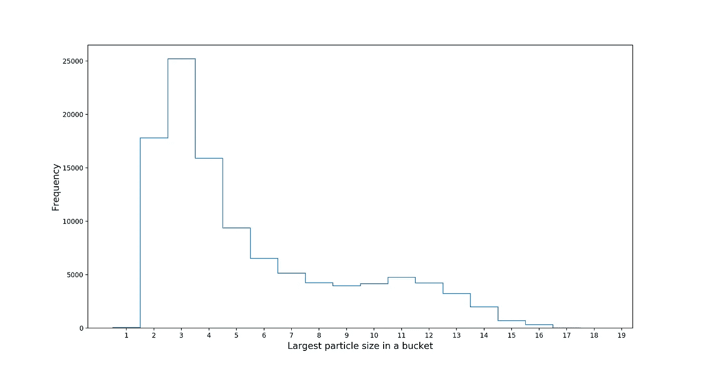
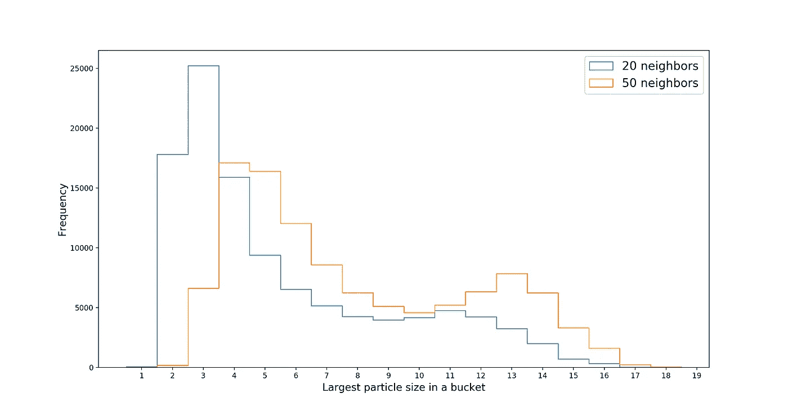

# 使用 Spotify 算法寻找高能物理粒子

> 原文：<https://itnext.io/using-the-spotify-algorithm-to-find-high-energy-physics-particles-1c28f5f37650?source=collection_archive---------2----------------------->

几个步骤，python 指南粒子跟踪与近似最近邻库烦扰。



在“桶”中收集相邻粒子碰撞

关于用 Python 处理和可视化粒子的复习，请查看我之前的文章。在高能物理学中追踪粒子就是将同一粒子产生的碰撞连接在一起。在一个典型的[高光度](https://home.cern/science/accelerators/high-luminosity-lhc)碰撞事件中，10K 粒子产生了 10 万次碰撞，导致平均粒子大小为 10 次碰撞。

接下来的挑战是从一堆看起来相似的 10 万个点击中把正确的 10 个连接起来，并且在一秒钟之内完成！这就是我们转向“开箱即用”解决方案的原因，这些解决方案通常用于处理大规模数据集。几百万**歌曲**数据集呢？

在推荐你下一首可能喜欢的歌曲方面，Spotify 是无可争议的赢家。这里的计算技巧是在一个非常大的数据库中搜索歌曲之间的相似性，而 Spotify 的烦人库做得非常优雅。它是开源的，使用简单，有多种语言版本。让我们看看如何用它来寻找光速粒子。

用 pip 可以快速安装骚扰

```
#Version used in this guide :  1.17.0
pip install annoy
```

近似最近邻技术背后的一般思想是返回*近似*和*快速*最接近查询点的点集。第一步是建立数据集的索引，同时指定用于评估点之间相似性的度量。然后，当进行查询时(图中的 x *4* ，使用近似技术而不是穷举搜索来检索相似点的集合。Annoy 使用随机投影来快速绑定数据，这使得搜索速度非常快。



如果你还没猜到，我们在粒子追踪中的*邻居*将是同一个粒子产生的命中。对数据集的不同查询会产生不同的邻居集合，我们的目标是在每个集合中找到至少一个粒子。我们将使用的碰撞事件同样来自[公共 TrackML 数据集](https://www.kaggle.com/c/trackml-particle-identification)。

要使用 Annoy 构建索引，我们只需指定每次点击的特征数量和相似性度量。作为第一步，我们将只有一个角距离击中的三维坐标。角距离确保相邻的击中相对于原点对齐。正如后面将要展示的，这是一个非常好的开始标准。接下来，让我们编写一个构建索引并用数据填充它的函数。

```
from annoy import AnnoyIndexdef buildAnnoyIndex(data,metric="angular",ntrees=5):
    f = data.shape[1]
    idx = AnnoyIndex(f,metric)  
    for i,d in enumerate(data):
        idx.add_item(i, d)
    idx.build(ntrees) 
    return idx
```

为了确保更高的精度，通过参数“ntrees”构建多个随机投影。为了确保更快的搜索，我们只使用了 5 棵树。

在碰撞事件上建立人工神经网络指数是通过以下几行完成的:

```
import pandas as pddata=pd.read_csv("lhc_event.csv")annoy_idx=buildAnnoyIndex(data[["x","y","z"]].values)
```

既然数据集存储在“annoy _ idx”变量中，我们就能够执行查询了。允许返回查询命中的近似最近邻的函数如下:

```
annoy_idx.get_nns_by_item(hit_id,Nb_neighbors)
```

查询命中通过其在数据集中的索引来指定，并且 Nb_neighbors 指示要返回的最接近命中的数量。这个函数然后返回近似邻居的索引。也可以通过打开选项参数`include_distances=True`返回距离值

当将 Nb_neighbors 设置为 20 并随机选择命中索引时，我们得到以下结果:

```
hit_id=467
Nb_neighbors=20
annoy_idx.get_nns_by_item(hit_id,Nb_neighbors)
Out : [467, 468, 469, 470, 471, 474, 466, 472, 473, 476, 475, 477, 478, 480, 465, 479, 18519, 18521, 495, 18520]
```

我们可以看到与这些“桶”索引相关联的命中如下:

```
bucket_idx=annoy_idx.get_nns_by_item(hit_id,Nb_neighbors)
data.iloc[bucket_idx]
```



原来我们的随机查询命中是一个幸运的电子！注意，数据帧的索引列正是我们的 ANN 存储桶。我们还可以看到，查询后的点击似乎共享同一个 particle_id=774646073942605824。这意味着我们的人工神经网络查询检索到了由同一个粒子产生的命中结果:一个电子。

让我们检查一下桶中这些电子击中的准确数量:(计数器功能在[上一篇文章](https://greysab.medium.com/10-ways-of-analyzing-high-energy-particles-with-python-329b736817dd)中介绍过)

```
from collections import CounterCounter(data.iloc[bucket_idx].particle_id)
Counter({**774646073942605824**: **16**, 945764717840826368: 3, 409834231879958528: 1})
```

答对了。我们在一个 20 次击中的桶中找回了 16 次击中的电子！但这是这个粒子产生的总命中数吗？

```
len(data[data.particle_id==**774646073942605824])** Out : 16
```



20 个命中(红点)的 ANN 桶和由线表示的最大粒子。TrackML 探测器的横向视图。

是的，确实所有的电子痕迹都在这个桶里。这是一个幸运的场景吗？当询问 20 个邻居时，我们实际得到的*平均*粒子大小是多少？让我们看看所有可能的人工神经网络查询中最大颗粒尺寸的分布。

我们可以通过简单地在每个查询中存储最大计数*来做到这一点，类似于我们对电子桶所做的可视化操作。在计数器上使用 most_common()函数可以只返回最大颗粒的 id 和尺寸。这个函数大约需要 40 秒，因为命中次数非常多，Counter()不是最快的选项(但它是最好的)。*

```
largest_particle_size=[]for i in data.index.values:
   bucket_idx=annoy_idx.get_nns_by_item(i,Nb_neighbors) c=Counter(data.iloc[bucket_idx].particle_id).most_common(1)[0][1]   largest_particle_size.append(c)
```



事实证明，在 20 命中的安桶中获得 16 命中的粒子是有点幸运的。不到 1K 个查询包含如此高数量的相同粒子命中。大多数人工神经网络桶包含 3、2 和 4 次击中的粒子轨迹。但是，如果我们尝试将查询的邻居数量从 20 增加到… 50，分布就会发生变化！



现在，大多数桶包含由同一粒子产生的 4 次和 5 次点击。总体分布很好地向右移动，允许包含更大的迹线。

使用 Annoy librabry 进行 50 次 10K(大约是一个事件中的粒子数)查询需要**400 毫秒**。我们是否可以进一步优化人工神经网络查询，使其仅包含大量的粒子痕迹？

到目前为止，我们只研究了按角度距离构建的 ANN 桶。有更好的选择吗？敬请关注下期帖子！

完整的代码可以在 github.com/greysab/pyhep 的[找到](https://github.com/greysab/pyhep/blob/main/ann_hep.ipynb)