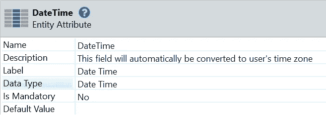
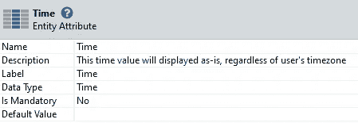
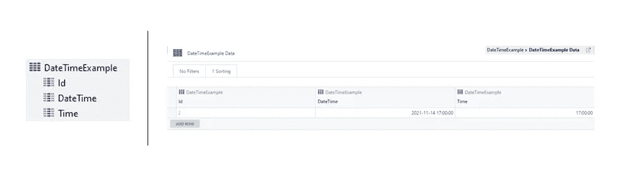
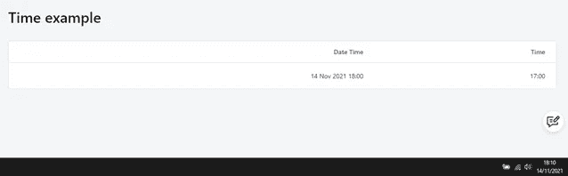

# 充分利用时间

> 原文：<https://itnext.io/using-time-to-our-advantage-6d7545887379?source=collection_archive---------5----------------------->

在我的记忆中，时区总是被视为一个需要解决的难题。随着外部系统的反应和移动应用程序的工作方式不同于传统的 Web 应用程序，困惑增加了，解决方法变得越来越有创造性。尽管如此，毫不费力地实现您的用例是非常简单和干净的。
本文主要关注 OutSystems 平台的开发。如果你没用过，你应该用一下。

# 介绍

对于传统的 Web 应用程序，时区总是在服务器端处理，对于应该显示在客户端时区上的日期时间，这种转换需要显式完成，这可以在 forge 组件如[时区](https://www.outsystems.com/forge/component-overview/500/time-zone)的帮助下完成。

首先是移动应用，然后是反应式应用，随着日期时间自动转换为客户端时区，范式发生了变化。这造成了一些混乱，并对如何呈现存储在数据库中的静态时间提出了挑战，而不管客户端的时区。例如，考虑一家餐馆的营业时间，无论用户在哪里，都应该以餐馆的当地时间显示。

然后我们可以将我们的用例一分为二:相对时间和绝对时间。

# **相对时间**

时间应该根据用户当时所处的时区显示在客户端设备上。例如，当一条推文一分钟前发布时，它是一分钟前在新西兰或纽约发布的。

在移动和反应式应用程序中，这是*日期时间*属性的默认行为。为了实现这个用例，您应该将时间保存在数据库中作为*日期时间*。

将属性保存为日期时间会将时间自动转换为用户的时区

# **绝对时间**

无论用户处于哪个时区，时间都应该显示相同。绝对时间的一个很好的例子是为你的下一次旅行寻找一家酒店。如果登机时间是当地时间 15 点，不管你现在在哪个时区，你都会看到 15 点。
为了实现这个用例，将时间保存在数据类型为 *Time* 的属性中。

将属性保存为时间将使时间按原样显示，而不考虑用户的时区

# 例子

作为展示这两种场景的一个小例子，我们创建了一个具有两个属性的表:一个具有类型 *DateTime* ，另一个具有类型 *Time* 。我们在数据库中用 17:00:00(GMT 时区)填充了它们。

具有日期时间*和时间值*的表示例，两者都是数据库中的 17:00:00 时间

现在一个简单的屏幕在浏览器上显示 GMT + 1 的时间。

该示例显示了如何将日期时间调整为客户端的时区(GMT + 1)，这与显示为 17:00 的时间不同，与时区无关。

正如我们在示例中看到的， *DateTime* 属性作为*相对时间，*自动调整到浏览器时区 GMT + 1，而 *Time* 属性作为*绝对时间*，显示与数据库中相同的值，不进行任何转换。

# 结论

当处理时间值时，我们可能希望它相对于客户端时区或独立于时区。在 OutSystems Mobile / Reactive 应用程序中实现这两种场景的最简单方法是将其相应地保存在数据库中:第一个场景保存为 *DateTime* ，第二个场景保存为 *Time* 。