# 在 Oracle embedded JVM 上使用 VSCode Dev 容器进行 Java 服务器端开发

> 原文：<https://itnext.io/using-vscode-dev-container-for-java-server-side-development-at-the-oracle-embedded-jvm-6d86662b2936?source=collection_archive---------2----------------------->

这篇文章是关于使用 VSCode Dev 容器扩展在 Oracle 内部 JVM(运行在 Oracle RDBMS 内部的 Java，也称为 OJVM)上进行受控和安全的 Java 开发，它也适用于常规的客户端 Java RDBMS 应用程序。


照片由[瑞安·普特拉](https://unsplash.com/@ryanadhi?utm_source=medium&utm_medium=referral)在 [Unsplash](https://unsplash.com?utm_source=medium&utm_medium=referral) 拍摄

# 为什么？

Visual Studio Code Remote-Containers 扩展允许您将 Docker 容器用作全功能开发环境。它允许您打开容器内(或装入容器中)的任何文件夹，并利用 Visual Studio 代码的完整功能集。项目中的一个 [devcontainer.json](https://github.com/scotas/docker-images/blob/master/devcontainer-ols/.devcontainer/devcontainer.json) 文件告诉 VS 代码如何使用定义良好的工具和运行时堆栈来访问(或创建)开发容器。该容器可用于运行应用程序或沙盒工具、库或运行时，这些都是使用代码库所需的。

如果你参与了一个大型的 Java 服务器端开发，其中包含了大量的 Java 代码，比如 Scotas Native Solr integration，这将是一个非常省时的机器。

我们开发环境示例有两大依赖项:

*   Oracle 18c/19c RDBMS (EE 或 XE)
*   阿帕奇索尔

Oracle 18c/19c RDBMS 是编译和测试 Scotas OLS 的目标系统，Apache Lucene/Solr 是作为搜索引擎集成到 RDBMS 中的组件，作为新的内置域索引运行。

本文是我上一篇文章[的续篇，在 Oracle embedded JVM](https://marcelo-ochoa.medium.com/using-docker-for-java-server-side-development-at-the-oracle-embedded-jvm-3141a72f280c) 中使用 Docker 进行 Java 服务器端开发，这篇文章描述了以下容器层:

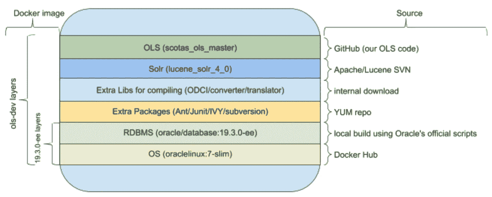

开发容器图像层

只有绿色层是我们从 GitHub 自动提取的开发/测试/构建代码，所有其他层都是不可变层，是开发环境的一部分，它们是:

*   [Docker Hub repo 的 Oracle Linux 7-slim](https://hub.docker.com/_/oraclelinux)(作为 Oracle 19c 构建流程的一部分)
*   19c 使用 Oracle 官方[脚本](https://github.com/oracle/docker-images/tree/master/OracleDatabase/SingleInstance/dockerfiles)构建 RDBMS Docker 映像
*   编译所需的额外工具/库，如 Apache Ant、JUnit 和 IVY
*   VSCode 扩展的额外包，如 docker-engine 和 aspnetcore-runtime-3.1
*   内部库，如 ODCI(用于[数据卡式包](https://docs.oracle.com/en/database/oracle/oracle-database/19/addci/index.html)的包装类)
*   来自官方 SVN 库的 Apache Lucene/Solr(已打补丁)

完整的 [Dockerfile](https://github.com/scotas/docker-images/blob/master/devcontainer-ols/.devcontainer/Dockerfile) 可在 GitHub 获得。

# 开发容器文件解释

我们的项目有几个文件:

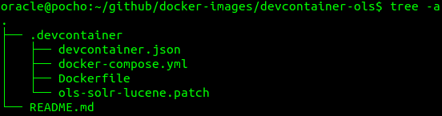

开发容器项目布局

最重要的是:

*   [devcontainer.json](https://github.com/scotas/docker-images/blob/master/devcontainer-ols/.devcontainer/devcontainer.json) ，以 VSCode 扩展格式定义了我们的开发环境
*   [Dockerfile](https://github.com/scotas/docker-images/blob/master/devcontainer-ols/.devcontainer/Dockerfile) ，构建 Docker 图像(我们的图像开发空间)的步骤
*   [docker-compose.yml](https://github.com/scotas/docker-images/blob/master/devcontainer-ols/.devcontainer/docker-compose.yml) ，我们的 docker compose 栈，Oracle 18c XE plus 以上开发者镜像(两个运行容器)

在打开此项目之前，必须已经构建了一个 Oracle 18c XE 映像，如果您想要使用 19c EE 映像，可以使用修改后的 [Dockerfile](https://github.com/scotas/docker-images/blob/master/ols-dev-env/Dockerfile.r5) 来实现类似的项目。通过列出您的本地映像存储库来检查映像是否存在(您可以避免使用位于公司私有注册表中的映像):

```
oracle@pocho:~/github/docker-images$ docker image ls|grep xe
***oracle/database***   ***18.4.0-xe***  6acb249d39ba   4 months ago    5.87GB
```

然后 check out***docker-images***repo 以 VSCode Dev 容器功能开始

```
oracle@pocho:~/github$ git clone [https://github.com/scotas/docker-images.git](https://github.com/scotas/docker-images.git)
Cloning into 'docker-images'...
remote: Enumerating objects: 112, done.
remote: Counting objects: 100% (112/112), done.
remote: Compressing objects: 100% (81/81), done.
remote: Total 304 (delta 55), reused 84 (delta 31), pack-reused 192
Receiving objects: 100% (304/304), 51.62 KiB | 367.00 KiB/s, done.
Resolving deltas: 100% (162/162), done.
oracle@pocho:~/github$ ***cd docker-images/devcontainer-ols***
oracle@pocho:~/github$ ***code .***
```

VSCode 会问你

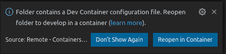

在容器中重新打开 VSCode 确认对话框

如果您选择在容器中重新打开，将会启动一个构建过程，但在此之前，请查看 docker-compose.yml 文件中的一些自定义内容:

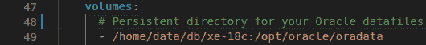

Oracle 数据文件的 Docker 卷装载

我正在使用**/T1/home/data/db/XE-18c**作为 Oracle XE 数据文件的持久目录，这意味着我的 RDBMS 状态将在许多启动/停止 docker 容器生命周期中继续存在，该目录应该为空，并由***54321:54321******UID/GID***Unix 权限拥有。以空目录开始将导致 Oracle XE image Docker entrypoint 创建一个全新的映像，最后应用***/opt/Oracle/scripts/setup/***安装后脚本，安装后脚本默认定义为:

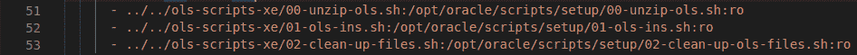

默认安装脚本

其中为 Oracle XE 安装了[Scotas OLS](https://github.com/scotas/ols)release[v 2 . 0 . 5](https://github.com/scotas/ols/releases/tag/v2.0.5)版本，如果您不希望这样，只需在上面注释三行。

一个新的 Oracle XE 实例将有一个 SYS/SYSTEM 密码，如中所定义:

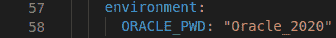

对于开发容器映像，您应该考虑以下值:

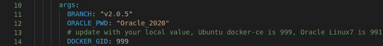

*   BRANCH 是 Scotas OLS 存储库上的一个标签(处理它的源代码)
*   ORACLE_PWD 必须等于上述值
*   DOCKER_GID 必须等于您的本地环境，请使用***grep DOCKER/etc/group***进行检查，这对于为了 DOCKER 扩展进行 VSCode 工作很重要

如果您查看了上面的配置，您可以使用 ***在容器*** 中重新打开按钮将项目目录作为 Dev 容器重新打开。

# 首轮放映

在第一次运行期间，当您在 Dev 容器中打开此项目时，一个日志进程将显示如下内容:

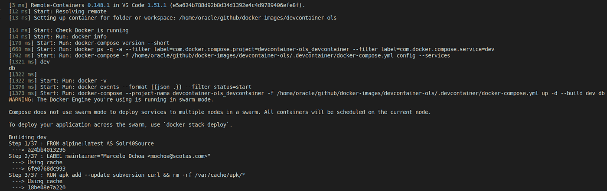

开发容器构建过程开始

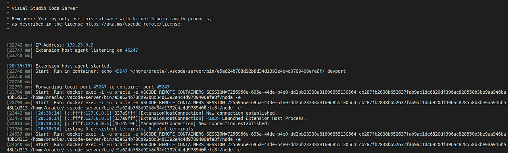

开发容器构建流程结束

将显示一个 VSCode 项目，并准备开始开发。

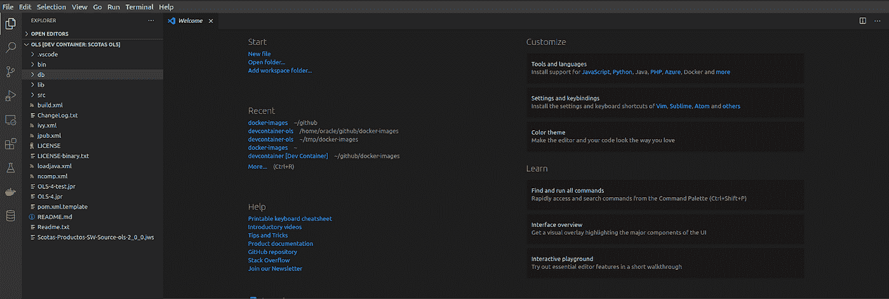

VSCode 欢迎项目，项目准备开始

# 扩展ˌ扩张

查看 [devcontainer.json](https://github.com/scotas/docker-images/blob/master/devcontainer-ols/.devcontainer/devcontainer.json) 文件，我们的开发环境中默认包含三个扩展:

*   ***VSC java . vs code-Java-Pack***，[微软的 Java 扩展包](https://marketplace.visualstudio.com/items?itemName=vscjava.vscode-java-pack)
*   微软的***ms-azure tools . vs code-Docker***， [Docker](https://marketplace.visualstudio.com/items?itemName=ms-azuretools.vscode-docker)
*   ***Oracle . Oracle dev Tools***，[Oracle dev Tools for VS 代码](https://marketplace.visualstudio.com/items?itemName=Oracle.oracledevtools)

这就是为什么 Dockerfile 在我们构建的映像中包含了这些包:

*   码头引擎
*   aspnetcore-运行时-3.1
*   open JDK 11 u-JDK _ x64 _ Linux _ hotspot _ 11 . 0 . 9 . 1 _ 1 . tar . gz

借助上述扩展，我们可以轻松管理 Oracle XE 容器:

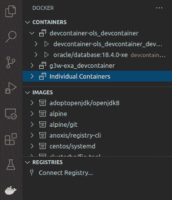

使用 Docker 扩展运行和访问容器

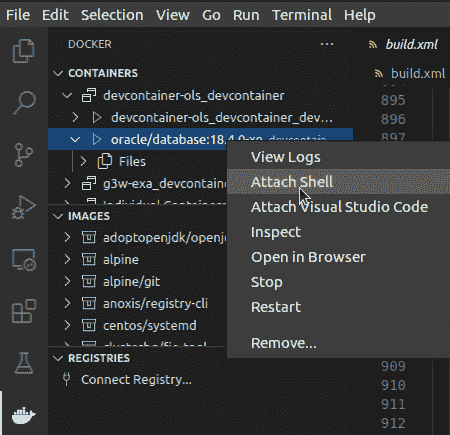

使用 shell 连接到正在运行的 Oracle XE RDBMS

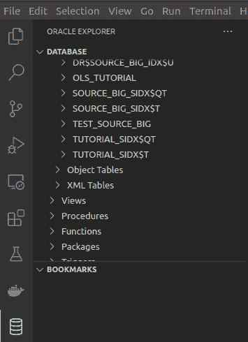

使用 Oracle Developer Tools for VS 代码编辑 Oracle DB 对象

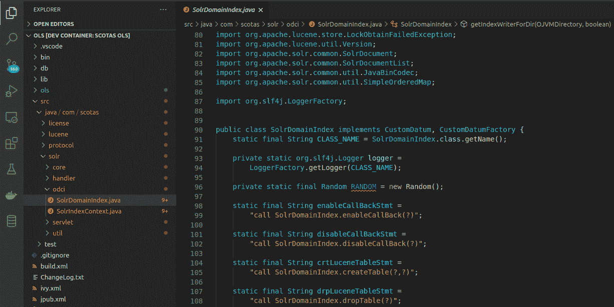

编辑 Java 源代码

# 在映像构建时预建了一些库

如果您想在第一次构建映像时预构建一些库，您可以在 [devcontainer.json](https://github.com/scotas/docker-images/blob/master/devcontainer-ols/.devcontainer/devcontainer.json) 处取消注释行 [postCreateCommand](https://github.com/scotas/docker-images/blob/master/devcontainer-ols/.devcontainer/devcontainer.json#L30) ，例如:

```
"postCreateCommand": "cd /home/lucene;ant build-modules;cd ../solr;ant dist-core dist-solrj dist-contrib",
```

# 包裹

首先，通过包含几个文件的简单项目，任何开发人员都可以在任何平台(Windows、Linux、Mac)上在几分钟内建立并运行开发容器环境；第二个最大的好处是，这是一个可重复的环境，你可以放弃和建立许多次，你会得到相同的结果，第三是冻结到一个特定的 RDBMS，Solr 和 OLS 代码(使用标记分支)，你可以在不同的图像改变分支建立参数，最后你有所有在一个地方编译和建立 OLS。