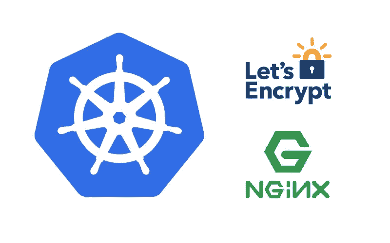

# 在 Kubernetes 的 cert-manager 中使用通配符证书并跨所有名称空间复制

> 原文：<https://itnext.io/using-wildcard-certificates-with-cert-manager-in-kubernetes-and-replicating-across-all-namespaces-5ed1ea30bb93?source=collection_archive---------2----------------------->



基于[这个](https://goo.gl/XGYRXH)以前的故事，我们开始为不同的应用程序管理几个证书，这变得越来越难维护(而且我们达到了 Let's-ecnrypt 的速率限制)，所以通过 [Lucas Collino](https://medium.com/u/615b72822d37?source=post_page-----5ed1ea30bb93--------------------------------) 我们找到了一种使用通配符证书的方法(正如推荐的)。

这允许创建适合我们支持的所有应用程序的单个*.mycompany.com 证书。

证书存储在 kube-system 名称空间的一个秘密中，我们在所有名称空间中复制了这个秘密，因此开发人员可以在他们自己的名称空间中访问它。

本指南假设您已经遵循了[上一个](https://goo.gl/XGYRXH)，并且您已经有了 Helm 和 cert-manager。

# 创建通配符证书

```
$ cat management-mycompany-com.yaml 
---apiVersion: certmanager.k8s.io/v1alpha1
kind: Certificate
metadata:
 name: management-mycompany-com
 namespace: kube-system
spec:
 secretName: management-mycompany-com-tls
 issuerRef:
   name: letsencryptdns
   kind: ClusterIssuer
 dnsNames:
   - '*.management.mycompany.com'
 acme:
   config:
     - dns01:
         provider: dns
       domains:
         - '*.management.mycompany.com'
```

几分钟后，你应该有秘密创建。

```
$ kubectl get certificates -n kube-system
NAME AGE
sandbox-mycompany-com 5m
$ kubectl describe certificate sandbox-mycompany-com -n kube-system...    Message:               Certificate issued successfully...
$ kubectl get secret sandbox-mycompany-com-tls -n kube-system
NAME TYPE DATA AGE
sandbox-mycompany-com-tls kubernetes.io/tls 2 5m
```

# 在所有名称空间中复制秘密

我们使用[这个工具](https://github.com/mittwald/kubernetes-replicator)跨所有名称空间复制带有证书的秘密。

首先创建一个名为 replicatedsecret.yaml 的文件，其中包含

```
apiVersion: v1
kind: Secret
metadata:
  name: auxsecret
  annotations:
    replicator.v1.mittwald.de/replicate-from: kube-system/auxsecret
data: {}
```

然后创建一个小脚本，用于每个名称空间并完成工作:

```
$echo "Enter secret to replicate (ex: sandbox-mycompany-com-tls)"
read secretsed "s/auxsecret/$secret/g" replicatedsecret.yaml > replicatedsecret-$secret.yamlNS=$(kubectl get ns | grep -v kube-system | awk '{ print $1 }' | tail -n +2)#Get NS - kube-system
for i in $NS; do
  echo $i
  kubectl apply -f replicatedsecret-$secret.yaml -n $i
done
```

您可以在您的名称空间上验证您是否复制了 secret sandbox-my company-com-TLS；)

另一种方法应该是遵循本指南[https://www . rev sys . com/tidbits/copy-kubernetes-secrets-between-namespaces](https://www.revsys.com/tidbits/copying-kubernetes-secrets-between-namespaces/)

# 创建一个测试入口

在默认名称空间中启动 nginx，并为它创建一个服务。

运行`kubectl run nginx --image nginx`
和`kubectl expose deploy nginx --port 80`

您刚刚在默认名称空间中启动了一个包含 nginx 的 pod，并提供了一个名为 nginx 的服务。

创建 ingress.yaml

```
apiVersion: extensions/v1beta1
kind: Ingress
metadata:
  annotations:
    ingress.kubernetes.io/ssl-redirect: "false"
    kubernetes.io/ingress.class: nginx
  labels:
    app: nginx
  name: nginx-sandbox-mycompany-com
  namespace: default
spec:
  tls:
  - hosts:
    - nginx.sandbox.mycompany.com
    secretName: nginx-sandbox-mycompany-com-tls
  rules:
  - host: nginx.sandbox.mycompany.com
    http:
      paths:
      - backend:
          serviceName: nginx
          servicePort: http
        path: /
```

运行`kubectl create -f ingress.yaml` -我们刚刚创建了入口。证书应该在大约 30 秒内准备好。

现在，整个流量都通过 https，我们已经从“让我们加密”中获得了有效证书。

所以，就这样了。我希望你觉得它有用，并且步骤容易遵循。如果我遗漏了什么，请评论和/或提问——我很乐意得到您的反馈。