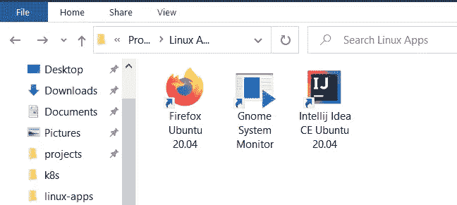
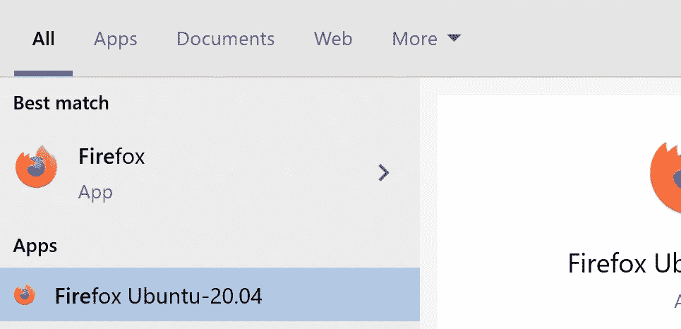
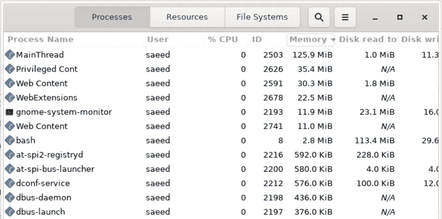

# 使用 WSL 2 在 Windows 10 中快捷地运行 Linux GUI 应用程序

> 原文：<https://itnext.io/using-windows-10-as-a-desktop-environment-for-linux-7b2d8239f2f1?source=collection_archive---------0----------------------->

## 使用 Windows 10 作为 Linux 的桌面环境



使用 WSL 2 在 Windows 10 中快捷地运行 Linux GUI 应用程序

## 什么是 Linux 桌面环境？

如果你在没有[桌面环境](https://en.wikipedia.org/wiki/Desktop_environment)的情况下使用 Linux，你只有一个终端来与 Linux 内核通信，这在你使用服务器时是很好的，但是当你开发软件时，你几乎总是需要 IDE、web 浏览器和几个其他工具和实用程序，因为这些 GUI 应用程序，你需要安装一个桌面环境，如 Gnome、KDE 和……它们提供了一个窗口管理器(和一些其他重要组件，如[窗口系统](https://en.wikipedia.org/wiki/Windowing_system)、[显示服务器](https://en.wikipedia.org/wiki/Display_server)和……)来显示 GUI 并管理与用户的交互。

## WSL 2 是什么？

到了[WSL 2](https://docs.microsoft.com/en-us/windows/wsl/wsl2-about)(Linux 的 windows 子系统)，你在一个轻量级的实用虚拟机(VM)中有了一个真正的 Linux 内核，它完全与 Windows 集成，你可以在它上面安装你喜欢的 Linux 发行版，并在 Windows 上运行 Linux 二进制文件。

## 使用 WSL 2 运行 Linux GUI 应用程序

WSL 2 很快，你可以在我之前的帖子中看到我的基准测试:

[](/using-wsl-2-to-develop-java-application-on-windows-8aac1123c59b) [## 使用 WSL 2 在 Windows 上开发 Java 应用程序

### 比较使用 Maven 和 Intellij Idea 时 WSL 2 和 Windows 10 的性能

itnext.io](/using-wsl-2-to-develop-java-application-on-windows-8aac1123c59b) 

但是 WSL 2 现在不支持运行 GUI 应用，因为 Linux 中的 GUI 应用至少需要一个[窗口系统](https://en.wikipedia.org/wiki/Windowing_system)和一个[显示服务器](https://en.wikipedia.org/wiki/Display_server)来显示 GUI 和管理与用户的交互。

目前，我们有两个选择:

1-在 WSL 2 发行版(如 Ubuntu-20.04)上安装一个桌面环境(如 Gnome 或 KDE)并通过 RDP 连接到它

2-在 Windows 10 上安装一个 X 服务器(一个[显示服务器](https://en.wikipedia.org/wiki/Display_server)，比如 [VcXsrv](https://sourceforge.net/projects/vcxsrv/) ，xming 或者 cygwin 的 xwin)并将其作为显示服务器引入 WSL 2:

[](https://techcommunity.microsoft.com/t5/windows-dev-appconsult/running-wsl-gui-apps-on-windows-10/ba-p/1493242) [## 在 Windows 10 上运行 WSL GUI 应用程序

### 在这篇文章中，我将演示如何在 Windows 桌面上运行 Linux GUI(图形用户界面)应用程序…

techcommunity.microsoft.com](https://techcommunity.microsoft.com/t5/windows-dev-appconsult/running-wsl-gui-apps-on-windows-10/ba-p/1493242) 

# 为 Linux GUI 应用程序(Firefox、Gnome 系统监视器、Intellij Idea、gedit 和…)创建快捷方式，并从开始菜单运行它们

到目前为止，您可以通过在 windows 10 上安装显示服务器( [VcXsrv](https://sourceforge.net/projects/vcxsrv/) )并将其引入 WSL 2 发行版(如 Ubuntu-20.04)，从 WSL 2 终端运行 Linux GUI 应用程序。

如果我们不想从命令行运行 Linux GUI 应用程序，我们必须做什么？

您可以将 Linux 命令直接传递给`wsl.exe`命令(从 Powershell 或 CMD ),而不用进入 Linux 终端:

```
wsl ls -al
```

我们可以使用这个特性，通过开始菜单中的快捷方式来运行 Linux GUI 程序。我们只需要用主机(运行 X Server)的 IP 地址设置`DISPLAY`环境变量，然后运行像 firefox 或 IntelliJ Idea 这样的 GUI 应用程序:

1-创建一个脚本文件，并将其命名为`wsl-app-runner.bat`(我通常在当前用户主目录`C:\Users\YOUR_USERNAME\programs\linux-apps`中创建所有这些脚本文件)

这个脚本找到 WSL 主机的 IP 地址(在其上运行 X 服务器),然后在`wsl`命令的`DISPLAY`环境变量中设置它，并获得 Linux GUI 应用程序的名称作为第一个参数。我们将重用这个脚本来创建几个快捷方式。

2-创建一个 Visual Basic 脚本文件(。vbs)，用于您的 Linux GUI 应用程序。这个文件必须在`wsl-app-runner.bat`文件旁边创建，并且你必须在 WSL 2 发行版(在我的例子中是 Ubuntu-20.04)上安装应用程序(例如 firefox)。

这个 Visual Basic 脚本文件是可执行的，也允许我们隐藏命令行。在这个脚本中，我们使用`wsl-app-runner.bat`运行我们最喜欢的 Linux GUI 应用程序。

3-右键单击 windows 文件资源管理器中的 Visual Basic 脚本文件，并选择`create shortcut`菜单，然后将该快捷方式重命名为您想要的任何名称(例如`Firefox Ubuntu-20.04`)。如果你愿意，你可以在文件属性中为这个快捷方式选择一个图标。

4-最后将该快捷方式复制到开始菜单快捷方式目录中(`C:\Users\YOUR_USERNAME\AppData\Roaming\Microsoft\Windows\Start Menu\Programs`)。我通常在那里创建一个新文件夹(例如`Linux Apps`)并将 WSL 2 快捷方式粘贴到其中。



现在你可以在开始菜单中搜索这个应用程序，只需点击一下就可以打开它。


如果对安装在 WSL 2 发行版上的任何新的 Linux GUI 应用程序重复步骤 2 到 4，就可以很容易地运行它。正如你在下面的照片中看到的，我运行`gnome-system-monitor`应用程序，你可以看到火狐的内存使用情况。



使用 WSL 2 运行 gnome 系统监视器

# 结论

如果你每天都要使用 Linux GUI 应用程序，如 Firefox 或 IntelliJ Idea(你已经安装在你的 WSL 2 发行版上),这种方法允许你将这些应用程序与 Windows 10 桌面环境集成，你可以轻松地运行和使用它们。

## —更新:

现在 Windows 11 支持原生运行 Linux GUI 应用！我写了另一篇关于这个的文章。所以你不再需要这个配置了。

[](/️using-wls-2-and-wslg-for-development-on-windows-11-final-part-70661bb3788c) [## ️Using WLS 2 和 WSLg 在 Windows 11 上的开发(最终部分)

### 现在 windows 11 支持原生运行 Linux GUI 应用！

itnext.io](/️using-wls-2-and-wslg-for-development-on-windows-11-final-part-70661bb3788c)