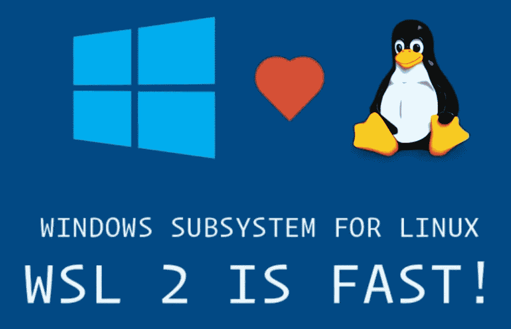
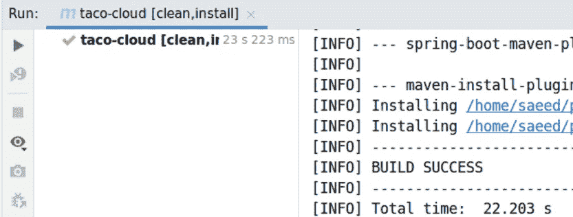
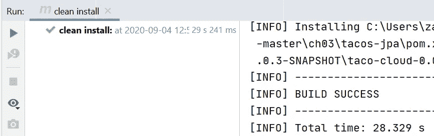

# 使用 WSL 2 在 Windows 上开发 Java 应用程序

> 原文：<https://itnext.io/using-wsl-2-to-develop-java-application-on-windows-8aac1123c59b?source=collection_archive---------1----------------------->

## 比较使用 Maven 和 Intellij Idea 时 WSL 2 和 Windows 10 的性能

作为一名 Java 开发人员，如果您想在 Windows 上建立一个开发环境，您有三种选择(我的经验):

*   下载原生的 JDK、Maven 和… for Windows，并直接安装在 Windows 上。
*   在 VMWare 或 Virtualbox 上安装一个桌面 Linux 发行版，然后在该虚拟机上安装 JDK、Maven 和……
*   使用 Multipass 安装一个 [Ubuntu 服务器，然后使用 **RDP** 连接到它(如果你在 Ubuntu 服务器上安装了桌面环境)，或者使用 **X 服务器**如 **VcXsrv 连接到它。**](/how-to-have-a-clean-dev-environment-like-wsl-2-using-multipass-on-linux-mac-or-windows-6828a78b87d7)

第一个选项是最直接的，但是如果您在开发过程中需要一些特定的 Linux 特性，它并不总是有效。第二个和第三个选项对于拥有 Linux 特性来说是好的，但是它们没有好的性能，并且消耗大量资源。

**在本文**中，我将介绍第四个选项(使用 WSL 2 和 X Server)，并将其性能与第一个选项进行比较。

## 什么是 WSL 2

WSL 2 经过了彻底的改进，现在我们有了一个由微软构建的完整的 Linux 内核( [WSL2-Linux-Kernel](https://github.com/microsoft/WSL2-Linux-Kernel) )，它运行在一个轻量级的实用 VM(虚拟机)中。WSL 2 中的虚拟化技术看起来不像传统的虚拟机(启动缓慢、孤立、消耗大量资源等等)，它在后台管理和运行，无需任何配置。

您可以在此视频中了解更多关于 WSL 2 架构的信息:

您也可以阅读这篇文章来了解更多关于 WSL 2 架构和特性的信息:

 [## 关于 WSL 2

### WSL 2 是一个新版本的体系结构，它支持 Linux 的 Windows 子系统在…上运行 ELF64 Linux 二进制文件

docs.microsoft.com](https://docs.microsoft.com/en-us/windows/wsl/wsl2-about) 

## 安装或更新 WSL 2

首先你需要在你的 Windows 机器上安装 WSL 2。您可以一步一步地阅读下面的链接来安装 WSL 2 或将您当前的 WSL 1 升级到版本 2。

 [## 在 Windows 10 上安装用于 Linux 的 Windows 子系统(WSL)

### 在 Windows 上安装任何 Linux 发行版之前，您必须启用“Linux 的 Windows 子系统”可选…

docs.microsoft.com](https://docs.microsoft.com/en-us/windows/wsl/install-win10) 

## 发展环境

我使用这些 SDK 和工具运行了一个样本 Java Spring Boot 项目:

*   [IntelliJ IDEA 2020.2.1(社区版)](https://www.jetbrains.com/idea/download/)
*   AdoptOpenJDK(内部版本 1.8.0_265-b01) ( [使用 SDK](/install-several-versions-of-jdk-gradle-kotlin-scala-spark-and-on-your-os-in-parallel-a7de30f691ad) 安装)
*   Apache Maven 3.6.3 ( [使用 SDK](/install-several-versions-of-jdk-gradle-kotlin-scala-spark-and-on-your-os-in-parallel-a7de30f691ad) 安装)

我使用了一个来自 [Spring in Action，第五版](https://www.manning.com/books/spring-in-action-fifth-edition)(第三章——tacos-JPA)的示例项目。为了在 WSL 2 中获得最大的 I/O 性能，我保留了这个项目的两个副本，一个在 NTFS 文件系统中以便在 Windows 10 中使用，另一个在安装在 WSL 2 上的 **Ubuntu 20.04** (ext4 文件系统)中。

最后，我在 Windows 10 和 WSL 2 上安装了所有这些软件的相同版本(Ubuntu-20.04)。

## 在 WSL 2 中运行 IntelliJ Idea GUI

我最喜欢的 IDE 是 IntelliJ IDEA (Community Edition)，目前，这个 IDE 没有像[VS Code Remote Development extension](https://marketplace.visualstudio.com/items?itemName=ms-vscode-remote.vscode-remote-extensionpack)这样的远程开发功能，因此，我在 Windows 10 上使用 X Server([**vcx SRV**](https://sourceforge.net/projects/vcxsrv/))来查看 Windows 中类似 IntelliJ IDEA 的 WSL 2 GUI 应用程序。为此，您可以通过此链接配置您的 Windows 10 和 WSL 2:

 [## 在 Windows 10 上运行 WSL GUI 应用程序

### 在这篇文章中，我将演示如何在 Windows 桌面上运行 Linux GUI(图形用户界面)应用程序…

techcommunity.microsoft.com](https://techcommunity.microsoft.com/t5/windows-dev-appconsult/running-wsl-gui-apps-on-windows-10/ba-p/1493242) 

如果你想在 Windows 10 中使用 WSL 2 运行 Linux GUI 应用程序，只需从开始菜单中选择一个快捷方式，你可以关注这篇文章:

 [## 使用 WSL 2 在 Windows 10 中快捷地运行 Linux GUI 应用程序

### 使用 Windows 10 作为 Linux 的桌面环境

itnext.io](/using-windows-10-as-a-desktop-environment-for-linux-7b2d8239f2f1) 

现在，您可以从 WSL 2 运行 IntelliJ Idea，在 windows 中查看 GUI，并开始在 Linux 上开发。

在 WSL 2 中运行 IntelliJ Idea GUI

## 基准怎么跑？

我使用[超精细基准工具](https://github.com/sharkdp/hyperfine)在`tacos-jpa`项目上运行`mvn clean install`命令。

 [## sharkdp/超精细

### 中文 A command-line benchmarking tool. Statistical analysis across multiple runs. Support for arbitrary shell commands…

github.com](https://github.com/sharkdp/hyperfine) 

## 结果

我使用[超精细](https://github.com/sharkdp/hyperfine)运行了几次该基准测试，您可以看到其中一个样本:

Windows 10 上的“mvn 全新安装”(原生)

WSL 2 (Ubuntu-20.04)上的“mvn 全新安装”

结果对我来说非常令人兴奋，正如你在这个结果中看到的，在 WSL 2 (Ubuntu-20.04)上运行`mvn clean install`比在 Windows 10(原生)上运行快大约 **30%。对于同一台机器上的其他尝试，该百分比介于 **25%到 30%** 之间。**

我在 WSL 2 (Ubuntu-20.04)和 Windows 10(原生)上尝试使用`Run/Debug Configuration Maven`在 IntelliJ Idea(与我在终端中使用的 JDK 和 Maven 版本相同)中运行`mvn clean install`。

而且我看到的几乎是之前的结果(22.203 s)，对于 WSL 2 (Ubuntu-20.04)上的 IntelliJ Idea，在 ide 内部手动运行多次`mvn clean install`之后。但是在这种情况下，两种方法之间的差异不是在 25%到 30%之间。如你所见，在 WSL 2 (Ubuntu-20.04)上在 ide 内手动运行`mvn clean install`比在 Windows 10(原生)上运行快大约 **20%。**

在 WSL 2 (Ubuntu-20.04)上使用 IntelliJ Idea 的“mvn 全新安装”

在 Windows 10(原生)上使用 IntelliJ Idea 的“mvn 全新安装”

# 结论

对于我来说，在使用 Java SDKs 和工具时，在 Windows 10 中拥有一个完整的 Linux 内核，并且具有比 Windows native 更好的性能(在 **20%到 30%** 之间)是非常有价值的。通过这种方式，我可以在 Windows 上顺利地安装和使用 Linux 专用工具，如 **Docker** 或 **LXD** 。

## —更新:

现在 windows 11 支持原生运行 Linux GUI 应用！我写了另一篇关于这个的文章。所以你不再需要这个配置了。

 [## ️Using WLS 2 和 WSLg 在 Windows 11 上的开发(最终部分)

### 现在 windows 11 支持原生运行 Linux GUI 应用！

itnext.io](/️using-wls-2-and-wslg-for-development-on-windows-11-final-part-70661bb3788c)