# 通过 Spot 实例，在亚马逊 EKS 上的自动扩展 Kubernetes 部署中利用 Jenkins

> 原文：<https://itnext.io/utilize-jenkins-in-an-auto-scaling-kubernetes-deployment-on-amazon-eks-with-spot-instances-f9159df00aee?source=collection_archive---------1----------------------->

如何使用自定义 Docker 图像执行器在自动缩放环境中使用亚马逊 EKS 上的 Kubernetes 与现货实例。


图片由 Pixabay 提供

# 目录

——[**简介**](#eebe)
——[**需求**](#1958)
——[**设置 EKS 集群**](#f6ca)
——[**设置 Jenkins 部署**](#0778)
— — [创建持久卷](#61fb)
— — [创建 Jenkins 容器](#c748)
— — [创建 Jenkins 部署](#ff78)
[**设置集群自动缩放器**](#5cc7)
— — [设置自动缩放策略](#32a5)
— — [部署集群自动缩放器](#b725)
——[——**创建 Jenkins 代理 Docker 映像**](#3ac5)
——[**在 Jenkins 上配置 Kubernetes**](#4308)
——[添加 Kubernetes 集群权限](#808d)

# 介绍

随着我们的生产负载已经在使用亚马逊 EKS 的自动伸缩 Kubernetes 集群上运行，感觉我们正处于技术的巅峰。但事实是，在许多情况下，生产环境远没有内部环境那么大或复杂。

许多组织正在运行复杂的测试和分析环境，其中没有一个是面向客户的，但两者都比生产环境更难实施，维护成本也更高。

当我着手容器化我们的内部环境时，我意识到我需要处理比以前多得多的流，同时始终牢记成本，并避免为我们不使用的资源付费。

AWS Spot 实例是一个很好的起点。使用 Spot 实例，您可以按需获得一组 EC2 实例，使用您选择的映像进行引导，而价格只是以标准方式使用相同 EC2 实例的一小部分。

在我之前的文章中，我演示了如何使用自定义的 Docker 图像来设置自动缩放的 EKS 环境。现在，我们将添加 Spot 实例，让所有东西都在 Jenkins 上运行，以创建一个完整的容器化自动扩展 CI/CD 环境。

# 要求

本文假设您将 AWS 作为云提供商，并且您可以访问 EKS 和 ECR 管理控制台，以及 AWS CLI。

我还假设您已经安装并配置了 *eksctl* 和 *kubectl* 。关于这些设置的更多信息，请查看我以前在[的帖子 https://medium . com/@ hawks eye/turn-your-own-docker-image-into-an-auto-scaling-kubernetes-deployment-using-Amazon-eks-BD 2 ab 8 ef 56 cc？source = friends _ link&sk = 5035 b 1196 cc 98 cf 2 a 5858 e 736d 64 BF 51](https://medium.com/@hawkseye/turn-your-own-docker-image-into-an-auto-scaling-kubernetes-deployment-using-amazon-eks-bd2ab8ef56cc?source=friends_link&sk=5035b1196cc98cf2a5858e736d64bf51)。

我再次尝试对以前的知识做最少的假设，并尽我所能进行解释，但是我确实假设对 Kubernetes 和 Docker 的概念有一些熟悉。

最后请注意，本文中所有的代码片段和引用文件都可以在这里找到:[https://gist . github . com/ohanetz/a 17149 e 8 a 55 ef 380970 EDF 5 e 8 bfe 66 a](https://gist.github.com/ohanetz/a17149e8a55ef380970dedf5e8bfe66a)

# 建立 EKS 集群

我们需要做的第一件事是设置一个 EKS 集群来托管我们的 Jenkins 安装和我们的 worker 节点。

我们的集群将由两个节点组组成:

*   一个节点组，包括一个相对较小的静态节点，用于保存 Jenkins 安装以及所有必要的 Kubernetes 服务和持久部署。
*   我们将用于工作节点的 Spot 实例的节点组。一旦 Jenkins 请求执行一个作业，这个节点组的规模可以缩小到 0，并且可以按需增长。

在 gist 中，您会发现一个名为[*eks-test-Jenkins . YAML*](https://gist.github.com/ohanetz/a17149e8a55ef380970dedf5e8bfe66a#file-eks-test-jenkins-yaml)的 *eksctl* 示例配置文件。如上所述，这个示例配置文件可以用来在您的 VPC 中设置一个具有两个节点组的 EKS 集群。

不要忘记用集群 AWS 区域和子网 id 替换占位符。

注意我们添加到 Spot 实例节点组的标签( *lifecycle: Ec2Spot，intent: apps* )。我们将使用这些标签来将这个节点组标识为我们想要用来在 Jenkins 中执行构建的节点组。

保存配置文件运行以下命令:

```
*eksctl create cluster -f eks-test-jenkins.yaml*
```

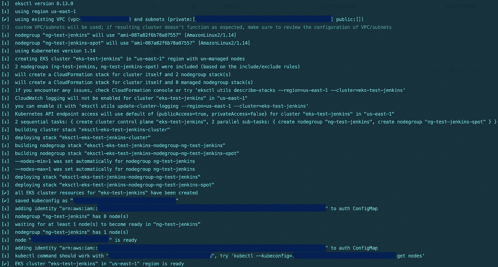

一旦 eksctl 完成，运行下面的命令来检查您的集群，注意您的集群配置了两个节点组，但是只有一个节点真正启动并运行，这正是我们此时想要的。

```
*eksctl get nodegroups --cluster=eks-test-jenkins*
```

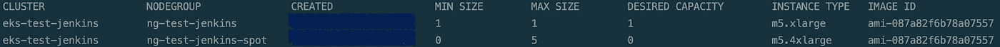

```
*kubectl get nodes*
```

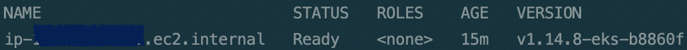

# 设置 Jenkins 部署

一旦我们的集群启动并运行，我们首先需要安装 Jenkins。因为我们需要 Jenkins 访问集群资源以控制我们的工作节点，所以最简单的方法是在 Kubernetes 上设置 Jenkins，这意味着将 Jenkins 安装在我们的 EKS 集群的静态节点上。

## 创建永久卷

在创建 Jenkins 部署之前，我们需要一个持久卷，即 Kubernetes 集群中的一个独立存储卷，以确保我们存储在 Jenkins 上的配置和数据不会在我们重新部署 Jenkins 或重新启动节点时丢失。

我们还需要一个持久卷声明，这是对持久卷存储的请求。
关于持久卷的其他信息可以在这里找到:[https://kubernetes . io/docs/concepts/storage/persistent-volumes/](https://kubernetes.io/docs/concepts/storage/persistent-volumes/)

从 gist 中获取 [*pv-volume.yaml*](https://gist.github.com/ohanetz/a17149e8a55ef380970dedf5e8bfe66a#file-pv-volume-yaml) 示例文件。此示例将在主机节点上的 */mnt/data* 文件夹中创建一个 10GB 的永久卷，具有一次读/写权限，这意味着只能从集群中的单个节点访问它。

运行以下命令来部署永久卷:

```
*kubectl apply -f pv-volume.yaml*
```

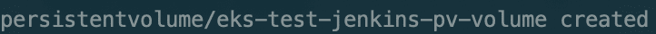

接下来，从 gist 中获取[*PV-claim . YAML*](https://gist.github.com/ohanetz/a17149e8a55ef380970dedf5e8bfe66a#file-pv-claim-yaml)示例文件。此示例将创建一个 5GB 存储声明，同样使用相同的访问模式。

运行以下命令来部署永久卷声明:

```
*kubectl apply -f pv-claim.yaml*
```

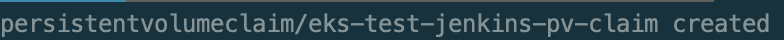

使用以下命令测试您的部署:

```
*kubectl get pvc*
```

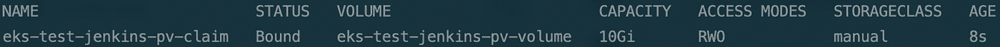

## 创建 Jenkins 容器

为了创建一个 Jenkins 部署，我们首先需要一个 Jenkins 容器(例如，我们可以使用默认容器并使用 helm 安装它，或者我们可以使用一些预安装的定制，如我们知道需要的插件，来创建我们自己的容器)。

从要点中获取[*Dockerfile-Jenkins*](https://gist.github.com/ohanetz/a17149e8a55ef380970dedf5e8bfe66a#file-dockerfile-jenkins)示例 docker file。这个 docker 文件将基于最新的 Jenkins 版本(在我写这篇文章的时候)创建一个容器，其中预装了几个必要的插件 kubernetes 插件和 ssh-slaves 插件，它们允许连接到远程代理来执行构建。

运行以下命令来构建 Docker 映像:

```
*docker build -f Dockerfile-jenkins -t "YOUR_DOCKER_IMAGE_FILE_NAME"*
```

关于在亚马逊 ECR 上发布图片的其他信息，可以查看我之前的帖子:[https://medium . com/@ hawks eye/turn-your-own-docker-image-into-an-auto-scaling-kubernetes-deployment-using-Amazon-eks-BD 2 ab 8 ef 56 cc？source = friends _ link&sk = 5035 b 1196 cc 98 cf 2 a 5858 e 736d 64 BF 51](https://medium.com/@hawkseye/turn-your-own-docker-image-into-an-auto-scaling-kubernetes-deployment-using-amazon-eks-bd2ab8ef56cc?source=friends_link&sk=5035b1196cc98cf2a5858e736d64bf51)。

## 创建 Jenkins 部署

在创建部署时，我们需要确保将其附加到我们刚刚创建的持久卷声明，以确保 Jenkins 数据和配置是持久的，并且我们不会在每次节点重启时都获得干净的副本。

从 gist 中获取[*Jenkins-deployment . YAML*](https://gist.github.com/ohanetz/a17149e8a55ef380970dedf5e8bfe66a#file-jenkins-deployment-yaml)文件。本例将创建一个 Jenkins 部署，其中我们的持久卷声明挂载为 *jenkins_home* 文件夹。

部署基于指定的 Jenkins Docker 映像(不要忘记替换 Docker 映像 URL 占位符。您也可以使用 jenkins/jenkins:lts 作为默认图像)。

请注意，我们需要确保可以使用 jenkins 用户访问该卷。对此有几种选择，但我发现最常见的解决方案(使用 Kubernetes SecurityContext 并设置 fsGroup，如下所述:[https://Kubernetes . io/docs/tasks/configure-pod-container/security-context/](https://kubernetes.io/docs/tasks/configure-pod-container/security-context/))在 EKS 集群上无法工作。我能找到的最好的解决方案是我在上面的例子中使用的那个——在创建部署时创建一个 init 容器，它将手动修复卷权限以匹配 jenkins 用户和组 id，默认为 1000。

运行以下命令来部署 Jenkins:

```
*kubectl apply -f jenkins-deployment.yaml*
```

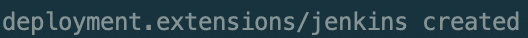

使用以下命令测试您的部署:

```
*kubectl get pods*
```

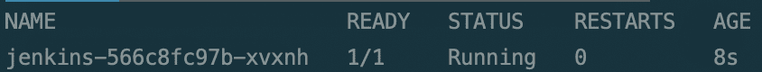

## 创建 Jenkins 外部服务

接下来，我们需要公开我们的 Jenkins 部署，这样它将有一个外部端点以便于访问。请注意，如果您的节点在 VPC 内部运行，并且不接受来自互联网的传入流量，则只能在 VPC 内部访问外部端点。

运行以下命令:

```
*kubectl expose deployment jenkins --type=LoadBalancer --name=jenkins-external*
```

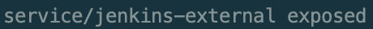

使用以下命令测试您的服务:

```
*kubectl get services*
```

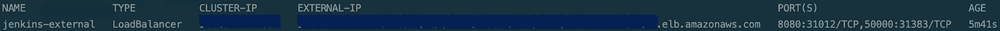

如果你的服务外部 IP 卡在*等待*或者你在这里面临另一个问题，查看我以前的帖子获得更详细的解释:

[https://medium . com/@ hawks eye/turn-your-own-docker-image-into-an-auto-scaling-kubernetes-deployment-using-Amazon-eks-BD 2 ab 8 ef 56 cc？source = friends _ link&sk = 5035 b 1196 cc 98 cf 2 a 5858 e 736d 64 BF 51](https://medium.com/@hawkseye/turn-your-own-docker-image-into-an-auto-scaling-kubernetes-deployment-using-amazon-eks-bd2ab8ef56cc?source=friends_link&sk=5035b1196cc98cf2a5858e736d64bf51)。

## 连接到詹金斯

现在我们已经准备好了外部服务，我们可以使用服务地址连接到 Jenkins。

使用以下命令获取地址:

```
*kubectl get services | grep jenkins-external | awk '{print $4}'*
```


复制 URL 并将其粘贴到浏览器中。不要忘记添加外部服务的端口(默认端口是 8080)。

您应该会看到 Jenkins 欢迎屏幕:

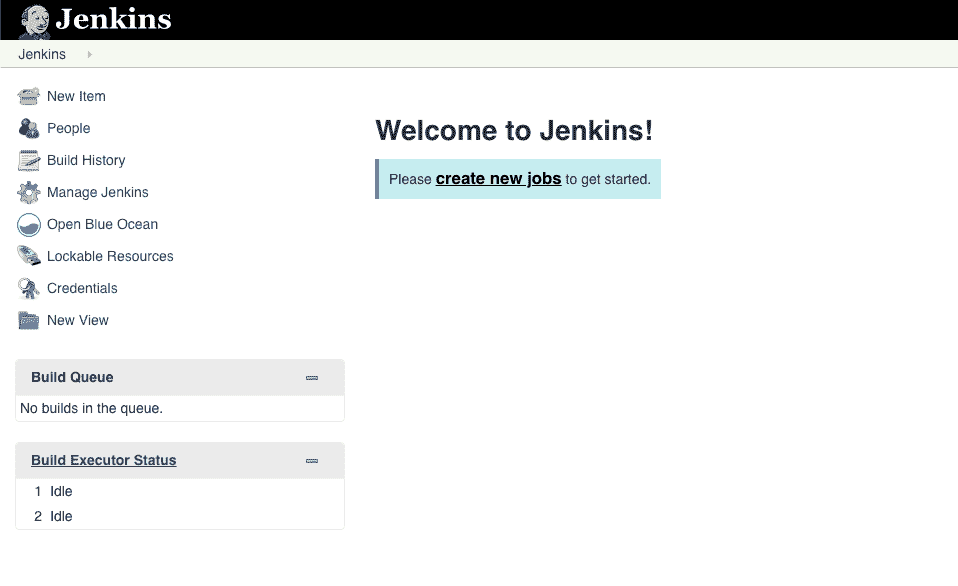

# 设置集群自动缩放器

现在，我们希望配置我们的 EKS 集群，以便 Spot 实例节点组可以按需从 0 自动扩展。

## 设置自动缩放策略

我们需要为静态节点组分配一个自动伸缩策略，授予它访问 Spot 实例自动伸缩组和修改其大小的权限。

首先，我们需要找到静态节点组堆栈的确切名称。运行以下命令:

```
*aws cloudformation list-stacks*
```

检查 *StackName* 字段，并查找包含集群名称和节点组名称的堆栈。例如，如果您的集群名称是 eks-test-jenkins，节点组名称是 ng-test-jenkins，那么您的堆栈名称应该是*eks CTL-eks-test-Jenkins-node group-ng-test-Jenkins*。

接下来，运行以下命令来查找该堆栈的 IAM 角色名称:

```
*aws cloudformation describe-stack-resources --stack-name YOUR_STACK_NAME | jq -r '.StackResources[] | select(.ResourceType=="AWS::IAM::Role") | .PhysicalResourceId'*
```

最后，从 gist 中获取[*k8s-ASG-policy . JSON*](https://gist.github.com/ohanetz/a17149e8a55ef380970dedf5e8bfe66a#file-k8s-asg-policy-json)文件，并运行以下命令对该角色应用 IAM 策略:

```
*aws iam put-role-policy --role-name YOUR_ROLE_NAME --policy-name ASG-Policy-For-Worker --policy-document file://./k8s-asg-policy.json*
```

## 部署集群自动缩放器

集群自动缩放器是负责自动调整 Spot 实例节点组大小的组件。

首先，我们需要获得为该节点组创建的自动伸缩组的名称。运行以下命令(用 eksctl 配置文件中定义的 Spot 实例节点组名称替换占位符(在我的例子中为 *ng-test-jenkins-spot* ):

```
*aws autoscaling describe-auto-scaling-groups | grep AutoScalingGroupName | grep YOUR_SPOT_NODEGROUP | awk 'NR==1{print substr($2, 2, length($2) — 3)}'*
```

从 gist 中获取[*cluster-auto scaler . YAML*](https://gist.github.com/ohanetz/a17149e8a55ef380970dedf5e8bfe66a#file-cluster-autoscaler-yaml)文件，将 *YOUR_SPOT_ASG_NODEGROUP* 占位符替换为您刚刚收集的自动缩放组名称，将 YOUR_SPOT_ASG_REGION 替换为您正在处理的 AWS 区域。

这里提供的 cluster-autoscaler.yaml 适用于使用单个自动伸缩组在 EKS 集群上部署集群自动伸缩程序。您可以在这里找到不同 EKS 配置的其他示例:[https://github . com/kubernetes/auto scaler/tree/master/cluster-auto scaler/cloud provider/AWS/examples](https://github.com/kubernetes/autoscaler/tree/master/cluster-autoscaler/cloudprovider/aws/examples)

运行以下命令在集群上部署集群自动缩放器:

```
*kubectl apply -f cluster-autoscaler.yaml*
```

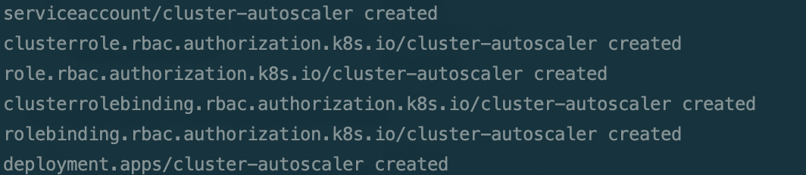

# 创建 Jenkins 代理 Docker 映像

我们最不需要的是一个 Docker 映像，它将用于执行我们的 Jenkins 构建的容器。

您可以在这里使用标准的 jenkins/jnlp-slave:latest Docker 映像，但是创建包含 Jenkins 代理所需的任何其他先决条件的定制映像也很简单，比如配置和包。

从 gist 中获取[*docker file-Jenkins-agent*](https://gist.github.com/ohanetz/a17149e8a55ef380970dedf5e8bfe66a#file-dockerfile-jenkins-agent)和[*Jenkins-slave*](https://gist.github.com/ohanetz/a17149e8a55ef380970dedf5e8bfe66a#file-jenkins-slave)文件。这个例子用 Jenkins JNLP 代理创建了一个简单的 Ubuntu 容器，我们的 Jenkins master 将使用它进行通信。

运行以下命令为 Jenkins 代理构建 Docker 映像:

```
*docker build -f Dockerfile-jenkins-agent -t "YOUR_DOCKER_IMAGE_FILE_NAME"*
```

# 在 Jenkins 上配置 Kubernetes

我们已经完成了环境设置和 Docker 映像准备工作，现在我们已经做好了在 EKS 集群上使用 Jenkins 的一切准备。

我们需要做的最后一件事是配置 Jenkins 与 Kubernetes 集群通信，以便它能够启动容器和执行构建。

## 添加 Kubernetes 集群权限

在容器中运行的任何应用程序都能够使用集群服务帐户与 Kubernetes 集群通信。通过绑定到群集角色，可以授予服务帐户某些群集权限。

可以将 Jenkins 设置为在一个单独的集群命名空间中运行，使用一个具有独特权限的专用服务帐户，但是让我们将深入的安全性讨论留到以后的文章中。目前，Jenkins 部署将自动使用默认服务帐户，我们将创建一个许可绑定，为所有服务帐户提供集群管理权限，这对于我们的目的来说已经足够了。

运行以下命令:

```
*kubectl create clusterrolebinding permissive-binding --clusterrole=cluster-admin --user=admin --user=kubelet --group=system:serviceaccounts*
```

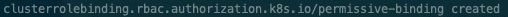

有关服务帐户权限和集群角色绑定的其他信息，请查看 Kubernetes 文档中的以下页面:[https://Kubernetes . io/docs/reference/access-authn-authz/RBAC/](https://kubernetes.io/docs/reference/access-authn-authz/rbac/)

## 获取 Kubernetes 主 URL

Jenkins 需要的另一件事是 Kubernetes 主服务的 URL，它将用于 Jenkins 与集群的通信。

执行以下命令:

```
kubectl cluster-info | grep master
```


## 配置 Jenkins

***詹金斯将军配置***

在 Jenkins 欢迎屏幕中，点击左侧菜单中的*管理 Jenkins* ，然后点击*配置系统*。

将 *# of executors* 字段设置为 0，在 *Usage* 字段中选择*Only build jobs with label expressions match this node*。

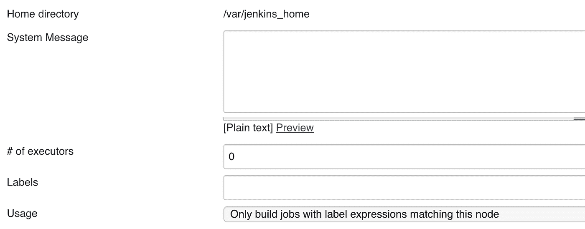

这两个设置将确保我们不会在主 Jenkins 节点上执行构建。

***Kubernetes 云配置***

在*云*部分，点击*添加新云*并选择 *Kubernetes* 。

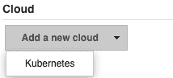

在 *Kubernetes URL* 框中输入我们之前提取的 Kubernetes 主 URL，然后点击*测试连接*按钮。您应该得到一条*连接测试成功*消息，表明 Jenkins 能够成功地与 Kubernetes 集群通信。

如果您在这里得到一条错误消息，请回顾前面的部分，确保一切都配置顺利。

在 *Jenkins URL* 框中，输入 Jenkins 外部服务的 URL，或您映射用于访问 Jenkins 的内部 VPC 地址。请注意，您可以通过执行以下命令来获取詹金斯 VPC 公司的内部 IP 地址:

```
kubectl describe service jenkins-external | grep Endpoints | awk 'NR==1{print $2}'
```

***Kubernetes Pod 模板配置***

在 *Pod 模板*部分，点击*添加 Pod 模板*。

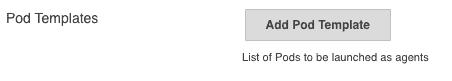

键入一个名称，并在*用法*字段中选择*尽可能使用该节点*。

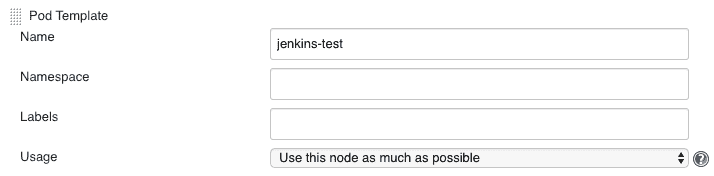

向下滚动到*节点选择器*字段，并键入我们在配置 Spot 实例节点组时添加的标签。这将确保 Kubernetes 使用这个节点组(点实例)中的节点来执行我们的构建。

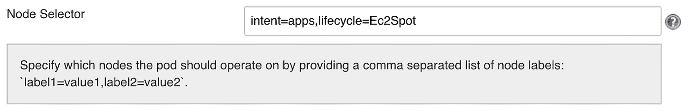

向上滚动，点击*添加容器*按钮，然后选择*容器模板*。

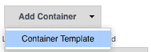

在*名称*字段中键入 *jnlp* (这是我们正在使用的 Jenkins 代理连接的类型)，并在 *Docker 映像*字段中键入您之前创建的 Jenkins 代理 Docker 映像的名称。

清除运行的*命令和传递给命令*字段的*参数。*

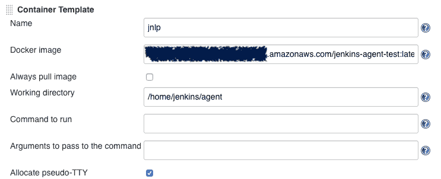

您也可以点击*高级…* 按钮，更新 Kubernetes pod 执行设置，如 CPU 和内存请求:

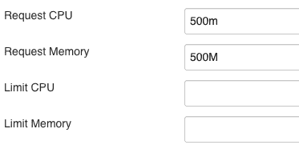

请注意，您可以使用这些高级执行设置来创建几种具有不同资源分配(甚至是完全不同的 pod 模板)的容器类型，以维护具有完全不同需求的不同流。

完成后点击*保存*按钮。

# 创建一个 Jenkins 测试项目

我们终于准备好测试我们的 Jenkins 部署，以确保我们可以在 Spot 机器上按需执行构建。

在 Jenkins 欢迎界面中，点击左侧菜单中的*新项目*，在下一个窗口中键入名称并选择*自由式项目*。然后点击*确定*。

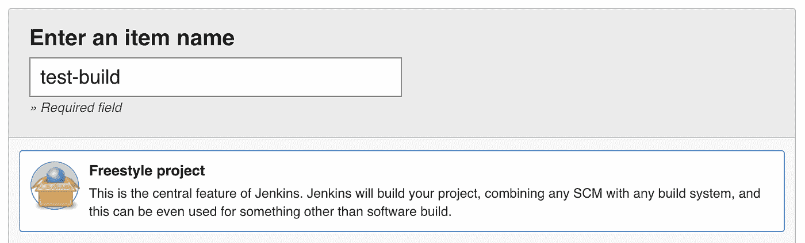

接下来，转到*构建*部分，点击*添加构建步骤*按钮并选择*执行 shell* 。

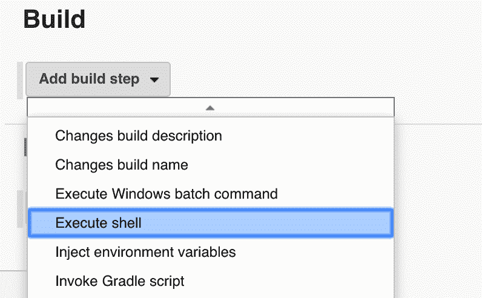

在命令框中输入*睡眠 300* 。然后点击*保存*。

我们刚刚创建的这个项目只有一个构建步骤，即执行 *sleep 300* 命令。这意味着构建将等待 5 分钟，给我们足够的时间来观察发生了什么。

选择*立即构建*触发构建。您会立即注意到构建是挂起的，正在等待一个执行程序。

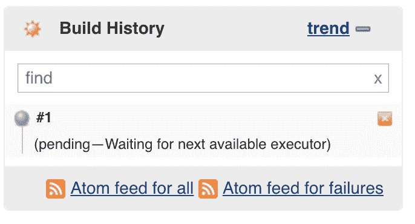

转到 Jenkins 主窗口，您会看到为这个构建分配了一个 pod，但是它仍然是离线的。

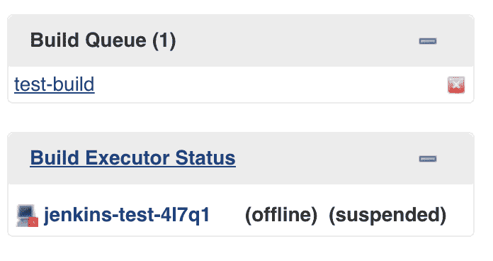

转到终端，运行以下命令:

```
kubectl get pods
```

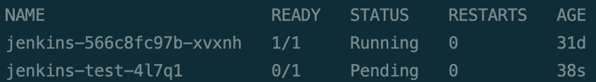

```
kubectl get nodes
```

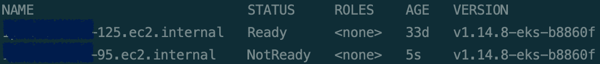

请注意，已经创建了一个新的 pod，但它仍处于*待定*状态。另外，注意已经创建了一个新节点(这可能需要几秒钟，我们需要提供一个 Spot 实例)，并且它仍然处于 *NotReady* 状态。

等一下，再检查一下詹金斯的主窗口。您会注意到，在某个时候，构建在分配的 pod 上开始。

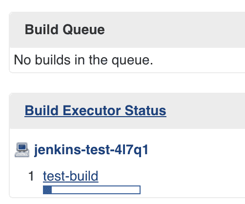

检查控制台，注意构建当前正忙于我们的 *sleep 300* 命令。

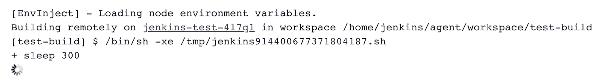

回到终端，运行相同的命令。

```
kubectl get pods
```

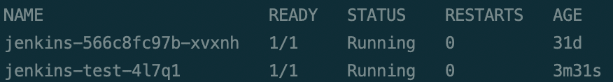

```
kubectl get nodes
```

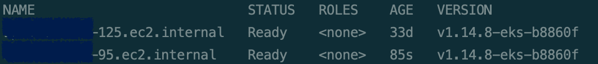

注意，现在 pod 处于*运行*状态，节点处于*就绪*状态。

等待构建完成，然后再次执行命令。

```
kubectl get pods
```

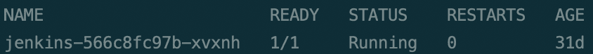

```
kubectl get nodes
```


请注意，pod 现在已经消失了，但是节点还在。如果您现在执行另一个 Jenkins 构建，将会在这个节点上立即创建一个新的 pod。

我们部署的集群 autoscaler 服务正在等待节点空闲几分钟，然后再进行缩减。

等待几分钟，然后再次运行该命令。

```
kubectl get nodes
```


请注意，该节点现在已经消失了。

# 摘要

维护具有许多不同流程和需求的 CI/CD 环境不是一件容易的事情，转向容器化实现是一种受欢迎的方法，但也是许多组织一再推迟的巨大变化。

我在这里展示了一个基本的用例来解释这种实现的概念和功能。我相信根据您的特定需求进行调整并添加不同的项目会相对容易，每个项目都运行在一个具有预定义资源的独特映像上。

将 Jenkins 与 AWS Spot 实例一起直接使用是一个很好的解决方案，但是即使我们将远非完美的集成放在一边，当涉及到具有不同需求的不同流程时，维护起来也是困难和昂贵的。我认为简单地添加新的 pod 模板更有意义。

要了解更多关于 EKS 及其功能的信息，请访问 https://docs.aws.amazon.com/eks/index.html 的 EKS AWS 文档。

你还应该参考亚马逊提供的这个 EKS 在线研讨会，它也可以帮助你入门，并向你介绍 https://eksworkshop.com/[的所有 EKS 特色。](https://eksworkshop.com/)

还有，看看我之前在 EKS 发的帖子，可能也有帮助:[https://medium . com/@ hawks eye/turn-your-own-docker-image-into-an-auto-scaling-kubernetes-deployment-using-Amazon-eks-BD 2 ab 8 ef 56 cc？source = friends _ link&sk = 5035 b 1196 cc 98 cf 2 a 5858 e 736d 64 BF 51](https://medium.com/@hawkseye/turn-your-own-docker-image-into-an-auto-scaling-kubernetes-deployment-using-amazon-eks-bd2ab8ef56cc?source=friends_link&sk=5035b1196cc98cf2a5858e736d64bf51)。