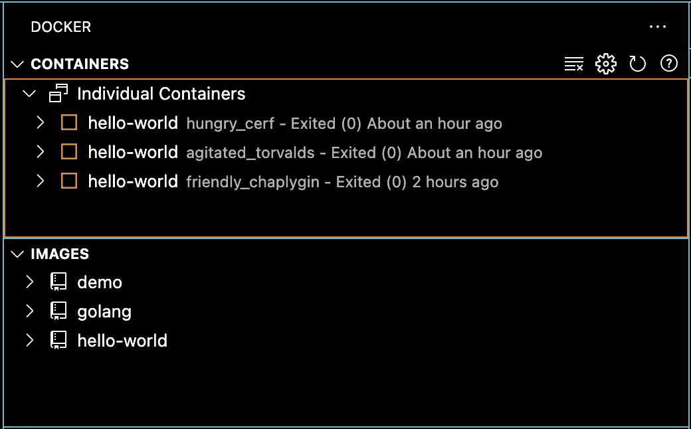
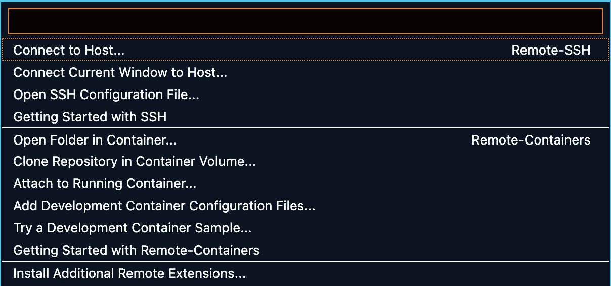
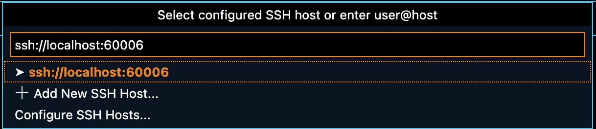
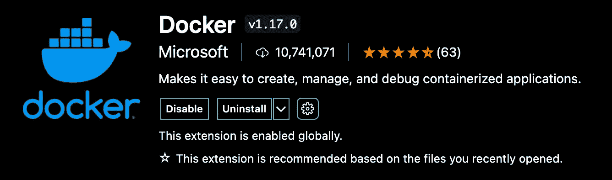

# 在没有 Docker 桌面的情况下使用 Docker CLI

> 原文：<https://itnext.io/utilizing-docker-cli-without-docker-desktop-4933f3473d5e?source=collection_archive---------1----------------------->

了解如何使用 Lima VM 和 Visual Studio 代码替换 Docker 桌面作为您的 Docker GUI



# 目标

这篇文章的目标是提供一个轻量级和简单的替代使用 Docker 桌面。本文将介绍 Lima VM 作为一种替代方案，以便使用 Docker CLI 托管容器，并使用 VS 代码作为 Docker 桌面 GUI 界面的替代。

# 利马虚拟机

Lima VM 是探索的第一个选项，Lima 用于在终端内部创建独立的 Linux 环境，然后可以用于运行 Linux 兼容软件，如 Podman(用于[消除对 Docker](https://medium.com/@ko185061/removing-dependency-on-docker-94c96fcaa024) 的依赖)。

# 安装和设置 Lima 来宾虚拟机

Lima 可通过 brew 获得。一旦安装完毕，limactl 就是用来启动 ubuntu VM 的 CLI，它允许用户通过 shell 进入 ubuntu VM。一旦进入虚拟机，更新软件包管理器 apt，然后安装 k3S

```
$ brew install lima
$ limactl start ubuntu
$ limactl shell ubuntu
lima $ sudo apt update
lima $ curl -sfL [https://get.k3s.io](https://get.k3s.io) | sh -
lima $ GITHUB_URL=https://github.com/kubernetes/dashboard/releases
VERSION_KUBE_DASHBOARD=$(curl -w ‘%{url_effective}’ -I -L -s -S     lima ${GITHUB_URL}/latest -o /dev/null | sed -e ‘s|.*/||’)
sudo k3s kubectl create -f [https://raw.githubusercontent.com/kubernetes/dashboard/${VERSION_KUBE_DASHBOARD}/aio/deploy/recommended.yaml](https://raw.githubusercontent.com/kubernetes/dashboard/${VERSION_KUBE_DASHBOARD}/aio/deploy/recommended.yaml)
lima $ exit
```

# 用于本地开发的 Docker CLI 的最小安装

Lima 还提供了一个轻量级 VM，用于从 mac 开发环境运行 docker 构建。将 *docker.yaml* 文件下载到您的本地工作站([https://github . com/Lima-VM/Lima/blob/master/examples/docker.yaml](https://github.com/lima-vm/lima/blob/master/examples/docker.yaml))，将文件另存为 docker . YAML 并运行以下命令。

```
$ limactl start ./docker.yaml
$ limactl shell docker
lima $ sudo systemctl enable ssh.service
```

一旦 shell 可用，现在就可以设置 mac 主机来引用 lima 虚拟机上安装的 docker 引擎。以下示例显示了如何使用远程 docker 构建本地 docker 文件。

```
$ export DOCKER_HOST=ssh://localhost:60006
$ docker build -t limadockertest .
Sending build context to Docker daemon 2.56kB
Step 1/6 : FROM ubuntu:latest
 — -> fb52e22af1b0
Step 2/6 : LABEL maintainer=”[myname@somecompany.com](mailto:myname@somecompany.com)”
 — -> Using cache
 — -> c37f3494497d
Step 3/6 : RUN apt-get update && apt-get upgrade -y
 — -> Using cache
 — -> e808af724770
Step 4/6 : RUN apt-get install nginx -y
 — -> Using cache
 — -> ed77ce72f229
Step 5/6 : EXPOSE 80
 — -> Using cache
 — -> 04279fe5c368
Step 6/6 : CMD [“nginx”, “-g”, “daemon off;”]
 — -> Using cache
 — -> 800d58e28779
Successfully built 800d58e28779
Successfully tagged limadockertest:latest
```

使用“docker 扫描”对图像运行 Snyk 测试，以找到漏洞并了解如何修复它们

```
$ docker images
REPOSITORY TAG IMAGE ID CREATED SIZE
limadockertest2 latest 800d58e28779 About an hour ago 162MB
limadockertest latest 800d58e28779 About an hour ago 162MB
ubuntu latest fb52e22af1b0 13 days ago 72.8MB
```
Once this images have been verified to be in the docker repo, we can verify it is also showing the same results in the linux guest VM.
```
$ docker images
REPOSITORY TAG IMAGE ID CREATED SIZE
limadockertest2 latest 800d58e28779 About an hour ago 162MB
limadockertest latest 800d58e28779 About an hour ago 162MB
ubuntu latest fb52e22af1b0 13 days ago 72.8MB
```

一旦这些步骤完成，您可能希望将这些容器部署到运行在 Lima-VM 上的 K8 环境中。以上部分介绍了 K3S 的安装(安装和设置 Lima 客户虚拟机)并讨论了如何将映像导入 K3S。快速回顾一下，可以完成以下步骤…

## 本地 mac 计算机

```
$ docker save — output limadockertest2.tar limadockertest2
```

## 来宾利马虚拟机

```
lima $ curl -sfL [https://get.k3s.io](https://get.k3s.io) | sh -
lima $ sudo k3s ctr images import test/limadockertest2.tar 
unpacking docker.io/library/limadockertest2:latest (sha256:ec240d997ec5f7800317da08e4ae4506599ffaf25c611fa1338f08df35edfcb1)…done
```

# VS 代码集成

对于简单的交互和类似 Docker 桌面的图形界面，可以将 Lima 与 VS 代码集成

第一步是使用左下角的 ssh 按钮从 VS 代码 ssh 到 lima 环境，并从下拉列表中选择“Connect to Host ”:



然后，您需要输入您的 ssh 位置，以便连接到 lima 环境:



VS 代码现在将打开一个新窗口并建立连接，最后在这个新环境中添加 Docker 扩展:



现在，您将能够看到 lima 环境中的所有容器和图像，并与文件进行交互，就像它们在您的本地机器上一样。

