# 利用内存数据缓存提高 AWS 上基于数据湖的应用程序的性能

> 原文：<https://itnext.io/utilizing-in-memory-data-caching-to-substantially-enhance-performance-of-data-lake-based-1e6afe04fe35?source=collection_archive---------4----------------------->

## 使用 Amazon ElastiCache for Redis 显著提高基于数据湖的分析应用程序的性能并降低其成本

# 介绍

最近的帖子[使用 Amazon Athena](/developing-spring-boot-applications-for-querying-data-lakes-on-aws-eeefa298741) 开发用于在 AWS 上查询数据湖的 Spring Boot 应用，演示了如何使用 Spring Boot 开发云原生分析应用。该应用程序利用 Amazon Athena API，通过 AWS Glue 数据目录查询基于 Amazon S3 的数据湖中的数据。

[](/developing-spring-boot-applications-for-querying-data-lakes-on-aws-eeefa298741) [## 开发用于在 AWS 上查询数据湖的 Spring Boot 应用程序

### 学习开发云原生的 RESTful Java 服务，使用 Amazon Athena 在基于 AWS 的数据湖中查询数据…

itnext.io](/developing-spring-boot-applications-for-querying-data-lakes-on-aws-eeefa298741) 

使用 RESTful APIs 安全地公开数据湖中的数据可以满足许多数据消费者的需求。但是，访问这些数据可能比从数据库或数据仓库访问要慢得多。例如，在之前的帖子中，我们将来自 Spring Boot 服务的 [OpenAPI v3 规范](https://github.com/OAI/OpenAPI-Specification/blob/main/versions/3.0.0.md)导入到了 [Postman](https://www.postman.com/) 中。API 规范包含大约 17 个端点。


使用 Postman 对 Spring Boot 服务运行一套集成测试

在我的本地开发笔记本电脑上，所有服务端点的 Postman API 测试运行时间平均为 32.4 秒。Spring Boot 服务在 AWS 美国东部(N. Virginia)地区的亚马逊 EKS 上运行三个 Kubernetes pod 副本。

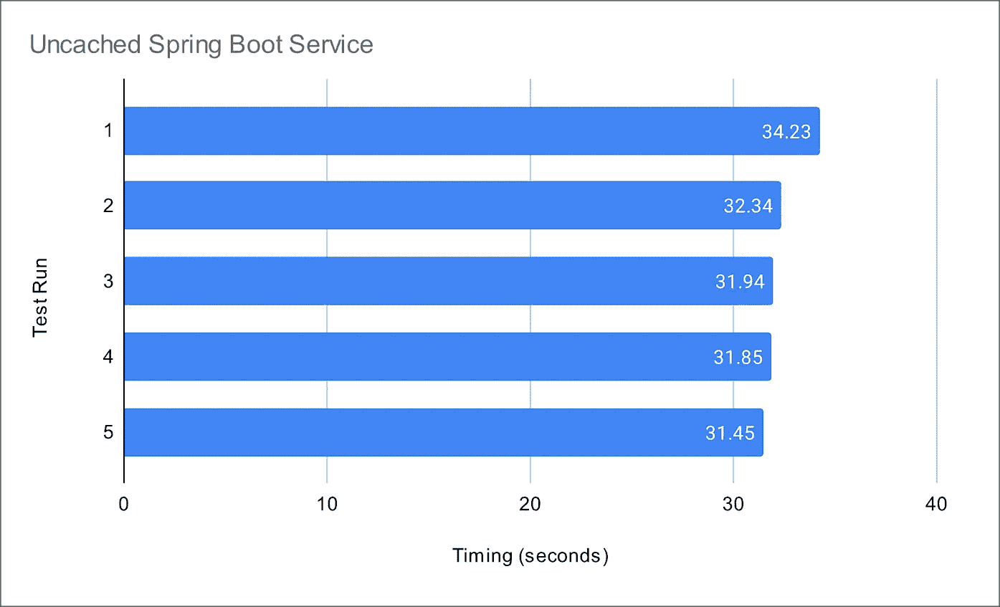

从服务运行的测试结果示例(无 Redis 缓存)

将数据湖查询结果时间与针对包含相同数据的最小规模的 [Amazon RDS for PostgreSQL](https://aws.amazon.com/rds/postgresql/) 数据库实例进行的等效查询进行比较。类似的 Spring Boot 服务中，所有 PostgreSQL 查询的平均运行时间为 10.8 秒。虽然不是一个精确的基准，但我们可以清楚地看到，访问亚马逊 S3 数据湖中的数据要慢得多，大约比 PostgreSQL 数据库慢 3 倍。优化数据库很容易造成更大的差异。

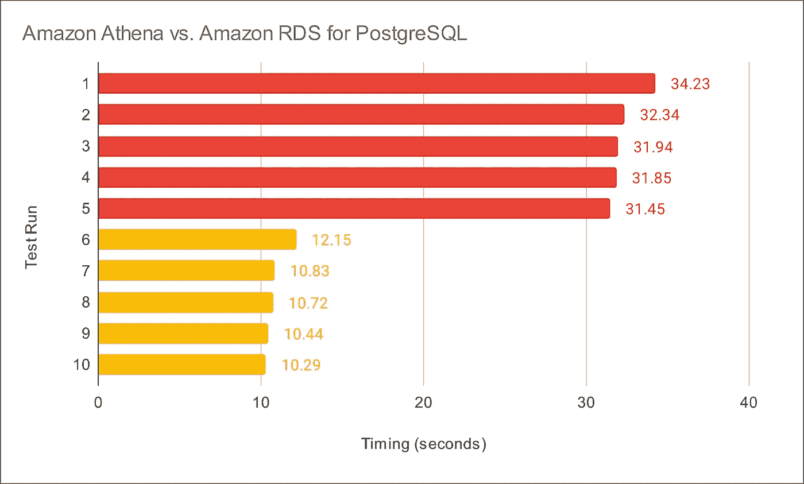

针对 Athena 和 PostgreSQL 从服务运行查询的测试结果示例(越快越好)

# 数据湖的缓存

据 AWS 称，数据库的速度和吞吐量可能是对整体应用程序性能影响最大的因素。因此，内存数据缓存可能是提高应用程序整体性能和降低数据库成本的最有效策略之一。同样的缓存策略也可以应用于构建在数据湖之上的分析应用程序，正如本文将要展示的。

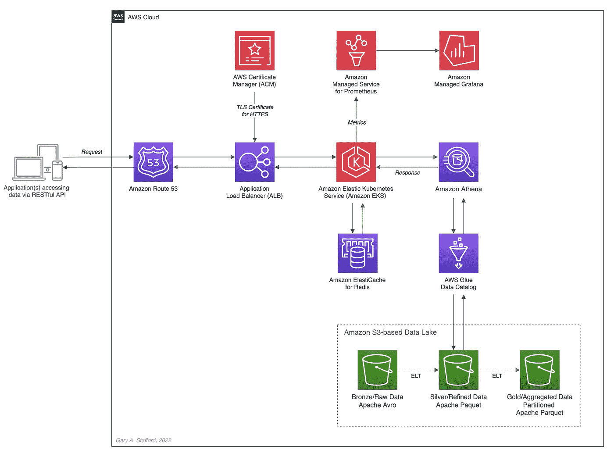

这篇文章展示了高级 AWS 架构

## 内存缓存

根据 [Hazelcast](https://hazelcast.com/glossary/memory-caching) 的说法，内存缓存(*又名内存缓存*)，通常简称为缓存，是一种计算机应用程序将数据临时存储在计算机主内存(如 RAM)中以实现数据快速检索的技术。用于临时存储的 RAM 被称为*缓存*。当应用程序试图读取数据(通常是从数据库等数据存储系统中)时，它会检查所需的记录是否已经存在于缓存中。如果是这样，应用程序将从缓存中读取数据，从而消除对数据库的较慢访问。如果所需的记录不在缓存中，则应用程序从源中读取记录。当它检索该数据时，它会将其写入缓存，以便当应用程序将来需要相同的数据时，它可以从缓存中快速检索该数据。

## Redis 内存数据存储

根据他们的[网站](https://redis.io/)，Redis 是开源的内存数据存储，被数百万开发者用作数据库、缓存、流媒体引擎和消息代理。Redis 提供了数据结构，如[字符串](https://redis.io/topics/data-types-intro#strings)、[哈希](https://redis.io/topics/data-types-intro#hashes)、[列表](https://redis.io/topics/data-types-intro#lists)、[集合](https://redis.io/topics/data-types-intro#sets)、[排序集合](https://redis.io/topics/data-types-intro#sorted-sets)、位图、[超级日志](https://redis.io/topics/data-types-intro#hyperloglogs)、[地理空间索引](https://redis.io/commands/geoadd)和[流](https://redis.io/topics/streams-intro)。此外，Redis 还内置了[复制](https://redis.io/topics/replication)、 [Lua 脚本](https://redis.io/commands/eval)、 [LRU 驱逐](https://redis.io/topics/lru-cache)、[事务](https://redis.io/topics/transactions)和不同级别的[磁盘持久性](https://redis.io/topics/persistence)，并通过 [Redis Sentinel](https://redis.io/topics/sentinel) 和 [Redis Cluster](https://redis.io/topics/cluster-tutorial) 自动分区提供高可用性。

## Redis 的 Amazon ElastiCache

根据 [AWS](https://aws.amazon.com/elasticache/redis/) 的说法，Amazon ElastiCache for Redis，Redis 的完全管理版本，是一个极快的内存数据存储，为互联网规模的实时应用提供亚毫秒级延迟。Redis 应用程序可以与 ElastiCache for Redis 无缝协作，无需任何代码更改。ElastiCache for Redis 将开源 Redis 的速度、简单性和多功能性与 AWS 的可管理性、安全性和可伸缩性相结合。因此，Redis 是实现高可用性内存缓存以减少数据访问延迟、增加吞吐量并减轻关系数据库和 NoSQL 数据库负载的绝佳选择。

## ElastiCache 性能结果

在接下来的文章中，我们将把内存缓存添加到上一篇文章中介绍的 Spring Boot 服务中。在亚马逊 ElastiCache for Redis 的初步测试中，Spring Boot 服务的平均响应时间提高了 34 倍。例如，在 Redis [缓存命中率](https://www.cloudflare.com/learning/cdn/what-is-a-cache-hit-ratio)为 100%的最佳情况下，测试运行的平均时间为 0.95 秒，而没有 Redis 时为 32.4 秒。

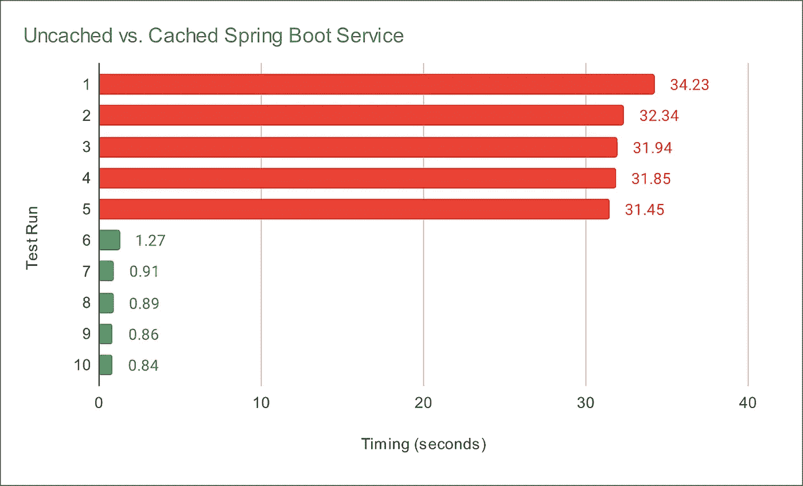

未缓存与缓存测试结果的比较示例(越快越好)

# 源代码

所有的源代码以及 Docker 和 Kubernetes 资源都是开源的，可以在 [GitHub](https://github.com/garystafford/athena-spring-app/tree/redis) 上获得。

```
git clone --depth 1 -b redis \
    [https://github.com/garystafford/athena-spring-app.git](https://github.com/garystafford/tickit-srv.git)
```

此外，Redis-base Spring Boot 服务的 Docker 图像可在 [Docker Hub](https://hub.docker.com/r/garystafford/athena-spring-app/tags) 上获得。对于这篇文章，使用带有`.redis`后缀的最新标签。

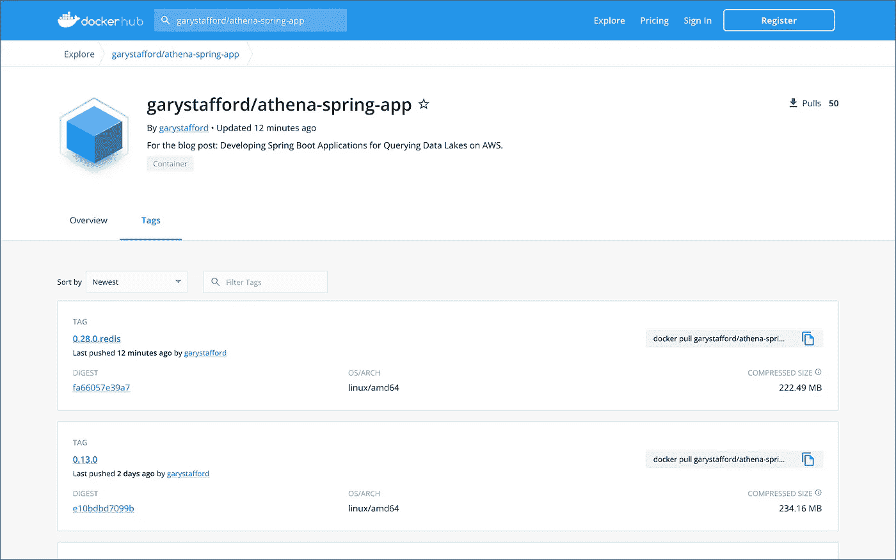

Spring Boot 服务图片可在 Docker Hub 上找到

# 代码更改

要使用 Redis 实现 Spring Boot 缓存，需要对 Spring Boot 服务进行以下代码更改。

## Gradle Build

`gradle.build`文件现在实现了两个额外的依赖项，Spring Boot 的`[spring-boot-starter-cache](https://mvnrepository.com/artifact/org.springframework.boot/spring-boot-starter-cache/2.7.1)`和`[spring-boot-starter-data-redis](https://mvnrepository.com/artifact/org.springframework.boot/spring-boot-starter-data-redis/2.7.1)` ( *第 45–46 行*)。

## 应用程序属性

应用程序属性文件`application.yml`已经针对`dev`和`prod` Spring 概要文件进行了修改。`dev` Spring Profile 预计 Redis 将在`localhost`上运行。相应地，项目的`[docker-compose.yml](https://github.com/garystafford/athena-spring-app/blob/redis/docker/docker-compose.yml)`文件现在包含了一个用于本地开发的 Redis 容器。所有 Redis 缓存的[生存时间](https://redis.io/commands/ttl/) (TTL)被任意设置为`dev`的一分钟和`prod`的五分钟。为了提高应用程序性能并降低使用 Athena 查询数据湖的成本，可以增加 Redis 的 TTL。请注意，增加 TTL 会降低数据的新鲜度。

## 雅典娜应用程序类

`AthenaApplication`类声明现在用 Spring Framework 的`[EnableCaching](https://docs.spring.io/spring-framework/docs/current/javadoc-api/org/springframework/cache/annotation/EnableCaching.html)`注释(*第 22 行*)修饰。此外，还添加了两个新 bean(*第 58–68 行*)。Spring Redis 通过`org.springframework.data.redis.cache`包为 Spring [缓存抽象](https://docs.spring.io/spring-framework/docs/5.3.21/reference/html/integration.html#cache)提供了一个实现。第一次写入时，`[RedisCacheManager](https://docs.spring.io/spring-data/redis/docs/current/api/org/springframework/data/redis/cache/RedisCacheManager.html)`缓存管理器默认创建缓存。`[RedisCacheConfiguration](https://docs.spring.io/spring-data/redis/docs/current/api/org/springframework/data/redis/cache/RedisCacheConfiguration.html)`缓存配置有助于定制`RedisCache`行为，例如缓存空值、缓存键前缀和二进制序列化。

## POJO 数据模型类

Spring Boot Redis 缓存使用 [Java 序列化和反序列化](https://www.baeldung.com/java-serialization)。因此，所有的 POJO 数据模型类都必须实现`Serializable` ( *第 14 行*)。

## 服务类别

服务类中的每个公共方法现在都用 Spring Framework 的`[Cachable](https://docs.spring.io/spring-framework/docs/current/javadoc-api/org/springframework/cache/annotation/Cacheable.html)`注释进行了修饰(*第 42 行和第 66 行*)。例如，`CategoryServiceImp`类中的`findById(int id)`方法被注释为`[@Cacheable](http://twitter.com/Cacheable)(value = "categories", key = "#id")`。该方法的`key`参数使用 [Spring 表达式语言](https://docs.spring.io/spring-framework/docs/3.0.x/reference/expressions.html) (SpEL)表达式来动态计算密钥。默认值为 null，意味着所有方法参数都被视为一个键，除非已经配置了自定义的`[keyGenerator](https://docs.spring.io/spring-framework/docs/current/javadoc-api/org/springframework/cache/interceptor/KeyGenerator.html)`。如果在 Redis 缓存中找不到计算键的值，将调用目标方法，返回值将存储在关联的缓存中。

## 控制器类别

不需要对控制器类进行任何更改。

# Redis 的 Amazon ElastiCache

为 Redis 集群创建 Amazon ElastiCache 有多个选项，包括集群模式、多 AZ 选项、自动故障转移选项、节点类型、副本数量、分片数量、每个分片的副本数量、可用性区域放置以及静态加密和传输中加密选项。本文中的结果基于最低配置的 Redis 版本 6.2.6 集群，其中一个 shard、两个`[cache.r6g.large](https://docs.aws.amazon.com/AmazonElastiCache/latest/red-ug/CacheNodes.SupportedTypes.html)`节点、集群模式、多 AZ 选项和自动故障转移都被禁用。此外，静态加密和传输中加密也被禁用。这种集群配置对于开发和测试是足够的，但是对于生产来说就不够了。

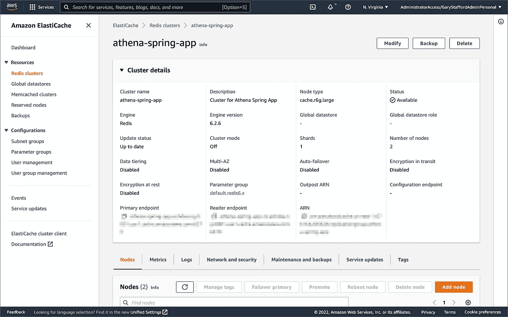

亚马逊弹性缓存 Redis 集群用于这篇文章

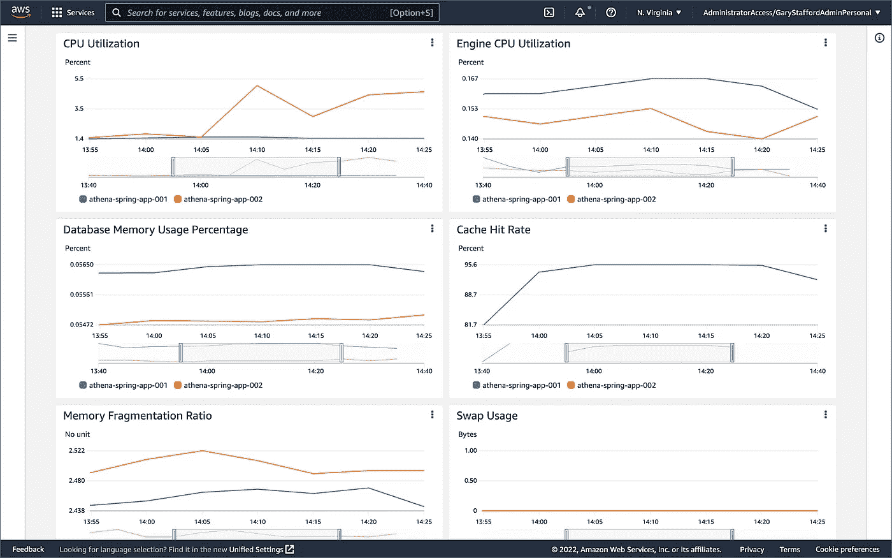

Amazon ElastiCache for Redis 集群监控控制台显示缓存活动

# 测试缓存

为了测试 Amazon ElastiCache for Redis，我们将再次使用 Postman 和导入的 [OpenAPI v3 规范](https://github.com/OAI/OpenAPI-Specification/blob/main/versions/3.0.0.md)。由于所有数据都从现有的 Redis 缓存中清除，第一次运行 Postman 测试时，它们会调用服务的目标方法，并将返回的数据存储在相关的缓存中。


使用 Postman 对 Spring Boot 服务运行一套集成测试

要确认这种缓存行为，请使用 Redis CLI 的`[--scan](https://redis.io/docs/manual/cli/#getting-a-list-of-keys)`选项。为了访问`redis-cli`，我在亚马逊 EKS 部署了一个[单 Redis pod](https://github.com/garystafford/athena-spring-app/blob/redis/kubernetes/redis.yml) 。第一次运行`--scan`命令时，我们应该得到一个空的键列表。在第一次 Postman 测试运行之后，同一个`--scan`命令应该返回一个缓存键列表。

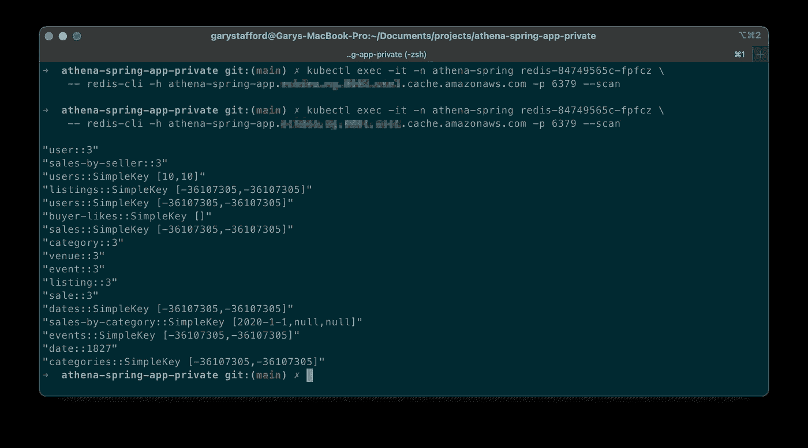

Redis 中的缓存键列表

使用 Redis CLI 的`MONITOR`选项进一步确认数据正在被缓存，如`set`命令所示。

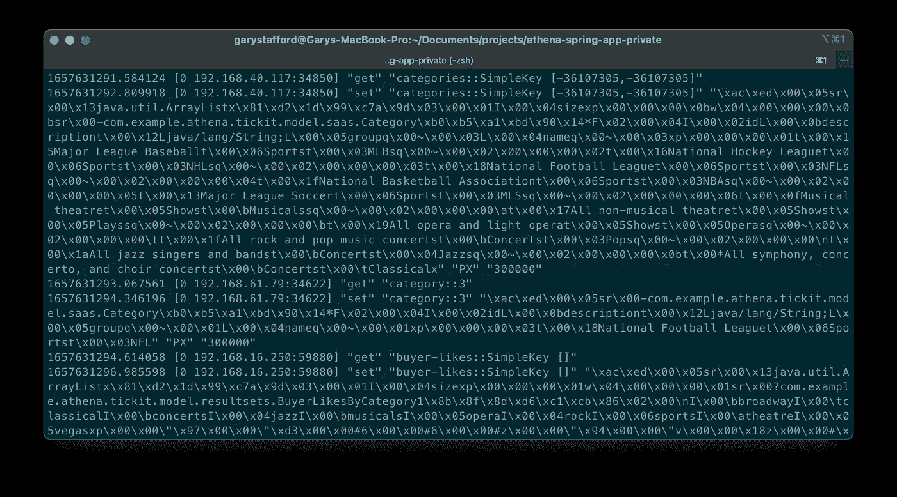

Athena 查询结果缓存在 Redis 中

在对数据进行初始缓存之后，再次使用 Redis CLI 的`MONITOR`选项来确认缓存被命中，而不是调用目标方法，后者将调用 Athena API。重新运行 Postman 测试，我们应该看到与`set`命令相对的`get`命令。

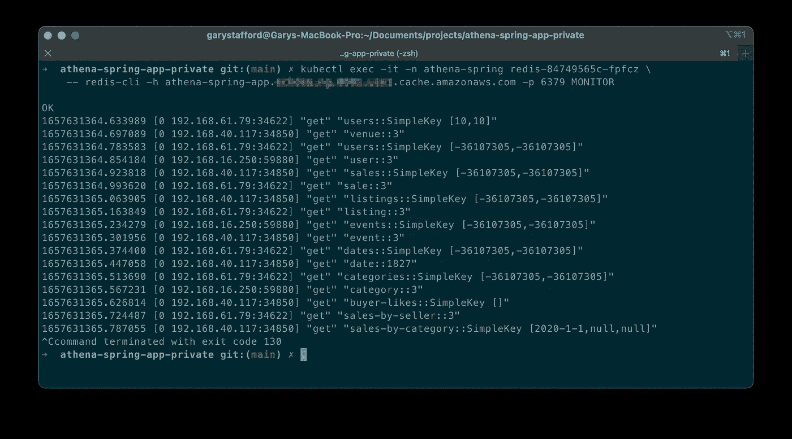

监控 Redis 中的缓存命中

最后，为了确认 Spring Boot 服务有效地使用 Redis 缓存数据，我们还可以在 AWS 管理控制台中检查 Amazon Athena 的最近查询选项卡。在 TTL 窗口中重复顺序测试运行后，我们应该只看到每个端点一个 Athena 查询。

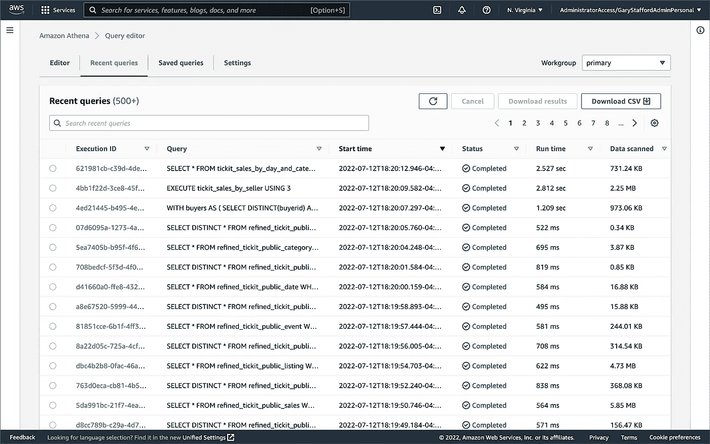

AWS 管理控制台中的 Amazon Athena 最近查询选项卡

# 结论

在最近的帖子[使用 Amazon Athena 开发用于在 AWS 上查询数据湖的 Spring Boot 应用](/developing-spring-boot-applications-for-querying-data-lakes-on-aws-eeefa298741)的后续文章中，我们看到了如何使用 Amazon ElastiCache for Redis 大幅提高数据湖应用的性能。尽管这种缓存技术通常与数据库相关联，但它也可以有效地应用于基于数据湖的应用程序，如本文中所示。

这篇博客代表我的观点，而不是我的雇主亚马逊网络服务公司(AWS)的观点。所有产品名称、徽标和品牌都是其各自所有者的财产。除非另有说明，所有图表和插图都是作者的财产。