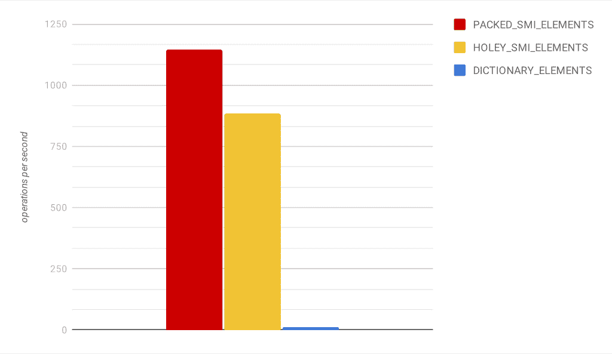
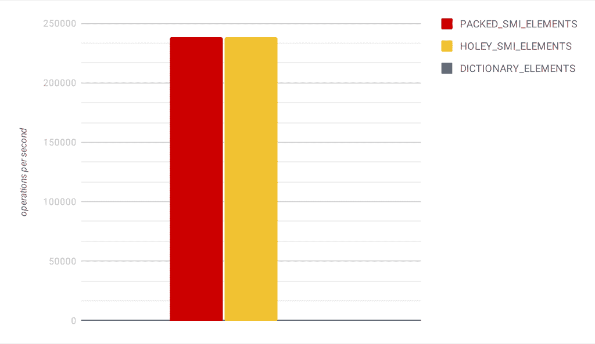

# [V8 深度探讨]了解阵列内部

> 原文：<https://itnext.io/v8-deep-dives-understanding-array-internals-5b17d7a28ecc?source=collection_archive---------0----------------------->


由 [Antonio Garcia](https://unsplash.com/@angarav?utm_source=medium&utm_medium=referral) 在 [Unsplash](https://unsplash.com?utm_source=medium&utm_medium=referral) 上拍摄

在本系列的前一部分中，我们讨论了 ES6 中引入的标准集合 Map 和 Set。这一次我们将关注 JavaScript 数组。

数组本质上是类似列表的对象，是该语言的核心特性之一，每个 JavaScript 开发人员都有使用它们的丰富经验。这篇博客文章并不试图让您理解公共 API，而是旨在简要介绍 V8 内部 JS 数组实现的各个方面，这些方面对我来说很有价值:内存布局、大小限制和其他有趣的实现细节。

为了简单起见，博文的剩余部分假设 V8 运行在 64 位系统上。

TL；博士的粉丝可能想跳到博客文章的最后一部分，在那里你可能会找到一个摘要。

**免责声明。下面写的是特定于 V8 8.9 的实现细节，捆绑了 Node.js 的最新开发版本(更准确地说是 [commit 49342fe](https://github.com/nodejs/node/commit/49342fe6f2ca6cedd5219d835a0a810e6f03cdd7) )。像往常一样，您不应该期望任何超出规范的行为，因为实现细节在任何 V8 版本中都可能发生变化。**

## 从前在 REPL

您可能会问自己:什么可能比 JavaScript 数组更简单？它必须由一个固定大小的数组支持，即一个连续的内存块。所有操作都应该是对存储在底层数组中的数据的直接操作。但是正如我们将在后面看到的，现实比这要复杂一些。

为了更实际，我们将观察一个 [Node.js REPL](https://nodejs.org/api/repl.html) 中数组的内部转换。更少的单词，更多的代码，让我们运行它:

```
$ node --allow-natives-syntaxWelcome to Node.js v16.0.0-pre.Type “.help” for more information.>
```

我们使用`--allow-natives-syntax`标志来使用`%DebugPrint()` V8 函数。这个函数打印给定对象或原始值的内部调试信息。

现在让我们创建一个空数组并打印它的调试信息:

```
> const arr = [];
undefined
> %DebugPrint(arr);
DebugPrint: 0x3db6370d4e51: [JSArray]
 - map: 0x3de594a433f9 <Map(PACKED_SMI_ELEMENTS)> [FastProperties]
 - prototype: 0x3a5538d05849 <JSArray[0]>
 - elements: 0x357222481309 <FixedArray[0]> [PACKED_SMI_ELEMENTS]
 - length: 0
 - properties: 0x357222481309 <FixedArray[0]>
 - All own properties (excluding elements): {
    0x357222484909: [String] in ReadOnlySpace: #length: 0x0f4cc91c1189 <AccessorInfo> (const accessor descriptor), location: descriptor
 }
...[]
```

最初的输出相当冗长，所以我对它进行了删减。我们感兴趣的是输出的`- elements: ... <FixedArray[0]> [PACKED_SMI_ELEMENTS]`部分。它告诉我们，我们的数组使用一个[固定大小的数组](https://github.com/nodejs/node/blob/49342fe6f2ca6cedd5219d835a0a810e6f03cdd7/deps/v8/src/objects/fixed-array.h#L99)来存储数据(V8 对此使用“后备存储”术语)，正如我们所预期的那样。该数组的大小为零。

调试输出还告诉我们，我们的 JS 数组具有 PACKED_SMI_ELEMENTS 元素类型。元素种类是 V8 跟踪的元数据，用于优化数组操作。它描述了存储在数组中的元素的类型。如果你不熟悉这个概念，你应该读一读 V8 团队的这篇伟大的[博客文章](https://v8.dev/blog/elements-kinds)。

PACKED_SMI_ELEMENTS 是最特殊的元素类型，这意味着数组中的所有元素都是从-2 到 2 -1 范围内的小整数。基于这些元数据，V8 可以在处理数组时避免不必要的检查和值转换。对我们来说，另一个重要方面如下。当一个 JS 数组被修改时，它的元素种类可能会从一个更具体的种类转变为一个不太具体的种类，而不是相反。例如，如果数组的元素类型由于插入而从 PACKED_SMI_ELEMENTS 更改为其他类型，那么对于这个特定的数组实例，就没有办法返回到原始的(更具体的)类型。

为了查看内部数组是如何增长的，我们将添加它的第一个元素，一个小整数:

```
> arr.push(42);
> %DebugPrint(arr);
DebugPrint: 0xe61bd5eb321: [JSArray] in OldSpace
...
 - elements: 0x0e61bd5e7501 <FixedArray[17]> [PACKED_SMI_ELEMENTS]
 - length: 1
...
 - elements: 0x0e61bd5e7501 <FixedArray[17]> {
           0: 42
        1-16: 0x357222481669 <the_hole>
 }
...[ 42 ]
```

这里我们看到用作后备存储的内部数组已经更改为`<FixedArray[17]> [PACKED_SMI_ELEMENTS]`。新数组具有相同的元素种类，但地址不同，内部数组大小等于 17。在我们的 64 位系统上，这意味着它需要 17 * 8=136 字节的内存(为了简单起见，我们忽略对象头)。这也意味着分配的内部数组比我们请求的要大。这允许 V8 对于增长数组的`push()`和类似操作实现恒定的[摊销时间](https://en.wikipedia.org/wiki/Amortized_analysis#Dynamic_array)。下面的[公式](https://github.com/nodejs/node/blob/49342fe6f2ca6cedd5219d835a0a810e6f03cdd7/deps/v8/src/objects/js-objects.h#L542)用于在内部数组不足的情况下确定新的大小:

```
new_capacity = (old_capacity + 50%) + 16
```

这里，`old_capacity`代表旧的内部数组大小加上插入项的数量，因此在我们的例子中它等于 1，而`new_capacity`被计算为 1 + 16 = 17。

在上面的输出中还有一个更有趣的细节。也就是说，数组内容中的`1-16: ... <the_hole>`文本告诉我们，内部数组中未使用的部分被“洞”填满了。这个洞是一个特殊的值，V8 使用它来标记未分配或已删除的数组项(不仅仅是它们)。这是一个永远不会“泄露”到 JS 代码中的实现细节。在我们的例子中，V8 使用这个洞来初始化数组中未使用的部分。

您可能想知道内部数组是否会收缩。在减少数组长度的操作中，如`pop()`或`shift()`，它似乎确实会收缩。如果超过一半的元素(对于小数组有一些填充)不会被用作操作的结果，就会发生这种情况。

回到我们的 REPL 会话，我们的数组中的 PACKED_SMI_ELEMENTS 类型假设没有漏洞，但是如果我们以某种方式改变它，该类型将转换为一个不太具体的类型。让我们开始吧:

```
> arr[2] = 0;
> %DebugPrint(arr);
...
 - elements: 0x0e61bd5e7501 <FixedArray[17]> [HOLEY_SMI_ELEMENTS]
 - length: 3
...
 - elements: 0x0e61bd5e7501 <FixedArray[17]> {
           0: 42
           1: 0x357222481669 <the_hole>
           2: 0
        3-16: 0x357222481669 <the_hole>
 }
```

这里我们指定了数组的第二项，跳过了包含洞的第一项。因此，数组的元素种类转换为 HOLEY_SMI_ELEMENTS。这种类型假设数组只包含 SMI 或 holey 值。就性能而言，这种元素比压缩元素稍慢，因为 V8 在迭代数组或修改数组时必须执行值检查以跳过漏洞。

我们不打算用数组支持的其他元素种类做进一步的实验。这是留给好奇读者的一个练习。然而，提到 V8 优化 64 位浮点数的数组是有意义的:PACKED_DOUBLE_ELEMENTS 和 HOLEY_DOUBLE_ELEMENTS 类型在后备数组中存储数字，避免每个数字的堆上指针。

下一步我们感兴趣的是知道用于数组项的后备存储是否可以不同于固定大小的数组。让我们在 REPL 会议上再做一个实验:

```
> arr[32 << 20] = 0;
> %DebugPrint(arr);
...
 - elements: 0x10f6026db0d9 <NumberDictionary[16]> [DICTIONARY_ELEMENTS]
 - length: 33554433
...
 - elements: 0x10f6026db0d9 <NumberDictionary[16]> {
   - max_number_key: 33554432
   2: 0 (data, dict_index: 0, attrs: [WEC])
   0: 42 (data, dict_index: 0, attrs: [WEC])
   33554432: 0 (data, dict_index: 0, attrs: [WEC])
 }
...
```

刚刚发生了什么？我们的数组不再使用基于数组的后备存储，取而代之的是使用一个`NumberDictionary[16]`，它是一个基于散列表的[集合](https://github.com/nodejs/node/blob/49342fe6f2ca6cedd5219d835a0a810e6f03cdd7/deps/v8/src/objects/dictionary.h#L301)，专门用于数字键。如果您对其他细节感兴趣，散列表使用[开放寻址](https://en.wikipedia.org/wiki/Hash_table#Open_addressing)和二次探测。

元素种类也转变为 DICTIONARY_ELEMENTS，这意味着 JS 数组的“慢”路径。通过这种方式，V8 旨在减少有很多孔的稀疏数组的内存占用，因为哈希表只存储非孔数组元素。另一方面，哈希表操作比数组慢，因为我们需要支付哈希代码计算、条目查找和重新哈希的成本。稍后，我们将进行一些微基准测试来了解成本。

dictionary 类型用于大于某个阈值的数组，所以这就是为什么我们的数组在达到极限[时会转换成这种类型。就内存而言，这意味着一个数组烘焙的 JS 数组不能超过 268MB。](https://github.com/nodejs/node/blob/49342fe6f2ca6cedd5219d835a0a810e6f03cdd7/deps/v8/src/objects/js-array.h#L120)

至于基于字典的数组，它们的最大大小受到 [ECMAScript 规范](https://262.ecma-international.org/11.0/#sec-arraycreate)的限制，不能超过 32 位无符号整数(2 — 1)的最大值。

太好了。现在，当我们对 V8 如何处理 JS 数组有了更好的理解后，让我们做一些基准测试。

## 一些愚蠢的基准

在我们进一步讨论之前，我需要警告你，下面的微基准是完全不科学的，不公平的基准，所以要有所保留。基准测试是在我的开发机器上完成的，使用 i5–8400h CPU、Ubuntu 20.04 和 Node.js v15.11.0。

首先，让我们试着理解不同元素种类在数组迭代方面的区别。在第一个基准测试的[中，我们迭代一个数字数组，并简单地计算其元素的总和。结果如下所示。](https://github.com/puzpuzpuz/microbenchmarks/blob/91672594d559f8c3dca69cc0a9241309bc6a7467/src/dictionary-array-iteration.js)



数组迭代基准测试结果。

在这里，字典类的结果几乎看不出来，因为它比打包类的结果小两个数量级(注意:事实上，[这里的差异](https://medium.com/p/90035b3325f9)是一个数量级，这仍然很多)。至于有孔的那种，只比打包的慢 23%。

现在让我们对基本的变异操作进行一些测量，比如`push()` 和`pop()`。在第二个基准测试中，我们将 1K 个元素放入数组，然后在每次迭代中取出所有元素。结果如下。



推送/弹出基准测试结果。

这一次，字典类的结果甚至是不可见的(是的，我不擅长数据可视化)，因为对于基于数组的类型，它是每秒大约 200 对大约 238K 的操作。

有趣的是，如果我们用`[--jitless](https://v8.dev/blog/jitless)` [标志](https://v8.dev/blog/jitless)禁用 V8 中的 JIT，结果变成每秒大约 200 次对大约 16K 次操作。这清楚地显示了 V8 的 JIT 编译器在优化基于数组的循环方面有多好。

虽然绝对数字并不重要，但是上面的结果说明了 JS 应用程序应该避免处理基于字典的数组，除非绝对必须这样做。

是时候总结并列出我们今天的发现了。

## 摘要

*   每个 JS 数组都与一种元素相关联，V8 跟踪元数据以优化数组操作。这些种类描述了存储在数组中的元素的类型。
*   足够小的数组的元素存储在一个内部固定大小的数组中。V8 在内部数组中分配一些额外的空间，以便为`push()`和类似的增长数组的操作实现恒定的摊销时间。当数组长度减少时，内部数组也可能收缩。
*   一旦 JS 数组变大(这也包括多孔数组)，V8 就开始使用哈希表来存储数组元素。该数组现在与“慢速”字典元素类型相关联。
*   对于热循环，“慢”类型可能比基于数组的类型慢几个数量级。
*   V8 的 JIT 编译器擅长为基于数组的类型优化循环。
*   通常，当编写在热路径上操作大型数组的代码时，您应该让 V8 为您的数组使用最特定的元素种类。

感谢你阅读这篇文章。如果你对 V8 深潜系列的下一篇文章有想法，请告诉我。关于不一致或不正确假设的反馈也非常受欢迎。