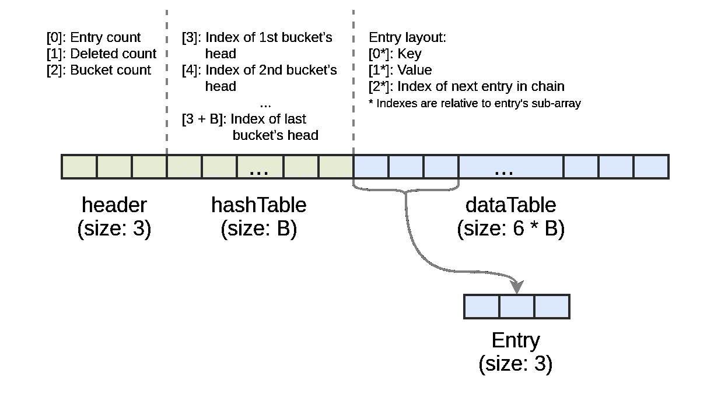

# [V8 深入探讨]了解地图内部

> 原文：<https://itnext.io/v8-deep-dives-understanding-map-internals-45eb94a183df?source=collection_archive---------2----------------------->

朱利安·保罗在 [Unsplash](https://unsplash.com?utm_source=medium&utm_medium=referral) 上的照片

通过这篇博客，我开始了 V8 Deep Dives 系列，致力于我在 V8 中的实验和发现，毫无疑问，V8 是一个设计良好的复杂软件。希望你会发现这篇博文很有价值，并分享你对下一个主题的想法。

## 介绍

[ECMAScript 2015](http://www.ecma-international.org/ecma-262/6.0/) ，也被称为 ES6，引入了许多内置集合，如 Map、Set、WeakMap 和 WeakSet。它们似乎是标准 JS 库的优秀补充，并在库、应用程序和 Node.js 核心中被广泛采用。今天，我们将重点关注地图收集，并尝试了解 V8 的实施细节，以及做出一些实际的结论。

该规范没有规定用于实现 Map 支持的精确算法，而是给出了一些可能的实现和预期性能特征的提示:

> Map 对象必须使用哈希表或其他机制来实现，平均来说，这些机制提供的访问时间与集合中的元素数量呈次线性关系。本地图对象规范中使用的数据结构仅用于描述地图对象所需的可观察语义。它不是一个可行的实现模型。

正如我们在这里看到的，该规范为每个实现者(即 JS 引擎)留出了很大的空间，但并没有对具体的算法、其性能或实现的内存占用给出很多确定性。如果您的应用程序在其热路径上处理地图，或者您在地图中存储了大量数据，这些细节肯定会有很大帮助。

作为一名具有 Java 背景的开发人员，我已经习惯了 Java 集合，可以在 Map 接口的多种实现之间进行选择，如果所选的类支持的话，甚至可以对它进行微调。此外，在 Java 中，总是可以从标准库中开放任何类的源代码，并熟悉实现(当然，这可能会因版本而异，但只是朝着更有效的方向)。所以，这就是为什么我不能忍受不学习 V8 中地图的工作原理。

现在，让我们开始潜水。

**免责声明。**下面写的是特定于 V8 8.4 的实现细节，捆绑了 Node.js 的最新开发版本(更准确地说是 [commit 238104c](https://github.com/nodejs/node/commit/238104c531219db05e3421521c305404ce0c0cce) )。你不应该期望任何超出规范的行为。

## 底层算法

首先，V8 中的映射建立在哈希表之上。后续文本假设您了解散列表是如何工作的。如果你不熟悉这个概念，你应该先学习一下(例如，通过阅读这个 [wiki 页面](https://en.wikipedia.org/wiki/Hash_table))，然后再回到这里。

如果你对地图有丰富的经验，你可能已经注意到了这里的矛盾。哈希表不为迭代提供任何顺序保证，而 ES6 规范要求实现在映射上迭代时保持插入顺序。所以,“经典”算法不适用于地图。但是似乎仍然有可能稍微改变一下就使用它。

V8 使用 Tyler Close 提出的所谓的[确定性哈希表算法](https://wiki.mozilla.org/User:Jorend/Deterministic_hash_tables)。以下基于 TypeScript 的伪代码显示了此算法使用的主要数据结构:

这里`CloseTable`接口代表哈希表。它包含`hashTable`数组，大小等于桶的数量。数组的第 n 个元素代表第 n 个桶，并保存了`dataTable`数组中桶头元素的索引。依次，`dataTable`数组包含了按插入顺序排列的条目。最后，每个`Entry`都有`chain`属性，它指向桶的链中的下一个条目(或者更精确地说，是单链表)。

每次当一个新条目被插入到表中时，它被存储在索引`nextSlot`下的`dataTable`数组中。这个过程还需要更新相应桶的链，因此插入的条目成为新的尾部。

当从散列表中删除一个条目时，它从`dataTable`中被移除(例如，通过将键和值都设置为`undefined`)。您可能会注意到，这意味着所有被删除的条目仍然占据着`dataTable`中的空间。

作为拼图的最后一块，当一个表充满了条目(包括存在的和删除的)时，需要用更大(或更小)的大小重新散列(重建)。

使用这种方法，在地图上的迭代只是一个遍历`dataTable`的问题。这保证了迭代的插入顺序要求。考虑到这一点，我希望大多数 JS 引擎(如果不是全部的话)使用确定性哈希表作为映射背后的构建块。

## 算法实践

让我们通过更多的例子来看看算法是如何工作的。比方说，我们有一个具有 2 个存储桶(`hashTable.length`)和总容量为 4 ( `dataTable.length`)的`CloseTable`，散列表由以下内容填充:

在此示例中，内部表格表示可以表示如下:

如果我们通过调用`table.delete(0)`删除一个条目，这个表就变成这样:

如果我们再插入两个条目，散列表将需要重新散列。稍后我们将更详细地讨论这个过程。

相同的算法可以应用于集合。唯一的区别是集合条目不需要`value`属性。

现在，当我们对 V8 中地图背后的算法有了一个了解，我们就准备进行更深入的探究。

## 实施细节

V8 中的 Map 实现是用 C++写的，然后暴露给 JS 代码。它的主要部分在`OrderedHashTable`和`OrderedHashMap`类中定义。我们已经了解了这些类是如何工作的，但是如果你想自己阅读代码，你可以在这里找到[这里](https://github.com/nodejs/node/blob/238104c531219db05e3421521c305404ce0c0cce/deps/v8/src/objects/ordered-hash-table.h)，这里[这里](https://github.com/nodejs/node/blob/238104c531219db05e3421521c305404ce0c0cce/deps/v8/src/objects/ordered-hash-table.cc)，最后，这里[这里](https://github.com/nodejs/node/blob/238104c531219db05e3421521c305404ce0c0cce/deps/v8/src/builtins/builtins-collections-gen.cc)。

当我们关注 V8 的 Map 实现的实际细节时，我们需要理解表容量是如何选择的。

## 容量

在 V8 中，哈希表(Map)容量总是等于 2 的幂。至于 load factor，它是一个常数，等于 2，这意味着一个表的最大容量是`2 * number_of_buckets`。当您创建一个空映射时，它的内部哈希表有两个桶。因此，这种映射的容量是 4 个条目。

最大容量也有限制。在 64 位系统上，这个数字是 2 个⁷，这意味着你不能在一个地图上存储超过 1670 万个条目。这个限制来自于用于 map 的堆上表示，但是我们将在稍后讨论这个方面。

最后，用于再散列的增长/收缩因子等于 2。因此，一旦一个映射获得 4 个条目，下一次插入将导致一个重散列过程，其中将构建一个两倍大(或更小)的新哈希表。

为了确认在源代码中可以看到什么，我修改了 Node.js 中捆绑的 V8，将桶的数量作为地图上可用的自定义属性`buckets`。你可以在这里找到结果。使用这个自定义 Node.js 构建，我们可以运行以下脚本:

上面的脚本简单地将 100 个条目插入到一个空地图中。它产生以下输出:

正如我们在这里看到的，当达到地图容量时，地图以 2 的幂增长。所以，我们的理论现在被证实了。现在，让我们尝试通过删除地图中的所有项目来缩小地图:

该脚本产生以下输出:

我们再次看到，一旦剩余条目比`number_of_buckets / 2`少，地图就会以 2 的幂缩小。

## 散列函数

到目前为止，我们还没有讨论 V8 如何为存储在映射中的键计算散列码，虽然这是一个好话题。

对于类似数字的值(SMI 和堆号、BigInts 和其他类似的内部内容)，它使用一个或另一个众所周知的低冲突概率的[散列函数](https://github.com/nodejs/node/blob/238104c531219db05e3421521c305404ce0c0cce/deps/v8/src/utils/utils.h#L213)。

对于类似字符串的值(字符串和符号)，它[根据字符串内容计算](https://github.com/nodejs/node/blob/238104c531219db05e3421521c305404ce0c0cce/deps/v8/src/objects/string.cc#L1338)散列码，然后将其缓存在内部头中。

最后，对于对象，V8 [根据一个随机数计算](https://github.com/nodejs/node/blob/238104c531219db05e3421521c305404ce0c0cce/deps/v8/src/execution/isolate.cc#L3785)哈希码，然后缓存在内部头中。

# 时间复杂度

大多数地图操作，如`set`或`delete`，都需要查找。就像“经典”哈希表一样，查找具有 O(1)时间复杂度。

让我们考虑最坏的情况，当表有 N/N 个条目时(它已满)，所有条目都属于一个桶，所需条目位于尾部。在这种情况下，查找需要遍历链元素 N 次。

另一方面，在最好的情况下，当表已满，但每个存储桶有 2 个条目时，查找将需要多达 2 次移动。

众所周知，虽然散列表中的单个操作很“便宜”，但重新散列却不便宜。重散列的时间复杂度为 O(N ),并且需要在堆上分配新的哈希表。此外，必要时，再散列是作为插入或删除操作的一部分来执行的。因此，举例来说，一个电话可能比你预期的要贵。幸运的是，重新散列是一个相对不常见的操作。

## 内存占用

当然，底层哈希表必须以某种方式存储在堆中，即所谓的“后备存储”中。还有一个有趣的事实。整个表(以及 Map)存储为一个固定长度的数组。阵列布局可以用下图来说明。

后备存储数组的特定片段对应于头(包含必要的信息，如存储桶计数或已删除条目计数)、存储桶和条目。bucket 链的每个条目占用数组的三个元素:一个用于键，一个用于值，一个用于指向链中下一个条目的“指针”。

至于数组大小，我们可以大致估算为`N * 3.5`，其中`N`是表容量。为了理解它在内存占用方面的含义，让我们假设我们有一个 64 位系统，并且 V8 的[指针压缩](https://v8.dev/blog/pointer-compression)特性被禁用。在这个设置中，每个数组元素需要 8 个字节，一个容量为 2 ⁰ (~1M)的映射需要大约 29 MB 的堆内存。

## 摘要

天哪，那是一次长途旅行。总结一下，下面是我们在 V8 中了解到的地图的列表:

*   V8 使用确定性哈希表算法实现映射，其他 JS 引擎也很有可能这样做。
*   地图用 C++实现，并通过 JS API 公开。
*   就像“经典的”散列映射一样，映射操作所需的查找是 O(1 ),重散列是 O(N)。
*   在 64 位系统上，当禁用指针压缩时，具有 1M 条目的映射在堆上占用大约 29 MB。
*   这篇博文中描述的大部分内容也可以应用于 set。

这次到此为止。请分享你对下一个 V8 深潜的想法。