# V8 如何优化 JavaScript 中的函数？

> 原文：<https://itnext.io/v8-function-optimization-2a9c0ececf5e?source=collection_archive---------5----------------------->


CC0 公共领域，来源:Pxhere

## JS 引擎是复杂的软件。我想快速解释一下 V8 用来加速你的…

> *如果您不想在您的计算机上运行它，请跳到“*我们要优化什么？”

首先，我们需要安装 V8 以便能够在没有整个包(节点或 web 浏览器)的情况下运行它。我为 Linux 用户创建了一个描述这个过程的要点。

[https://gist . github . com/burn piro/d85d 836200 df 93 af 892877 C2 cf 37 f 12 c](https://gist.github.com/burnpiro/d85d836200df93af892877c2cf37f12c)

如果你是 Mac 用户，它应该也适用于你。如果您在安装过程中有任何问题，请参考[正式文件](https://v8.dev/docs/build)

安装后，您应该能够运行如下代码

```
// index.js

console.log('it works');
```

通过打电话

```
d8 index.js
```

# 我们试图优化什么？

我们的测试函数如下所示:

```
function test(obj: any): string {
  let result = '';
  for (let i = 0; i < N; i += 1) {
    result += obj.a + obj.b;
  }
  return result;
}
```

让我们假设这个函数在脚本执行过程中被调用了数千次，因此快速运行是非常重要的。在我解释如何在 V8 中进行优化之前，我们需要知道什么是形状以及线内缓存(IC)是如何工作的。

# 形状(V8 中的地图)

> *这个形状的学名是“隐藏类”,特别是在 JS 中，这可能会令人困惑，所以每个人都有不同的称呼，但 FF 团队介绍的名称可能是最好的。*

`Shape`包含了很多 staff，但是当人们使用这个名字时，他们大多把它称为对象属性的`descriptors`表。Shape 还存储其他信息，比如对象的大小以及指向构造函数和原型的指针。我很快会在例子中展示给你们看。

让我们从一个简单的对象开始:

```
const obj = {
  x: 1,
  y: 1,
};
```

它在 V8 中的表示如下

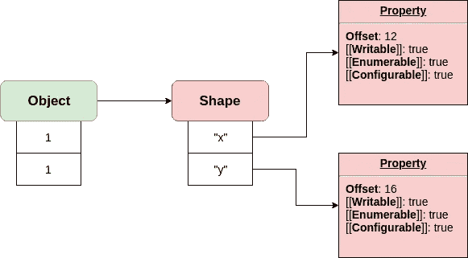

如果你观察它，在对象值和它们的描述之间有一个明显的区别。该对象的每个属性都根据形状中定义的`offset`存储在内存中。在我们的例子中，属性`x`与`offset: 12`一起存储，后者告诉 v8 通过将指针偏移 12 来寻找`obj.x`值。

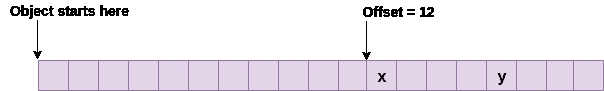

好了，现在你知道什么是形状了，但是为什么它这么有用呢？

# 形状的有用性

当您创建一个对象时，如果您的系统中有一个类似的对象，您不会真的想再次存储关于它的所有信息。这就是 V8 重新使用其形状的原因。

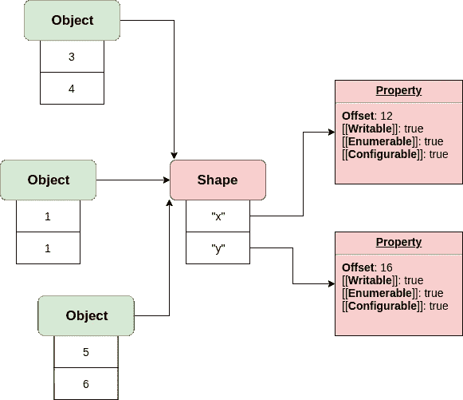

造成这种情况的代码可能如下所示

```
const obj1 = {
  x: 1,
  y: 1,
};
const obj2 = {
  x: 3,
  y: 4,
};
const obj3 = {
  x: 5,
  y: 6,
};
```

# 并非所有具有相同“结构”的物体都具有相同的形状

如果你比较这两个物体

```
const obj1 = {
  x: 1,
  y: 1,
};
const obj2 = {};
obj2.x = 1;
obj2.y = 1;
```

他们可能看起来一样，但他们有不同的形状。我们已经讨论过的第一个的形状。第二个的形状在这里

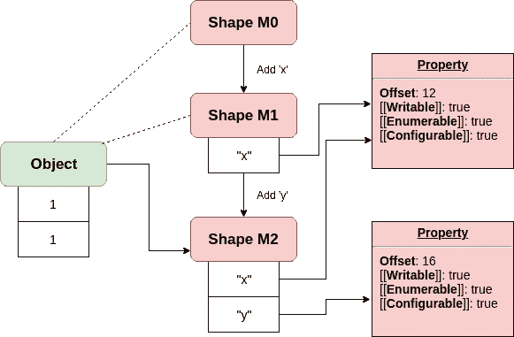

在代码执行过程中，V8 创建了 3 个不同的形状和它们之间的过渡来描述最终结果。

```
const obj2 = {};
// Shape M0
// add "x": Transition to M1, offset 12

obj2.x = 1;
// Shape M1
// "x": at offset 12
// add "y": Transition to M2, offset 16

obj2.y = 1;
// Shape M2
// "x": at offset 12
// "y": at offset 16
```

创建类时也是如此

```
class MyComponent {
  constructor(size, name) {
    // Shape M0

    this.size = size;
    // Shape M1
    // "size": at some offset

    this.name = name;
    // Shape M2
    // "size": at some offset
    // "name": at some other offset
  }
}
```

100%诚实地说，V8 不会存储整个形状，当它在它们之间转换时。

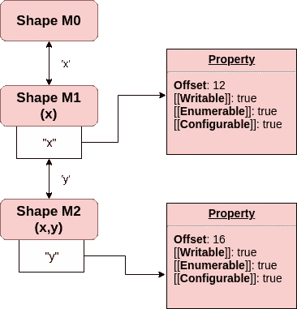

它不会将关于`x`属性的信息复制到`Shape M2`中。这使得它可以在拥有不同对象时形成树状结构。

```
const obj1 = {};
obj1.x = 1;
const obj2 = {};
obj2.x = 1;
obj2.y = 1;
const obj3 = {};
obj3.x = 1;
obj3.z = 1;
obj3.k = 1;
const obj4 = {};
obj4.i = 1;
obj4.j = 'test';
obj4.k = 1;
```

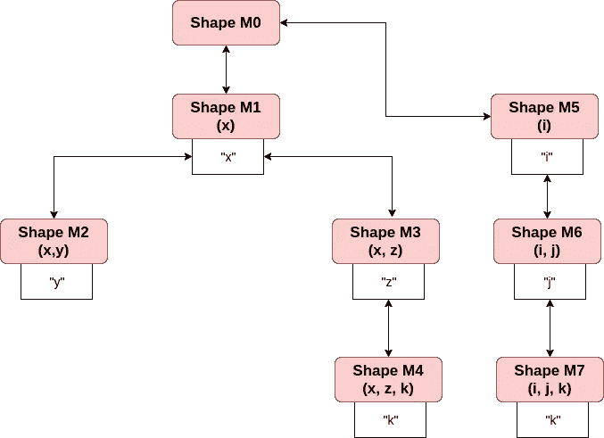

注意，即使我们使用相同的属性名作为第三属性，在`obj3`和`obj4`中，这是两个不同的形状。原因是因为形状与过渡有关。如果你有一个代表`k`属性的全局形状，它需要定义`offset`属性。这可能适用于内存中的相同对象结构(偏移量是根据对象的其余部分在属性之前占用的空间大小来设置的)。因此，如果你有一个类似于`obj4`的对象，那么属性`k`可能与属性`k`在`obj3`上有不同的偏移量(过渡到形状 M7 是不同的)。

# 内嵌高速缓存

也许这次从代码开始？

```
const N = 1000000;
const obj1 = {};
obj1.name = 'Jake';

function getMeName(o) {
  return o.name;
}

for (let i = 0; i < N; i += 1) {
  getMeName(obj1);
}
```

然后像这样运行这段代码

```
d8 --trace-ic index.js
```

> *题外话:你可能想知道为什么我们要运行函数那么多次。这是因为 V8 不会尝试优化功能，除非该功能被标记为* `*hot*` *。并且多次运行函数时会得到* `*hot*` *状态。*

现在您可以在浏览器中打开`path/to/v8/tools/ic-explorer.html`。该页面允许您探索内联缓存的情况。

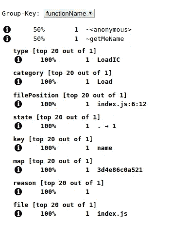

它的一个重要部分是`state`，它可以是以下状态之一:

*   0 未初始化
*   。前单形
*   1 单态
*   ^重新计算处理程序
*   多态磷
*   巨型的
*   g 通用

在我们的例子中`state`被设置为单态，这意味着该函数被优化为只接收具有一个定义形状的对象。

现在让我们来定义什么是真正的 IC…

不幸的是，我们不得不采取强硬的手段。通过查看一些字节码(如果你感兴趣的话，有一篇关于理解字节码的博客文章，作者是 Franziska Hinkelmann。要做到这一点，只需运行

```
d8 --print-bytecode index.js
```

它的输出很长，但我们对最后一部分感兴趣。寻找`generated bytecode for function getMeName`。

```
...
[generated bytecode for function: getMeName]
Parameter count 2
Register count 0
Frame size 0
   69 E> 0x2d34c959f9d6 @    0 : a5                StackCheck
   86 S> 0x2d34c959f9d7 @    1 : 28 02 00 00       LdaNamedProperty a0, [0], [0]
   91 S> 0x2d34c959f9db @    5 : a9                Return
Constant pool (size = 1)
0x2d34c959f989: [FixedArray] in OldSpace
 - map: 0x0741c8840789 <Map>
 - length: 1
           0: 0x0741c8843eb9 <String[#4]: name>
Handler Table (size = 0)
```

在`LdaNamedProperty`上看。这个方法负责从`a0`(参数 0)中提取命名属性。属性名(在我们的例子中是`name`)由来自`Constant pool`的`[0]`常量决定。

```
- map: 0x0741c8840789 <Map>
 - length: 1
           0: 0x0741c8843eb9 <String[#4]: name>
```

从参数中获取属性值后，函数将它存储在累加器中(函数最后返回累加器)。

这个过程产生了我们称之为`Inline Cache` ( `IC`)的东西。每次使用不同的对象形状运行函数时，它都会创建一个新的 IC 条目。

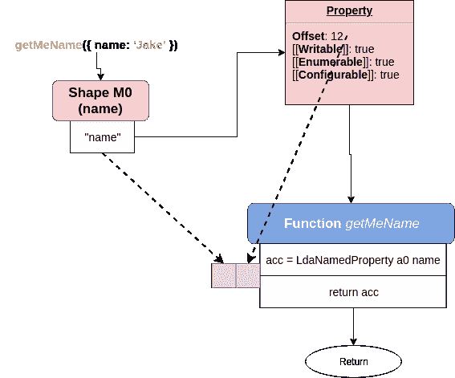

我们称这个物体为`getMeName`，它给出了 M0 的形状。首先，函数的运行如前所述，因此 V8 必须在`a0`上查找命名属性，并将其存储到`acc`中。运行字节码后，它创建包含两个内容的 IC:

*   形状
*   去酒店的路

现在，如果我们对一个具有相同形状的对象再次调用相同的函数:

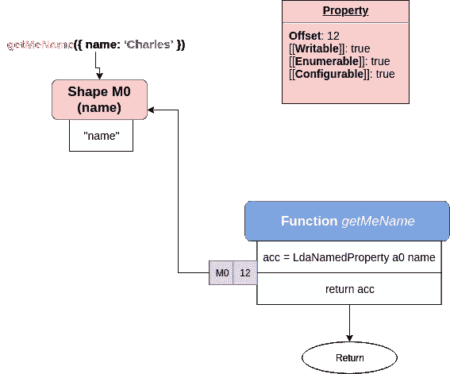

V8 将当前形状与存储在 IC 中的形状进行比较，并跳过调用`LdaNamedProperty`的整个过程，因为这种形状有一个“快捷方式”，存储在 IC 中。这样我们就可以很好地优化函数调用。但是如果我们用不同的对象(不同的形状)调用这个函数呢？

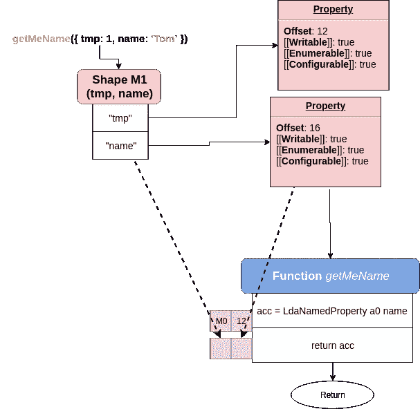

V8 为 shape M1 创造了另一个 IC。之后，我们有了两种形状的“捷径”。但是 V8 一个功能能造多少个 IC 呢？很多…唯一的问题是，每次都有一个去优化。

# 功能状态

您的函数可能处于不同的状态，但我们最感兴趣的是其中的 3 种:

*   单态-1ic
*   多态—2–4 个集成电路
*   巨型→5 IC

当 V8 决定是否应该优化函数时，它检查当前函数状态。其中只有两个可以优化:单态和多态。达到 5 ICs V8 基本上就是 ***“完全不知道自己要去哪，就到此为止吧”*** 。此时**涡扇**不会在 IC 中存储任何东西，相反，它会回到全局缓存中。通常，如果你的函数是巨型的，这并不重要，但是如果这个函数经常运行，你可以考虑通过减少它接受的不同形状的数量来优化它。

# 回到我们的功能

```
const N = 10000;

let a = { a: 'Jack', b: 'Sparrow' };
let b = { tmp: 3, a: 'Charles', b: 'Xavier' };
let c = { tmp: 3, tmp2: 3, a: 'Frodo', b: 'Baggins' };
let d = { tmp: 3, tmp2: 3, tmp3: 3, a: 'Legolas', b: 'Thranduilion' };
let e = { tmp: 3, tmp2: 3, tmp3: 3, tmp4: 3, a: 'Indiana', b: 'Jones' };
let f = { tmp: 3, tmp2: 3, tmp3: 3, tmp4: 3, tmp5: 3, a: 'Gandalf', b: 'The Grey' };
let f2 = { tmp: 3, tmp2: 3, tmp3: 3, tmp4: 3, tmp5: 3, a: 'Jack', b: 'Sparrow' };
let f3 = { tmp: 3, tmp2: 3, tmp3: 3, tmp4: 3, tmp5: 3, a: 'Charles', b: 'Xavier' };
let f4 = { tmp: 3, tmp2: 3, tmp3: 3, tmp4: 3, tmp5: 3, a: 'Frodo', b: 'Baggins' };
let f5 = { tmp: 3, tmp2: 3, tmp3: 3, tmp4: 3, tmp5: 3, a: 'Legolas', b: 'Thranduilion' };
let f6 = { tmp: 3, tmp2: 3, tmp3: 3, tmp4: 3, tmp5: 3, a: 'Indiana', b: 'Jones' };

function test(obj) {
  let result = '';
  for (let i = 0; i < N; i += 1) {
    result += obj.a + obj.b;
  }
  return result;
}
function test2(obj) {
  let result = '';
  for (let i = 0; i < N; i += 1) {
    result += obj.a + obj.b;
  }
  return result;
}

const startT1 = Date.now();
for(let i = 0; i < N; i += 1) {
	test(f);
	test(f2);
	test(f3);
	test(f4);
	test(f5);
	test(f6);
}
console.log("test with one shape:", Date.now() - startT1, "ms.");

const startT2 = Date.now();
for(let i = 0; i < N; i += 1) {
	test2(a);
	test2(b);
	test2(c);
	test2(d);
	test2(e);
	test2(f);
}
console.log("test with multiple shape:", Date.now() - startT2, "ms.");
```

执行此代码后，它会打印:

```
test with one shape: 3015 ms. 
test with multiple shape: 12329 ms.
```

刚刚发生了什么？首先，我们已经为每个测试设置了 6*10⁸操作数(6 x 10000 x 10000)。第一个函数`test`以相同的形状再次被调用(不同的对象，相同的形状)。第二个函数`test2`用 6 种不同的形状调用，因此 V8 没有优化它。

如果你打开`v8/tools/ic-explorer.html`，用`d8 --trace-ic index.js`运行上面的代码。你可以将`v8.log`载入`ic-explorer`。不想做的，这里截图。

`test(obj)`:

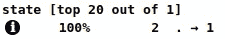

`test2(obj)`:

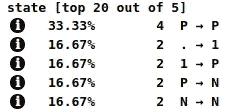

测试结果很明显，`test()`比`test2()`快 7.8 倍。

你可能会问，如果看起来一样，为什么要创建`test2()`？这是因为在用一个形状运行`test()`之后，它已经为它进行了优化。我不想影响第二次运行的性能，但仍然希望将其保存在一个文件中。

# 额外的

我已经提到过，shape 不仅仅包含关于添加属性的信息。以下是为`let b`创建的形状的示例:

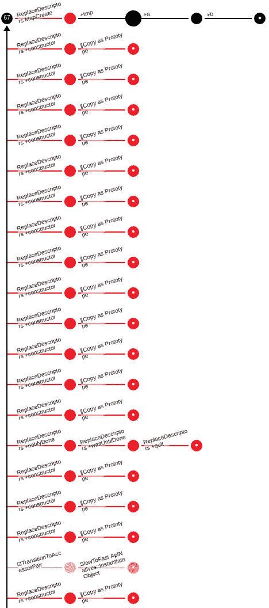

如果您愿意，可以通过运行以下命令为您的代码生成该文件

```
d8 --trace-maps index.js
```

并将`v8.log`上传到`v8/tools/map-processor.html`中。当它生成图表时，点击`Transitions`并在页面底部浏览它们的列表。

*最初发布于*[*https://erdem . pl*](https://erdem.pl/2019/08/v-8-function-optimization)*。*