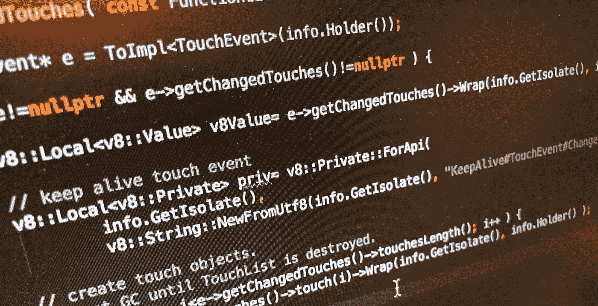

# V8 包装对象生命周期

> 原文：<https://itnext.io/v8-wrapped-objects-lifecycle-42272de712e0?source=collection_archive---------5----------------------->



V8 中的对象，对于可以持有它们的句柄类型可以主要是:`Local` 或者`Persistent`。虽然还有另外一种句柄类型:`Eternal`，它的寿命与`Isolate`相同，因此永远不会被垃圾回收。

`Local`代表一个短暂的对象，来自 v8 头文件本身:*轻量级和短暂的，通常用于本地操作*。一旦管理这个`Local`处理程序的`HandleScope`被销毁，被包装的对象就无效，最终被垃圾回收。

`Persistent`句柄，可用于跨几个执行单元存储对象。这些对象最终将被垃圾回收。

在嵌入 v8 时，我总是需要在 javascript 中暴露一个本机对象，这是通过将一个`Persistent`处理程序与一个本机对象配对来完成的。平均而言，这些本机对象是随着我的 javascript 代码流创建/销毁的，其对应的本机对象也需要相应地销毁和释放。为此，我设定了一个`weak handle callback`像:

```
class JavascriptWrapper {private:
    v8::Persistent<v8::Object> wrapper_;public:
    public void Wrap( v8::Isolate*, ... ) {
        ...
        // set weak handler
        wrapper_.SetWeak( this, 
                          weakCallbackForObjectHolder,     
                          v8::WeakCallbackType::kParameter);
    } // the **weak handler function** is as follows: staticvoidweakCallbackForObjectHolder(
        constv8::WeakCallbackInfo<HC::Wrapper>& data) {
        deletedata.GetParameter();
    }
}
```

一旦 javascript 对象被垃圾收集，这个函数就会被调用，允许我回收这个对象持有的所有本机资源。

有时，我需要保留一个对象，直到某些操作完成。例如，Image 对象应该一直存在，直到它的异步下载过程结束，并有机会通知它的回调，从而避免在该过程中进行垃圾收集。这是通过调用以下命令将`Persistent`句柄标记为不弱来实现的:

```
wrapper_->ClearWeak();
```

这阻止了 GC 回收我的对象。想象这样一个 javascript 对象:

```
const image = new Image();
image.addEventListener(“load”, (e)=> {...});
image.addEventListener(“error”, (e)=> {...});
image.src= 'http://...';
```

这段代码可能会在通知回调之前破坏`image`对象。(注意`image`根本没有引用，只是在 javascript 中定义并遗忘了)。由于我希望通知`load`或`error`回调，所以我必须阻止 GC 介入，而`ClearWeak`正是这么做的。稍后，当回调被通知时，我可以像上面的例子一样通过调用`SetWeak(...)`来标记可用于垃圾收集的`Persistent`处理程序。这个`ClearWeak` / `SetWeak`组合让我可以完全控制包装对象的生命周期。

# 私人参考

有些时候，我只需要将一个对象的生命周期绑定到另一个对象。比如一个`TouchEvent`包含一个`TouchList`对象，我想把它们的生命周期绑定在一起。

为此，v8 还提供了私有属性实用程序。可以想象，这些属性将无法从 javascript 访问。要创建私有属性，只需调用

```
v8::Local<v8::Value> v8Value= obj->Wrap(info.GetIsolate(), ...);// create a private property
v8::Local<v8::Private> priv= v8::Private::ForApi(
        info.GetIsolate(),
        v8::String::NewFromUtf8(
           info.GetIsolate(), 
           "KeepAlive#TouchEvent#ChangedTouches"));// assign this property to the object:
info.Holder()->SetPrivate(
        info.GetIsolate()->GetCurrentContext(),
        priv,
        v8Value);
```

这样我就得到一个有趣的效果，当 TouchEvent 存在时，TouchList 对象保持活动状态，没有人可以修改或破坏 javascript 的这种联系。

尽管如此，还有另一个阶段，我的被包装的本机对象值得特别注意，这是在`Isolate`销毁时间。

# 孤立破坏

不能依靠垃圾收集来回收任何对象。事实上，它可能不会在 javascript 程序生命周期中触发。

在这个前提下，所有本机包装的对象都需要有机会在隔离销毁时被释放。特别是如果您希望创建另一个隔离并避免昂贵的内存泄漏。我们如何识别我们的`Persistent`句柄以进行特殊处理呢

```
wrapper_.SetWrapperClassId( int16_t_tag );
```

稍后，当隔离被销毁时，我必须显式调用

```
isolate_->VisitHandlesWithClassIds( &phv );
```

phv 是这样一个类的实例:

```
**class** PHV : **public** v8::PersistentHandleVisitor {
**public**:

    v8::Isolate* isolate_;

    PHV(v8::Isolate* isolate) : isolate_(isolate) {}
    **virtual** ~PHV() {}

    **virtual void** VisitPersistentHandle(
        v8::Persistent<v8::Value>* value,
        uint16_t class_id) {

        // delete persistent handles on isolate disposal.
        **if** ( class_id==HC_GARBAGE_COLLECTED_CLASS_ID ) {
            v8::HandleScope hs(isolate_);
            Wrapper* w = // extract your wrapped object from
                         // the passed-in value object. **delete** w;
        }
    }
};
```

如您所见，处理本机对象实际上非常简单。使用嵌入式 v8 是多么令人愉快的另一个例子。