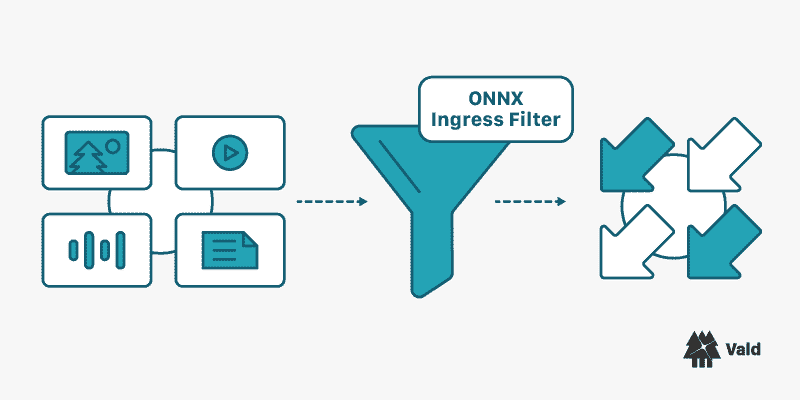

# Vald 发布了新的 Vald 官方入口过滤器:vald-onnx-ingress-filter

> 原文：<https://itnext.io/vald-released-the-new-vald-official-ingress-filter-vald-onnx-ingress-filter-b807e147188b?source=collection_archive---------2----------------------->

Vald 发布了名为`vald-onnx-ingress-filter`的官方入口过滤器组件。这篇文章描述了它的介绍和使用教程。



# 什么是入口滤波器？

入口过滤器是 Vald 的组件之一，它可以在通过连接入口过滤器网关组件处理请求之前对请求进行一些预处理。在将向量插入 Vald 集群之前，用户可以实现用户定义的自定义过滤逻辑作为入口过滤器，如向量修改、基于用户 ID 的过滤功能等。下面是具体逻辑的例子:

*   修改发送的向量，例如归一化
*   压缩请求向量的维度
*   将文本和图像等非结构化数据转换为矢量

当然，各种各样的定制过滤可以根据每个用例来执行。

# 什么是 vald-onnx-ingress-filter？

`vald-onnx-ingress-filter`是 Vald 提供的官方入口过滤器实现之一。它的定制逻辑要求输入 ONNX 模型作为请求，并输出来自 ONNX 模型的结果作为 Vald 代理的请求。使用该组件，您可以在 Vald API 的请求内联中使用 ONNX 模型对各种非结构化数据(如文本、音频和图像)进行矢量化，而无需构建外部 API。您可以使用非结构化数据直接执行 CRUD 处理。

关于 ONNX 的详细信息，请参考官方页面

 [## ONNX |主页

### 在您喜欢的框架中开发，而不用担心下游推理的影响。ONNX 使您能够使用…

onnx.ai](https://onnx.ai) 

有关 Vald 组件的更多详细信息，请参考以下文档。

[](https://vald.vdaas.org/docs/overview/component/) [## Vald |组件

### 本文档将向您概述 Vald 中开发和使用的所有组件。Vald 过滤器是可选的…

vald.vdaas.org](https://vald.vdaas.org/docs/overview/component/) 

# vald-onnx-ingress-filter 入门

现在，让我们开始试着用样本清单`vald-onnx-ingress-filter`！本教程要求:

*   [码头工人](https://www.docker.com/)
*   [舵](https://helm.sh/)
*   K3d (或另一个 kubernetes 星团)
*   [Git](https://git-scm.com/)

本教程遵循以下步骤:

1.  准备 Kubernetes 集群
2.  展开`[vdaas/vald-onnx-ingress-filter](https://hub.docker.com/r/vdaas/vald-onnx-ingress-filter)`
3.  部署包括`vald-filter-gateway`组件的 Vald 集群
4.  插入和搜索操作

## 准备 Kubernetes 集群

让我们检查一下您的 Kubernetes 集群是否正在运行。如果使用 K3d，集群从

```
// create cluster command
k3d cluster create vald-onnx

// check command
kubectl cluster-info
```

## 部署 vald-onnx-入口-过滤器

在[仓库](https://github.com/vdaas/vald-onnx-ingress-filter)中公开清单。请按照以下命令克隆到本地。

```
git clone https://github.com/vdaas/vald-onnx-ingress-filter.git
cd vald-onnx-ingress-filter
```

本教程使用来自 [ONNX 模型动物园](https://github.com/onnx/models#onnx-model-zoo)的`ResNet50-v2`作为 ONNX 模型。您可以通过编辑示例清单文件`k8s/deployment.yaml`来更改模型。

```
...
  - |
    curl -L "https://github.com/onnx/models/raw/main/vision/classification/resnet/model/resnet50-v2-7.onnx" -o /model/sample.onnx  #FIXME
```

并且，当 ONNX 模型路径改变时，请不要忘记更新 `k8s/deployment.yaml`。

```
...
    env:
      - name: MODEL_PATH
        value: "/model/sample.onnx"  #FIXME
```

编辑完清单文件后，让我们将`vald-onnx-ingress-filter`部署到您的 Kubernetes 集群。

```
// deploy
kubectl apply -f k8s

// check
kubectl get pod===
NAME                                        READY   STATUS    RESTARTS   AGE
vald-onnx-ingress-filter-55b8778f5c-chkqq   1/1     Running   0          68s
vald-onnx-ingress-filter-55b8778f5c-xxf54   1/1     Running   0          68s
```

## 部署带有过滤器网关的 Vald 集群

接下来，让我们使用 Helm 部署 Vald 集群。我们编辑 Vald 存储库中的`example/helm/values.yaml`,使`vald-filter-gateway`可用，并将其用于部署。

```
git clone https://github.com/vdaas/vald.git
cd vald
vim example/helm/values.yaml
---
...
gateway:
...
    filter:
        enabled: true
...
agent:
    ngt:
        dimension: 1000
...
```

编辑之后，让我们试着通过`helm install`命令部署 Vald 集群。

```
# deploy
helm install vald vald/vald --values example/helm/values.yaml

# verify
kubectl get pods===
NAME                                        READY   STATUS    RESTARTS   AGE
vald-agent-ngt-0                            1/1     Running   0          15m
vald-agent-ngt-1                            1/1     Running   0          15m
vald-agent-ngt-2                            1/1     Running   0          15m
vald-agent-ngt-3                            1/1     Running   0          15m
vald-agent-ngt-4                            1/1     Running   0          15m
vald-agent-ngt-5                            1/1     Running   0          15m
vald-discoverer-749cbf4cd4-kvs4v            1/1     Running   0          15m
vald-filter-gateway-7856bf7c6c-krwsb        1/1     Running   0          15m
vald-filter-gateway-7856bf7c6c-lhxfq        1/1     Running   0          15m
vald-filter-gateway-7856bf7c6c-tg6hg        1/1     Running   0          15m
vald-lb-gateway-6798bd4c8d-46b57            1/1     Running   0          15m
vald-lb-gateway-6798bd4c8d-b7bcn            1/1     Running   0          15m
vald-lb-gateway-6798bd4c8d-qwc2q            1/1     Running   0          15m
vald-manager-index-669d967797-j9smn         1/1     Running   0          15m
vald-onnx-ingress-filter-55b8778f5c-chkqq   1/1     Running   0          18m
vald-onnx-ingress-filter-55b8778f5c-xxf54   1/1     Running   0          18m
```

## 插入和搜索操作

本节尝试插入向量，并使用 Vald 集群和您之前部署的`vald-onnx-ingress-filter`进行搜索。在运行操作之前，我们使用`kubectl port-forward`连接`vald-filter-gateway`和本地环境。如果您使用 Kubernetes 入口，则不必进行端口转发。

```
kubectl port-forward deployment/vald-filter-gateway 8081:8081
```

**插入向量**

这种情况下的插入数据流是:

1.  `vald-filter-gateway`获取请求，包括作为插入对象的字节对象，并将其传递给`vald-onnx-ingress-filter`。
2.  `vald-onnx-ingress-filter`从请求字节对象转换矢量，然后将其用作该组件中 ONNX 模型的输入。
3.  `vald-onnx-ingress-filter`获取矢量，ONNX 模型的输出，并尝试将其插入 Vald 代理。

因此，任何被定义为字节序列的对象，无论是文本、图像还是语音，只要 ONNX 模型再次正确地对来自该对象的输入向量进行矢量化，就可以使用。这一次，我们使用一个随机向量作为对象的例子。

示例代码:

```
import grpc
import numpy as np
from vald.v1.payload import payload_pb2
from vald.v1.vald import (
    filter_pb2_grpc,
    search_pb2_grpc,
)

channel = grpc.insecure_channel("localhost:8081")
stub = filter_pb2_grpc.FilterStub(channel)

sample = np.random.random((1, 3, 224, 224)).astype(np.float32)
resize_vector = payload_pb2.Object.ReshapeVector(
    object=sample.tobytes(),
    shape=[1, 3, 224, 224],
)
resize_vector = resize_vector.SerializeToString()

req = payload_pb2.Insert.ObjectRequest(
    object=payload_pb2.Object.Blob(
        id="0",
        object=resize_vector
    ),
    config=payload_pb2.Insert.Config(skip_strict_exist_check=False),
    vectorizer=payload_pb2.Filter.Target(
        # Please edit host according to your environment.
        host="{Your k8s ingress host for vald-ingress-filter}",
        port=8081,
    )
)
stub.InsertObject(req)
```

样本输出:

```
name: "vald-agent-ngt-1"
uuid: "0"
ips: "127.0.0.1"
ips: "127.0.0.1"
ips: "127.0.0.1"
ips: "127.0.0.1"
ips: "127.0.0.1"
```

由于本教程使用 k3d，输出中所有的“IP”都是`127.0.0.1`。

**搜索邻居**

搜索操作搜索刚刚插入的向量。这里，作为一个例子，用 0 个向量进行搜索。注意，插入的向量是关于距离的随机向量，因此搜索结果可能不是恒定的。此外，以下代码用户使用上一节中的相同通道。

示例代码:

```
sstub = search_pb2_grpc.SearchStub(channel)
scfg = payload_pb2.Search.Config(
    num=10, radius=-1.0, epsilon=0.01, timeout=3000000000
)
sstub.Search(
    payload_pb2.Search.Request(
        vector=np.zeros((1000)),
        config=scfg
    )
)
```

样本输出:

```
results {
  id: "0"
  distance: 44.72878646850586
}
```

恭喜你！你用`vald-onnx-ingress-filter`完成了教程！

# 结论

这篇帖子简单介绍了`vald-onnx-ingress-filter`和一个简单的教程。感谢您读到这里，也感谢您的关注！

我们介绍了 Vald 团队提供的入口过滤器组件的官方实现，但是入口过滤器并不受限。你可以实现入口过滤器来满足[vald-ingress-filter API 接口](https://github.com/vdaas/vald/blob/master/apis/proto/v1/filter/ingress/ingress_filter.proto)并独立使用。让我们尝试创建您自定义的入口过滤器:)

如果您有任何问题或要求，请随时联系我们！

[](https://join.slack.com/t/vald-community/shared_invite/zt-db2ky9o4-R_9p2sVp8xRwztVa8gfnPA) [## 松弛的

### 编辑描述

join.slack.com](https://join.slack.com/t/vald-community/shared_invite/zt-db2ky9o4-R_9p2sVp8xRwztVa8gfnPA) 

我们期待您的贡献！

[](https://vald.vdaas.org/docs/contributing/contributing-guide/#contributing-issue) [## 投稿指南

### Vald 是一个开源项目。我们感谢您的帮助！我们使用 Github 问题来跟踪这个库中的问题…

vald.vdaas.org](https://vald.vdaas.org/docs/contributing/contributing-guide/#contributing-issue) 

下期见:)

# 其他职位

[](https://medium.com/geekculture/vald-a-highly-scalable-distributed-fast-approximate-nearest-neighbour-dense-vector-search-engine-af1946a4a37) [## 瓦尔德。一个高度可扩展的分布式快速近似最近邻密集向量搜索引擎。

### 编辑描述

medium.com](https://medium.com/geekculture/vald-a-highly-scalable-distributed-fast-approximate-nearest-neighbour-dense-vector-search-engine-af1946a4a37) [](https://vdaas-vald.medium.com/a-new-world-created-by-similar-search-cases-where-vald-can-be-used-15c768e49bb) [## 相似搜索创造的新世界:可以使用 Vald 的案例。

### 编辑描述

vdaas-vald.medium.com](https://vdaas-vald.medium.com/a-new-world-created-by-similar-search-cases-where-vald-can-be-used-15c768e49bb) [](https://vdaas-vald.medium.com/a-super-easy-way-to-try-similarity-search-using-vald-88fd7e8b87e9) [## 使用 Vald 尝试相似性搜索的一个超级简单的方法

### 如何在 5 分钟内在 k3d 上部署 Vald 在这篇文章中，我们将展示一个快速简单的方法来执行一个相似的…

vdaas-vald.medium.com](https://vdaas-vald.medium.com/a-super-easy-way-to-try-similarity-search-using-vald-88fd7e8b87e9)