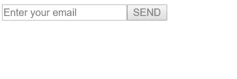
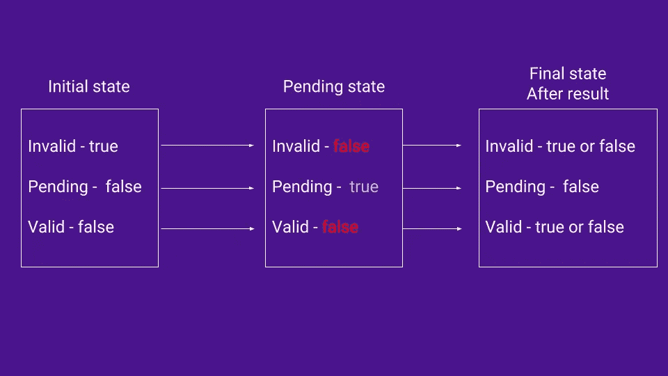

# 角度形式的有效和无效

> 原文：<https://itnext.io/valid-and-invalid-in-angular-forms-61cfa3f2a0cd?source=collection_archive---------1----------------------->


在 Angular 中，验证表单最常见的方法之一是禁用提交按钮。这是一种很好的方式(和有用的消息一起)来告诉用户表单中有些地方不对劲。

因此，要禁用按钮，我们使用这样的东西

```
...
<button type="submit" [disabled]="form.invalid">SEND</button>
...
<button type="submit" [disabled]="!form.valid">SEND</button>
```

所以上面有两种最常见的方法可以在表单无效时禁用按钮。你有没有想过`form.invalid` 和`!form.valid`的区别？虽然在逻辑上它们必须是相同的，但实际上它们之间有细微的差别。为了演示这一点，我们将创建一个简单的表单，其中一个输入检查给定的电子邮件是否存在于数据库中。为此，我们将使用反应式表单和自定义异步验证器。

```
<form [formGroup]="form"> <input placeholder="Enter your email" formControlName="email"/> <button type="submit" [disabled]="form.invalid">SEND</button> <div *ngIf="form.get('email').pending">
      
   </div>
</form>
```

所以标记非常简单，我们有一个表单，里面有一个输入。我们还有一个提交表单的按钮，该按钮被`form.invalid`禁用。

我们也有一个 div 来显示一个简单的加载微调，而我们将检查给定的电子邮件在数据库中的存在。

在一个. ts 文件中，我们使用 FormBuilder 创建了我们的表单。我们应用了 Angular 的`required` 和`email` 验证器以及一个定制的异步验证器来检查邮件。

```
form: FormGroup;constructor(private fb: FormBuilder) {}ngOnInit() {
    this.form = this.fb.group({
      email: ['', [Validators.required, Validators.email], 
              this.checkValidEmail]
    })
  }
```

这里的`this.checkValidEmail`是我们的自定义验证器，它只是一个函数。在实际应用中，你可能需要一个服务，向数据库发送请求，检查电子邮件是否存在并返回结果。为了简单起见，我们将使用`setTimeout()`模拟对后端的调用。重要的是调用后端(或者用`setTimeout()`模拟它)是一个异步操作，所以我们不能使用标准的验证器或者定制的同步验证器。

因此，我们的`checkValidEmail`函数会将输入字段中的给定电子邮件与静态电子邮件进行比较。如果它们匹配，这意味着电子邮件正忙，我们需要通知用户选择另一个电子邮件，我们还需要禁用按钮。

```
checkValidEmail(control: AbstractControl) {
    return new Promise((resolve, reject) => {
      setTimeout(() => {
        if (control.value === 'super@secret.com') {
            resolve({ emailIsTaken: true })
        } else {resolve(null)}
      }, 2000)
    })
}
```

所以现在我们准备好了。让我们来看看浏览器



因此，最初该按钮是禁用的，但当我们插入电子邮件时，该按钮变为启用，2 秒钟后(时间设置在`setTimeout()`)该按钮再次变为禁用，因为该电子邮件确实在“数据库”中。

启用短时按钮的原因是除了`valid` 和`invalid`之外还有一个状态。那就是`pending` 州。最初`pending` 被设置为**假**，但是当我们使用异步验证器时，挂起变为**真**，`valid` 和`invalid` 变为**假**。



当我们的异步验证器开始工作时，状态变为`pending` 并且`invalid`变为**假**，这意味着表单是有效的。这就是为什么当使用带有异步验证器的`form.invalid`时，我们会得到这种行为。想象一下，这个操作可能需要 3 秒甚至更多的时间，当它挂起时，按钮将被启用，用户可以单击并提交表单。

当我们用`!form.valid`代替`form.invalid`时，情况就不同了。因为在未决状态下`valid` 变为**假**，按钮将被禁用，直到我们得到结果，根据该结果，我们启用或不启用按钮。

所以希望现在能清楚为什么使用`[disabled]=”!form.valid”`比`[disabled]=”form.invalid”`更安全。

感谢阅读。完整的代码可从[这里](https://stackblitz.com/edit/angular-p4bz6e)获得