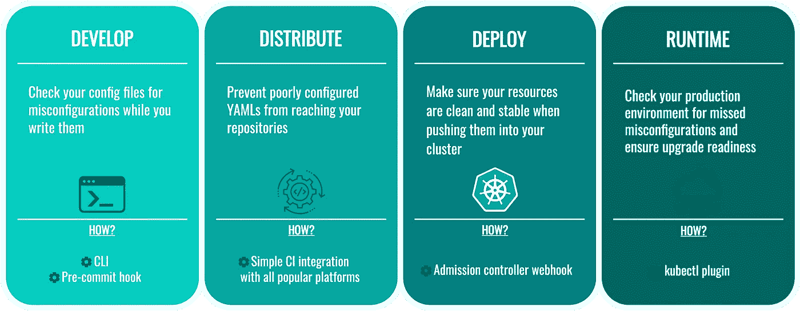

# 用 Datree 验证交叉平面组合

> 原文：<https://itnext.io/validate-crossplane-compositions-with-datree-f52061cdb1b7?source=collection_archive---------2----------------------->

undraw.co

如果你已经熟悉 Crossplane，你会从这个博客中受益匪浅。查看我的另一个博客[基础设施代码:下一个大转变在这里](/infrastructure-as-code-the-next-big-shift-is-here-9215f0bda7ce?source=your_stories_page-------------------------------------)和[交叉平面文档](https://crossplane.io/)了解更多。

对于使用这个[自定进度的杀手科达场景](https://killercoda.com/decoder/course/crossplane/crossplane-datree-validation)的实际演练。如果你喜欢视觉内容，看看这个配套视频。

## 验证什么以及为什么要验证

软件中的测试和验证至关重要，这是一个很好的总结:

> “我不愿意相信。我想知道。”
> 
> 卡尔·萨甘

我们希望**确信**我们创建和维护的软件会像预期的那样工作，没有 bug 和错误。这对于支持 Crossplane 组合等基础设施的软件来说甚至更为关键。当其他一切都取决于这一层的正确性时，赌注就高了！

## YAML 是一种数据序列化语言

作文是在 YAML 写的。不在 Go、C#或任何其他**编程**语言中。虽然这很好地以声明的方式表达了我们需要系统做什么，但是如果没有高级语言工具，很难创建和维护它。

最终目标是生成组合，并将 YAML 作为数据序列化媒介，类似于 JSON with REST API。今天已经有一些机制可以做到这一点，请查看 Chris 的这个库或 [Crossplane cdk8](https://github.com/crossplane-contrib/crossplane-cdk8s) 。

> 在我关于创建 Kubernetes YAML 文件的博客中了解更多关于 cdk8s 的信息。

## 验证级别

有 3 个级别的测试/验证，以下是 Datree docs 的解释和我的评论。

[https://hub.datree.io/](https://hub.datree.io/)

1.  **开发测试循环**有助于尽早发现错误，并且必须非常快，如果它与 ide 或其他开发工具集成，这是额外的好处。
2.  CI/CD 管道在每次登记时执行相同的验证
3.  **运行时**在允许 YAML 进入 kube-api 之前，使用 Kubernetes 准入控制器 webhook 根据一组策略对其进行验证。

## 验证的类型

说到作文，我们对两种类型的验证感兴趣。

*   根据 XRD 进行模式验证
*   自定义策略验证

Custom policies validation is testing if a composition complies with an arbitrary set of custom rules such as naming convention, required fields otherwise not specified in the schema, or cascading dependencies.

> For schema validation and testing composition YAML file correctness against build-in rules, you can use a [VS 代码插件](https://marketplace.visualstudio.com/items?itemName=Upboundio.upbound)(也可以作为 LSP 与 vim/nvim 一起工作)。

# 演示设置

互动演示可在[https://killer corda . com/decoder/course/cross plane/cross plane-datree-validation](https://killercoda.com/decoder/course/crossplane/crossplane-datree-validation)获得，这里有几个亮点，以免重复整个设置。

“Datree”中的自定义策略表示为基于 JSON 模式的文档。因为这是 JSON 模式，所以它在 YAML 自动可用。我们将与 YAML 政策合作。

下面是您将在交互式场景中使用的自定义策略。

## 结论

DevOps 移动和更具体的“左移”，将基础设施置于开发团队的责任之下，但也将软件实践带入了 Ops 领域。

自动化测试和验证是一项非常重要的实践，深深植根于软件开发世界，平台团队或 DevOps 实践者正在适应这一点。