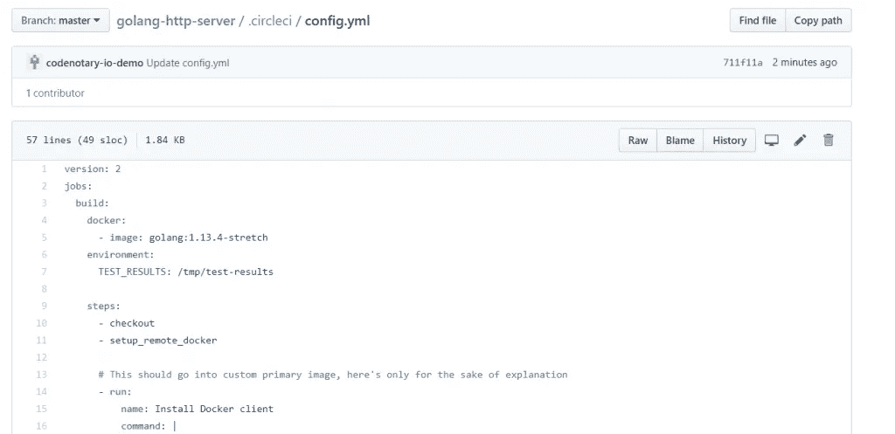
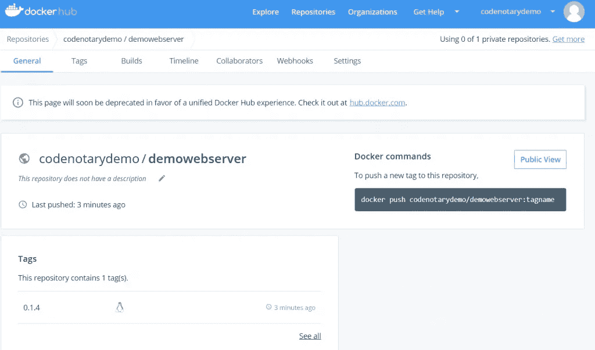
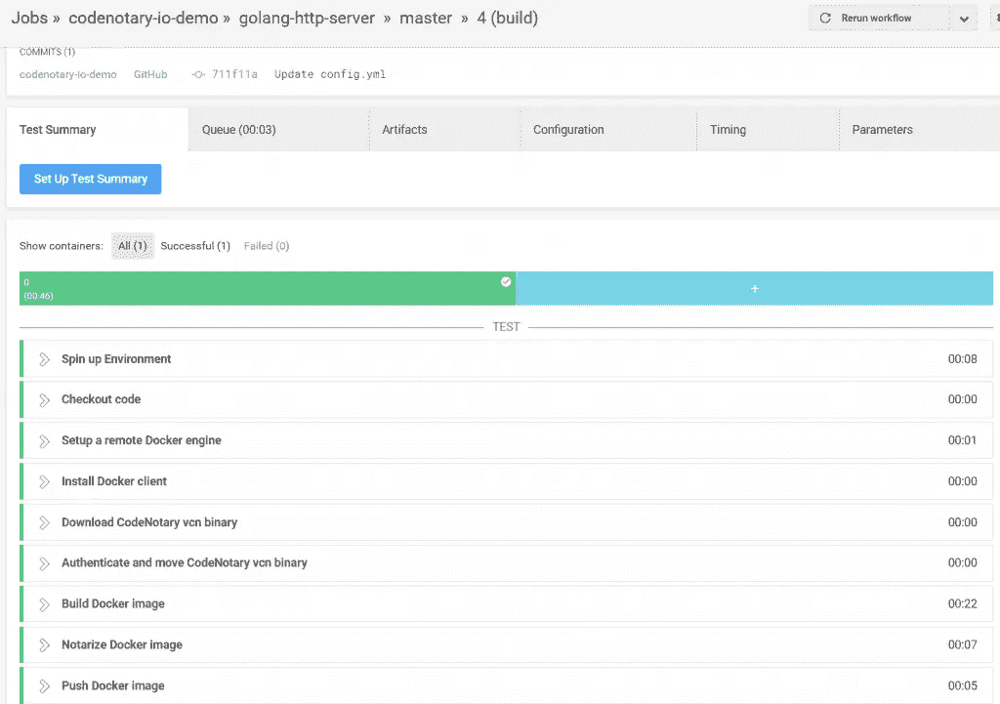

# 使用 CircleCI 验证构建

> 原文：<https://itnext.io/validated-builds-using-circleci-28eaeb15987d?source=collection_archive---------4----------------------->

由于 CircleCI 是市场上最受欢迎的 CI/CD 工具之一，我们最近收到大量请求并不奇怪。用户在我们的博客帖子中注意到了[詹金斯](https://www.codenotary.io/securing-your-azure-devops-ecosystem-jenkins-and-kubernetes-aks-using-codenotary-part-1/)的整合，我们想知道 CircleCI 会是什么样子。

我们听取了意见，CircleCI 集成产生了可以被任何地方的任何人验证和认证的有效构建。

我们的博客文章涵盖了生成经验证的构建所需的所有步骤:

*   以一个现有的 Git 存储库为例
*   创建 Circle CI 配置
*   定义 Circle CI 构建步骤
*   下载最新的 code 公证人 vcn 命令行
*   验证下载的二进制文件(安全比遗憾好)
*   建立 docker 形象
*   公证包括 Circle CI 构建号的 docker 图像
*   将 docker 映像部署到 Dockerhub
*   验证上传的 docker 图像

# 设置

# 创建或派生存储库

让我们从 git 存储库的设置开始，它包含一个简单静态网站项目的分支。【https://github.com/katacoda/golang-http-server 

对于我们的例子，repo 包含一个有效的 Dockerfile 来构建容器映像是很重要的。

在我们分叉该项目后，我们需要添加 Circle CI 构建配置。

# 创建循环 CI 配置

为此，只需在。分叉存储库中的 circleci 文件夹。



# 定义 Circle CI 步骤以创建经验证的构建

该 config.yml 文件的内容包含了构建所需的所有步骤:

常规构建设置

```
version: 2
jobs:
  build:
    docker:
      - image: golang:1.13.4-stretch
    environment:
      TEST_RESULTS: /tmp/test-results
    steps:
      - checkout
      - setup_remote_docker
```

## 准备远程 docker 客户端

```
# This should go into custom primary image, here's only for the sake of explanation
      - run:
          name: Install Docker client
          command: |
            set -x
            VER="17.03.0-ce"
            curl -L -o /tmp/docker-$VER.tgz https://get.docker.com/builds/Linux/x86_64/docker-$VER.tgz
            tar -xz -C /tmp -f /tmp/docker-$VER.tgz
            mv /tmp/docker/* /usr/bin
```

下载最新的 code 公证人 vcn 命令行

```
- run:
          name: Download CodeNotary vcn binary
          command: |
            set -x
            VER="v0.7.3"
            curl -L -o /tmp/vcn https://github.com/vchain-us/vcn/releases/download/v0.7.3/vcn-$VER-linux-amd64
            CHECKSUM=$(sha256sum /tmp/vcn | cut -d " " -f 1)
            curl -s https://api.codenotary.io/authenticate/$CHECKSUM?org=vchain.us | grep -q :0
```

该代码片段的重要部分是下载最新版本(请确保相应地更改版本)，独立计算文件校验和以进行验证。[code 公证人](https://www.codenotary.io)验证确保下载的二进制文件确实经过了 vcn cli 的制作者 [vchain.us](https://www.vchain.us) 的公证:

```
curl -s https://api.codenotary.io/authenticate/$CHECKSUM?org=vchain.us | grep -q :0
```

当校验和可以被验证并且已经被给定的组织公证时，退出代码总是 0(成功)。

**这样，我们可以确认我们不会使用伪造或篡改的 vcn！**如果无法验证，则管道断开。

## 将 vcn 二进制文件移动到路径中，并使其可执行

```
- run:
          name: move CodeNotary vcn binary
          command: |
            chmod +x /tmp/vcn
            mv /tmp/vcn /usr/local/bin/vcn
```

## 建立 docker 形象

```
- run:
          name: Build Docker image
          command: |
            TAG="0.1.${CIRCLE_BUILD_NUM}"
            docker build -t codenotarydemo/demowebserver:$TAG .
```

## 公证包括 Circle CI 构建号的 docker 图像

```
- run:
          name: Notarize Docker image
          command: |
            TAG="0.1.${CIRCLE_BUILD_NUM}"
            VCN_USER=${codenotary_user} VCN_PASSWORD=${codenotary_pass} vcn login
            VCN_NOTARIZATION_PASSWORD=${codenotary_pass} vcn n --attr CircleCI=$TAG docker://codenotarydemo/demowebserver:$TAG
```

这项工作确保 docker 图像在上传 Dockerhub 之前经过公证，所以没有人可以干预。为了增加安全性，我们还在公证过程中添加了 CircleCI 内部版本号。

请注意，我们在该步骤中使用了不同的环境变量，这些变量需要在 Circle CI 中定义。


## 将 docker 映像部署到 Dockerhub

```
- run:
          name: Push Docker image
          command: |
            TAG="0.1.${CIRCLE_BUILD_NUM}"
            docker login -u ${docker_user} -p ${docker_pass}
            docker push codenotarydemo/demowebserver:$TAG
```

管道的最后一步是确保使用正确的标签将新构建的 docker 容器映像上传到我们的 DockerHub.com 存储库中。请确保也为 DockerHub 设置 Circle CI 环境变量。



# 结果

让我们将所有部分放在一起，形成一个完整的 Circle CI 构建流程。circleci/config.yml)

```
version: 2
jobs:
  build:
    docker:
      - image: golang:1.13.4-stretch
    environment:
      TEST_RESULTS: /tmp/test-results

    steps:
      - checkout
      - setup_remote_docker

      # This should go into custom primary image, here's only for the sake of explanation
      - run:
          name: Install Docker client
          command: |
            set -x
            VER="17.03.0-ce"
            curl -L -o /tmp/docker-$VER.tgz https://get.docker.com/builds/Linux/x86_64/docker-$VER.tgz
            tar -xz -C /tmp -f /tmp/docker-$VER.tgz
            mv /tmp/docker/* /usr/bin

      - run:
          name: Download CodeNotary vcn binary
          command: |
            set -x
            VER="v0.7.3"
            curl -L -o /tmp/vcn https://github.com/vchain-us/vcn/releases/download/v0.7.3/vcn-$VER-linux-amd64
            CHECKSUM=$(sha256sum /tmp/vcn | cut -d " " -f 1)
            curl -s https://api.codenotary.io/authenticate/$CHECKSUM?org=vchain.us | grep -q :0

      - run:
          name: Authenticate and move CodeNotary vcn binary
          command: |
            chmod +x /tmp/vcn
            mv /tmp/vcn /usr/local/bin/vcn

      - run:
          name: Build Docker image
          command: |
            TAG="0.1.${CIRCLE_BUILD_NUM}"
            docker build -t codenotarydemo/demowebserver:$TAG .

      - run:
          name: Notarize Docker image
          command: |
            TAG="0.1.${CIRCLE_BUILD_NUM}"
            VCN_USER=${codenotary_user} VCN_PASSWORD=${codenotary_pass} vcn login
            VCN_NOTARIZATION_PASSWORD=${codenotary_pass} vcn n --attr CircleCI=$TAG docker://codenotarydemo/demowebserver:$TAG 

      - run:
          name: Push Docker image
          command: |
            TAG="0.1.${CIRCLE_BUILD_NUM}"
            docker login -u ${docker_user} -p ${docker_pass}
            docker push codenotarydemo/demowebserver:$TAG
```

当一切顺利时，您应该看到构建过程从您的 config.yml 更改开始，一切都在运行。



# 验证上传的 docker 图像

因为这是第一次运行，所以让我们确保图像的公证进行得很顺利，并且世界上的任何人都能够验证构建。

因此，让我们将上传的映像拉至一个完全不同的系统，并使用 [vcn 来验证所有信息](https://github.com/vchain-us/vcn)。

**docker pull codenotary demo/demowebserver:0 . 1 . 4****vcn 认证 docker://codenotary demo/demowebserver:0 . 1 . 4**


所有检查都是成功的，我们肯定不会发布任何软件、容器映像或其他无法验证的工件。

如果您对安全性、DevSecOps 和构建验证很认真，那么就没有借口了，因为它是免费的:

*原载于 2019 年 11 月 8 日*[*https://www . code 公证人. io*](https://www.codenotary.io/validated-builds-using-circleci-ci-cd/) *。*