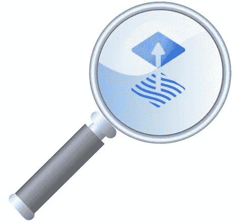

# 使用 hrval 验证 CI 中的 HelmReleases

> 原文：<https://itnext.io/validating-helmreleases-in-ci-using-hrval-7a785b1c1b21?source=collection_archive---------1----------------------->



# 问题陈述

这项工作的问题陈述如下:

作为一名工程师，我希望在我的头盔被部署之前对它们有信心。
**这样**部署在 Kubernetes 更有可能成功而不是失败。

# 当前的问题

如前所述，在 Mettle，我们在将工作负载部署到 Kubernetes 集群时严格遵循 GitOps 原则。然而，在过去，我们已经被部署无效的`HelmRelease`清单所困扰，导致`tiller`吞下错误而没有浮出水面。

迁移到 Helm 3 使得这些错误在描述 HelmRelease 本身时出现(见下文)

```
Status:
  Conditions:
    Last Transition Time:  2020-04-15T16:40:49Z
    Last Update Time:      2020-04-15T16:40:49Z
    Message:               Chart fetch failed for Helm release 'redacted' in 'redacted'.
    Reason:                ChartFetchFailed
    Status:                False
    Type:                  ChartFetched
  Observed Generation:     1
  Phase:                   ChartFetchFailed
Events:
  Type     Reason             Age   From           Message
  ----     ------             ----  ----           -------
  Warning  FailedReleaseSync  58s   helm-operator  synchronization of release 'redacted in namespace 'redacted' failed: failed to prepare chart for release: chart unavailable: chart "redacted" version "2.0.34" not found in [https://redacted-charts.storage.googleapis.com](https://redacted-charts.storage.googleapis.com) repository
```

# 理想的解决方案

理想的解决方案是在将 HelmRelease 部署到一个或多个集群之前，尽可能彻底地测试 HelmRelease 的所有组件。这些组件包括:

*   舵图本身(带有默认值)
*   具有来自舵释放值的舵图表也适用

# 舵图测试

我们的自定义舵图表已经有严格的林挺运行对他们作为 CI 的一部分。我们使用以下工具:

*   [https://github.com/helm/chart-testing](https://github.com/helm/chart-testing)
*   [https://github.com/instrumenta/kubeval](https://github.com/instrumenta/kubeval)

## 舵/制图-测试

我们在林挺的第一份工作是将我们的舵轮图与上游的舵轮图测试码头集装箱进行对比。该工具执行以下操作:

> `ct`是测试舵图的工具。它旨在用于林挺和测试拉请求。它会自动检测针对目标分支更改的图表。

请参见下面的 CircleCI 配置:

```
lint:
    docker:
      - image: quay.io/helmpack/chart-testing:v3.0.0-rc.1
    steps:
      - checkout
      - run:
          name: lint
          command: ct lint --all --config test/ct.yaml
```

## 库贝瓦尔

我们对所有掌舵图运行`kubeval`，通过循环每个掌舵图，运行`helm template`，然后对输出执行严格的`kubeval`林挺(见下文):

```
#! /usr/bin/env bash

set -euo pipefail

mkdir -p /tmp/mettle

for chart in mettle/*; do

  printf "\nChecking %s\n" "${chart#*/}"

  helm template ${chart}  > /tmp/${chart}.yaml

  export KUBEVAL_SCHEMA_LOCATION=file:///usr/local/kubeval/schemas

  kubeval --kubernetes-version 1.17.0 --strict --force-color --ignore-missing-schemas /tmp/${chart}.yaml

done
```

因此，我们已经使用上游的`helm/chart-testing`容器和`kubeval`本身对我们的自定义舵图进行了 linted 和静态分析，但是没有任何东西可以将我们的 HelmRelease 值与我们的默认值混合，这将是圣杯！

# 拼图中缺失的部分

在网上做了一些挖掘之后，我的好朋友斯特凡·普罗丹已经创造了`hrval`(【https://github.com/stefanprodan/hrval-action】)。

该操作通过以下方式工作:

1.  下载舵图。
2.  使用默认值和给定 HelmRelease 中指定的值运行`helm template`。
3.  对渲染输出运行严格的`kubeval`。

这听起来很完美，是我们理想解决方案中缺失的部分。

# 添加到我们的工具包容器中

在 Mettle，我们已经将 CircleCI 用于我们所有的 Kubernetes 林挺和静态分析，因此我们使用 Stefan 的 docker 文件作为参考，将他的脚本移植到我们的[工具包](https://quay.io/repository/mettle/kubernetes-toolkit.)容器中。我们的 docker 文件现在包括以下附加部分:

```
# Install hrval scripts
COPY src/hrval.sh /usr/local/bin/hrval.sh
COPY src/hrval-all.sh /usr/local/bin/hrval
RUN chmod +x /usr/local/bin/hrval.sh
RUN chmod +x /usr/local/bin/hrval
```

# 将它连接到我们的 CI 管道

如果你读过我以前的博客文章，你会知道在 Mettle 我们大量利用`[Kustomize](https://github.com/kubernetes-sigs/kustomize)`来尽量保持我们的仓库干燥(不要重复你自己)。

因此，我们编写了一个 bash 脚本，它将针对给定环境的`kustomize build`的输出运行`hrval`(见下文)。

```
#! /usr/bin/env bashENV=$1
IGNORE_VALUES=false
KUBE_VERSION=1.17.0
HELM_VERSION=v2set -euprintf "Running hrval against all %s HelmReleases\n" "${ENV}"mkdir -p /tmp/"${ENV}"
kustomize build kustomize/"${ENV}" -o /tmp/"${ENV}"
hrval /tmp/"${ENV}"/ ${IGNORE_VALUES} ${KUBE_VERSION} ${HELM_VERSION}
```

然后在我们的 CircleCI 配置中，我们简单地在每个环境中运行这个脚本:

```
defaults: &defaults
  working_directory: ~/project
  docker:
    - image: quay.io/mettle/kubernetes-toolkit:1.17.2hrval-for-sbx:
  <<: *defaults
  steps:
    - checkout
    - run:
        name: kubeval helmreleases for sbx
        command: bash -c "bin/hrval-for-environment sbx"
```

注意:我们对我们的定制舵图和上游舵图运行`hrval`,以确保我们的`HelmRelease`清单尽可能符合要求。

# 摘要

将`hrval`添加到我们的工具包和 CI 渠道中，从`kubeval`的角度来看，可能为我们提供了最完整的 CI 工作流程，它符合我们理想工作流程的所有要点。设置完成后，它已经发现了两个问题:

1.  我们引用了一个不存在的舵图版本。
2.  我们在`HelmRelease`中传递了无效的值

我们希望这能让我们在未来避免类似的问题。🤞

**作为参考，`hrval`大约需要 60 到 90 秒的时间来识别每个环境中最多 100 个`HelmRelease`清单。