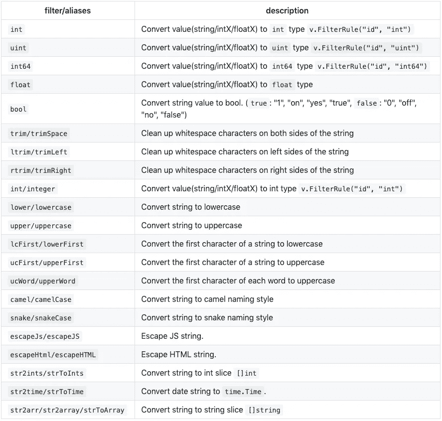
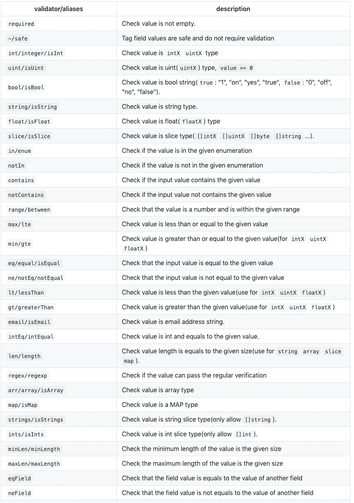

# 在 GO 语言中验证结构、映射、表单数据

> 原文：<https://itnext.io/validating-struct-map-form-in-go-language-1f819b8596c7?source=collection_archive---------0----------------------->


我使用 gookit/validate，这是一个通用的数据验证和过滤库。

# 验证结构

有了结构的 TAG 标签，你可以快速验证一个结构数据。

**并提供扩展功能:**

该结构可以实现三种接口方法，这便于进行一些定制:

*   `ConfigValidation(v *Validation)`将在验证器实例创建后被调用
*   `Messages() map[string]string`可以自定义验证器错误信息
*   `Translates() map[string]string`可以自定义字段翻译

```
package mainimport "fmt"
import "time"
import "github.com/gookit/validate"// UserForm struct
type UserForm struct {
	Name     string    `validate:"required|minLen:7"`
	Email    string    `validate:"email"`
	Age      int       `validate:"required|int|min:1|max:99"`
	CreateAt int       `validate:"min:1"`
	Safe     int       `validate:"-"`
	UpdateAt time.Time `validate:"required"`
	Code     string    `validate:"customValidator"`
}// CustomValidator custom validator in the source struct.
func (f UserForm) CustomValidator(val string) bool {
	return len(val) == 4
}// Messages you can custom validator error messages. 
func (f UserForm) Messages() map[string]string {
	return validate.MS{
		"required": "oh! the {field} is required",
		"Name.required": "message for special field",
	}
}// Translates you can custom field translates. 
func (f UserForm) Translates() map[string]string {
	return validate.MS{
		"Name": "User Name",
		"Email": "User Email",
	}
}func main() {
	u := &UserForm{
		Name: "inhere",
	}

	v := validate.Struct(u)
	// v := validate.New(u) if v.Validate() { // validate ok
		// do something ...
	} else {
		fmt.Println(v.Errors) // all error messages
		fmt.Println(v.Errors.One()) // returns a random error message text
		fmt.Println(v.Errors.Field("Name")) // returns error messages of the field 
	}
}
```

# 验证地图

您也可以直接验证地图数据。

```
package main

import "fmt"
import "time"
import "github.com/gookit/validate"

func main()  {
	m := map[string]interface{}{
		"name":  "inhere",
		"age":   100,
		"oldSt": 1,
		"newSt": 2,
		"email": "some@email.com",
	}

	v := validate.Map(m)
	// v := validate.New(m)
	v.AddRule("name", "required")
	v.AddRule("name", "minLen", 7)
	v.AddRule("age", "max", 99)
	v.AddRule("age", "min", 1)
	v.AddRule("email", "email")

	// can also
	v.StringRule("age", "required|int|min:1|max:99")
	v.StringRule("name", "required|minLen:7")

	// v.WithScenes(map[string]string{
	//	 "create": []string{"name", "email"},
	//	 "update": []string{"name"},
	// })

	if v.Validate() { // validate ok
		safeData := v.SafeData()
		// do something ...
	} else {
		fmt.Println(v.Errors) // all error messages
		fmt.Println(v.Errors.One()) // returns a random error message text
	}
}
```

# 验证请求

如果是 HTTP 请求，可以快速验证数据，通过验证。然后将安全数据绑定到该结构。

```
package main

import (
	"fmt"
	"net/http"
	"time"

	"github.com/gookit/validate"
)

// UserForm struct
type UserForm struct {
	Name     string
	Email    string
	Age      int
	CreateAt int
	Safe     int
	UpdateAt time.Time
	Code     string
}

func main()  {
	handler := http.HandlerFunc(func(w http.ResponseWriter, r *http.Request) {
		data, err := validate.FromRequest(r)
		if err != nil {
			panic(err)
		}

		v := data.Create()
		// setting rules
		v.FilterRule("age", "int") // convert value to int

		v.AddRule("name", "required")
		v.AddRule("name", "minLen", 7)
		v.AddRule("age", "max", 99)
		v.FieldRule("code", `required|regex:\d{4,6}`)

		if v.Validate() { // validate ok
			// safeData := v.SafeData()
			userForm := &UserForm{}
			v.BindSafeData(userForm)

			// do something ...
			fmt.Println(userForm.Name)
		} else {
			fmt.Println(v.Errors) // all error messages
			fmt.Println(v.Errors.One()) // returns a random error message text
		}
	})

	http.ListenAndServe(":8090", handler)
}
```

# 全局选项

它还提供了一些选项，你可以自定义一些东西

```
// GlobalOption settings for validate
type GlobalOption struct {
	// FilterTag name in the struct tags.
	FilterTag string
	// ValidateTag in the struct tags.
	ValidateTag string
	// StopOnError If true: An error occurs, it will cease to continue to verify
	StopOnError bool
	// SkipOnEmpty Skip check on field not exist or value is empty
	SkipOnEmpty bool
}
```

用法:

```
// change global opts
validate.Config(func(opt *validate.GlobalOption) {
	opt.StopOnError = false
	opt.SkipOnEmpty = false
})
```

# 添加自定义验证程序

`validate`支持添加自定义验证器，支持添加`global validator`和`temporary validator`。

*   全局验证器是全局有效的，可以在任何地方使用
*   临时验证器添加到当前验证实例中，只有当前验证可用

## 添加全局验证器

您可以一次添加一个或多个自定义验证器。

```
validate.AddValidator("myCheck0", func(val interface{}) bool {
	// do validate val ...
	return true
})
validate.AddValidators(M{
	"myCheck1": func(val interface{}) bool {
		// do validate val ...
		return true
	},
})
```

## 添加临时验证程序

同样，您可以一次添加一个或多个定制验证器。

```
v := validate.Struct(u)
v.AddValidator("myFunc3", func(val interface{}) bool {
	// do validate val ...
	return true
})
v.AddValidators(M{
	"myFunc4": func(val interface{}) bool {
		// do validate val ...
		return true
	},
})
```

# 快速方法

快速创建`Validation`实例。

*   `New(data interface{}, scene ...string) *Validation`
*   `Request(r *http.Request) *Validation`
*   `JSON(s string, scene ...string) *Validation`
*   `Struct(s interface{}, scene ...string) *Validation`
*   `Map(m map[string]interface{}, scene ...string) *Validation`

快速创建`DataFace`实例。

*   `FromMap(m map[string]interface{}) *MapData`
*   `FromStruct(s interface{}) (*StructData, error)`
*   `FromJSON(s string) (*MapData, error)`
*   `FromJSONBytes(bs []byte) (*MapData, error)`
*   `FromURLValues(values url.Values) *FormData`
*   `FromRequest(r *http.Request, maxMemoryLimit ...int64) (DataFace, error)`

> *通过* `*DataFace*`创建 `*Validation*`

```
*d := FromMap(map[string]interface{}{"key": "val"})
v := d.Validation()*
```

# *关于 gookit **验证***

*go package[**gookit/validate**](https://github.com/gookit/validate)进行数据验证和过滤。支持映射、结构、表单数据。*

*   *支持验证映射、结构、请求(表单、JSON、url。值，上传的文件)数据*
*   *支持在验证前过滤/净化数据*
*   *支持添加自定义过滤器/验证器功能*
*   *支持场景设置，验证不同场景下的不同字段*
*   *支持自定义错误信息，字段翻译。*
*   *可定制的 i18n 感知错误消息，内置于`en`、`zh-CN`*
*   *内置通用数据类型过滤器/转换器。参见[内置过滤器](https://github.com/gookit/validate#built-in-filters)*
*   *许多常用的验证器已经内置(> 60)，参见[内置验证器](https://github.com/gookit/validate#built-in-validators)*

> **激发了项目*[*albrow/forms*](https://github.com/albrow/forms)*和*[*asaskevich/go validator*](https://github.com/asaskevich/govalidator)*。非常感谢**

# *去吧医生*

*   *[GOP kg 的 godoc](https://godoc.org/gopkg.in/gookit/validate.v1)*
*   *[github 的 godoc](https://godoc.org/github.com/gookit/validate)*

*注意:*

*   *`intX` is 包含:int，int8，int16，int32，int64*
*   *`uintX` is 包含:uint、uint8、uint16、uint32、uint64*
*   *`floatX` is 包含:float32，float64*

# *内置过滤器*

> **滤镜由:*[*gookit/滤镜*](https://github.com/gookit/filter)*

**

# *内置验证器*

**

*更多验证者请[https://github.com/gookit/validate#built-in-validators](https://github.com/gookit/validate#built-in-validators)*

# *Gookit 软件包*

*   *[gookit/ini](https://github.com/gookit/ini) 进入配置管理，使用 ini 文件*
*   *[gookit/rux](https://github.com/gookit/rux) 简单快速的 golang HTTP 请求路由器*
*   *[gookit/gcli](https://github.com/gookit/gcli) 构建 cli 应用程序、工具库、运行 CLI 命令*
*   *[gookit/event](https://github.com/gookit/event) 轻量级事件管理器和调度器通过 Go 实现*
*   *[gookit/cache](https://github.com/gookit/cache)golang 的通用缓存使用和缓存管理器。支持文件，内存，Redis，Memcached。*
*   *[gookit/config](https://github.com/gookit/config) Go 配置管理。支持 JSON，YAML，TOML，INI，HCL，ENV 和标志*
*   *一个命令行颜色库，支持真彩色、通用 API 方法和窗口支持*
*   *[gookit/filter](https://github.com/gookit/filter) 提供 golang 数据的过滤、净化和转换*
*   *[gookit/validate](https://github.com/gookit/validate) 用于数据验证和过滤。支持映射、结构、表单数据*
*   *[gookit/goutil](https://github.com/gookit/goutil) 一些实用程序:字符串、数组/切片、映射、格式、cli、env、文件系统、测试等等*
*   *更多请看 [@gookit](https://github.com/gookit)*

# *开源代码库*

*[](https://github.com/gookit/validate) [## Google kit/验证

### 用于数据验证和过滤的 Go 包。支持映射、结构、表单数据…

github.com](https://github.com/gookit/validate) 

# 许可证

[麻省理工](https://github.com/gookit/validate/blob/master/LICENSE)*