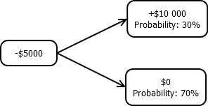
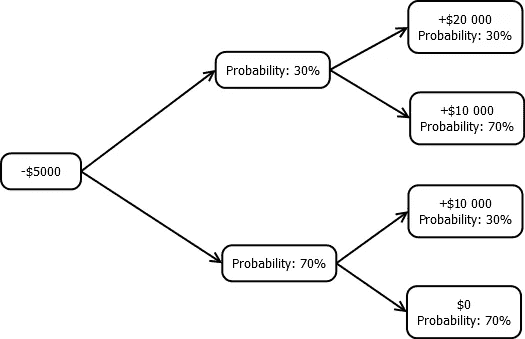

# 重视软件开发

> 原文：<https://itnext.io/valuing-software-development-21db2a84b62b?source=collection_archive---------1----------------------->

让我们面对现实吧。我们经常很难估计修复一个 bug、实现一个特性或完成一个项目需要多长时间。如果一个项目晚了，它通常会大大落后于时间表。有时，我们花在自动化工作上的时间比我们手动完成的时间还要多。或者我们过度设计了一个无关紧要的功能。

然后是另一面。通常给开发人员的时间太少，无法正常工作，也没有足够的资源来升级遗留系统。有时候，获得开发无意义新功能的许可比提高代码库的质量更容易。有时候管理层不理解开发人员的观点，而开发人员也无法传达他们的观点。

我最近一直在思考，我是否可以使用财务方面的一些估价方法，并使用它们来更好地估计一个软件决策的成本，至少在工作时间方面。我意识到这个问题与投资分析非常接近，尤其是二项式模型对于解决这类问题非常有用。接下来，我将快速解释该模型，它是如何在金融中使用的，然后我们讨论如何将该模型应用到软件开发中。

## 金融中的二项式模型

二项式模型只是一个可能结果的树，其中每个结果以给定的概率出现。它常用于期权定价和投资分析。传统上，该模型每层仅包含两个结果(因此命名为二项式)，但如果需要，每种情况下可以有更多结果。此外，可能的结果通常也有许多层次。我们举个例子。

比方说，我们可以为一个开发人员支付 5 000 美元，他们将为我们创建一个应用程序，该应用程序明年产生+10000 美元利润的概率为 30%，而它不会产生利润的概率为 70%，因为没有人会订阅该应用程序。下面是这个问题的一个例子:

所以，我们应该雇用开发人员并创建应用程序，还是跳过这个机会？你现在可以花一点时间尝试自己解决这个问题。

下面是答案:该项目的预期价值为+$3 000 ($10 000 * 0.30 + 0 * 0.70)。如果我们参与这项投资，我们将不得不支付 5 000 美元，但我们预计只能获得 3 000 美元。因此，我们损失了 2 000 美元，所以我们不应该接受这笔交易。我们在赔钱。

当然，你不需要一个模型来计算一个简单的期望值。但是，您可以通过添加更多层来增加模型的复杂性。例如，假设在第一年后，如果申请成功，有 30%的可能性我们将获得额外的 10，0 00 美元，总共+20，0 00 美元的利润，但有 70%的可能性我们不会比我们已经赚的更多，我们总共获利+10，0 00 美元。类似地，如果应用程序在第一年后不成功，仍然有 30%的可能性会产生一些东西，我们将获得+$10 000。然而，有 70%的可能性它卖不出去，我们将从这个项目中总共获得 0 美元。

那么，我们现在应该接受这笔交易吗？同样，你可以花时间尝试自己解决问题。

答案现在实际上是肯定的。我们通过从右到左计算每个节点的期望值来解决这个问题。如果我们运气好，第一年后我们预计将获得+13000 美元(20000 * 0.30+10000 * 0.70 美元)，如果我们运气不好，我们预计将获得+3000 美元(与我们之前的例子相同)。该项目的总预期利润为+$6 000 ($13 000 * 0.30 + $3 000 * 0.70)。我们总共将净赚 1 000 多美元，现在我们开始赚钱了。我们应该加入交易。

现在我们知道了二项式模型的工作原理以及它如何用于投资分析，那么我们如何在软件开发中使用它呢？

## 软件开发中的二项式模型

在一些情况下，二项式模型有助于管理层或其他利益相关者做出更好的估计。例如，当我们估计开发一个功能、修复一个 bug 或发布一个软件需要多长时间时，我们倾向于说他们将花费最可能的时间。这通常与他们实际预期花费的时间不同。一个小错误很可能需要很短的时间来修复，但也有可能需要两周时间，因为有一些意想不到的副作用。我们通常不会考虑最糟糕的情况，这种情况发生的几率很小，但一旦发生，影响会很大。

为了说明这一点，假设修复一个 bug 只需要 2 个小时，有 70%的可能性，但是如果问题比我们预期的更复杂，就需要 80 个小时(两个完整的工作周)。这个事件的概率是 30%。下面是一个例子:

最有可能的结果是只需要 2 个小时，但预期的时间实际上是 25 个小时(80 小时* 0.30+2 小时* 0.70)。你敢说你会在 2 小时内完成吗？希望不会，你应该说至少需要半个星期，或者如果你想安全的话甚至更长时间。

类似于我们雇用开发人员的例子，您也可以通过添加更多节点来使这变得更复杂。例如，您也许可以反映部署中可能出现的其他问题。如果修复是简单的，可能不需要太多的审查，但是如果是复杂的，代码审查可能需要更多的时间，或者仍然可以相对快速地完成。那么，如果修复很复杂，解决方案仍然会破坏生产中的某些东西的可能性就会增加，但这不是必须的。您可以将从修复到生产的整个部署管道添加到树中，以估计每个步骤中可能的结果以及每个事件的额外成本。

您也可以对其他开发问题使用类似的评估方法，例如:

*   你应该自动化一个过程吗？
*   您是否应该将新技术添加到您的技术堆栈中？
*   你应该重新设计或重构你的代码库吗？

## 结束语

当然，在每个小任务或决定上使用复杂的估计并不总是可行的，但我希望你现在在给出关键的最后期限或决定是否努力解决不紧急的问题或添加可选功能时有稍微更好的准备。给出现实的估计是一项有价值的技能。

也许稍后我会谈到软件开发中的选项。我希望你觉得这篇文章有趣。