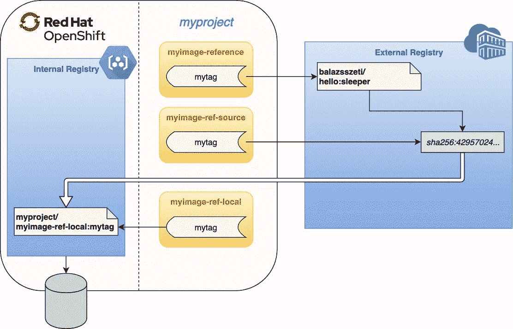

# OpenShift 4 中图像流的变化

> 原文：<https://itnext.io/variations-on-imagestreams-in-openshift-4-f8ee5e8be633?source=collection_archive---------1----------------------->

集装箱图像存储在图像注册中心(如 [Docker Hub](https://hub.docker.com/) 、 [Quay.io](https://quay.io/) )，从这里可以*提取*并手动运行或在 Kubernetes 集群中运行。Vanilla Kubernetes 没有企业环境中通常需要的内部图像注册中心。 [Red Hat OpenShift](https://www.openshift.com/) 打算通过提供一个开箱即用的[集成注册表](https://docs.openshift.com/container-platform/4.1/registry/architecture-component-imageregistry.html)并引入一个名为 *ImageStream* 的新 Kubernetes 资源来以“Kubernetes-native 方式”管理图像，从而填补这一空白。

ImageStreams 旨在支持不同的用例，但某些参数的影响在开始时可能会令人困惑。在本帖中，我们将看看其中的一些参数，以及它们如何改变从不同图像流创建的部署的行为。要了解 OpenShift 中图像管理的基本概念，请首先查看以下链接:

*   [管理 OpenShift 4 文档中的图像流](https://docs.openshift.com/container-platform/4.1/openshift_images/image-streams-manage.html)
*   [管理 OpenShift 3 文档中的图像](https://docs.openshift.com/container-platform/3.11/dev_guide/managing_images.html)
*   相关博客[这里](https://cloudowski.com/articles/why-managing-container-images-on-openshift-is-better-than-on-kubernetes/)，这里[这里](https://blog.openshift.com/automatically-update-red-hat-container-images-on-openshift-3-11/)，这里[这里](https://blog.openshift.com/image-streams-faq/)。

> 在 OpenShift 4 中，ImageStreams 的功能与 OpenShift 3 中的基本相同。对于这篇博文中的测试，我们使用了 OpenShift v4.1.6。

从技术上讲，ImageStream 只是一个包含元数据的 Kubernetes 资源。除了管理内部图像——通常[构建在 OpenShift 集群](https://docs.openshift.com/container-platform/4.1/builds/understanding-image-builds.html)中——ImageStreams 还可以指向外部注册表中的图像。在这种情况下，它们只是一个额外的抽象层，提供一些额外的功能(例如轮询更新、缓存)。因为图像流可以以两种不同的方式表现，如果我们区分它们是指向内部图像还是外部图像，就更容易理解它们。

> 类似于注册表中的存储库，ImageStream 有多个*标记*指向一个图像，因此 ImageStream 实际上是 ImageStream 标记的集合。严格地说，容器是从 ImageStreamTag(不是 ImageStream)创建的，但为了简单起见，我们在本文中互换使用这些术语。

## 内部与外部图像

首先，关于存储在内部注册表中的图像的一些注意事项:

*   对于内部图像，图像流和内部注册表是紧密耦合的。例如，`myproject`名称空间中的`myimage-internal`图像流被映射到`image-registry.openshift-image-registry.svc:5000/myproject/myimage-internal`存储库。
*   如果我们运行一个新的构建，其中的[输出](https://docs.openshift.com/container-platform/4.1/builds/managing-build-output.html)是一个 ImageStream，那么这个图像将被存储在内部注册表中。
*   如果我们手动*将*推送到注册表(参见[如何操作](https://blog.openshift.com/remotely-push-pull-container-images-openshift))，将自动创建一个匹配的图像流。该 url 必须引用一个有效的名称空间，我们在其中拥有*编辑*权限。
*   如果我们删除图像流，内部注册表中的存储库也会被删除，我们的图像也会丢失。
*   为了维护注册表使用的空间，你必须偶尔[修剪图像](https://docs.openshift.com/container-platform/4.1/applications/pruning-objects.html)。在修剪过程中，会自动保留在构建或部署中使用过或最近使用过的内部映像。


外部图像的 ImageStreams 怎么样？：

*   我们可以用`oc import-image`或`oc tag`命令或者直接用 *yaml* 创建一个指向外部图像的图像流。
*   在单个 ImageStream 中，您可以让标签指向来自完全不同的注册中心和存储库的图像。这是耦合相关但存储在不同存储库中的外部图像的有效方法。
*   作为抽象层，图像流隐藏了图像的实际来源。当构建和部署引用 ImageStream 时，我们可以通过修改 ImageStream 中的 url 来更改正在使用的映像，而不是逐个编辑每个构建和部署。
*   当创建或更新图像时，ImageStream 通过其唯一的 *sha256* *ID* 而不是标签来引用图像。这提供了防止标签在外部注册表中移动的稳定性。
*   ImageStreams 可以定期(15 分钟)监控外部标签是否改变(通过`--scheduled=true`)。有时这是一个有用的特性—对于安全更新来说—有时我们想要相反的东西，使用 ImageStreams 来确保我们使用相同的图像，即使外部标签移动了—为了稳定性。
*   我们可以在内部注册表中缓存外部图像(通过`--reference-policy=local`)。这真的很有用，因为它使部署更快，并且独立于外部注册表的可用性。



另一个重要的特性——对于内部和外部映像——是能够自动触发相关的 *BuildConfigs* 和 *DeploymentConfigs* 如果它们的映像流被更新。这种行为可以在那些资源上进行设置([参见](https://docs.openshift.com/container-platform/4.1/applications/deployments/managing-deployment-processes.html#deployments-triggers_deployment-operations) `imageChangeParams.automatic=true`)并且通常是启用的。

# 变化

现在，让我们来看看不同类型的图像流的详细信息:

*   指向外部图像
*   用*拉通*指向外部图像(缓存)
*   直接引用外部图像 url
*   指向内部图像
*   指向另一个图像流

## 外部图像

创建指向外部图像的 ImageStream，如下所示:

```
oc import-image myproject/myimage-ref-source:mytag --from="docker.io/balazsszeti/hello:sleeper" --confirm
```

或者，我们可以使用具有相同结果的`oc tag`:

```
oc tag docker.io/balazsszeti/hello:sleeper myproject/myimage-ref-source:mytag
```

查看前面命令创建的 *yaml* 资源:

```
$ oc get is myimage-ref-source -oyaml
apiVersion: image.openshift.io/v1
kind: ImageStream
metadata:
  annotations:
    openshift.io/image.dockerRepositoryCheck: "2019-08-08T17:50:46Z"
  creationTimestamp: "2019-08-08T17:50:45Z"
  generation: 2
  name: myimage-ref-source
  namespace: myproject
  resourceVersion: "741320"
  selfLink: /apis/image.openshift.io/v1/namespaces/myproject/imagestreams/myimage-ref-source
  uid: 0c8c4396-ba05-11e9-b920-0a580a800116
spec:
  **lookupPolicy:
    local: false**
  tags:
  - annotations: null
    **from:
      kind: DockerImage
      name: docker.io/balazsszeti/hello:sleeper**
    generation: 2
    **importPolicy: {}**
    name: mytag
    **referencePolicy:
      type: Source**
status:
  dockerImageRepository: image-registry.openshift-image-registry.svc:5000/myproject/myimage-ref-source
  publicDockerImageRepository: default-route-openshift-image-registry.apps-crc.testing/myproject/myimage-ref-source
  tags:
  - items:
    - created: "2019-08-08T17:50:46Z"
      dockerImageReference: docker.io/balazsszeti/hello@sha256:42957024...
      generation: 2
      image: sha256:42957024...
    tag: mytag
```

> 在本例中，我们使用名称“我的图像参考源”,因为默认情况下设置`referencePolicy.type`为`Source`。参见下面的“[带拉通](#3eae)的外部图像”，我们如何为不同的行为改变该设置。

让我们讨论一下这个图像流是如何工作的:

1.  **当 Pod 由引用此图像流的构建或部署创建时，它使用哪个图像 url？** 图像由 *sha256 ID* 提取，外部标签在图像流创建时指向此处:`docker.io/balazsszeti/hello@sha256:42957024b43e121a210a1b3a8a44f497233a2385f7ef48227a6866afdb9b8e1b`
2.  **如果外部注册表不可访问，它还能工作吗？例如，在临时网络中断或外部注册表关闭时？**
    否，因为 Pod 使用外部 url。
3.  **如果外部注册表中的标签移动，并且我们为 DeploymentConfig 提供了新的卷展栏，会发生什么情况？**
    由于 ImageStream 标签指向图像的 *sha256 ID* ，所以即使外部标签移动，容器也将从图像的该版本创建。您可以通过再次运行`oc tag`或`oc import-image`或通过`--scheduled=true`启用自动更新来手动更新 ImageStream 中的引用(这将在 yaml 中添加`importPolicy: {scheduled: true}`)。
4.  这个 ImageStream 可以用在 Pod(或其他香草 Kubernetes 资源)中吗？
    是，但不是默认。您需要`lookupPolicy: {local: true}` [set](https://docs.openshift.com/container-platform/3.9/dev_guide/managing_images.html#using-is-with-k8s) 并且它只在同一个名称空间内工作。
    `oc set image-lookup myimage-ref-source`
5.  **deployment config roll back 在部署后切换回以前的版本有效吗？**
    是的。使用`oc rollback dc/myimage-ref-source`回滚会使用 DeploymentConfig 以前的映像 url 创建一个新的部署。因为它通过以前的 *sha256 ID* 引用外部映像 url 注意:只有旧映像在外部注册表中仍然可用时，这才会起作用。

> 我们的测试容器是一个简单的“Hello World ”,带有一个 docker 文件:

> 还有一个 DeploymentConfig 示例，用于参考使用 ImageStream 的测试部署:

## 具有拉通的外部图像

要创建指向外部映像的 ImageStream 并启用 pullthrough，请将 reference-policy 标志修改为`—-reference-policy=local`:

```
oc import-image myproject/myimage-ref-local:mytag --from="docker.io/balazsszeti/hello:sleeper" --confirm --reference-policy=local
```

或者

```
oc tag docker.io/balazsszeti/hello:sleeper myproject/myimage-ref-local:mytag --reference-policy=local
```

这里我们只展示了 *yaml* 中有趣的部分:

```
$ oc get is -oyaml myimage-ref-local
apiVersion: image.openshift.io/v1
kind: ImageStream
metadata:
  name: myimage-ref-local
spec:
  tags:
  - **from:
      kind: DockerImage
      name: docker.io/balazsszeti/hello:sleeper**
    name: mytag
    **referencePolicy:
      type: Local**
status:
  dockerImageRepository: image-registry.openshift-image-registry.svc:5000/myproject/myimage-ref-local
  tags:
  - items:
    - dockerImageReference: docker.io/balazsszeti/hello@sha256:42957024...
      image: sha256:42957024...
    tag: mytag
```

和上面一样的问题:

1.  **Pod 中的图片 url 是什么？** 图像通过被*拉入内部注册表，因此 Pod 引用一个内部图像 url: `image-registry.openshift-image-registry.svc:5000/myproject/myimage-ref-local@sha256:42957024b43e121a210a1b3a8a44f497233a2385f7ef48227a6866afdb9b8e1b`*
2.  **当外部注册表不可达时是否工作？** 图像第一次使用时被缓存。所以它在第一次部署时不能脱机工作，但是一旦被缓存，就再也不需要联系外部注册表了。即使图像从外部注册表中删除，它仍将保留在缓存中。
3.  **如果标签移动会怎样？**
    和以前一样，ImageStream 标签指向图像的 *sha256 ID* ，所以即使外部标签移动，容器也是从同一个图像创建的。使用`--scheduled=true`或者手动刷新 ImageStream 将会更新它所引用的 *sha256 ID* ，但是新的图像只有在容器需要它的时候才会被缓存。
4.  **该 ImageStream 可以在 Pod 中使用吗？**
    是的，设定后`lookupPolicy: {local: true}`。
5.  **回滚有效吗？**
    是的。pod 通过 *sha256 ID* 指向内部 url，因此在回滚后旧的映像如预期的那样被使用。显然，这只有在旧图像没有从内部注册表中删除的情况下才有效——如果您仍然可以在 ImageStream 标签项目历史记录中看到它，则它是可用的。

## 引用外部图像

我们可以通过`--reference=true`标志创建一个直接引用外部标签的 ImageStream:

```
oc tag docker.io/balazsszeti/hello:sleeper myproject/myimage-reference:mytag --reference=true
```

相关的 *yaml* :

```
$ oc get is myimage-reference -oyaml
apiVersion: image.openshift.io/v1
kind: ImageStream
metadata:
  name: myimage-reference
spec:
  tags:
  - **from:
      kind: DockerImage
      name: docker.io/balazsszeti/hello:sleeper**
    name: mytag
    **reference: true**
    referencePolicy:
      type: Source
status:
  dockerImageRepository: image-registry.openshift-image-registry.svc:5000/myproject/myimage-reference
  tags:
  - items:
    - dockerImageReference: docker.io/balazsszeti/hello:sleeper
      image: ""
    tag: mytag
```

和上面一样的问题:

1.  **Pod 中的图像 url 是什么？** Pod 正在通过标签(而不是 *sha256 ID* )从外部注册表:`docker.io/balazsszeti/hello:sleeper`中提取图像
2.  离线工作吗？
    不，图像是从外部注册表中提取的。加`--reference-policy=local`没什么区别。
3.  **如果标签移动会发生什么？**
    容器是从外部标签 url 创建的，所以标签后面的新图像总是被使用。Pod 参数`imagePullPolicy: Always`在这种情况下很重要，否则旧图像可能会被容器运行时缓存在节点上。
4.  **该图像流可以在 Pod 中使用吗？**
    不行，连`lookupPolicy: {local: true}`都帮不上。如果设置了该标志，Pod 将尝试从一个不存在的内部 url: `image: image-registry.openshift-image-registry.svc:5000/myproject/myimage-reference:mytag`
5.  **回滚有效吗？**
    否，因为 Pod 引用了外部浮动标签(而不是 *sha256 ID* )。因此，在回滚后，容器将从外部注册表中提取图像的相同标记版本(例如`docker.io/balazsszeti/hello:sleeper`)，就像我们在 DeploymentConfig 中使用外部图像标记而不是图像流一样。

> 在 [Quay.io](https://quay.io) public registry 中，当一个新的图像被推送到一个现有的标签中时，先前的 *sha256 ID* 立即失效，并且先前的图像不能再被拉取——这似乎与 [Docker Hub](https://hub.docker.com/) 的情况不同。这是一个很好的例子，其中*穿越*特性可以帮助缓存我们部署的图像。

## 内影像

让我们通过在集群上运行 Docker 构建来创建一个映像—参见上面的示例*Docker file*:

```
oc new-build --to='myimage-internal:mytag' --strategy=docker --binary=true --name=myimage-internaloc start-build myimage-internal --from-dir=.  --follow
```

*yaml* 看起来有点不一样，注意:没有`spec.tags`:

```
$ oc get is myimage-internal -oyaml
apiVersion: image.openshift.io/v1
kind: ImageStream
metadata:
  labels:
    build: myimage-internal
  name: myimage-internal
spec:
  lookupPolicy:
    local: false
status:
  dockerImageRepository: image-registry.openshift-image-registry.svc:5000/myproject/myimage-internal
  tags:
  - items:
    - dockerImageReference: image-registry.openshift-image-registry.svc:5000/myproject/myimage-internal@sha256:ff3b3c5e...
      image: sha256:ff3b3c5e...
    tag: mytag
```

又是常见的问题:

1.  **Pod 中的图片 url 是什么？** 图片 URL 将通过*sha 256 ID*:*`image-registry.openshift-image-registry.svc:5000/myproject/myimage-internal@sha256:ff3b3c5e3d09bf93e2a05ece04235f4ea8212f36b617161d8f11f374a14aeb74`引用内部注册表*
2.  *离线工作吗？
    是的。图像在内部注册表中。*
3.  ***如果标签移动会发生什么？**
    图像流和内部图像保持同步，因此新的构建(或推送)也会更新标签。卷展栏将始终创建一个包含最新图像的窗格。*
4.  ***该图像流可以在 Pod 中使用吗？**
    是，设定`lookupPolicy: {local: true}`后。*
5.  ***回滚有效吗？**
    是的。只要图像没有从内部注册表中删除。*

> *注意:在上面的例子中，我们为每种类型使用了不同的 ImageStream，但是通过在一个 ImageStream 中使用不同的标签也可以达到同样的效果。*

## *引用另一个图像流*

*一个 ImageStream 也可以从另一个 ImageStream 创建，新标签的图像 url 设置在源标签当时指向的位置。新的图像流不会自动跟随旧的图像流(在这种情况下，您不能设置`--scheduled=true`)。其他属性(`referencePolicy`、`reference`、`lookupPolicy`、…)也不会被接管。新的 ImageStream 在创建/更新时采用源 ImageStream 的图像的 *sha256 ID* ,并且之后独立。*

*从另一个图像流创建新图像流的最常见用例是用于内部存储的图像，因为这对于外部图像来说意义不大。例如，如果我们有一个由 *git 挂钩触发的自动构建，*在“开发”、“测试”或“生产”名称空间中标记图像流可以触发 DeploymentConfig，我们不需要做太多其他事情就可以拥有一个基本的 CI/CD 流程。但是这个话题绝对超出了这篇已经很长的文章的范围。*

*让我们基于源图像流的类型和不同的参数来检查图像 url 看起来如何——当从我们的新图像流创建 pod 时。*

> *这最后一节只是为了涵盖所有场景。我们通常不使用这些边缘情况——除了在另一个名称空间中创建简单的“克隆”标签。*

***旧图像流指向外部图像:***

```
*oc tag myproject/myimage-ref-source:mytag myproject/fromis-ref-source-myimage-ref-source:mytag
  --> Pod image: docker.io/balazsszeti/hello@sha256:42957024...oc tag myproject/myimage-ref-source:mytag myproject/fromis-reference-myimage-ref-source:mytag **--reference=true**
  --> Pod image: docker.io/balazsszeti/hello@sha256:42957024...oc tag myproject/myimage-ref-source:mytag myproject/fromis-ref-local-myimage-ref-source:mytag **--reference-policy=local** 
  --> Pod image: image-registry.openshift-image-registry.svc:5000/myproject/fromis-ref-local-myimage-ref-source@sha256:42957024...*
```

*所有三个 *yaml* 变体看起来都很相似:*

```
*$ oc get is -o yaml fromis-ref-source-myimage-ref-source
apiVersion: image.openshift.io/v1
kind: ImageStream
metadata:
  name: fromis-ref-source-myimage-ref-source
spec:
  tags:
 **- from:
      kind: ImageStreamImage
      name: myimage-ref-source@sha256:42957024...
      namespace: myproject**
    name: mytag
status:
  dockerImageRepository: image-registry.openshift-image-registry.svc:5000/myproject/fromis-ref-source-myimage-ref-source
  tags:
  - items:
    - dockerImageReference: docker.io/balazsszeti/hello@sha256:42957024...
      image: sha256:42957024...
    tag: mytag*
```

***旧图像流指向带有拉通的外部图像:***

```
*oc tag myproject/myimage-ref-local:mytag myproject/fromis-ref-source-myimage-ref-local:mytag
  --> Pod image: docker.io/balazsszeti/hello@sha256:42957024...oc tag myproject/myimage-ref-local:mytag myproject/fromis-reference-myimage-ref-local:mytag **--reference=true**
  --> Pod image: docker.io/balazsszeti/hello@sha256:42957024...oc tag myproject/myimage-ref-local:mytag myproject/fromis-ref-local-myimage-ref-local:mytag **--reference-policy=local**
  --> Pod image: image-registry.openshift-image-registry.svc:5000/myproject/fromis-ref-local-myimage-ref-local@sha256:42957024...*
```

*与从非直通图像流进行标记相比，没有区别。*

***旧图像流是外部参考:***

```
*oc tag myproject/myimage-reference:mytag myproject/fromis-ref-source-myimage-reference:mytag
  --> Pod image: docker.io/balazsszeti/hello@sha256:42957024...oc tag myproject/myimage-reference:mytag myproject/fromis-reference-myimage-reference:mytag **--reference=true**
  --> Pod image: docker.io/balazsszeti/hello:sleeperoc tag myproject/myimage-reference:mytag myproject/fromis-ref-local-myimage-reference:mytag **--reference-policy=local**
  --> Pod image: image-registry.openshift-image-registry.svc:5000/myproject/fromis-ref-local-myimage-reference@sha256:42957024...*
```

*如果我们标记的源图像流是`--reference=true`，新的图像流定义看起来与其他情况不同。这里标签的种类是`DockerImage`，没有迹象表明这是从另一个图像流创建的。*

```
*$ oc get is -oyaml fromis-ref-source-myimage-reference
apiVersion: image.openshift.io/v1
kind: ImageStream
metadata:
  name: fromis-ref-source-myimage-reference
spec:
  tags:
 **- from:
      kind: DockerImage
      name: docker.io/balazsszeti/hello:sleeper**
    name: mytag
status:
  dockerImageRepository: image-registry.openshift-image-registry.svc:5000/myproject/fromis-ref-source-myimage-reference
  tags:
  - items:
    - dockerImageReference: docker.io/balazsszeti/hello@sha256:42957024...
      image: sha256:42957024...
    tag: mytag*
```

***旧图像流指向内部图像:***

*如上所述，在不同的名称空间之间标记内部图像是很常见的。在这种情况下，似乎有一些特殊的逻辑来像处理`--reference-policy=local`一样处理`--reference-policy=source`，以避免名称空间之间的权限问题:*

```
*oc tag myproject/myimage-internal:mytag myproject/fromis-ref-source-myimage-internal:mytag
  --> Pod image: image-registry.openshift-image-registry.svc:5000/myproject/**fromis-ref-source-myimage-internal**@sha256:ff3b3c5e...oc tag myproject/myimage-internal:mytag myproject/fromis-reference-myimage-internal:mytag **--reference=true**
  --> Pod image: image-registry.openshift-image-registry.svc:5000/myproject/myimage-internal@sha256:ff3b3c5e...oc tag myproject/myimage-internal:mytag myproject/fromis-ref-local-myimage-internal:mytag **--reference-policy=local**
  --> Pod image: image-registry.openshift-image-registry.svc:5000/myproject/fromis-ref-local-myimage-internal@sha256:ff3b3c5e...*
```

*ImageStream *yaml* 看起来是这样的:*

```
*$ oc get is -oyaml fromis-ref-source-myimage-internal
apiVersion: image.openshift.io/v1
kind: ImageStream
metadata:
  name: fromis-ref-source-myimage-internal
spec:
  tags:
 **- from:
      kind: ImageStreamImage
      name: myimage-internal@sha256:ff3b3c5e...
      namespace: myproject**
    name: mytag
status:
  dockerImageRepository: image-registry.openshift-image-registry.svc:5000/myproject/fromis-ref-source-myimage-internal
  tags:
  - items:
    - dockerImageReference: image-registry.openshift-image-registry.svc:5000/myproject/fromis-ref-source-myimage-internal@sha256:ff3b3c5e...
      image: sha256:ff3b3c5e...
    tag: mytag*
```

# *摘要*

*ImageStreams 是管理存储在 OpenShift 内部注册表中的图像的一种很好的方式，但是当它们指向外部 URL 时，一些参数可能会令人困惑。OpenShift 4 的发布和日益流行给了我们一个很好的理由来做一个全面的概述，并检查当在部署中使用 ImageStream 标签时，它们是如何被解析为实际的容器图像 url 的。希望这有助于回答您在设计自己的映像管理策略时可能遇到的一些问题。*