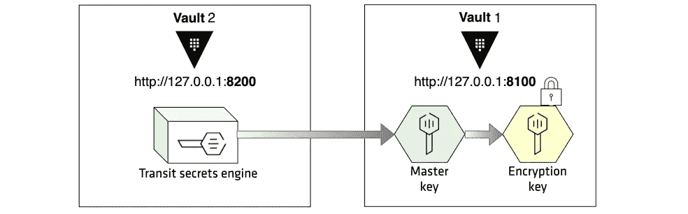

# Kubernetes 上具有自动解封功能的保险库集群

> 原文：<https://itnext.io/vault-cluster-with-auto-unseal-on-kubernetes-8e469f9cdcfd?source=collection_archive---------0----------------------->

这又是一个有趣的跳马话题。

这是一个脚本来实现一个简单的保险库集群，它作为后台存储集成到 Consul 集群中，并作为中转服务器来自动解封保险库集群，**当然是为了测试目的**。

在解释剧本之前，让我们先回顾一些介绍。

# 什么是跳马？

使用 UI、CLI 或 HTTP API 保护、存储和严格控制对令牌、密码、证书和加密密钥的访问，以保护机密和其他敏感数据。

# 领事是什么？

Consul 使用服务身份和传统网络实践来帮助组织安全地连接在任何环境中运行的应用程序。

# 什么是中转服务器？

Vault 支持通过 transit secrets 引擎选择自动解封。此功能使操作员能够将解封过程委托给受信任的 Vault 环境，以简化操作。传输密封将 Vault 配置为使用 Vault 的传输密码引擎作为自动解封机制。

**在此查找代码:**

[https://github.com/hosein-yousefii/kubernetes-vault-cluster](https://github.com/hosein-yousefii/kubernetes-vault-cluster)

**入门**:

正如您可以在这里找到的，vault 中的 Transit secrets 引擎能够为您的 vault 集群存储密钥，以便自动解封它。

对于此设置，我们需要:

1-每个 vault 节点都有 consul 客户端的 vault 集群

2-作为传输秘密引擎的另一个 vault 实例

3-咨询集群以存储我们节点的数据



我们有一个脚本来在 Kubernetes 上实现和配置所有这些功能。

让我们来了解一下剧本“`vault-cluster.sh`”:

**1。**我们通过删除“vault-cluster”命名空间及其持久卷来清理环境。然后从部署 Consul 集群开始。

```
kubectl create namespace vault-cluster 
kubectl apply -f consul/cm.yaml 
kubectl apply -f consul/svc.yaml 
kubectl apply -f consul/deploy.yaml REPLICAS=$(kubectl get statefulsets.apps --namespace=vault-cluster -o custom-columns=:.spec.replicas consul|tail -1)
REPLICA=$(expr ${REPLICAS} - 1)while [[ ! $(kubectl get po --namespace=vault-cluster --field-selector status.phase=Running|grep consul-$REPLICA ) ]]
do 
 echo -ne .
 sleep 5s

done
```

因为你能在我的 [GitHub](https://github.com/hosein-yousefii/kubernetes-vault-cluster) 上找到文件:

cm 参考配置图。

svc 指服务。

部署参考主文件进行部署。

**2。**我们部署了 Vault transit server 和 Vault cluster。

**3。**让我们配置 Vault 中转服务器:

```
# FIRSTLY initialize the vault 
kubectl exec --namespace=vault-cluster --stdin --tty $TRANSIT_SERVER_NAME -- vault operator init -format=yaml > vault-auto-unseal-keys.txt # SECONDLY unseal it                                                       
kubectl exec --namespace=vault-cluster --stdin --tty $TRANSIT_SERVER_NAME -- vault operator unseal -tls-skip-verify $(grep -A 5 unseal_keys_b64 vault-auto-unseal-keys.txt |head -2|tail -1|sed 's/- //g')kubectl exec --namespace=vault-cluster --stdin --tty $TRANSIT_SERVER_NAME -- vault operator unseal -tls-skip-verify $(grep -A 5 unseal_keys_b64 vault-auto-unseal-keys.txt |head -3|tail -1|sed 's/- //g')kubectl exec --namespace=vault-cluster --stdin --tty $TRANSIT_SERVER_NAME -- vault operator unseal -tls-skip-verify $(grep -A 5 unseal_keys_b64 vault-auto-unseal-keys.txt |head -4|tail -1|sed 's/- //g')
```

是时候启用机密、策略和令牌了:

```
VAULT_AUTO_UNSEAL_ROOT_TOKEN=$(grep root_token vault-auto-unseal-keys.txt |awk -F: '{print $2}'|sed 's/ //g')kubectl exec --namespace=vault-cluster --stdin --tty $TRANSIT_SERVER_NAME -- vault login -tls-skip-verify ${VAULT_AUTO_UNSEAL_ROOT_TOKEN} kubectl exec --namespace=vault-cluster --stdin --tty $TRANSIT_SERVER_NAME -- vault audit enable file file_path=/vault/logs/audit.log kubectl exec --namespace=vault-cluster --stdin --tty $TRANSIT_SERVER_NAME -- vault secrets enable transit kubectl exec --namespace=vault-cluster --stdin --tty $TRANSIT_SERVER_NAME -- vault write -f transit/keys/autounseal kubectl exec --namespace=vault-cluster --stdin --tty $TRANSIT_SERVER_NAME -- vault policy write autounseal /vault/unseal/autounseal.hcl kubectl exec --namespace=vault-cluster --stdin --tty $TRANSIT_SERVER_NAME -- vault token create -policy="autounseal" -wrap-ttl=12000 -format=yaml > .vault-auto-unseal-token.txt
```

**金库包裹:**

在许多 Vault 部署中，客户端可以直接访问 Vault 并使用返回的机密。在其他情况下，分离特权可能是有意义的或者是期望的，使得一个受信任的实体负责与大多数 Vault API 进行交互，并且将秘密传递给最终消费者。

当响应被包装时，来自 Vault 的普通 API 响应不包含原始机密，而是包含一组与响应包装标记相关的信息:TTL、标记、创建时间、创建路径、包装的访问器。

最后:解开令牌，返回里面的响应。返回的响应将是原始的有线格式响应；它可以直接用于 API 客户端。

让我们把它自动化:

```
VAULT_AUTO_UNSEAL_TOKEN=$(grep token: .vault-auto-unseal-token.txt|awk '{print $2}'|tr -d '\r')kubectl exec --namespace=vault-cluster --stdin --tty $TRANSIT_SERVER_NAME -- env VAULT_TOKEN=${VAULT_AUTO_UNSEAL_TOKEN} vault unwrap -format=yaml > .vault-unwrap-token.txtVAULT_AUTO_UNSEAL_TOKEN=$(grep client_token: .vault-unwrap-token.txt|awk '{print $2}'|tr -d '\r')
```

**4。**下一步是配置存储集群并咨询客户端配置图:

```
tee vault/cm-updated.yaml << EOF
apiVersion: v1
kind: ConfigMap
metadata:
  name: vault-config
  namespace: vault-cluster
  labels:
    app.kubernetes.io/name: vault
    app.kubernetes.io/creator: hossein-yousefi
    app.kubernetes.io/stack: vault-cluster
data:
  config.hcl: |
    listener "tcp" {
      tls_disable = 1
      address          = "0.0.0.0:8200"
      cluster_address  = "0.0.0.0:8201"   
     }
    storage "consul" {
      address = "consul:8500"
      path    = "vault/"
     }
    disable_mlock = true
    seal "transit" {
      address = "[http://vault-auto-unseal:8200](http://vault-auto-unseal:8200)"
      token = "${VAULT_AUTO_UNSEAL_TOKEN}"
      disable_renewal = "false"
      key_name = "autounseal"
      mount_path = "transit/"
      tls_skip_verify = "true"
     }---apiVersion: v1
kind: ConfigMap
metadata:
  namespace: vault-cluster
  name: consul-client-config
  labels:
    app.kubernetes.io/name: vault
    app.kubernetes.io/creator: hossein-yousefi
    app.kubernetes.io/stack: vault-cluster
data:
  consul.json: |
   {
      "server": false,
      "datacenter": "dc1",
      "data_dir": "/consul/data/",
      "bind_addr": "0.0.0.0",
      "client_addr": "0.0.0.0",
      "retry_join": ["vault"],
      "log_level": "DEBUG",
      "acl_enforce_version_8": false
   } 
EOFkubectl apply -f vault/cm-updated.yaml &> /dev/nullkubectl rollout restart statefulsets --namespace=vault-cluster vault
```

**5。**最后一步是初始化 vault-0:

```
kubectl exec — namespace=vault-cluster — stdin — tty vault-0 -c vault — vault operator init -format=yaml > vault-keys.txtkubectl exec — namespace=vault-cluster — stdin — tty vault-1 -c vault — vault operator unseal -tls-skip-verify $(grep -A 5 unseal_keys_b64 vault-keys.txt |head -2|tail -1|sed ‘s/- //g’)kubectl exec — namespace=vault-cluster — stdin — tty vault-1 -c vault — vault operator unseal -tls-skip-verify $(grep -A 5 unseal_keys_b64 vault-keys.txt |head -3|tail -1|sed ‘s/- //g’)kubectl exec — namespace=vault-cluster — stdin — tty vault-1 -c vault — vault operator unseal -tls-skip-verify $(grep -A 5 unseal_keys_b64 vault-keys.txt |head -4|tail -1|sed ‘s/- //g’)
```

**最后:**我们有一个保险库集群，它可以使用另一个保险库服务器作为传输秘密引擎来解封自己。

**在我的**[**GitHub**](https://github.com/hosein-yousefii/kubernetes-vault-cluster)**上找到所有文件，有问题尽管提。**