# CPU 和 GPU 上的向量处理比较

> 原文：<https://itnext.io/vector-processing-on-cpus-and-gpus-compared-b1fab24343e6?source=collection_archive---------0----------------------->

## SIMD、CUDA、SSE、MMX、SVE2 和 RVV，这些并行处理的方法有何不同？

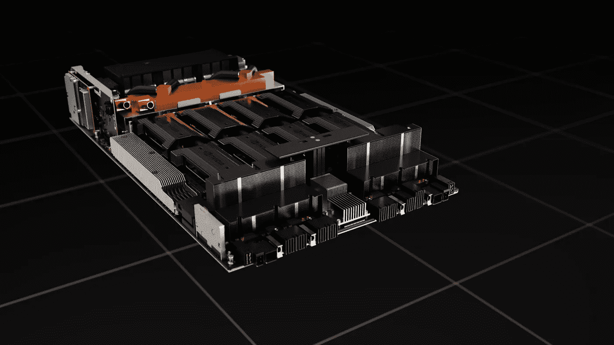

Nvidia Hopper 架构

现代 CPU 和 GPU 都可以并行处理大量数据，那么它们到底有什么不同呢？这个问题变得越来越重要，因为我们看到 Arm 处理器添加了可扩展的矢量扩展，英特尔和 AMD 将 AVX 添加到 x86 微处理器架构中，而 RISC-V 最近正式推出了 RISC-V 矢量扩展。

苹果正在为他们的 M1 片上系统(SoC)添加神经引擎，我们最近看到英伟达发布了他们新的 Hopper H100 GPU 架构。所有这些系统的共同点是，它们旨在通过利用数据并行性来提高性能。这些系统的核心是 SIMD 系统，单指令多数据。这与如下图所示的单指令单数据(SISD)的经典计算机体系结构形成对比。


单指令多数据和单指令单数据处理的区别。

你在这里看到的指令有加、乘、减、移和除。数据是我们正在执行这些操作的数字。

这个故事比计划的要长得多，所以我将给出一些要点和每个主要部分的简短描述:

*   **简单 RISC 微处理器的操作** —解释简单 RISC 处理器如何执行指令，与 SIMD 指令的执行方式进行对比。
*   **SIMD 指令如何工作**——看看一些已知的 SIMD 指令集的代码示例，并尝试通过一些图表来理解它们是如何工作的。
*   **从压缩 SIMD 到向量处理** —如何在旧的 Cray 计算机以及现代指令集扩展(如 ARM 的 SVE2 和 RISC-V 的 V 扩展)中进行向量处理。
*   **在多个内核之间划分任务** —如果您想要构建数百个支持 SIMD 的内核，该怎么办？您如何管理这么多内核上的工作负载？
*   **单指令多线程——SIMT**——英伟达等公司的现代显卡和人工智能加速器如何解决在具有类似 SIMD 功能的大量内核之间分配任务的问题。
*   **组织和管理经线中的线程** —解释 GPU 编程中的线程概念以及它与普通 CPU 线程的不同之处。
*   **GPU 硬件需要这么复杂吗？** —对源自图形硬件的矢量处理和基于 SIMT 的处理的复杂性差异的比较和思考。

# 简单 RISC 微处理器的操作

微处理器由不同的功能单元组成，用灰色方框表示。每个灰框以某种方式处理数据。当数据被处理时，它必须通过数据总线(蓝色箭头)或地址总线(绿色箭头)传送到另一个功能单元。您可以将彩色箭头想象为发送电信号的铜迹线或电线，将灰色方框想象为协同工作以完成特定任务的一组晶体管。

澄清这一点只是让你思考的一种方式。由硅片制成的微芯片当然不像你在印刷电路板上看到的那样有铜迹线。

CPU 的核心是算术逻辑单元(ALU ),它就像微处理器的计算器。它从寄存器中读取加减或移位的数字。在一个典型的 RISC 处理器中，你有 32 个寄存器，每个寄存器可以保存一个数字。

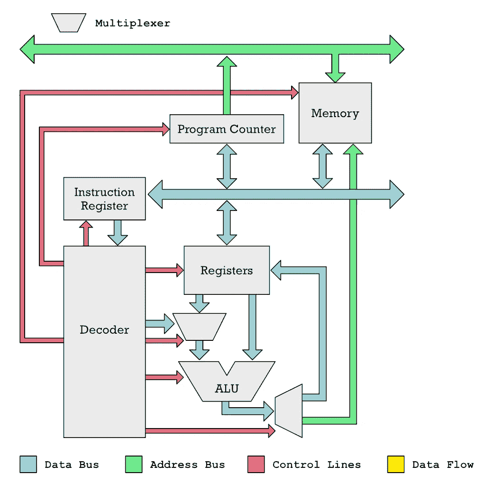

一种简单 RISC 微处理器(CPU)的体系结构

为了准确地决定 ALU 执行什么算术运算，必须通过控制线(红色)来指示该做什么，控制线是用于开启或关闭不同功能的电信号。*解码器*单元负责切换这些控制线。解码器通过从*指令寄存器*中读取指令，计算出开启或关闭哪条控制线。我们通过从存储程序的内存中一个接一个地读取指令来将指令存入指令寄存器。

下图显示了程序计数器如何告诉内存要读取什么地址，以及该地址的数据如何发送到指令寄存器。

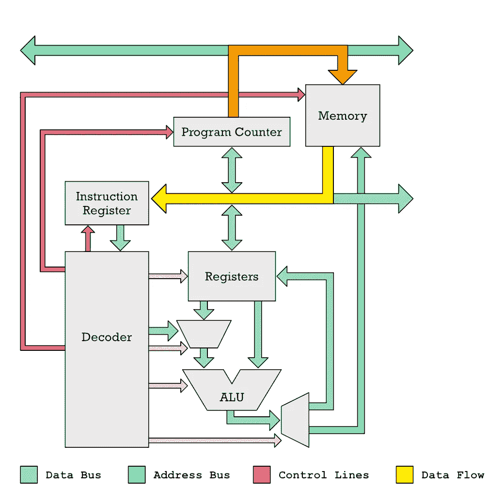

如何从 CPU 的内存中取出指令。

这给了你一些关于 CPU 如何正常运行的背景知识。它将数据混洗，目的是向 ALU 提供数据。然后，结果被发送回寄存器，接下来另一条指令可能会将其存储到内存位置。

这是一个简单的 RISC-V 汇编代码程序，显示了类似的东西。正如你所看到的，每条指令都是非常基本的。`LI` (Load Immediate)将一个数载入寄存器。这就是它所做的一切。`ADD`指示 ALU 将两个数相加。

```
# RISC-V Assembly code for adding numbers 42 and 12

LI  x2, 42      # store 42 in register x2
LI  x3, 12      # store 12 in register x3
ADD x4, x2, x3  # add x2 and x3, result in x4
SW  x4, 90(x0)  # store result at memory location 90 + x0
```

下一步是更好地理解我们如何以 SIMD 的方式从添加单对数字转移到添加多对数字。

# SIMD 指令如何工作

在一个简单的处理器中，寄存器和 ALU 的结构如下图所示。一些寄存器`r1`和`r2`用作输入，结果存储在另一个寄存器`r2`中。当然，可以使用任何寄存器。根据建筑的不同，它们可能被命名为`x0`、`x1`、...，`x31`或者它们可以是`r0`，`r1`，...，`r15`如 32 位 ARM 架构上的情况。

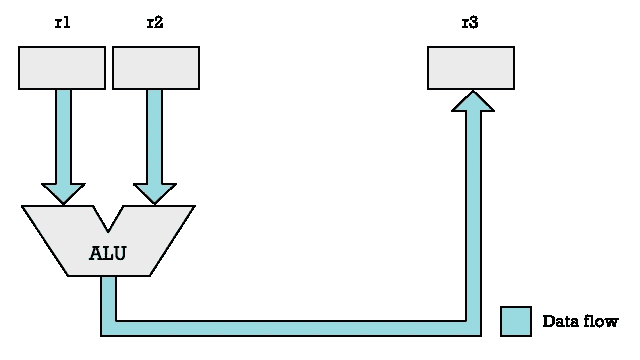

以 SISD 方式使用算术逻辑单元。

为了支持 SIMD 指令，我们在 CPU 中增加了更多的 alu，并将寄存器分割成多个元素。因此，我们可以将一个 32 位寄存器拆分成两个 16 位元素，然后将这两个 16 位元素馈送给一个独立的 alu。现在，我们突然能够将每个时钟周期执行的算术运算数量增加一倍。

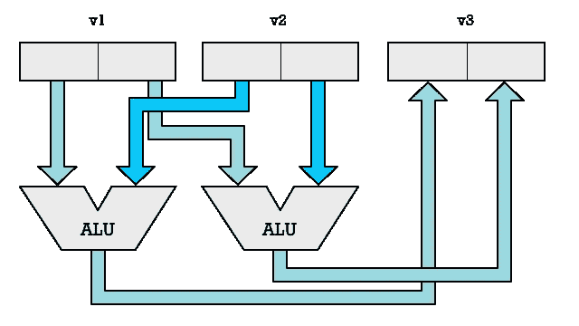

使用多个 alu 来实现数据的 SIMD 处理。

我们不需要局限于两个 alu，我们可以添加更多。如果我们有四个 alu，我们可以并行处理四个数字对。与 ALU 结合的每个元素对被称为 SIMD 通道。有了两个通道，我们可以处理两对数字。有了八个通道，我们可以并行处理八个数字。

我们可以并行处理多少个数字受到通用寄存器或向量寄存器的位长度的限制。在某些 CPU 上，您可以对常规通用寄存器执行 SIMD 操作。在其他情况下，您使用特殊寄存器进行 SIMD 操作。

让我们以 RISC-V 为例，因为它提供了一个相当简单的指令集。我们将在 RISC-V P 扩展中使用`ADD16`和`ADD8`指令。

`LW`(加载字)指令将在 32 位 RISC-V 处理器(RV32IP)上加载 32 位值。我们可以将这个值视为两个 16 位的值，并分别将它们相加。这就是`ADD16`的作用。

```
# RISC-V Assembly: Add two 16-bit values.

LW    x2, 12(x0)   # x2 ← memory[x0 + 12]
LW    x3, 16(x0)   # x3 ← memory[x0 + 16]
ADD16 x4, x2, x3   
SW    x4, 20(x0)   # x4 → memory[x0 + 20]
```

或者，我们可以使用`ADD8`,它会将我们从地址 12 和地址 16 加载的 32 位值视为四个 8 位值。

```
# RISC-V Add four 8-bit values.

ADD8  x4, x2, x3
```

如果我们使用 Arm 处理器，即使指令的语法略有不同，逻辑也会非常相似。下面是一个使用 Arm 的新 SIMD 指令和 16 个 8 位值的例子。注意，Arm 使用向每个向量寄存器添加后缀的惯例(`r0`，`r1`，...`r31`)来表示元素的大小和数量。因此，`.16B`后缀意味着 16 个元素，`B`意味着字节大小的元素。

```
; ARM Neon Add sixteen 8-bit values with (128-bit vector regs) 

LDR v0, [x4]    ; v0 ← memory[x4]
LDR v1, [x6]    ; v1 ← memory[x6]

ADD v4.16B, v0.16B, v1.16B 
STR v4, [x8]    ; v4 → memory[x8]
```

如果我们想要添加 32 位值，那么这些值被称为单字值或简称为`S`。

```
; ARM Neon adding four 32-bit values
ADD v4.4S, v0.4S, v1.4S
```

英特尔 x86 SSE 指令更简单一些，因为它们最初只支持 32 位元素值。他们添加了名为`xmm0`、`xmm1`的新寄存器，...`xmm7`均为 128 位。这赋予了每条指令处理四个 32 位值的能力。

```
; x86 SSE adding four 32-bit values

MOVAPS xmm0, [12]  ; xmm0 ← memory[12]
MOVAPS xmm1, [28]  ; xmm1 ← memory[28]
ADDPS  xmm0, xmm1
MOVAPS [44], xmm0  ; memory[44] ← xmm0
```

SIMD 处理可以以许多不同的方式发生。我们刚才看到的叫做压缩 SIMD 指令。但是向量 SIMD 指令也存在。

使用压缩 SIMD 指令，我们也可以清楚地知道要运算的元素的大小和个数。注意 Arm Neon packed-SIMD 指令是如何要求你给寄存器加上一个像`.16B`或`.4S`这样的后缀的。这些足以准确说明我们处理了多少个元素，每个元素有多宽。

RISC-V P 扩展在这里稍微灵活一些，因为元素的数量实际上是由 CPU 是 32 位还是 64 位决定的。在 32 位 RISC-V 处理器上，`ADD16`指令每个输入寄存器使用两个 16 位数，而对于 64 位处理器，每个输入寄存器使用四个 16 位数。

底线是，所有这些压缩 SIMD 指令集都受到这样一个事实的限制，即它们严重限制了扩展元素大小的能力以及在不添加更多指令的情况下可以处理的元素数量。下面的代码编码了两条完全不同的指令。如果你想支持另一个后缀，你需要添加更多的指令到指令集中。

```
; ARM Neon
ADD v4.16B, v0.16B, v1.16B 
ADD v4.4S, v0.4S, v1.4S
```

这一要求是包装 SIMD 指令的主要限制。相反，我们想要的是更高层次的抽象，它允许硬件设计者增加更多的处理能力，而不必每次都改变硬件的接口。

# 从压缩 SIMD 到矢量处理

我们希望能够添加更多的 SIMD 通道和更大的向量寄存器，但在遵循打包 SIMD 方法时，如果不添加新指令，我们就无法做到这一点。

早在 70 年代和 80 年代，克雷超级计算机使用的这个问题的早期解决方案是定义矢量 SIMD 指令。有了这些指令，向量寄存器被认为是无类型的。向量指令没有说我们有多少元素和它们的大小。

这是 RISC-V 矢量扩展(RVV)和 Arm 可伸缩矢量扩展(SVE)使用的策略。对于 RVV se，使用一个名为`VSETVLI`的指令来配置元素的大小和数量。我们每次执行一个 SIMD 运算，比如`VADD.VV`(带有两个向量寄存器参数的向量加法)，用我们想要处理的元素数填充一个寄存器。

例如，这条指令告诉 CPU 配置为处理 16 位元素。`x2`包含了我们想要处理的多少元素。然而，我们的 SIMD 硬件可能没有足够大的寄存器来处理这么多的 16 位元素，这就是为什么每次我们调用向量 SIMD 指令时，指令都会在`x1`中返回我们能够处理的元素的实际数量。

```
VSETVLI  x1, x2, e16
```

实际上，我们必须在加载和存储时指定元素的大小，因为它会影响位的排序。因此，我们发出一个`VLE16.V`来加载`x1`个 16 位值。`VLSE16.V`用于存储`x1`个 16 位值。

```
# RISC-V Vector processing (adding two vectors)

VSETVLI  x1, x2, e16 # Use x2 no. 16-bit elements
VLE16.V  v0, (x4)    # Load x1 no. elments into v0
VLE16.V  v1, (x5)    # Load x1 no. elments into v1
VADD.VV  v3, v0, v1  # v3 ← v0 + v1
VLSE16.V v3, (x6)    # v3 → memory[x6]
```

使用矢量 SIMD 指令，我们可以从指令集中抽象出多少条 SIMD 通道。下图显示了矢量处理的工作原理。每个寄存器有 16 个元素，但只有两个 SIMD 通道。这不是问题，因为向量处理器会简单地遍历所有元素，直到完成。在压缩 SIMD 中，我们会在一个时钟周期内处理两对数字。使用向量 SIMD，我们花费四个 CPU 时钟周期来处理八对数字。

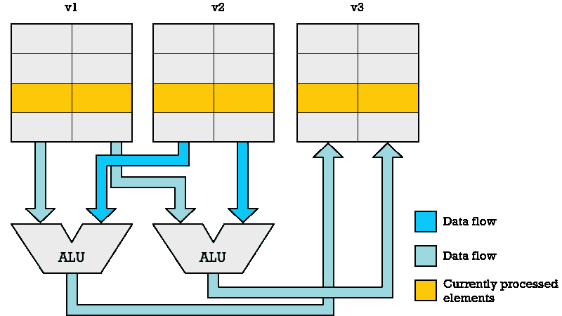

如果我们有四个 SIMD 通道(四个 alu ),我们可以在两个时钟周期内处理八对数字。这种方法的美妙之处在于，你可以在不同的 CPU 上运行完全相同的代码，这些 CPU 有不同数量的 SIMD 通道。

因此，你可以拥有一个只有一个通道的廉价微控制器，或者一个复杂的高端 CPU，用于 64 个 SIMD 通道的科学计算。两者都能够运行相同的代码。唯一的区别是高端 CPU 能够更快地完成。

# 跨多个内核划分任务

我们实际上还没有完成 SIMD 计算的抽象。我们可以走得更远。为了获得最高的性能，我们希望能够并行执行尽可能多的工作，但是我们并不总是需要对大量的元素执行完全相同的操作。这就是拥有多个 CPU 内核的意义所在。还因为有许多非向量代码您可能希望与向量处理并行执行。

这件事有不同的处理方式。现代 CPU 内核非常大，因为它包含许多晶体管来实现许多功能，这允许它并行执行许多指令。这就是超标量处理器所做的。下图可能会给你一个想法。请注意，与最初的简单图不同，这张图底部有多个指令解码器。我们创建了微操作，而不是一个解码后的指令立即切换各种控制线来控制不同的单元，如 ALU。

CPU 包含各种聪明的东西，可以计算出这些微操作中的哪些操作是相互独立的，因此操作可以并行进行。也许它发现有一种乘法不依赖于被解码的加法指令。在这种情况下，乘法器和 ALU 可以并行工作。

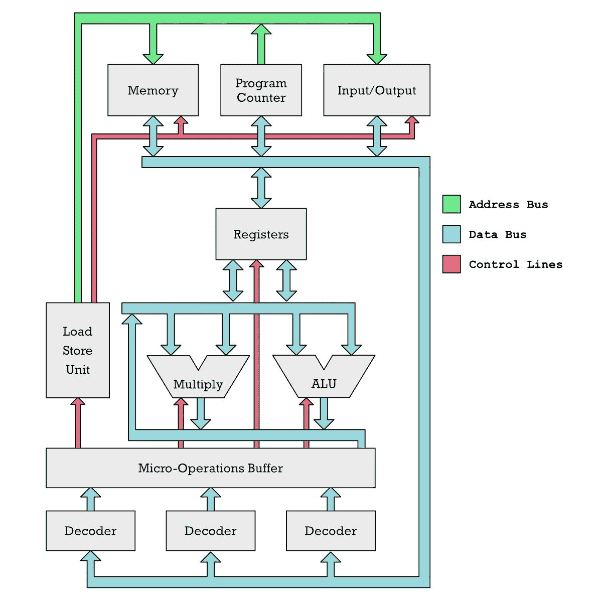

超标量 CPU 有许多解码器，可以并行运行许多指令。

更奇妙的是，超标量 CPU 可以乱序执行指令(OoO)，这意味着它想出一种方法来重新排序它们，以便更容易地并行运行。后来它不得不再次命令返回结果。

好吧，好吧，我知道，你想知道这和 SIMD 指令有什么关系。公平地说，这与 SIMD 没有直接关系。这只是为了让你理解为什么现代 CPU 要装这么多晶体管。他们做了很多需要很多晶体管的聪明的事情。

另一方面，如果你的处理器内核应该主要执行大量的 SIMD 指令，你就不需要那些花哨的东西。这只是一个沉重的负担。事实上，如果你放弃超标量 OoO 能力，花哨的分支预测器和所有这些好东西，你会得到更小的处理器内核。事实上，有序的面向 SIMD 的核心可以做得非常小。

假设你有 200 亿个晶体管可以玩。用这样的晶体管预算，你也许可以制造 16-32 个厚内核。但是如果你制造简单的向量处理核心，你可以制造一千个向量处理核心！

现在，您有一千个内核，每个内核都有 512 位向量寄存器，允许您在每个时钟周期处理 32 个 16 位值(512/16 = 32)。

也许你有一百万个元素需要处理。你需要一些更高层次的抽象来划分工作，并把它推到你的一千个向量处理核心中的每一个。假设内存不是瓶颈，所有这些内核每个 CPU 周期总共可以处理 32 000 个元素(32*1000)。

我刚才所描述的本质上是世界语技术公司正在做的基于 RISC-V 的人工智能加速卡。他们制作了一个片上系统(SoC ),称为 ET-SOC-1，它有四个胖超标量通用内核，称为 ET-Maxion。此外，他们还有 1088 个称为 ET-Minion 的微型矢量处理器核心。现在后者也是通用 CPU，但它们缺少所有花哨的超标量 OoO 东西，这使它们能够快速运行常规程序。相反，它们针对矢量处理进行了优化(矢量 SIMD 指令)。

让我来总结一下我们到目前为止学到的东西:

1.  我们研究了具有标量运算的常规哑 RISC 处理器。
2.  然后我们想:嘿，让我们假设一个寄存器是一个数字阵列，让我们通过添加更多的 alu 和乘法器来并行计算这些数字。
3.  利用这些多个 alu 和向量寄存器的第一个简单方法是定义压缩 SIMD 指令。
4.  打包 time 不会随着时间的推移而扩展。每次硬件设计人员想要增加更多 SIMD 通道时，都需要新的指令。向量-SIMD 救援。
5.  单核与矢量 SIMD 是不够的。我们需要更多内核。现在我们有了一个新问题:我们如何组织和划分工作负载？

在世界语技术出现之前，Nvidia 等显卡制造商一直在解决同样的问题。显卡不仅仅是一个处理很长向量寄存器的单核。就像 ET-SOC-1 一样，它们包含大量针对运行 SIMD 指令而优化的小内核。

但是现在事情变得复杂多了。

# 单指令多线程— SIMT

对于图形硬件，事情变得复杂得多。当我开始写这个故事时，我的意图是将图形硬件解释为 SIMD 处理，更高级的东西在上面。

然而，这种描述并不公平。显卡制造商称之为 SIMT 的东西——单指令多线程——与 SIMD 截然不同，它应该有自己的缩写。

不是谈论 SIMD 巷图形家伙谈论线程。起初我认为这是对众所周知的术语的滥用。通常一个线程封装一个执行线程。它需要存储一个程序计数器，这个计数器表示一个特定线程在程序中的位置。

你有一个可以恢复线程的调度程序。然后，当线程暂停时，它将从存储器中弹出该线程的程序计数器，以在程序中的最后一个位置恢复执行。

线程在普通软件中是很实用的，因为你可以让代码读写磁盘或网络，这在等待响应时会被卡住。使用线程，你可以暂停一个正在等待数据的线程，并恢复另一个线程去做有用的事情。

这听起来不太像 SIMD 巷，对不对？那么，当讨论 GPU 中的并行处理时，这个术语是如何溜进来的呢？这是因为 GPU 核上的 SIMD 莱恩斯实际上更像是一个线程。

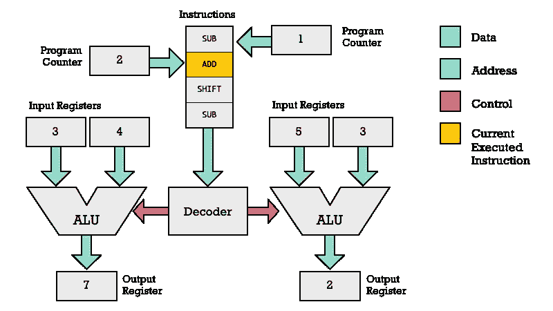

单指令多线程

这不仅仅是一个通道作为自己的计算单元，如 ALU，而且它们还有自己的*程序计数器* (PC)和自己的*加载存储单元* (LSU)。什么？所以你们每个 SIMD 巷都能像正常的 CPU 核心一样完全独立地运行指令？

不完全是。在 Nvidia GPU 上，你基本上有 32 个 SIMD 通道。一条指令可以同时在 32 对数字上执行。有趣的是，条件指令仍然是允许的。假设条件是 12 个线程(通道)的`true`和 20 个线程的`false`。这意味着这两组线程需要运行不同的代码。每一个都更新了他们的程序计数器，但是我们只在同一时间用相同的程序计数器运行线程。

因此，前 12 个线程可以运行一条`ADD`指令。也许他们运行另一个指令，一个`SHIFT`(乘以 2 的因子)指令。每当程序计数器(PC)为 12 个线程中的每一个更新时。

在某个时候，你可能会得到一条从内存中读取数据的指令。这让事情发生了翻天覆地的变化。通过打包 SIMD 和向量 SIMD，我们负责在 SIMD 引擎开始工作之前从内存中填充向量寄存器。SIMT 的情况有所不同:每个“通道”都可以从内存中提取数据。每个通道执行一个从内存加载指令，但是寄存器可能指向不同的内存地址。

内存读取通常很慢，因此此时 12 个线程可能会暂停。此时，我们运行具有相同程序计数器位置的 20 个其他踏板。也许他们执行的是`SUB`(减法)指令。不运行的线程被屏蔽。

屏蔽是可以用压缩 SIMD 和向量 SIMD(向量处理)实现的，但是早期的 SIMD 指令集不支持。它基本上允许您在进行特定计算时禁用某些元素(通道)。

让我们总结一下要点:

*   GPU 核心中的每个线程都有自己的程序计数器，指向它们共享程序(内核)中的不同位置。
*   一次只能执行一条指令。然而，该指令在具有相同程序计数器的所有线程中重复。
*   每条指令最多在 32 个并行线程上执行。

## 使用 LSU 的并行存储器访问

每个线程(SIMD 巷)在运行时得到自己的 LSU。一种计算内存地址的 LSU。这意味着每个线程都可以对内存执行读写指令。

显然，并行执行加载操作的多个线程*不能同时*从多个内存位置读取，因为内存是共享资源。相反，CPU 和 GPU 都是成块读取内存的。这些块倾向于 64 或 32 字节。因此，LSU 地址被分组。许多 LSU 内存地址将属于同一个 32 字节块。我们一次读一大块。这意味着每个时钟周期只有一些活动线程获得它们请求的数据。

我试图在下图中说明这一点。为了简化起见，我从该图中删除了指令流、程序计数器和指令解码器，以关注存储器和寄存器之间的交互。基本上，该图显示了可以并行执行两个 GPU 线程的两个通道。

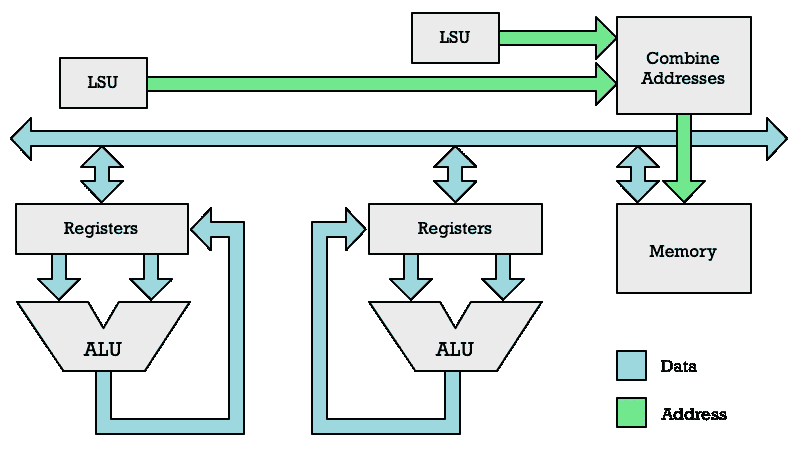

GPU 中的每个 SIMD 通道如何访问内存

由于获取每条 SIMD 车道的数据可能需要多个周期，显卡制造商试图通过安排新任务来优化系统。这让我们想到了下一个概念:*扭曲*和扭曲调度器。

# 组织和管理经线中的线

对于 Nvidia speak，我们称之为对称多处理器(SM)的 GPU 核心。这些 GPU 核心中的每一个都可以同时在 32 个线程上执行一条指令。你可以认为每个 GPU 核心都有 32 个通道的 SIMD 引擎。

这种描述是一种简化，因为每个内核可以有 1 到 4 个 SIMD 引擎，每个引擎在 32 个并行线程上执行一个操作。

我们刚刚讨论了内存访问如何需要多个周期。因此，为了更有效地利用 GPU 核心，我们在线程之间切换。这就像常规的多线程一样。如果一个线程在常规 CPU 上等待输入数据时停滞不前，您可以切换到另一个线程。

同样的事情发生在 GPU 上，除了每个线程不能彼此独立地运行指令，它们被捆绑成所谓的*经线*(显然在编织术语中，经线是一束线程)。

GPU 核心(SMs)可以存储许多扭曲的状态，并在每次另一个扭曲停止时安排一个新的扭曲。这允许更有效地利用 GPU 核心的 SIMD 引擎中的处理能力。在等待输入数据时，另一个经线可以被唤醒并继续处理，而不是闲置。

这些扭曲之间的切换非常快，不像 CPU 中的线程之间的切换。我的理解是，你可以在多个扭曲之间快速切换，并且每个扭曲只执行一条指令，而不会产生额外的开销。

下图试图说明这种调度如何在具有两个 warp 调度器的 GPU 核心中工作。你有四个不同的经线，它们有自己的指令序列需要处理。请注意每个经线的指令是如何按顺序执行的，但其他经线可能会交错执行。

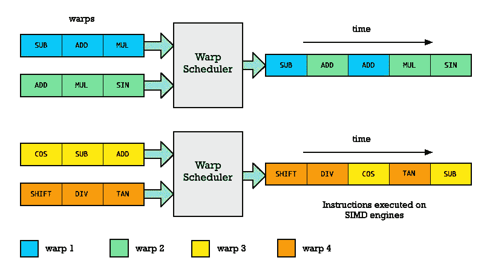

扭曲是如何在 GPU 核心中调度的

如果你对细节更感兴趣，你可以阅读 Nvidia Fermin 微架构的白皮书。

# 将工作组织到线程块中

我们已经研究了在 SIMT 体系结构中如何执行指令的最底层，但没有研究如何分割比如说一百万个元素并分块处理它们。为了解释这一点，我们将看一些矩阵和向量数学相关的代码。

## 关于线性代数和 SIMD 代码例子的题外话

围绕矩阵和向量的数学称为线性代数。它包含关于矩阵乘法，矩阵求逆和许多其他事情的信息。因为这在所有科学和工程中是如此重要，几十年来我们已经有了一个名为 [BLAS](http://www.netlib.org/blas/#_reference_blas_version_3_10_0) 和 LAPACK 的 Fortran 库，其中包含了丰富的线性代数函数集合。这是黄金标准。

因为线性代数涉及矩阵和向量，所以它是任何基于 SIMD 处理的系统的流行目标。因此，无论是查看 RISC-V 向量扩展示例，还是 Nvidia CUDA 或 OpenCL 示例代码，您都会看到提到一些命名神秘的函数，如 [SAXPY](http://www.netlib.org/lapack/explore-html/df/d28/group__single__blas__level1_gad2a52de0e32a6fc111931ece9b39726c.html) 和 [SGEMM](http://www.netlib.org/lapack/explore-html/db/dc9/group__single__blas__level3_gafe51bacb54592ff5de056acabd83c260.html) 。

这些函数在所有与 SIMD 相关的代码示例中都很常见，所以我们将在这里使用它们来解释在基于 SIMT 的代码中，线程是如何组织成线程块的。SAXPY 计算:

```
Y = αX + Y    # saxpy
```

其中`X`和`Y`是矩阵(或向量)`a`是标量。每个 BLAS 函数都是做这些简单的操作。实例的 SGEMM 执行以下操作:

```
C = aA⋅B + βC   # sgemm
```

在线性代数中，矩阵用大写字母，标量用小写字母是很常见的。在我的编程示例中，我将使用`xs`和`ys`来表示元素数组。因此`x`是`xs`中的一个元素，而`y`是`ys`中的一个元素。

## 实现 SAXPY

通常情况下，您会像这样实现 SAXPY，以便在 CPU 上运行。

```
// Single-Precision α ⋅ X Plus Y,
void
saxpy(int n, float a, float *xs, float *ys) {
    for (int i=0; i<n; i++)
        ys[i] = a * xs[i] + ys[i];
}
```

为了让它在 GPU 上运行，我们定义了一个函数，这个函数通常被称为内核。内核通常表示应用于大量元素的代码片段。此语法基于 CUDA (Nvidia)。

请注意，for 循环已经消失了。相反，代码在 SIMT 处理器中的一个 SIMD 通道上执行。这段代码将在 GPU 上运行，而不是在 CPU 上运行，因此内核代码将由图形驱动程序编译并推送到 GPU。

```
_global_void 
gpu_saxpy(int n, float a, float *xs, float *ys) {
    int i = blockIdx.x * blockDim.x + threadIdx.x;
    if (i < n) 
        y[i] = a*xs[i] + ys[i]; 
}
```

阅读更多: [CUDA 示例代码。](https://people.cs.pitt.edu/~melhem/courses/xx45p/cuda_examples.pdf)

显卡本身不会这样做，所以你需要在 CPU 上运行一些代码来设置一切。我们得到了两个包含我们想要处理的`n`元素的数组`xs`和`ys`。为了并行完成这项工作，我们希望将这项任务分成多个块。在 OpenGL 中，他们恰当地将其命名为工作组。Nvidia 称之为线程块。每个 GPU 核可以处理一个线程块。

```
// Invoke parallel SAXPY kernel (256 threads per block)

int blocksize = 256
int nblocks = (n + blocksize-1) / blocksize;
saxpy_parallel<<<nblocks, blocksize>>>(n, 2.0, xs, ys);
```

因为我们经常处理矩阵数据，所以我们开发了一个系统，可以很容易地找出一个线程被分配处理矩阵的哪一行和哪一列。这被称为线程索引。将线程调度到经线的 GPU 机器并不关心线程索引，而是与线程 ID 相关。线程 ID 是唯一标识特定线程的东西。

如果我在一个矩阵上工作，并且想知道我的内核代码正在处理什么行和列，那么我可以问`threadId.x`和`threadIdx.y`的值是什么。这些是映射到每个 GPU 核心(SM)中的寄存器的全局变量。如果我处理一个立方体的数据，我可能也会对`threadIdx.z`感兴趣。

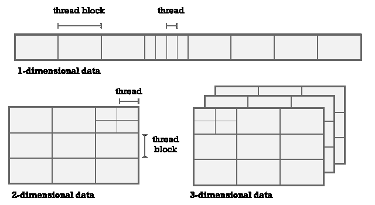

将线程组织成不同维度的块

为了利用更多的 GPU 核心，我们将线程聚集成线程块。硬件设置使得每个 GPU 核可以并行处理一个线程块。

这里有一个重要的观察点:一个 GPU 核心不会同时处理每一个线程。记住它只能同时处理 1-4 根经纱，每根经纱是 32 根。因此，一个 GPU 内核最多可以同时处理 128 个(4 × 32)线程。

## 为什么分配给 GPU 核心的线程比它能够并行处理的线程多？

如果您无法处理所有线程，那么为什么不为每个内核分配更少的线程，并将它们分布在更多的内核上呢？

现在你要记住我们所说的因为等待内存而导致扭曲停止。各种事情都可能发生，这意味着 warp 中的当前指令无法执行。

为了能够有效地利用硬件资源，我们希望有其他的变形来代替它们。因此，即使您的内核只能并行处理 64 个线程，您仍然应该分配更多的线程来保持 SIMD 引擎忙碌。

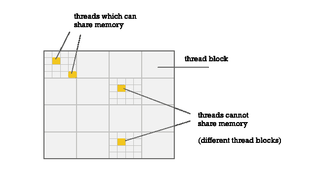

同一块上的线程可以共享内存。

第二个要点是块中的线程可以共享内存。请记住，每个 GPU 核心都有自己的本地内存。这意味着在同一个 GPU 核上执行的加载/存储指令能够访问同一个内存。

因此，如果线程需要彼此共享结果，它们需要在同一个线程块上。

## 数据块大小并不总是与您的阵列匹配

假设你想处理两个有 80 个元素的数组。如果使用一个 64 元素的块，就不能处理整个数组。如果使用两个 64 元素的块，则得到 128 个元素，这太多了。这就是为什么`saxpy`实现有这些行:

```
if (i < n) 
        y[i] = a*xs[i] + ys[i];
```

请记住，内核的调用是基于您设置的线程块配置，而不是基于您的数组实际拥有的元素数量。

因此，我们必须确保不会对每个线程索引进行计算。有些会出界。

## 线是如何映射到经线的？

当处理 1D 数据时，你的线程 ID 和你的`threadIdx.x`将是相同的。ID 为 0，1，...31 将形成一根经纱，而 ID 为 32，33，...63 将形成下一个曲速。

这意味着当我们执行 if 语句`if (i < n)`时，它将发生在一个 warp 中，其中某些线程的条件为真，而其他线程的条件为假。

当运行以下代码的指令时，条件不为真的线程将被简单地屏蔽(程序计数器不更新):

```
y[i] = a*xs[i] + ys[i];
```

使用遮罩是当今所有矢量处理中的常见策略。你会发现这两个向量 SIMD 和包装 SIMD 指令。RVV、SVE 和 AVX 都使用口罩。这是为了解决一个常见的问题，即由 SIMD 引擎处理的元素块很少会整齐地划分您正在处理的整个数据数组。你通常会得到一个尾巴。

早期的压缩 SIMD 指令不支持掩码，因此必须用常规标量指令处理向量的尾端，使得尾端的处理相当慢。

# GPU 硬件需要这么复杂吗？

所有旨在将大量工作负载调度到不同内核的硬件都会带来一定的复杂性。然而，我认为这仍然是一个公平的问题。

从历史的角度来看，SIMT 硬件的概念是有意义的。图形管道通常将 3D 模型中的顶点输入到我们称之为顶点着色器的内核中。稍后，流水线将为顶点之间形成的表面生成片段(具有深度的像素)。这些片段中的每一个都将运行一个片段着色器(内核)。

每个人都想做大量复杂的事情。你会想要做一个顶点坐标的矩阵乘法来做投影变换，移动场景中的相机和许多其他事情。对于片段，你需要查找纹理数据。

对于每个“SIMD 通道”来说，这是一个非常复杂的东西，因此传统的 SIMD 思维必须大大增强，以至于我们得到了 SIMT，它开始越来越像小 CPU 内核本身。也许这就是为什么 Nvidia 称它们为核心，即使它们有点像 SIMD 车道。

对于许多机器学习(ML)和许多科学任务来说，这种方法不一定是关于数据处理的最符合逻辑的思考方式。即使回到 20 世纪 80 年代，编译器也可以这样处理代码:

```
void
saxpy(int n, float a, float *xs, float *ys) {
    for (int i=0; i<n; i++)
        ys[i] = a * xs[i] + ys[i];
}
```

并将其转化为矢量化汇编代码。我们可以看看现代的 RISC-V 矢量扩展变体。当然，这是一个集合，所以更容易记账，也更难跟踪。然而从概念上来说，这比 GPU 卡所做的要简单得多。

这些代码所做的就是计算出我们的向量处理硬件可以处理多少个元素，然后将这些元素加载到向量寄存器中。然后我们调用完成整个计算的汇编代码指令。

每一次迭代，我们都获取另一个块，并加载它进行处理。

```
saxpy:
    # t0 ← min(a0, (VLEN × 8) / 32)
    vsetvli t0, a0, e32, m8, ta, ma

    vle32.v v0, (a1)    # v0 ← mem[a1:a1+t0]

    sub a0, a0, t0      # calc xs elements left to read
    slli t0, t0, 2      # t0 << 2 (each element is 4 bytes)   
    add a1, a1, t0      # point a1 to next xs batch to read

    vle32.v v8, (a2)    # v8 ← mem[a2:a2+t0]
    vfmacc.vf v8, fa0, v0  # v8 ← fa0 × v0 + v8

    vse32.v v8, (a2)    # store batch of results at a2
    add a2, a2, t0      # point a2 to next ys batch to read
    bnez a0, saxpy      # goto saxpy if a0 ≠ 0
    ret
```

这也许也是为什么我们开始看到各种各样的供应商挑战科学计算和机器学习的大型显卡的霸权。你不需要复杂的硬件来处理大量这类数据。

以机器学习和深度神经网络为例。你所做的大部分事情都是大矩阵的乘法和加法。这个问题域可以用一个比 CUDA 更简单的界面来表达。

那么为什么 3D 显卡及其后代会统治这个市场这么久呢？我不是这方面的专家，所以这将是一个猜测:像 Nvidia 这样的公司已经在制造强大的显卡方面建立了能力和规模。调整他们的核心技术以拓展新市场是有意义的。

CUDA 建立在图形硬件工作特性的基础上。对于英伟达和其他公司来说，放弃一个已经主导市场的平台没有太大意义。

类似的例子可能是 x86 CPU 市场。我们都知道 x86 指令集不再是最佳的。这是一个完全过时的指令集(is a)。尽管如此，它仍是主导当前市场的 ISA。对英特尔和 AMD 来说，更有意义的是通过添加新的强大指令来调整现有的设计，在内部添加类似 RISC 的引擎，并添加各种其他昂贵的技巧来阻止竞争，而不是创建一个干净的设计。

当 90 年代的高级 RISC 芯片挑战英特尔时，他们被击败了，因为凭借着较高的产量和利润，英特尔能够在他们的问题上砸钱，并且比 RISC 公司花得更多。

我怀疑类似的策略是什么给了我们作为人工智能加速器的显卡。它们可能不是一个理想的平台，但 Nvidia 等公司通过加入大量新的特殊功能(如张量核心)来保持这些卡的竞争力，从而使它们留在了游戏中。

但最终你可能会达到一个转折点，就像我们今天看到的 x86 与 ARM 的对比。最终，遗产会赶上你，更干净设计的好处会胜出。

# 总结和结束语

如果你读到最后:恭喜你。这个故事有了自己的生命。我非常希望我能写一个更简洁的版本。但正如布莱士·帕斯卡所说:“很抱歉信写得这么长，我没有时间写一封更短的。”

我决定推出这个版本，而不是花时间写一个更短的版本。无论如何，我想总结一下这是怎么回事。

现代高性能计算都与某种并行性有关。要么我们使用超标量 CPU 内核来实现指令级并行，要么我们通过创建多个内核来实现任务并行。每个内核可以运行一个硬件线程，执行不同的任务。

最后，我们可以利用数据并行性，这是本文的重点。即处理同一操作可以同时应用于多个元素的情况。它是科学计算、线性代数、计算机图形学、机器学习和许多其他领域中出现的东西。

我试着从最简单的方法开始，让你理解:

*   压缩 SIMD 指令——特定的指令，它说:“将寄存器 v0 乘以 v1，其中两者都有 8 个 32 位元素。”
*   向量 SIMD 指令——我们抽象地向上移动，隐藏我们有多少条 SIMD 车道。硬件架构师可以在不改变指令集的情况下增强 CPU。
*   单指令多线程(SIMT) —意味着每个 SIMD 通道现在都在执行一大堆指令。它们甚至可以读取内存，跟踪它们在程序中的位置(程序计数器寄存器)等等。

有了 GPU，我们获得了一个全新的抽象层次。您永远不会看到生成的汇编代码。你把高级代码发送给一个驱动程序，驱动程序对它进行编译。硬件的功能已经基本上被抽象化了。

然而，这种抽象可能无法完美地工作，原因很简单，GPU 核心不是通用处理器。常规的 C 代码可以被编译成矢量化代码。你不能用 GPU 代码做到这一点。你必须通过指定诸如线程块的数量和大小之类的东西来明确你实际上是针对 GPU 的。

# 相关故事

我写的关于硬件的故事，可能会感兴趣。

*   [RISC-V 矢量指令 vs ARM 和 x86 SIMD](https://medium.com/swlh/risc-v-vector-instructions-vs-arm-and-x86-simd-8c9b17963a31) —重点比较压缩 SIMD 和矢量 SIMD 指令以及它们存在的原因。
*   ARMv9:有什么大不了的？ —详细介绍添加到 ARMv9 架构中的 SVE2 矢量 SIMD 指令集。
*   [RISC-V 微处理器的天才](https://erik-engheim.medium.com/the-genius-of-risc-v-microprocessors-b19d735abaa6)——与 SIMD 无关，而是关于 RISC-V 内核中的指令压缩和宏操作融合。
*   [现代微处理器是如何工作的](https://medium.com/swlh/how-does-a-microprocessor-work-e06d196efd8f)——意为初学者介绍微处理器是如何工作的。我们来看一个简化的 RISC 处理器。它对十进制数而不是二进制数进行运算，以简化解释。

# 资源

*   [CUDA C++编程指南](https://docs.nvidia.com/cuda/cuda-c-programming-guide/index.html) —伟大的 Nvidia 指南，通过良好的矩阵乘法示例详细介绍线程和模块。
*   [CUDA 二进制实用程序](https://docs.nvidia.com/cuda/cuda-binary-utilities/index.html#instruction-set-ref) —通过查看 CUDA 的汇编器/反汇编器来解释 GPU 汇编代码。
*   [更多计算着色器](https://anteru.net/blog/2018/more-compute-shaders/) —解释着色器汇编指令如何工作。
*   [ARB 汇编语言](https://en.wikipedia.org/wiki/ARB_assembly_language) —有点类似汇编的低级着色语言。旧的 OpenGL 的东西。