# 针对运营商管理的 K8s 有状态应用的 Velero 备份/恢复

> 原文：<https://itnext.io/velero-backup-restore-for-k8s-stateful-applications-managed-by-operators-8fd9c732ffcc?source=collection_archive---------0----------------------->

[Velero](https://velero.io/) 是 Kubernetes 的备份和恢复工具，Kubernetes 是最广泛采用和使用的容器编制器。Kubernetes 已经发展成为拥抱容器世界的开发人员的救星，缩短了他们的冲刺时间，使生活变得更加轻松。从 CI/CD 管道到生产就绪 Pod(K8s 中构成容器的最小单元/对象),构建部署已经从几周缩减到几天和几小时。

另一方面，IT 系统已经采用了 Kubernetes，与开发人员有着相同的基调和活力，但随之而来的是管理它和为日常操作运行它的麻烦。K8s 通过将网络、计算和存储抽象化，在管理基础架构方面带来了新的挑战。所有这些资源都变成了 JSON 文件中的一个对象，并存储在一个有状态的 **etcd** 数据库中。Kubernetes 现在是所有主要公共云中的 PaaS，用于工作负载部署，并推动云原生应用程序的概念。

企业面临的主要挑战之一是保持应用程序的高可用性和弹性。K8s 上应用程序的云原生设计通过内置的关键功能高度可用，如自动扩展、集群节点的跨区域实施、ReplicaSet、StatefulSet、metro-stretch 存储系统等。

如果我们退后一点，应用程序托管在一个高度可用的架构上的一个云上。但是它们有弹性吗？BCP，当灾难来临的时候怎么样！，公司还有吗？是的，自磁带备份和异地保险存储时代以来，备份和恢复技术一直在拯救我们的任务关键型业务应用程序。

TL；dr 我在这里尝试列举并说明弹性是如何构建到托管在 Kubernetes 或公共云上的 Kubernetes 即服务上的任务关键型有状态应用程序中的。

为了集中讨论，我将使用 IBM 公共云的 [IKS](https://www.ibm.com/in-en/cloud/container-service) (Kubernetes 服务)和 [COS](https://www.ibm.com/in-en/cloud/object-storage) (云对象存储——不可变)。您还可以将 [Minio](https://min.io/) 用于您的对象存储，这是一个很好的工具，可以通过将更快的存储层映射到您的节点来获得更好的性能。该指南也非常适合普通的 Kubernetes 内部部署。

Velero 架构及其内部工作原理在他们的网站 Github 文档中有很好的记录，所以我在这里不做尝试。但是下面的架构会给你一个整体的视角。

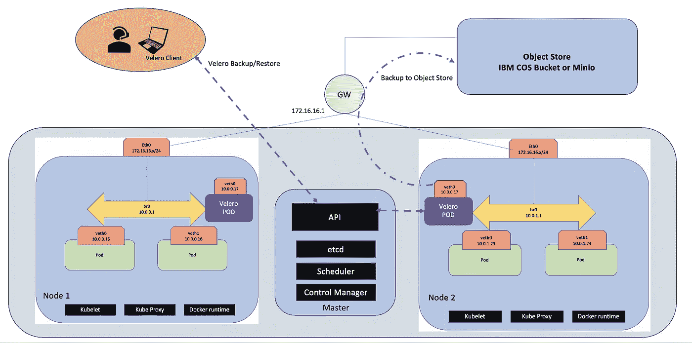

Velero 与 K8s 集成，用于备份到 COS/Minio

所以我们开始吧！

**下载并安装 Velero 客户端**

下载 Velero 如这里所述:【https://github.com/vmware-tanzu/velero/releases/tag/v1.3.2】T2。一次 tar ball 下载应该会安装 Velero 客户机程序以及集群所需的配置文件。

提取 tar.gz 文件，并将其移动到本地工作目录。将 Velero 目录添加到路径中。例如，如果您已经下载了 velero-v1.3.0-darwin-amd64，则运行以下命令

> *导出路径= $ PATH:/usr/local/bin/velero-v 1 . 3 . 0-Darwin-amd64/*

运行命令 velero - help 来探索它提供的选项。

**配置 Velero 设置和设置 COS**

配置您的 kubectl 客户机来访问您的 IKS 部署。创建一个 COS bucket 和相关的服务凭据，以便在 Velero 安装期间使用。在本地目录中创建一个特定于 Velero 的凭证文件(credentials-velero)。将您的<cos access="" key="" id="">和<cos secret="" access="" key="">替换为您为 COS bucket 创建的 COS 服务凭证。</cos></cos>

```
echo “[default] 
aws_access_key_id = <COS access key ID> 
aws_secret_access_key = <COS secret Access key>” > credentials-velero
```

现在使用下面的 Velero install 命令安装 Velero 服务器。用您的 COS 桶名替换<cos bucket="" name="">。编辑 COS 区域和 s3URL 以匹配您的选择。插件是必需的，如下所示。</cos>

```
velero install \
 — provider aws \
 — bucket <COS bucket name> \
 — secret-file ./credentials-velero \
 — use-volume-snapshots=false \
 — backup-location-config region=us- east,s3ForcePathStyle=”true”,s3Url=https://<S3 URL>
 — plugins velero/velero-plugin-for-aws:v1.0.0
```

这将在 IKS 集群上执行 Velero 安装作为部署，如下所示。完成后，输出应该类似于下图。

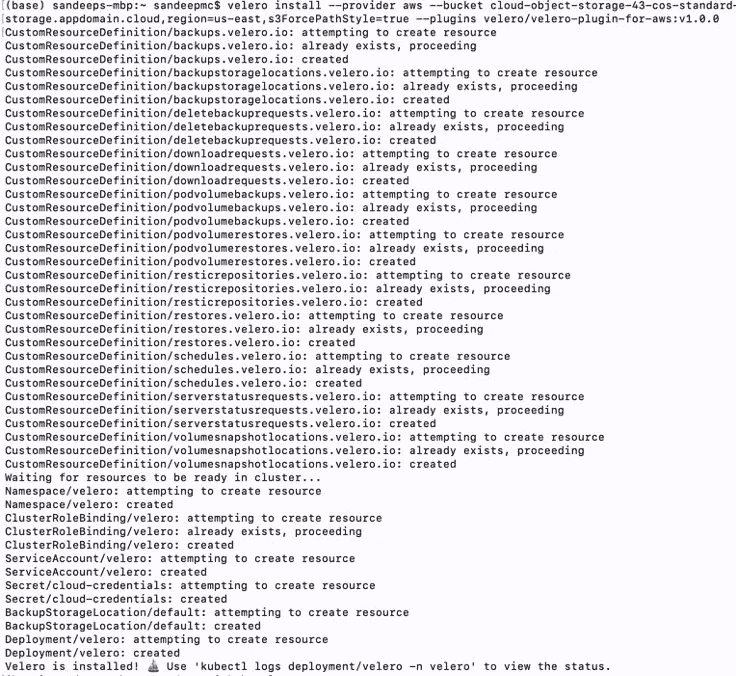

Velero 安装

Velero 部署创建了一个名为 Velero 的独立名称空间，Velero pod 驻留在该名称空间中。

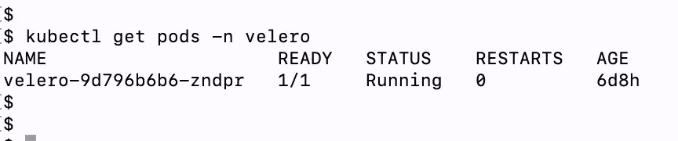

“Velero”命名空间内的 Velero pod

**设置您的应用程序进行备份**

我们将部署一个示例应用程序(在我们的例子中是一个带有 MySQL DB 的 WordPress 应用程序),其中包含一个使用 PVC 备份的卷，并将其动态映射到 IKS 的一个预定义存储类。在本练习中，我们将为 IKS 使用 IBM NFS 文件存储。

创建一个与存储类 ibmc-file-silver 关联的 PVC

```
---
apiVersion: v1
kind: PersistentVolumeClaim
metadata:
 name: mysql-silver-pvc
 labels:
 billingType: hourly
 region: us-south
 zone: dal10
spec:
 accessModes:
 — ReadWriteMany
 resources:
 requests:
 storage: 24Gi
 storageClassName: ibmc-file-silver
```

PVC 与存储类 ibmc-file-silver 绑定

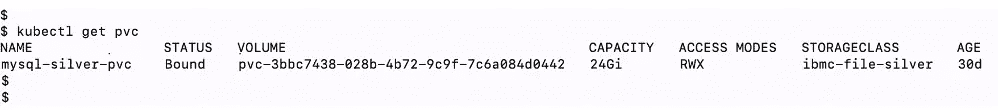

动态创建和绑定 PVC

我们将使用 MySQL 部署 wordpress，下面是 yaml。使用您选择的编辑器(vi)创建一个名为 mysql.yaml 的. yaml 文件。用您选择的安全密码替换<*密码* >的 env 值。这个密码将在以后用于登录 MySQL 数据库。快跑。yaml 文件，带有 kubectl 命令 kubectl apply-f<MySQL . YAML>

```
apiVersion: apps/v1 # for versions before 1.9.0 use apps/v1beta2
kind: Deployment
metadata:
 name: wordpress-mysql
 labels:
 app: wordpress
spec:
 selector:
 matchLabels:
 app: wordpress
 tier: mysql
 strategy:
 type: Recreate
 template:
 metadata:
 labels:
 app: wordpress
 tier: mysql
 spec:
 containers:
 — image: mysql:5.6
 name: mysql
 env:
 — name: MYSQL_ROOT_PASSWORD
 value: <password>
 ports:
 — containerPort: 3306
 name: mysql
 volumeMounts:
 — name: pvc-3cb5302d-5cb5–43ed-bff3–4926f1d4852d
 mountPath: /var/lib/mysql
 volumes:
 — name: pvc-3cb5302d-5cb5–43ed-bff3–4926f1d4852d
 persistentVolumeClaim:
 claimName: mysql-silver-pvc
```

应用程序窗格被派生出来，看起来类似于下图。

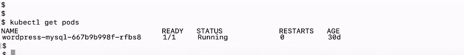

Wordpress 窗格已创建

现在我们已经创建了一个有状态的应用程序 pod，我们将检查 pod 是否正在运行，并验证 pod 的详细信息。详细的 pod 描述将显示所有信息，如节点、PVC、IP 详细信息、卷安装等。如下图。

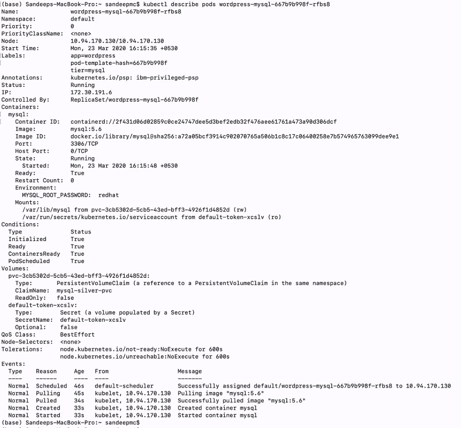

Wordpress 窗格详细信息

**配置 MySQL pod**

我们可以通过将备份范围限定到应用程序的名称空间来备份示例应用程序。因为我们已经在默认名称空间中部署了我们的应用程序，所以我们可以将其保留为默认名称空间。

我们将进入分离舱的外壳。以用户“root”和我们在部署 yaml 文件中提供的<password>身份登录 MySQL 数据库。然后，我们将创建如下所示的几个示例数据库(test1、test2 ),在卷中创建一个持久数据。</password>

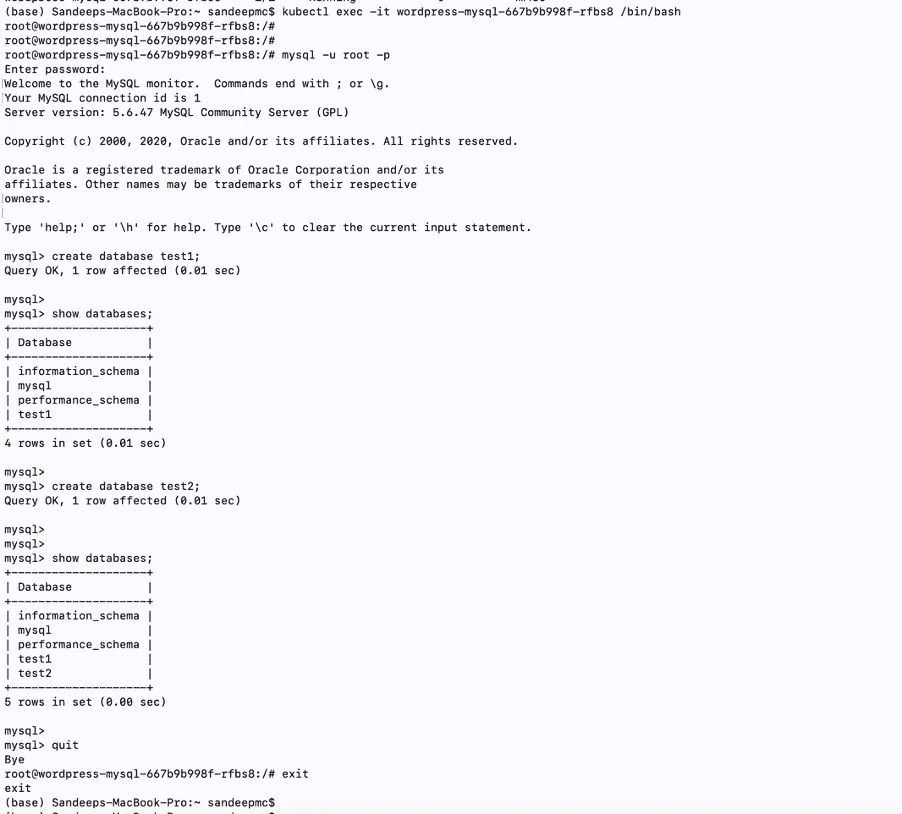

进入 MySQL pod 并创建数据库

**使用 Velero 备份 K8S 配置和卷**

使用 Velero 命令创建备份。Velero 提供了一种在不同名称空间中查找 pod 的粒度方法。这里我们可以使用 Pod 选择器 app=wordpress，它已经在 MySQL 部署期间声明了。这将让 Velero 使用匹配的选择器创建特定 pod 的备份。下图还提供了所创建备份的详细描述。

注意:我们需要每个 POD 的 Restic 注释，以便 Velero 能够进行备份。这在博客中没有显示。

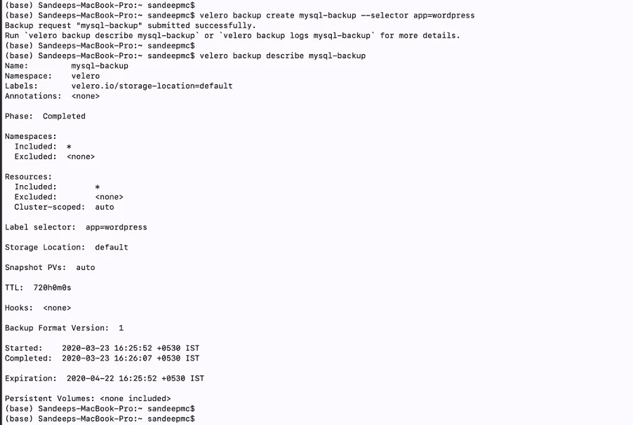

使用 Velero 创建备份

**验证 COS 中的备份**

下图显示了为 MySQL pod 备份的文件。仔细查看，了解 Velero 备份的文件

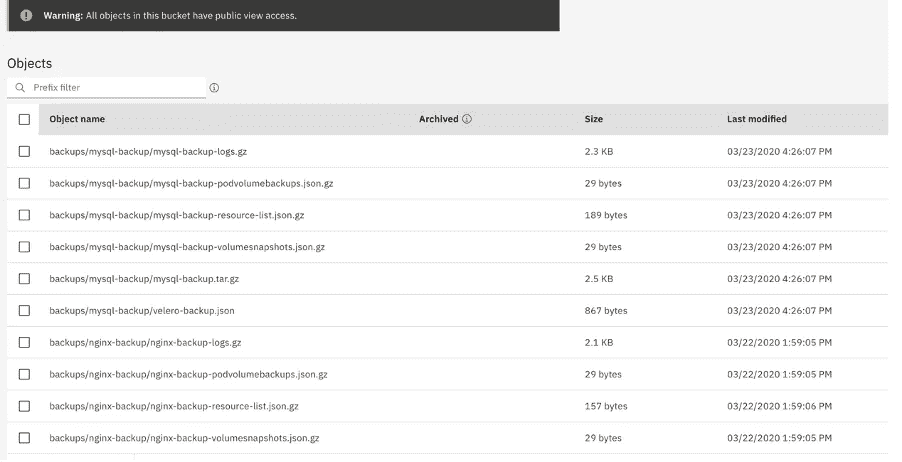

对象存储(COS)中的备份文件

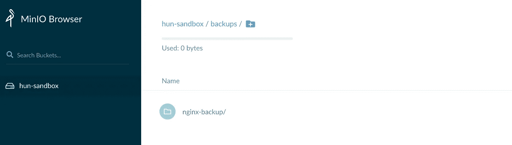

迷你备份文件(例如)

**模拟灾难和恢复应用**

我们现在将删除 MySQL 部署，并验证部署和关联的 pod 是否也被删除，如下所示。

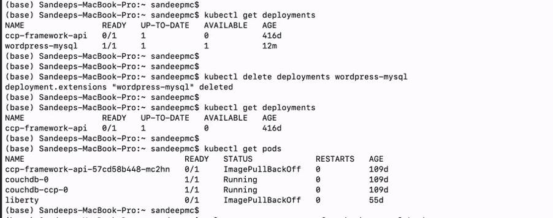

删除部署和窗格

**使用 Velero 恢复并验证部署和 MySQL 数据库**

我们将运行 Velero restore 命令，从 COS 中的备份文件恢复 MySql 部署。不一会儿，我们注意到 Velero 已成功恢复部署。

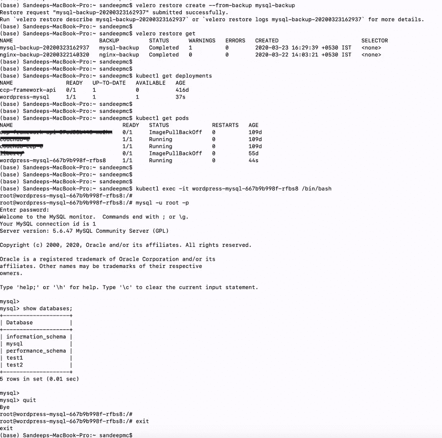

使用 Velero 从 COS(对象存储)恢复 MySQL

一旦我们恢复了部署，相关联的吊舱也启动了。我们进入 shell 并登录 MySQL 数据库。我们可以看到我们之前创建的数据库(test1 和 test2)完好无损。

在下一节中，我们将更深入地了解 Velero 的功能

**使用 K8s 操作符通过 CRD 设置应用**

Kubernetes 有控制器，这些控制器是控制循环，监视您的[集群](https://kubernetes.io/docs/reference/glossary/?all=true#term-cluster)的状态，然后根据需要做出或请求更改。每个控制器都试图将当前的群集状态移至更接近所需的状态。

Kubernetes 还有名为 CRD 的定制控制器，它定义了定制资源和相关的控制器。自定义资源本身只是让您存储和检索结构化数据。当您将自定义资源与自定义控制器相结合时，自定义资源提供了真正的声明性 API。一个[声明式 API](https://kubernetes.io/docs/concepts/overview/kubernetes-api/) 允许您声明或指定您的资源的期望状态，并试图保持 Kubernetes 对象的当前状态与期望状态同步。控制器将结构化数据解释为用户期望状态的记录，并持续保持该状态。

操作符是一种打包、部署和管理 Kubernetes 应用程序的方法

因此，当定制控制器在本地 Kubernetes 资源和事件上操作和监听时，操作员使用定制资源定义(CRD)，即用户为解决复杂的业务问题而创建的资源。操作员可以被认为是人类操作员的替代品。知道应用程序的技术细节，也知道业务需求并据此行动的人。

**安装 OLM 和 CouchDB 操作器**

我们将在 IKS 部署一个用于 CouchDB 安装的操作员。CouchDB 安装需要操作员和一些其他先决条件。

CouchDB 操作员管理 CouchDB 集群安装的每一步。此后，它管理 CouchDB 集群的健康和集群仲裁。

要安装操作符，您必须安装[操作符生命周期管理器](https://github.com/operator-framework/operator-lifecycle-manager) (OLM)，这是 Red Hat 的一个工具，用于帮助管理在您的集群上运行的操作符。运行以下命令来安装 OLM 和 CouchDB 操作符

> curl-sL[https://github . com/operator-framework/operator-life cycle-manager/releases/download/$ OLM _ RELEASE/install . sh](https://github.com/operator-framework/operator-lifecycle-manager/releases/download/$OLM_RELEASE/install.sh)| bash-s $ OLM _ RELEASE
> 
> https://operatorhub.io/install/couchdb-operator.yaml
> 
> kubectl 获取 csv -n 运算符

治疗床 DB 的操作器安装在一个单独的名称空间中，如下图所示(见图中突出显示的行)。另请参见部署在 Operators 名称空间中的 CouchDB Operator pod。

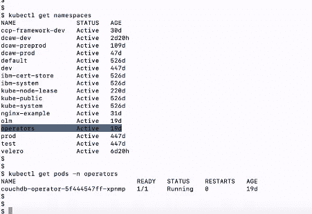

运算符作为单独的命名空间

**安装 CouchDB 集群**

使用 CouchDB 操作符，我们安装了 CouchDB 集群。CouchDB 集群部署在一个单独的名称空间上。下面显示了 CouchDB 集群和集群的相关 pod 的详细信息。

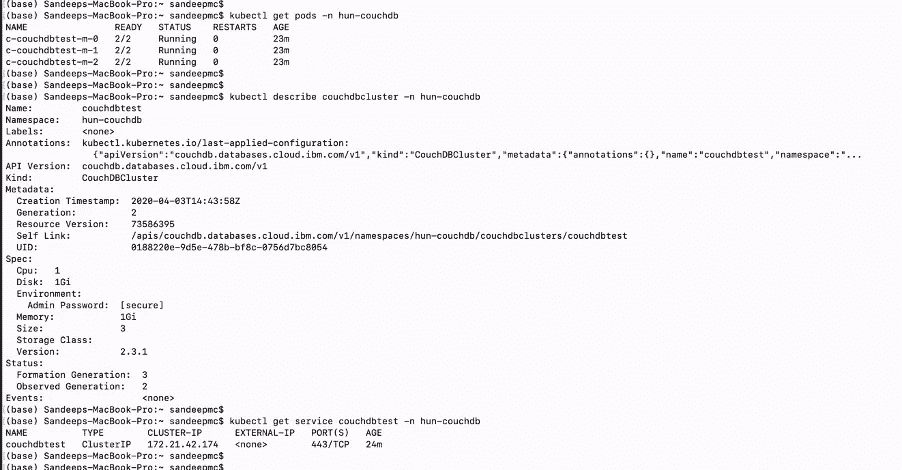

CouchDB 集群和 Pod 详细信息

**couch db 集群的 Velero 备份**

我们运行相同的 Velero 命令来备份 CouchDB 集群。请注意，我们使用-include-namespace 选项来指定集群。我们不需要使用 pod 选择器，因为所有的 pod 都是类似的 CouchDB 集群的一部分。

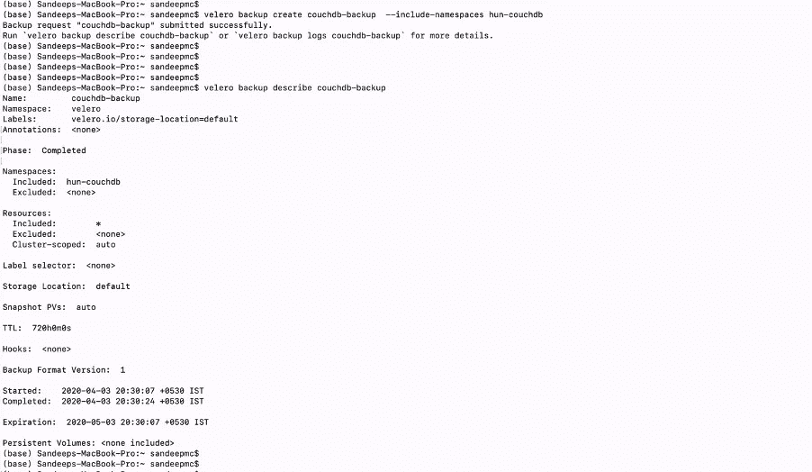

使用 Velero 备份 CouchDB 集群

下面是 COS bucket 中的图像，显示了 CouchDB 备份的文件。

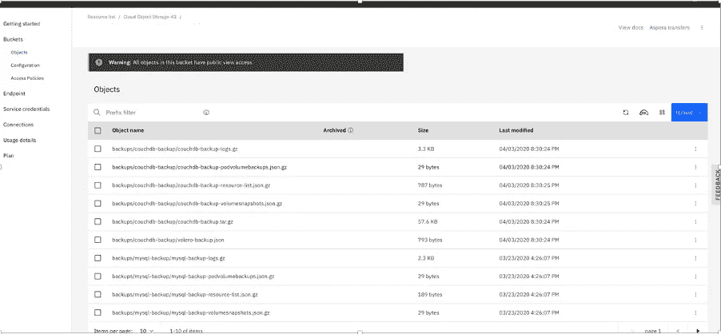

COS 中的 CouchDB 备份

**couch db 集群的 Velero 恢复**

我们不会删除 CouchDB 的所有名称空间和所有关联的 pod，以便运行 Velero restore 命令来恢复所有集群。操作员和 OLM 不会被移除，将保持不变。现在，我们将从 COS 中的备份中恢复 CouchDB。下图显示了 Velero 中可用的备份以及运行 restore 命令后的结果。您会注意到名称空间(hun-couchDB 突出显示)已恢复。现在，CouchDB 集群恢复了之前集群中的所有三个 pod。

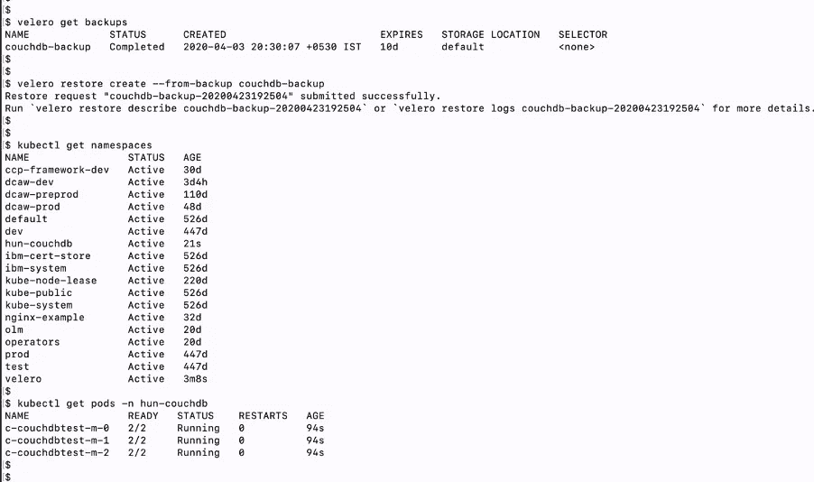

使用 Velero 恢复 CouchDB

我希望这些插图能够让您清楚地了解 Velero 及其功能，以及如何使用正确的技术轻松部署。

## 结论

*免责声明:在结束之前，我想就 Velero 作为运行在 Kubernetes 上的云本地有状态应用程序的备份和恢复解决方案发表一下我个人的看法。*

我们有各种各样的行业供应商，他们一直在销售备份和恢复产品。我曾经尝试使用 Kubernetes 的一个主要供应商的备份产品，但是我可以说它与 Kubernetes 的耦合非常松散。它在每个工作节点内运行一个客户端 pod，该 pod 与它的主/媒体服务器通信，并且该 pod 需要被映射到持久卷(PV ),该持久卷被映射到应用程序。同一个 pod 也可以在您的应用程序 pod 中作为边车容器运行。这些对应用程序 pod 及其 PVs 的严重依赖必然会成为一种限制和障碍。

Velero 与 Kubernetes API 紧密结合。从架构的角度来看，Velero 有一个服务器组件，它可以作为名称空间部署在您的集群中，这本身就为它提供了多租户功能，并与不同名称空间中的其他工作负载相隔离。它在使用标签:选择器和名称空间等进行备份时引入了粒度。您可以运行一个高效的 Kubernetes 多租户工作负载环境，Velero 也是该集群的一部分，为您的所有应用程序创建备份策略。

最后，我相信这篇文章已经阐明了 Velero 的一些特性和功能，将来还会有更多关于 Velero 与 Kubernetes 更详细集成的文章和讨论。