# 使用 ksniff 和 Wireshark 验证 Kubernetes 中的服务网状 TLS

> 原文：<https://itnext.io/verifying-service-mesh-tls-in-kubernetes-using-ksniff-and-wireshark-2e993b26bf95?source=collection_archive---------4----------------------->

## 查看 k8s 集群内的加密流量

与来自 [HashiCorp](https://www.hashicorp.com/) 的 [Nic Jackson](https://twitter.com/sheriffjackson) 一起，我最近在几个会议和网络研讨会上讲述了在现代应用中，跨越端到端，或“[用户到服务](https://www.cncf.io/event/securing-cloud-native-communication-from-end-user-to-service/)”的传输层加密的需求。针对从用户浏览器到应用边缘的流量的 TLS 加密(和终止)一直是 API 网关、cdn 和边缘代理的长期特性，但直到最近，服务网格技术才使针对服务到服务流量实施 TLS 成为我们大多数人的现实方法。

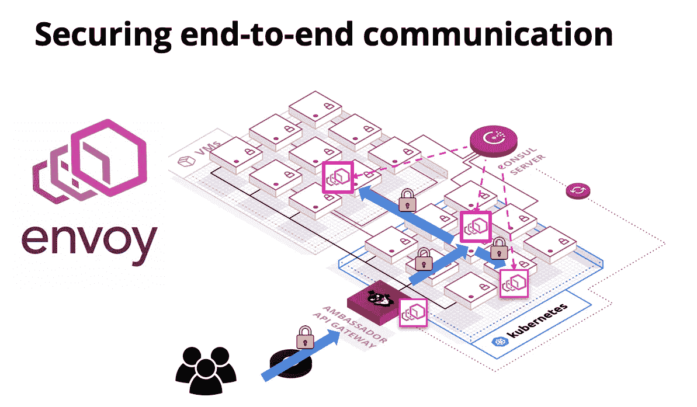

许多服务网格实施承诺低接触 TLS 实施，允许运营商通过单个配置选项或 YAML 文件中的几行来实现这一点。但是，您如何知道您的集群间流量确实被成功加密了呢？当然，您可以在 Kubernetes 集群中运行的 Pod 内启动 [tcpdump](https://www.tcpdump.org/) ，但是这可能很难管理，尤其是对于那些不太熟悉 Linux 工具的人来说。在最近的一系列服务网格调查和 TLS 调试之后，我遇到了来自 [Eldad Rudich](https://twitter.com/d3bu9) 的[ksniff](https://github.com/eldadru/ksniff)插件，它被证明是一个非常有用的工具，可以用来检查集群内的流量。

我想分享我从使用 ksniff 中学到的东西，并根据我最近对 API 网关和服务网格的第一个内部跳之间的 TLS 通信的研究，提供几个例子。

# ksniff—Wireshark 的所有优点，运行在 Kubernetes

根据该项目的 GitHub repo，ksniff 是一个“使用 tcpdump 和 wireshark 来缓解 kubernetes pods 上的嗅探的插件”。我使用 tcpdump 和 Wireshark 检查网络流量已经很多年了，但是我发现在 Kubernetes 中使用它有些棘手。使用一个简单的`kubectl`插件，比如 ksniff，几乎消除了配置这两个流量嗅探工具的所有手工操作。

你可以使用`kubectl`插件包管理器 [krew](https://github.com/GoogleContainerTools/krew) 安装 ksniff:

```
$ kubectl krew install sniff
```

我以前也手动安装过 ksniff(因为我想访问一个当时 krew 包中没有的特性)，这很容易做到，也有很好的文档记录。

你还需要在你的本地机器上安装 [Wireshark](https://www.wireshark.org/) 。我通常是通过网站下载完成的，但是你也可以通过大多数包管理器找到 Wireshark，比如 apt 和 brew。

现在您已经安装了工具，让我们来进行一次演示。

# 嗅探未加密的边缘到服务流量

我已经通过 Helm 将[大使 API 网关](https://www.getambassador.io/)和[哈希公司的领事服务网格](https://www.hashicorp.com/products/consul/service-mesh)部署到 GKE 托管的 Kubernetes 集群中。由于 [Ambassador 和 Consul](https://www.consul.io/docs/platform/k8s/ambassador.html) 之间的集成，我可以向通过 Ambassador 公开的 API 端点(管理 GCP 负载平衡器)发出请求，并通过 TLS 连接将该请求从网关动态路由到 Consul 管理的任何内部服务。我还可以使用 Consul 作为 Ambassador 的简单服务发现机制，它支持流量的动态路由，但不使用传输加密。让我们先这样做，因为这样您可以通过 ksniff 看到未加密的流量。

我已经安装了 Ambassador、Consul 和一个“当前引用(QOTM)”服务，如[网关/网格集成文档](https://www.getambassador.io/user-guide/consul/)的前半部分所述。在我的集群中，我看到以下服务正在运行:

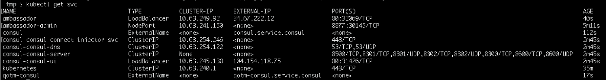

我可以向通过`/qotm-consul/`端点公开的 QOTM 应用程序发出外部请求，该端点通过 Ambassador 和 Consul 路由

```
$ curl -v 34.67.222.12/qotm-consul/
*   Trying 34.67.222.12...
* TCP_NODELAY set
* Connected to 34.67.222.12 (34.67.222.12) port 80 (#0)
> GET /qotm-consul/ HTTP/1.1
> Host: 34.67.222.12
> User-Agent: curl/7.54.0
> Accept: */*
> 
< HTTP/1.1 200 OK
< content-type: application/json
< content-length: 174
< server: envoy
< date: Mon, 05 Aug 2019 08:30:18 GMT
< x-envoy-upstream-service-time: 1
< 
{"hostname":"qotm-7fcb555cdf-xb27c","ok":true,"quote":"Nihilism gambles with lives, happiness, and even destiny itself!","time":"2019-08-05T08:30:18.802450","version":"1.7"}
* Connection #0 to host 34.67.222.12 left intact
```

这个请求看起来一切都很好，读了这段话后，我已经开始觉得自己更聪明了……:)

让我们发出另一个请求，但是通过 ksniff 查看内部集群间网络流量。首先，我需要获得 QOTM 服务的 Pod 的名称，因为这是我将连接 ksniff 的地方:


现在，我可以通过本地机器用一个简单的命令将 ksniff 连接到这个 Pod:

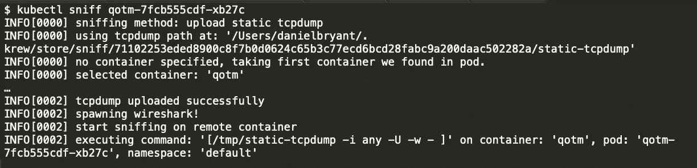

您可以在 CLI 输出中看到所有 tcpdump 配置，如果一切顺利，Wireshark 应该会启动，这将显示以下窗口:

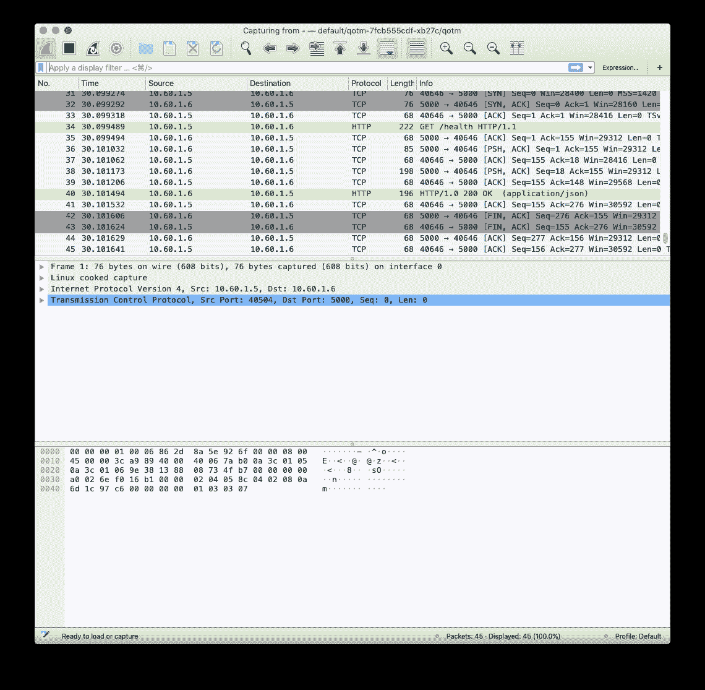

Wireshark 用户界面起初看起来有点令人生畏，但实际上并不复杂。顶部的菜单栏允许您开始和停止网络流量捕获，还可以搜索和导航捕获的流量数据。菜单栏正下方还有一个显示过滤器。顶部窗口显示流入和流出 Pod 网络接口的流量数据包，中间窗口提供流量概述(如协议详细信息和报头元数据)，底部窗口显示流量数据包内容。

您可以应用显示过滤器，只显示 http 流量，只需在过滤器框(菜单栏下方)中键入“HTTP”并按回车键即可。现在，如果您通过网关发出请求，您应该看到 Pod 处理这个请求并生成响应:

```
$ curl 34.67.222.12/qotm-consul/
{“hostname”:”qotm-7fcb555cdf-xb27c”,”ok”:true,”quote”:”Nihilism gambles with lives, happiness, and even destiny itself!”,”time”:”2019–08–05T08:40:28.469624",”version”:”1.7"}
```

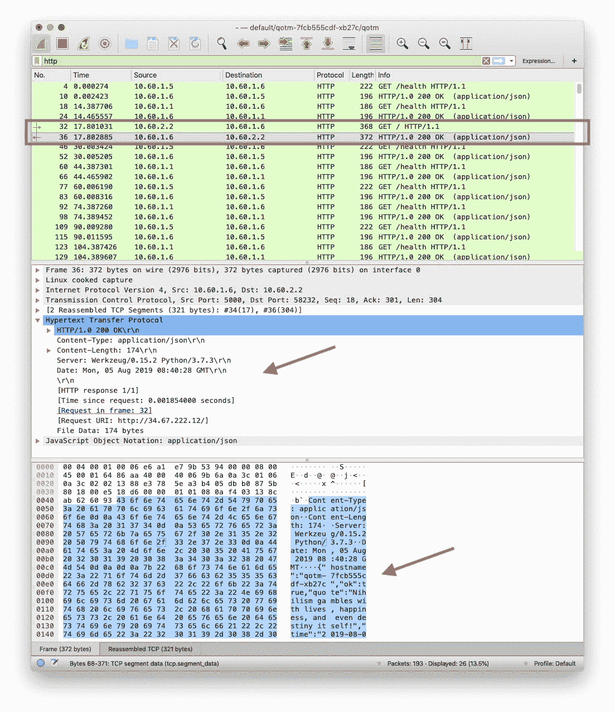

您可以忽略大量的`GET /health HTTP`请求，因为这些请求是通过 Kubernetes 节点的 kubelet 生成的，在 kube let 中部署了这个 Pod，这是部署就绪检查的结果。

有意思的是`GET / HTTP request`，用红框突出显示。您可以看到入站 HTTP 请求来自`10.60.2.2`，这将导致一个响应，其中包含由 Python 服务器(通过第一个红色箭头显示)生成的 200 HTTP 状态代码，该服务器是 QOTM 服务，HTTP 有效负载(通过第二个红色箭头显示)与您向集群发出 curl 请求时看到的结果相同。

如果我查看所有 Pod 的配置，我可以看到集群内的`10.60.2.2`流量源 IP 属于大使 Pod，而`10.60.1.6`的目的地属于 QOTM Pod。这似乎是合理的，因为我提出了一个外部请求，即 Ambassador 通过 Consul 服务查找路由到 Pod IP。

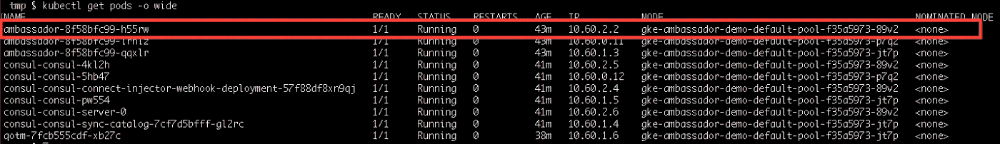

在这一点上，我鼓励您向集群发出更多的请求，也许部署您自己的服务，并继续探索集群中流动的请求。

现在让我们启用大使和领事服务网状 mTLS 集成，这将加密来自边缘和服务到服务的所有流量，并查看使用此配置生成的流量。

# 加密边缘到服务流量达到峰值

为了简单起见，我建议终止您当前与 QOTM Pod 的 ksniff 连接，并从您的 Kubernetes 集群中删除当前的 QOTM 服务和地图。

之后，您可以返回到大使和领事集成文档中的[“加密”部分，并安装第二版的 QOTM 服务，该服务使用领事连接和特使侧车来管理进出 pod 的所有流量处理(如果您正在跟进，请不要忘记应用`ambassador-consul-connector.yaml`，因为没有它，演示将无法工作)。](https://www.getambassador.io/user-guide/consul/#encrypted-tls)

一旦一切就绪并开始运行，您应该能够通过新的端点`/qotm-consul-tls/`向这个修改后的服务版本发出请求

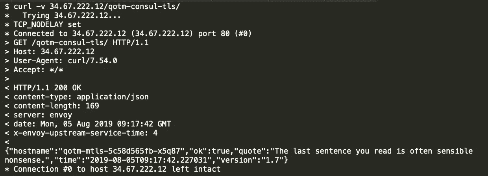

现在让我们将 ksniff 连接到您的新 QOTM 吊舱。如果你在豆荚处检查，你会注意到这个版本的 QOTM 有两个容器，一个用于 QOTM 服务，一个用于领事管理的特使边车:

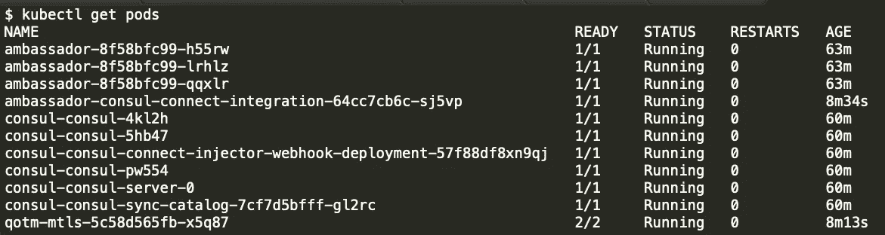

您可以描述 pod 来获取容器名称，这也将显示一些关于如何使用 init-container 引导 Envoy sidecar 的有趣信息:


下面突出显示了 Envoy sidecar init 容器中有趣的细节，它显示了启动时生成并加载到 sidecar 中的 Envoy 配置。您可以看到我的 QOTM 服务在端口 5000 上侦听的详细信息，还可以看到 Envoy sidecar 将在 Pod 的网络接口上侦听端口 20000。请记下这一点，因为您将在稍后的博客文章中使用这些信息。

```
...
      cat <<EOF >/consul/connect-inject/service.hcl
      services {
        id   = "${POD_NAME}-qotm-sidecar-proxy"
        name = "qotm-sidecar-proxy"
        kind = "connect-proxy"
        address = "${POD_IP}"
        port = 20000

        proxy {
          destination_service_name = "qotm"
          destination_service_id = "qotm"
          local_service_address = "127.0.0.1"
          local_service_port = 5000

        }
...
```

如果此时您不想使用完整的 describe 命令，您还可以使用一点`kubectl`魔法从标有“qotm-mtls”的 Pod 中获取容器名称:

```
$ kubectl get pods -l app=qotm-mtls -o jsonpath={.items[].spec.containers[*].name}qotm consul-connect-envoy-sidecar
```

在这里你可以看到领事注入特使边车被称为“领事-连接-特使-边车”。

将 ksniff 连接到具有多个容器的 Pod 时，您需要指定要连接到哪个容器。由于一个 Pod 中的所有容器共享一个网络名称空间，因此容器的选择通常取决于您可以成功附加到哪个容器，例如，哪个容器具有正确的权限并且没有运行临时基础映像等(在下面的“高级技术”部分中可以找到更多信息)。

我现在将 ksniff 连接到我的 QOTM 吊舱和特使边车集装箱:

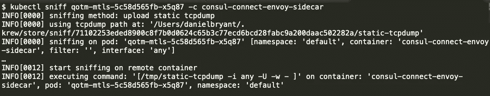

如果我将“http”过滤器添加到 Wireshark，并向我的 QOTM 服务发出请求，我会看到以下内容:

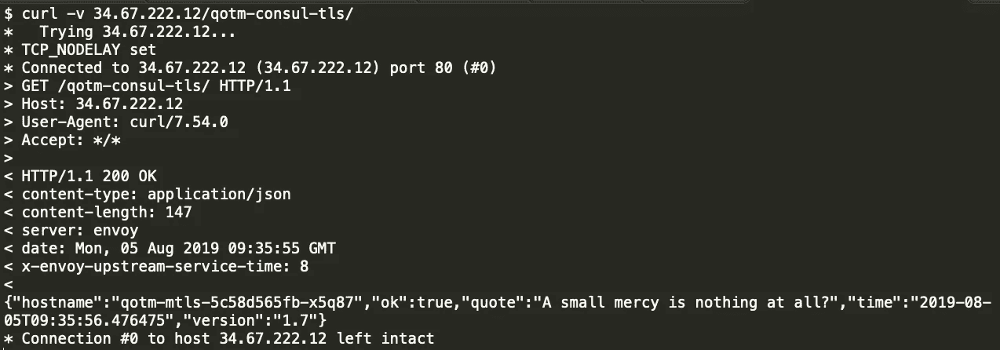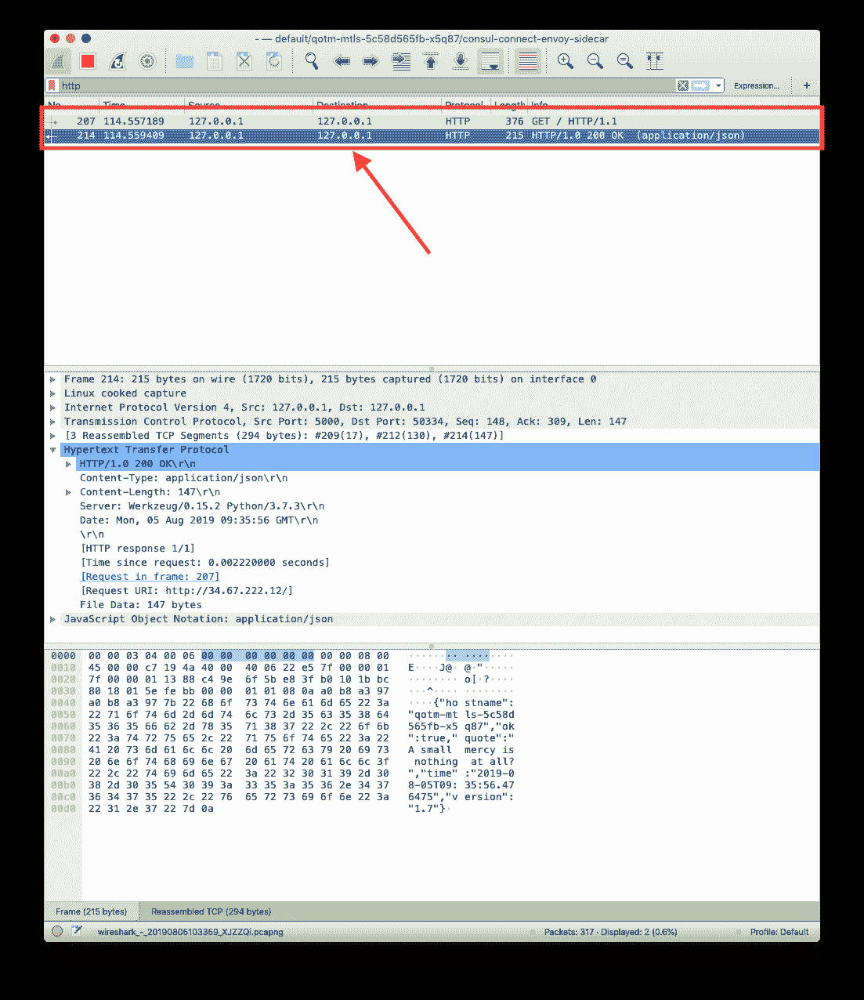

除了注意源和目的 IP 地址:它们都是`127.0.0.1`之外，一切看起来与前面的例子非常相似。您在这里看到的是领事特使 sidecar 和 QOTM 服务之间的未加密流量，它们通过 Pod 的本地主机环回适配器进行通信。这在容器之间是可行的，因为一个 Pod 中的所有容器共享一个网络名称空间。顺便提一下，值得注意的是，在生产中，QOTM 服务应该只绑定到 Pod 的环回适配器，因为您不希望 Pod 之外的任何进程通过不安全的传输介质(即 HTTP)与它通信。然而，这将意味着 HTTP 准备就绪检查(通过节点的 kubelet 进行)不起作用，因此您必须使用其他形式的[准备就绪检查](https://kubernetes.io/docs/tasks/configure-pod-container/configure-liveness-readiness-probes/)。

看到到 QOTM 服务的未加密通信只发生在环回适配器上只是 TLS 验证过程的一部分。理想情况下，您希望看到加密流量在集群中流动。您可以通过删除“http”过滤器来做到这一点，而是添加一个显示过滤器，只显示带有您的 QOTM Pod 的目的 IP 地址和目标端口 20000 的 TCP 流量，您可以看到 Envoy sidecar 正在通过之前发出的`kubectl` describe 命令侦听该流量。

如果您的速度很快(因为通常有大量运行状况检查流量在群集中流动)，您应该能够看到如下内容:

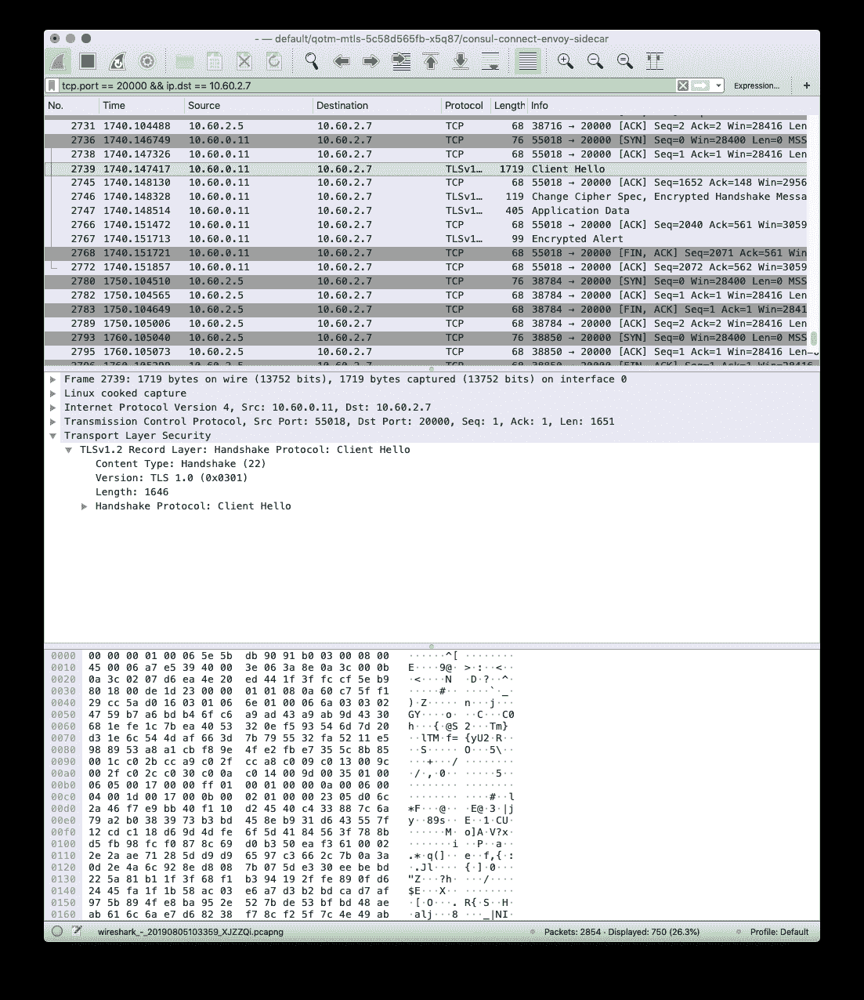

虽然这不像 HTTP 流量那样容易阅读，但您可以清楚地看到大使 Pod(在`10.60.0.11`)向我的 QOTM 应用程序(在`10.60.2.7`)发起的“Client Hello”TLS 握手，然后是一系列使用 TLSv1.2 协议的其他数据包，其中包含不可读的加密数据。

这就是了。将两个结果放在一起，一个是 QOTM 通过 Pod 的环回适配器响应领事使团代理的请求，另一个是大使 Pod 通过 TLS 与 QOTM 领事使团侧车通信，这应该证明您已经正确配置了 TLS。

# 先进的技术

有几个主题超出了这篇博文的范围，但是我可以在以后的文章中探索它们(如果您对此感兴趣，请告诉我！).第一种是使用 Wireshark 进行额外的[高级过滤](https://www.wireshark.org/docs/wsug_html_chunked/ChWorkDisplayFilterSection.html)，这在您试图调试不同 IP 和端口上公开的特定服务时会很有用。同样有趣的是，[解密在集群中流动的 TLS 流量](https://redflagsecurity.net/2019/03/10/decrypting-tls-wireshark/)的能力，例如，通过将 Consul 提供的私钥加载到 Wireshark 中。最后，ksniff 还能够在[特权模式](https://github.com/eldadru/ksniff#user-content-non-privileged-and-scratch-pods)下执行，以便嗅探从零开始构建的容器中的流量，或者不允许附加进程。

# 结论

在探索 [Ambassador](https://www.getambassador.io/) API 与各种服务网格的集成时，我发现 ksniff 是一个非常有价值的工具，比如[consult](https://www.getambassador.io/user-guide/consul)、 [Linkerd](https://linkerd.io/2/tasks/using-ingress/#ambassador) 和 [Istio](https://www.getambassador.io/user-guide/with-istio/) 。当然，您可以使用 tcpdump，但是我发现配置它有时很有挑战性，而且我喜欢 Wireshark 提供的强大 GUI。

我还想对 ksniff 的创造者 Eldad Rudich 表示感谢，感谢他创造了这个工具，也感谢他帮助回答了我的几个问题。

如果你想问关于这个的任何问题，你可以在 Twitter 上的 [@danielbryantuk](https://twitter.com/danielbryantuk) 找到我，或者在 [Datawire OSS Slack](http://d6e.co/slack) 上使用相同的句柄。