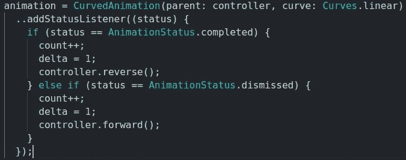
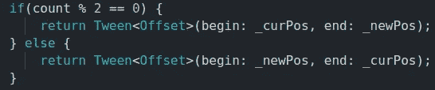
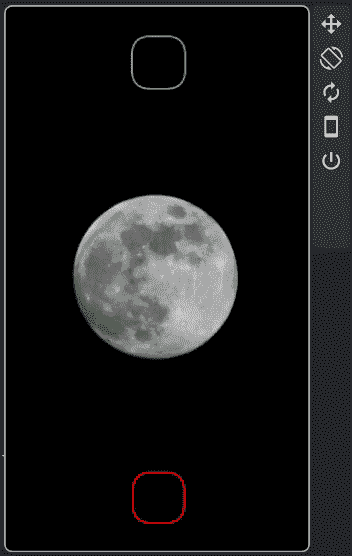
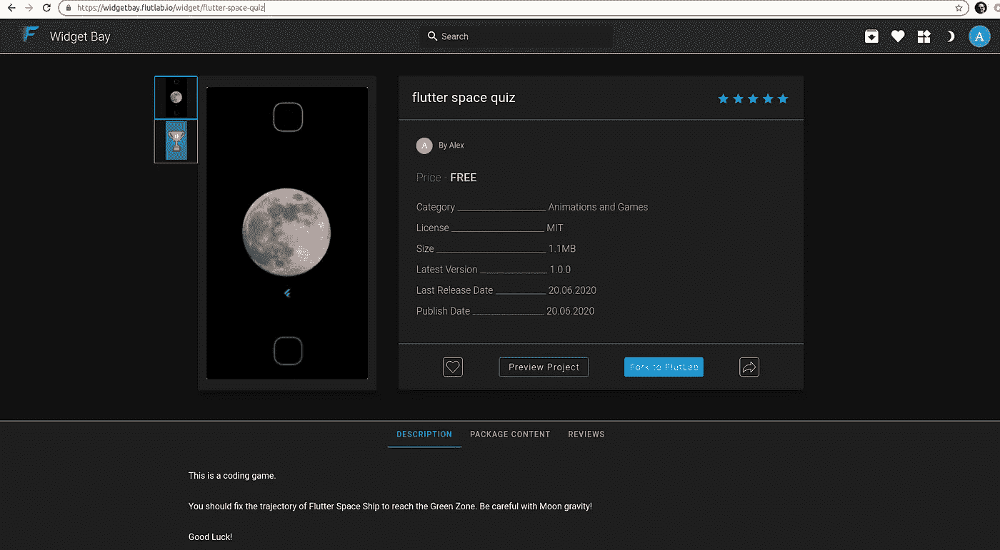
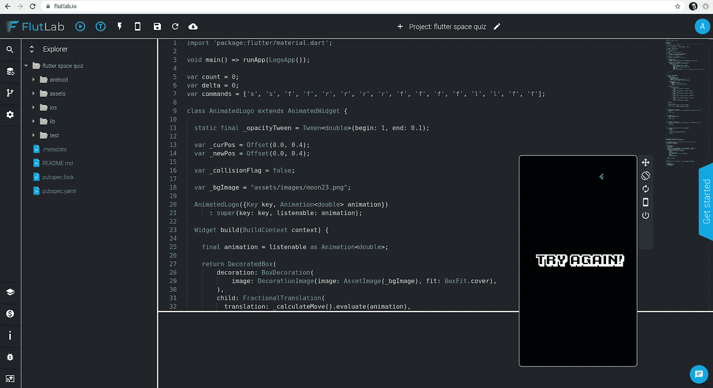
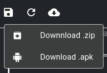
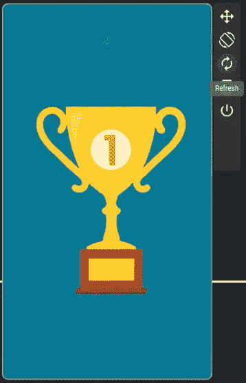
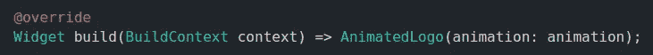
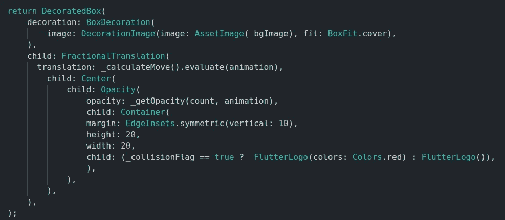

# 非常简单的游戏引擎，带有颤动动画

> 原文：<https://itnext.io/very-simple-game-engine-with-flutter-animations-6da4f633b501?source=collection_archive---------9----------------------->

# TL；速度三角形定位法(dead reckoning)

颤动动画用于以一次性的方式执行漂亮的视觉效果。但是我们可以使用***addStatusListener***方法 ***:*** 将它们重新加工成循环转换

此外，为“游戏计数器”的每个第二步切换开始和结束动画状态:

使用这种技术的示例游戏如下所示:

# 怎么玩呢

该项目由 [FlutLab/WidgetBay](https://widgetbay.flutlab.io/widget/flutter-space-quiz) 主持。您可以通过单击“预览项目”立即运行它:

它将显示任务失败的游戏场景。这是一个编码游戏！

点击“Fork to FlutLab”(你应该是在那里注册的，是免费的)。您将在 FlutLab IDE 中打开 Flutter 项目。点击“热预览”:

…观察失败的任务:

或者，您可以下载项目并在您最喜欢的桌面 IDE 中播放:

现在，您应该查看代码，并尝试将“颤振飞船”的轨迹固定在绿色矩形区域。

提示:调查名为 ***命令*** 的顶级集合。它包含类似于[徽标-海龟游戏](https://en.wikipedia.org/wiki/Logo_(programming_language))的移动命令:

*   f(向前)
*   b(向后)
*   左(左)
*   右(右)
*   停止

正确修复后，您应该会看到一个“赢家屏幕”:

# 它是如何工作的

上面提到的动画用【游戏循环】注入到 ***AnimatedLogo*** 类中:

***AnimatedLogo*** 包含程序中唯一的 UI 小部件:

所有奇迹发生的地方。动作由***fractional translation***小工具的 ***translation*** 参数操作。飞船不透明度动画由*小工具的 ***不透明度*** 参数管理。*

*动画对象提供了微小的进化变化，如在频繁的定时器点击之间移动 1-2 个像素。这允许所有变换的平滑模式。基数的变化，如每一个新的 ***计数*** 增量上的 ***补间<偏移>*** 的变化都在这个函数内计算:*

**

*其中 ***delta*** 是在每个 ***计数*** 增量上设置为 1 的标志，并且在下一个动画 ***补间*** 准备好之后立即下降到 0。*

*另外，请参见 ***中负责游戏生命周期的几个函数:碰撞、胜利或失败。****

# *结论。*

*这里有一个非常快速的演示，介绍了如何使用 Flutter 动画来创建简单的游戏。在这个例子中，我们只有一个 ***精灵*** 。您可以使用 ***Stack*** 小部件轻松扩展项目以添加更多精灵。*

*如果你有兴趣深入了解颤动动画，请阅读[这篇](https://medium.com/flutter-community/flutter-animation-has-never-been-easier-part-1-e378e82b2508)漂亮的帖子。*