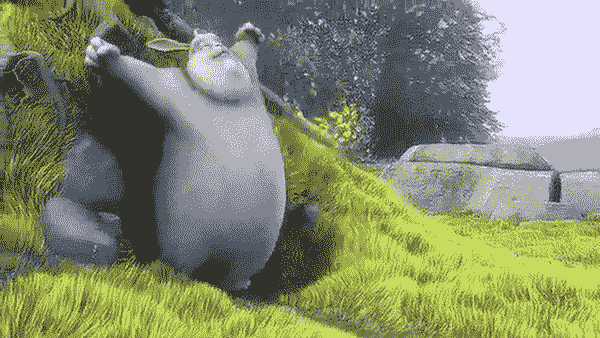
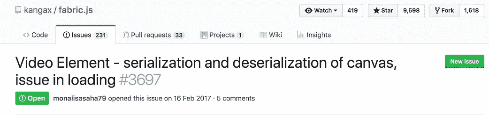
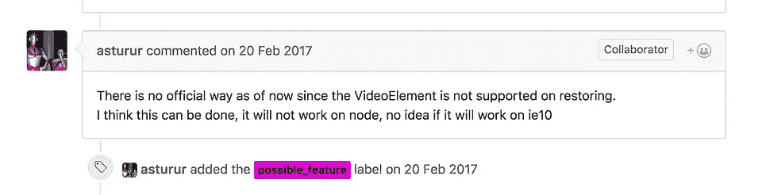

# 在 fabric JS 中序列化反序列化视频

> 原文：<https://itnext.io/video-element-serialization-and-deserialization-of-canvas-fc5dbf47666d?source=collection_archive---------3----------------------->



我是 [fabric.js](http://fabricjs.com/) 的忠实粉丝，我发现它是可用于 HTML5 canvas 的最强大的 js。

我很难将视频渲染到画布上，然后将其保存为 JSON 对象，并使用 **loadFromJson** 再次渲染到画布上

由于没有官方方法来序列化和反序列化视频元素 [**问题#3697**](https://github.com/kangax/fabric.js/issues/3697)

[你现在可以使用 fabric js 渲染视频元素](http://fabricjs.com/video-element)，未来的版本可能会有这个功能，但不确定。



# 我是这样做的

## #第一步

将一个视频元素渲染到画布上，下面这段代码将把一个视频元素渲染到画布上。

```
**function** getVideoElement(url) {
    **var** videoE = document.createElement('video');
    videoE.width = 530;
    videoE.height = 298;
    videoE.muted = **true**;
    videoE.crossOrigin = "anonymous";
    **var** source = document.createElement('source');
    source.src = url;
    source.type = 'video/mp4';
    videoE.appendChild(source);
    **return** videoE;
}**var** canvas = new fabric.Canvas('c');**var** url_mp4 = 'http://www.quirksmode.org/html5/videos/big_buck_bunny.mp4';

**var** videoE = getVideoElement(url_mp4);
**var** fab_video = **new** fabric.Image(videoE, {left: 0,   top: 0});canvas.add(fab_video);
fab_video.getElement().play();fabric.util.requestAnimFrame(**function** render() {
   canvas.renderAll();
   fabric.util.requestAnimFrame(render);
});
```

现在，如果您将画布导出为 JSON

```
canvas.toJSON();
```

你会看到 JSON 对象中有很多属性，但是主要关注的属性是`src`和`type`

> *{"objects": [{"src ":"，" top": 0，" left": 0，" type": "image "，…}，{}]，" version": "2.0.0-rc.4" }*

**注:** `src`为**空白**，`type`为**图像，**表示织物将视频保存为图像对象，但无法分配视频来源

## #第二步

为了保存视频元素的`src`，你需要给 fabric 对象添加一个自定义属性，为此你需要覆盖 **fabric** **对象**。

```
fabric.Object.prototype.toObject = (**function** (toObject) {
    **return function** (propertiesToInclude) {
        propertiesToInclude = (propertiesToInclude || []).concat(
            ['video_src']
        );
        **return** toObject.apply(**this**, [propertiesToInclude]);
    };
})(fabric.Object.prototype.toObject);
```

上面的代码在导出的时候会给 JSON 对象添加一个自定义属性`video_src`，你可以对它进行全局初始化。

> **注意:**在将视频元素添加到画布之前设置`video_src`属性

```
**var** fab_video = **new** fabric.Image(videoE, {left: 0,   top: 0});fab_video.set('video_src', url_mp4);canvas.add(fab_video);
```

您将看到导出的对象为:

> *{"objects": [{"src ":"，" video _ src ":"*http://www.quirksmode.org/html5/videos/big_buck_bunny.mp4*，" top": 0，" left": 0，" type": "image "，…}，{}]，" version": "2.0.0-rc.4" }*

## **#第三步**

您已成功将视频 src 保存到 JSON 对象。现在我们需要使用 **loadFromJSON** 再次渲染它

> **loadFromJSON** 方法，用于将 JSON 对象转换为实际的 fabric 对象，并将它们加载到画布上。

现在的问题是，它将如何理解自定义属性`video_src`，答案是，它不会，我们需要再次创建一个视频元素并手动渲染它。

为此，我们需要在 loadFromJSON 的回调方法上循环遍历对象，找出视频对象并手动处理它，其余的对象，即*文本、图像*将被正确渲染。

```
**var** data = *{“objects”: [{“src”: “”, “video_src”: “*http://www.quirksmode.org/html5/videos/big_buck_bunny.mp4*”, “top”: 0, “left”: 0, “type”: “image”, …}, {}], “version”: “2.0.0-rc.4” }***var** canvas = canvas.loadFromJSON(JSON.stringify(data), canvasLoaded , **function**(o, object) {
    fabric.log(o, object);
});**function** canvasLoaded(){      
   canvas.renderAll.bind(canvas);
   **var** objs = data['objects'];      
   **for**(**var** i=0; i< objs.length; i++){
      **if**(objs[i].hasOwnProperty('video_src')){
         **var** videoE = getVideoElement(objs[i]['video_src']); 
         **var** fab_video = **new** fabric.Image(videoE, {left: objs[i]['left'], top: objs[i]['top']} );                   
         canvas.add(fab_video);
         fab_video.getElement().play();                 
         fabric.util.requestAnimFrame(**function** render() {                      
            canvas.renderAll();                     
            fabric.util.requestAnimFrame(render);                
         });
      }
   }
}
```

这是一个使用 fabric 来序列化和反序列化视频元素的解决方法。

*(通过给别人*帮助别人在 Medium 上找到我的文章)👏🏽*下图。)*