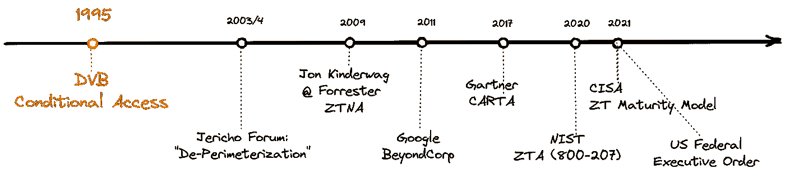
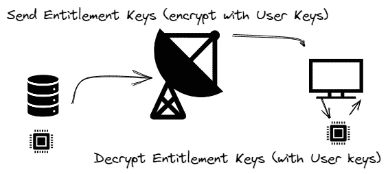
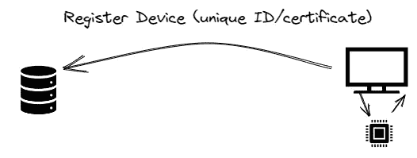
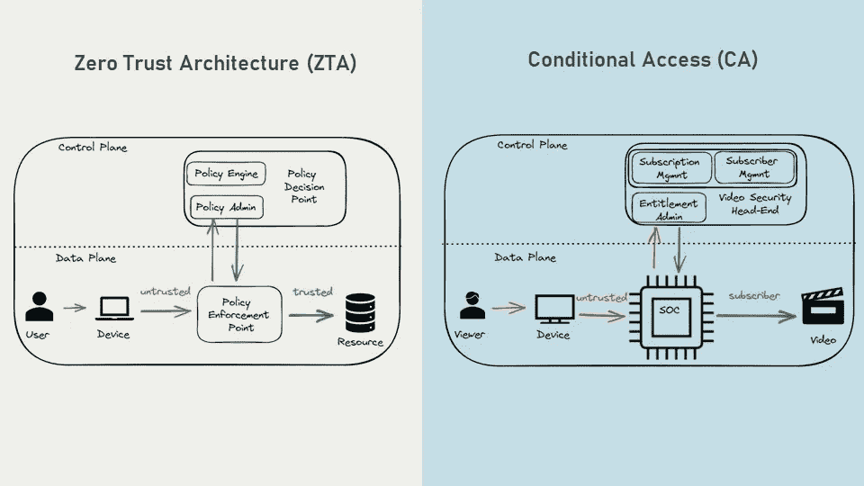
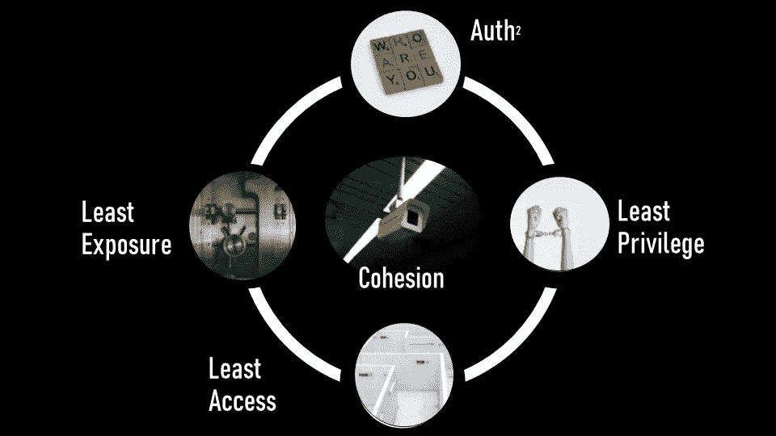
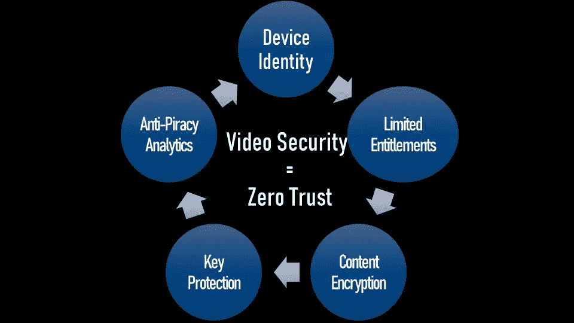

# 视频安全=原 ZTNA

> 原文：<https://itnext.io/video-security-the-original-ztna-f51f4e41f9e?source=collection_archive---------3----------------------->

## 软件架构/安全性

## 在零信任被发明之前，视频安全实现了一个完美的零信任架构。

视频安全早在 1995 年就实施了 ZTNA

大多数人认为零信任方法始于 2003-2004 年。他们错了！零信任网络架构(ZTNA)始于十年前。让我解释一下。

在本系列的第 1 部分中，我们对零信任进行了深入的概述。现在，我将根据非常科学的[鸭子测试](https://en.wikipedia.org/wiki/Duck_test)来证明，视频安全是一个零信任解决方案，它是第一个 ZTNA，可以追溯到 1995 年的史前时代，当时网飞还不存在，观众受电视广播公司阵容的支配，杰里科论坛还没有说出“边界”这个词。

你为什么要在乎？

因为实现安全 ZTNA 的一个巨大挑战是缺乏零信任系统的行业经验。或者正如 [NIST](https://nvlpubs.nist.gov/nistpubs/SpecialPublications/NIST.SP.800-207.pdf) 所说:

> “差距..因为缺乏时间和经验来进行成熟的零信任部署”。

一旦我们确定视频安全实施了零信任理念、原则和架构，我们就可以讨论如何利用 ZTNA 应对挑战，例如 BYOD、克隆以及在广阔的开放世界中建立信任。

**视频安全与零信任:**

1.  **视频安全拥有与零信任相同的** [**理念**](https://medium.com/@MsArchitect/deed1cb1a2d7)**——“永远不信任，永远验证。”**

仅英超联赛的转播权就有望在 2022 年带来近 70 亿美元的收入。任何观看盗版内容的观众都会影响收入。120 万英国观众承认在 2021 年观看了盗版英超联赛内容，相比之下，英超联赛的英国合法观众为 200 万。算一算——仅英超联赛就损失了数十亿美元的收入。

视频盗版通常被认为是一种没有受害者的犯罪，很大一部分人在观看非法传播的内容时没有负罪感。(此外，盗版广播公司创建的视频广播和视频流系统具有合法系统的外观和感觉，因此并非所有盗版观众都意识到他们在犯罪。)

所以，如果你从事视频安全工作，你从来没有信任过任何人，尤其是所有的观众。零信任不是什么新鲜事。

**2。视频安全零信任** [**架构**](https://medium.com/@MsArchitect/deed1cb1a2d7)

**如何保护视频内容？**

视频发送到每个人，要么通过卫星广播，这样它就可以通过卫星接收器到达每个家庭，要么通过有线网络广播，要么在公共互联网上分发。是什么迫使人们付费观看内容？

诀窍在于所有的视频内容都是*加密的。*

保护视频内容有两种主要方法。较早的是电视广播公司使用的条件接收(CA)。更现代的系统是用于保护流式内容的数字版权管理(DRM)。虽然这两个都是零信任的很好的用例，但我在这里将重点讨论广播安全性。

广播内容被分发，加密的内容以及用于加密它的密钥被共享——这里肯定没有对网络的信任！

视频控制平面注册所有用户订阅。每个用户通常会有一组不同的订阅(例如:体育、电影频道、新闻、儿童、视频点播)——还记得零信任的“最低权限”原则吗？我们不让*所有*用户访问*所有*内容。

用户在控制平面注册还不够。每个**设备**也需要注册——就像在零信任中一样，设备需要和用户一起被认证。

该设备身份必须是(1)唯一的(2)安全的(3)防克隆的。(我们将在本系列的第 3 部分更详细地讨论防止克隆。)

控制平面分发用于解密与内容一起发送的(加密的)内容密钥的授权密钥。

每个设备的授权密钥也是唯一加密的。(偏执多，有人吗？)

只有具有有效订阅的有效用户的有效设备才能访问内容密钥并解密内容。

当我们并排比较这两种架构时，我们可以看到相似之处。(在第 3 部分中，我们将对此进行更深入的探讨，看看我们如何改进 ZTNA 系统架构)

**3。视频安全的** [**原则**](https://medium.com/@MsArchitect/deed1cb1a2d7) **与零信任**相同

零信任原则(照片由:[布雷特·乔丹](https://unsplash.com/@brett_jordan?utm_source=unsplash&utm_medium=referral&utm_content=creditCopyText)、[牛牛](https://unsplash.com/@mengmengniu?utm_source=unsplash&utm_medium=referral&utm_content=creditCopyText)、[陈泰铭](https://unsplash.com/@raysontjr?utm_source=unsplash&utm_medium=referral&utm_content=creditCopyText) & [杰森·登特](https://unsplash.com/@jdent?utm_source=unsplash&utm_medium=referral&utm_content=creditCopyText)登上 [Unsplash](http://Unsplash.com)

**视频安全中的零信任原则:**

1.  用户+设备身份:查看者和他们的设备都由控制平面识别
2.  最低权限-用户只能观看他们购买的内容。除非有特殊权限，否则他们不能共享、复制或录制它。
3.  最小暴露—用于解密内容的密钥在每个密钥周期都会更改。那些钥匙，即使暴露了也不是很有用。用于保护这些密钥的授权密钥存储在可信计算库(TCB)中。用户不能访问用于解密内容的密钥。
4.  最少访问-这在广播公司的控制平面中实现，在内容、用户许可、用户密钥和内容密钥之间具有字符串分段(然而，这不是 DVB 协议的定义部分)。
5.  内聚性-查看活动和设备活动不断受到监控，以发现盗版行为。

例如，如果你一天 24 小时都在看电视，你是不是:

(a)真的真的很无聊

(b)因为背景噪音而让电视开着

(c)共享内容的盗版者？

我不能分享更多，但这里正在进行大量的分析，甚至早在 90 年代，在人工智能/机器学习广泛使用之前，视频广播公司就在分析观众行为，以识别盗版分销商。

综上所述，**所有零信任原则在视频安全系统中也得到了贯彻**。

回到[鸭子测试](https://en.wikipedia.org/wiki/Duck_test)，如果视频安全系统看起来像 ZTNA，运行起来像 ZTNA，听起来像 ZTNA，那么它很可能就是 ZTNA。

*接下来的第 3 部分:视频安全如何教会我们建立一个更好的 ZTNA——在不信任的世界中的克隆、BYOD 和信任。*