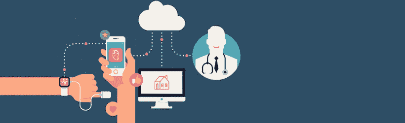

# 四个将会改变医疗保健的发展

> 原文：<https://itnext.io/vier-ontwikkelingen-die-de-zorg-gaan-veranderen-16d507c62d7b?source=collection_archive---------3----------------------->

再过几周 2016 年就真的结束了。一年里，很多人都在谈论病人越来越多地服用的记录片。或者是“T0”区块链技术以及它是否真的适合于医疗保健。或对云基础架构(如[混合云模型](https://www.linkit.nl/knowledge-base/179/Hoe_past_de_Hybrid_Cloud_bij_eHealth_toepassingen)的日益多样化有何看法。又是一年，在许多组织中，有很多单词都被发布到了[【大数据】T5，或者是七个大瓶颈:在“安全”](https://www.linkit.nl/knowledge-base/172/Gebruik_van_Big_Data_in_de_zorgsector)[T7”内部的关注点。](https://www.linkit.nl/knowledge-base/47/Het_belang_van_informatiebeveiliging_in_de_zorg)

现在，2017 年就在门外。一年内，上述所有术语可能会进一步扩展，但也是一年内还会有更多的新闻发生。有什么进展吗？什么样的技术会出现？例如，请考虑在人群中执行健康分析(Population Health Analytics)、进行基因改造以改善健康状况(health gaming)，以及开发纳米机器人(Nanorobotics)。但有更多的技术我的直觉会对医疗行业产生很大的影响。

## **1。嵌入式传感器**

在医疗系统中，越来越多地使用嵌入式系统和机器人。传感器技术也有能力更准确地支持和指导长期护理的患者。

*示例:*

已有各种传感器(■T12)可通过将传感器放置在可监控重要功能的身体上或周围来测量(重要)身体功能和行为，例如活动、睡眠时间和饮食模式但在未来，它会变得小很多。纳米机器人，如皮下芯片或可吸入药片，将有助于我们的身体越来越多地用数字来表达(‘t14’【定量自我】。

但这不仅仅是对人类施加的传感器；即使是在环境中，它们也可能适用于医疗保健。其中一个例子是未来的" T0 "痴呆之家"在艾玛，它展示了科技如何帮助患有痴呆的人更长的家。这种特别设计的房子有各种感应器可以在有人半夜穿过"幽灵"的房子时向救援人员发出信号。此外，当地人用叉子进食来测量我或任何人吃的东西。

*未来*

通过使用这些传感器，我们能够在未来按患者提供真正的定制服务。此外，相关的医疗专家也将在验证自己收集的资料，并将资料转换为适当的医疗环境中扮演重要角色。最终，这将导致积极的预防性医疗，而不是医疗，当邪恶已经发生。

## **2。3D 列印**

长期以来，3D 列印技术的发展速度非常快，也开始在医学领域慢慢发展。它可以帮助专家和研究人员更快地进行更精确的工作，并允许病人进行特定的护理(因为每一个身体和每一种疾病都是独特的)。

在三个领域中总结 3D 技术的优势:

1.  3D 列印医疗设备
2.  3D 生物打印
3.  3D 列印药物

*示例:*

在所有这些领域中，这项技术的应用方式各不相同。因此，在矫正术中可以重建完整的牙齿。默认情况下，石膏模型将替换为精确按尺寸打印的三维打印(下颌)模型。同时，3D 列印也能让您在义肢方面有长足的进步。扫描可让您预先决定所需的修复体形状，然后进行自订列印。这将大大缩短操作时间并提高精度。

另一个可启用 3D 列印的范例是「预防」。例如，学生可以在学习或培训过程中使用真实的解剖模型。但对外科医生来说，它也能提供帮助；可以打印三维打印的模型，以便外科医生为手术做好准备，从而降低出错的可能性。

也可以在制药领域应用这种技术。以逐层列印产品，例如塑胶、蛋白质或营养。最大的好处是，可以根据病人的需要生产出精确的处方药，同时可以在一个药片(即“固定剂量”)中使用多种药物。成人和儿童之间的差异会因为这种技术的发展而消失。现在药物还在研发中，以成年人的平均体重为 70 公斤。

随着所有的发展，人们对 3D 打印的需求会越来越多。在器官打印领域有很多研究使用特定的细胞。而且新一代的 3D 印表机可以直接印在病人身上，速度很慢，但很有信心。首先扫描身体，然后一层一层地在身体上打印出正确的细胞来修复伤口。

*未来:T1*

3D 列印在大规模生产中的可能性微乎其微，因为它知道它在产品特定区域的功能。但是，在医疗保健方面，有很大的发展空间，可能会带来巨大的成本节省和医疗干预措施的改进。

## **3 号。人工智能(a . I)**

人工智能(人工智能)越来越受到人们的关注。这主要是因为 A.I .能把人脑握得太高的模式和联系起来。在一个数据丰富的行业(如医疗保健)中，这将带来巨大的潜力。去年，仅在美国，就有大约 60 个“T4”交易是由医疗领域的人工智能投资者完成的。一个小小的比较:2011 年，只有 8 个。

*示例:*

Microsoft 研究实验室最近的一个[项目 T1 表明，搜索引擎日志可用于对胰腺癌进行深入诊断。同时，通过跟踪移动电话并跟踪移动和打字速度，也可以实现双极干扰信号。这些例子说明了医学影像学在机械学习中是如何旋转的。去年 7 月，伦敦一家医院宣布将与谷歌(Google)](http://blogs.microsoft.com/next/2016/06/07/how-web-search-data-might-help-diagnose-serious-illness-earlier/#sm.000b05r6v1cgxdalrtf10glehcv06)[deepmin](https://deepmind.com/)合作，开发一种 A.I 工具，通过数字眼科扫描**识别眼部疾病。**因此，护理人员可以在诊断和医学影像/治疗计划中得到 A.I 的支持，从而利用所有必要的信息来获得最佳的治疗方法。但是，在前景中，应用程序可能会有很大的价值:人工智能能够识别未知的途径和联系，从而可能导致新的治疗方法。

[聊天机器人](https://www.linkit.nl/knowledge-base/242/Will_chatbots_change_our_lives)也广泛应用于人工智能领域。这些是自动交谈合作夥伴(或虚拟助理)，可让使用者针对特定主题进行对话。例如，在护理中，它是以[旋律](http://research.baidu.com/baidus-melody-ai-powered-conversational-bot-doctors-patients/)的形式使用的此工具可通过询问问题收集患者信息，并从医生处接管三角区。这可以支持甚至改善医生的诊断。另一个例子是[奥利维亚](http://info.sense.ly/nhs):这个应用程序能够识别病人的症状，给予治疗，并安排病人和医疗专家之间的会面。因为这里有一个“神通”这个工具会变得更有生命力，病人们会觉得它是一个非常愉快的社会体验。正是由于这些经验，阿凡达越来越多地被运用起来，不再需要与医生进行身体接触。

因此，相应的算法(机器学习)对护理有很大的影响，从而使您能够将护理的重点放在预防上。一个[例子](http://www.ndtv.com/health/artificial-intelligence-used-to-detect-rare-leukemia-type-in-japan-1440789)，其中一个算法已经在日本证明了它的价值。一个病人的常规治疗方法并没有奏效，但是由于 [IBM Watson](https://www.linkit.nl/knowledge-base/236/Why_IBM_Watson_is_one_of_the_first_hands_on_IoT_examples) 发现了一种罕见的白血病形式，没有医生的干预。这是因为沃森比较了两千万的肿瘤数据，从而为医生创造了一个全新的视角。调查持续时间？10 分钟。

这些算法使聊天机器人不断进化，并能够深入你的个性和个人情况；有什么抱怨，你的生活方式，等等。这样他们就越来越了解病人了他们可以在被问及之前回答问题。

*未来:*

但是，人们并不期望算法能够自主做出决策，人类干预的区域。因此，A.I .在护理中的应用不会取代人与人之间的接触，而是提供护理的适当补充。一个范例。

## **4。增强/虚拟现实(2020-2030 年)**

因为医护人员正在治疗多名病人，所以他们不可能同时在所有地方工作。他们把医疗需求放在优先位置，这样就形成了等待名单。例如，使用“T8”头装显示器“T9”(hmds)或“T10”智能玻璃“T11”(如拳头或镜片)，可以更有效地提供护理。也就是说，技术人员可以直接从远端进行检视，并设定特定诊断或治疗方法，而不需要亲自介入。

*示例:*

这是一个很好的例子，一个与截肢有关的病人。通过在虚拟环境中模拟这种情况，病人可以更好地处理特定身体部分的损失，并且更早地接受这一点。它还会教病人如何使用义肢，从而加快/加速康复过程。

但医生们最终还是会在其中编织一些丝。他们可以模拟手术，在特定的手术中训练自己。[触摸外科](https://www.touchsurgery.com/)就是一个例子；此平板电脑应用程式可训练使用者如何在 3D 虚拟病人的大脑中定位及放置导管。

[增强现实](https://nl.wikipedia.org/wiki/Toegevoegde_realiteit)的应用也正在全面发展中。例如，有平板电脑、智能玻璃或电话的摄像头可以识别的标签，这些标签可以在公寓中进行精确测量，以对患者的公寓进行任何调整。因此，服务提供商和安装程序可以在整个护理过程中与一个效率团队进行更紧密的协作。

*未来:*

虽然在医疗保健领域有许多应用 AR/VR 的范例，但在医疗保健领域中的应用仍然是一个挑战。医疗人员要有全新的思维方式他们需要投资在培训和教育上。但是，从“最佳实践”的角度来看，行业合作伙伴共享知识和经验也是一个重要组成部分。尽管这需要时间，但这些应用程序将最终实现标准化；一方面是因为可以创建效率层，另一方面是因为整个护理过程中的优化。