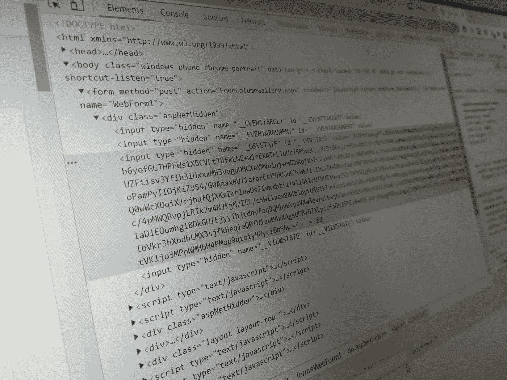
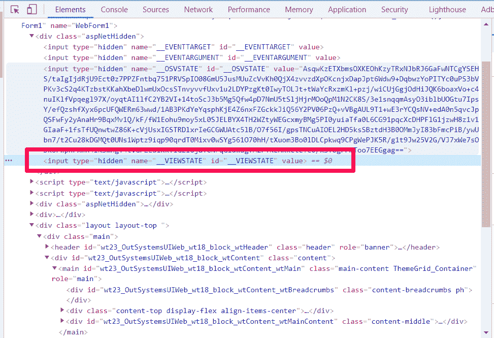
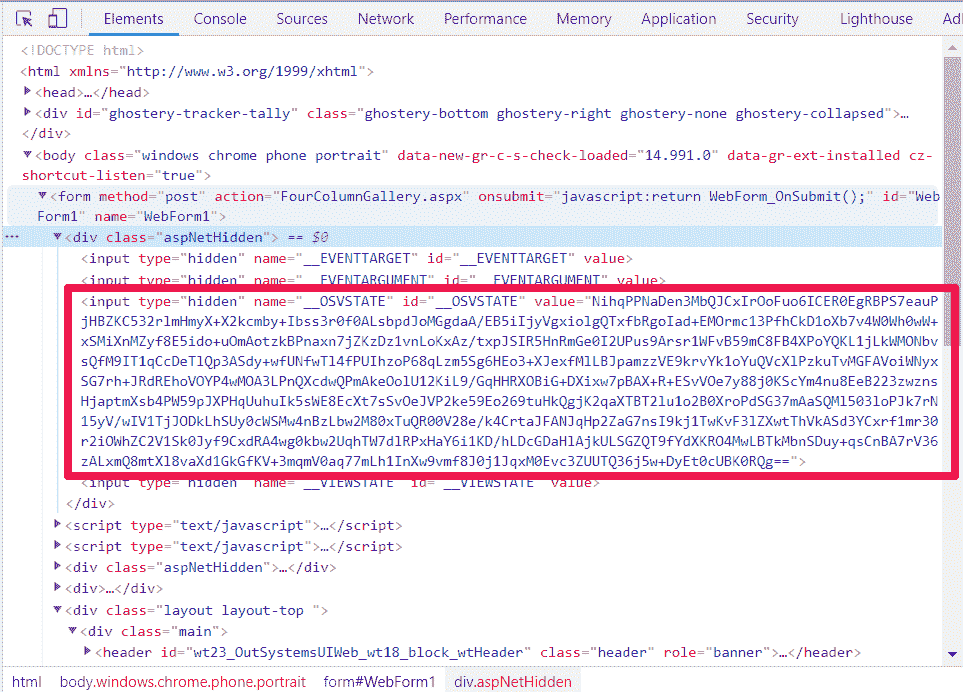

# 查看系统外传统 Web 应用程序的状态

> 原文：<https://itnext.io/view-state-in-outsystems-tradicional-web-apps-c06a246a6bbc?source=collection_archive---------3----------------------->

## 关于外部系统中视图状态的基础知识



你知道在传统的 Web 应用程序中，视图状态在你创建的每一个屏幕中都在追逐你吗？如果没有，那么您应该了解为什么以及如何处理它，以避免对服务器的缓慢请求，以及在最后一种情况下，向服务器提交数据的超时异常。

让我们从了解什么是视图状态以及了解它的重要性开始。之后，我将解释考虑到视图状态的大小，在您的 web 页面中产生问题的最常见的场景是什么。

尽管这是 Outsystems 社区中的一个老话题，但我认为有必要将它带回到讨论中，用更多的解释和更多的测试来澄清它。希望你喜欢它！

# 什么是视图状态？

在我们开始视图状态定义之前，我想给出一些关于 HTTP 协议的上下文。

HTTP 协议是无状态的，这意味着我们向服务器发出的任何请求都完全独立于上一个请求，正如您所知，有时我们需要根据从上一个请求中获得的信息向服务器发出请求。

考虑到这一点，微软创建了视图状态来解决无状态问题，并将这种方法用于他们的 Web 产品。

从开发人员的角度来看，视图状态只不过是一个隐藏的输入标签，其属性 **name** 和 **id** 设置为 **__VIEWSTATE。**对此感到惊讶？看下一张图片！



. Net Framework 视图状态的示例

**value** 属性负责在客户端存储执行请求所需的数据，维护服务器请求之间的页面状态。

所有的魔法都发生在。Net Framework，这是反序列化**值**属性的地方，以便在您的代码中作为普通变量使用。

对于这个例子，**值**为空，因为外部系统执行了自己的实现并从。网络视图状态。

# **out systems“查看状态”**

考虑到您从本文第一部分学到的一切(我希望如此)，现在您应该知道 OutSystems 创建了自己的视图状态实现，以便添加额外的加密层[。](https://success.outsystems.com/Documentation/11/Managing_the_Applications_Lifecycle/Secure_the_Applications/Encrypt_web_apps_view_state?origin=d)

为此，正如微软所做的那样，Outsystems 也创建了一个隐藏输入，将属性 **name** 和 **id** 设置为 **__OSVSTATE** ，这可能代表 **Outsystems 视图状态**。但想法完全一样。

在下图中，您可以看到一个 Outsystems 视图状态的示例。



外部系统视图状态的示例

现在，您可能会问**值**属性上有什么。

答案是…

在**值**属性中，存储了一组在下一次请求时发送给服务器的加密信息，比如:

*   Web 块中的局部变量和记录列表
*   Web 屏幕中的本地变量和记录列表

每当我们发出服务器请求时，所有这些数据都会被发送到服务器，更确切地说，是当我们执行 Ajax 提交或在我们的网页或 web 块中提交时。**所有的视图状态都被发送到服务器**，因为您的下一个屏幕操作需要这些信息。

# 视图状态的影响

这里的一个大问题是应用程序中视图状态的影响是什么。

考虑视图状态的大小非常重要，因为处理这种影响的第一个人是用户。

一旦你为你的用户构建了应用程序，他/她就是你需要关心的人，交付一个高质量的 web 应用程序。

拥有一个大视图状态的问题是，每次你的用户用 Submit 或者 Ajax Submit 方法点击一个按钮或者一个链接，他/她都需要等待，直到数据被发送到服务器，而用户并不知道。用户唯一想要的是一个快速的页面。

不要忘记:大视图状态是快速页面的敌人！

因此，总而言之，为了创建快速页面，我们需要注意视图状态(以及其他一些事情，但让我们留到下次再说)。

由于视图状态是存储页面数据的 HTML 输入，我们需要小心它的大小，因为更大的视图状态会导致页面的性能下降，这是大视图状态的缺点。

即使 Outsystems 平台也对视图状态进行了一些优化，但是如果我们从屏幕到服务器使用大量数据，视图状态会变得很大，我们会得到一个超时异常。

# 如何避免大视图状态？

到目前为止，我们讨论了什么是视图状态及其影响。在这篇文章的结尾，我想给你一些关于如何避免大视图状态的想法:

1.  避免在屏幕操作中使用准备数据
2.  尽量减少作为局部变量的大记录列表
3.  如果可能的话，将大屏幕分割成服务器标签或不同的屏幕
4.  小心 AJAX 刷新

现在，我真的希望你能思考一下我们今天讲的内容。

下一次，我将带着上面的想法做更深入的解释，并向您展示它们的使用如何在视图状态大小上产生差异。

敬请关注，了解更多相关信息！

想了解我更多吗？查看[网站](https://tiagoagostinho.com)。

```
References:1.[https://www.outsystems.com/forums/discussion/10458/view-state-in-outsystems-applications/](https://www.outsystems.com/forums/discussion/10458/view-state-in-outsystems-applications/)2.[https://success.outsystems.com/Documentation/Best_Practices/Performance_and_Monitoring/Performance_Best_Practices_-_User_Interface](https://success.outsystems.com/Documentation/Best_Practices/Performance_and_Monitoring/Performance_Best_Practices_-_User_Interface)3.[https://www.c-sharpcorner.com/UploadFile/225740/what-is-view-state-and-how-it-works-in-Asp-Net53/](https://www.c-sharpcorner.com/UploadFile/225740/what-is-view-state-and-how-it-works-in-Asp-Net53/)
```