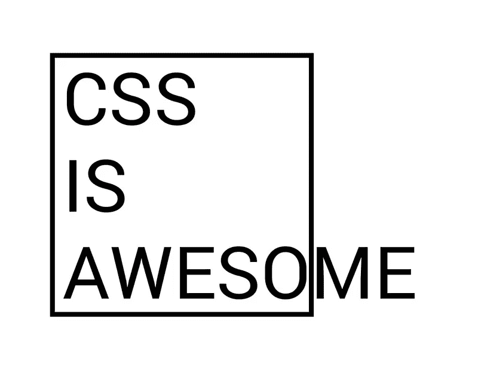

# 视口单位，你不知道但应该知道的 CSS

> 原文：<https://itnext.io/viewport-units-the-css-you-didnt-know-about-but-should-24b104483429?source=collection_archive---------3----------------------->

# 因为 CSS 做对了就是牛逼



来源:整个互联网和每个前端 web 开发人员在同一时间或其他，让我们在这里是真实的。

# 介绍

对于 web 开发人员来说，SS 可能同时是世界上最伟大的东西和最令人沮丧的东西。

当它按照我们预想的方式工作时，这是一种快乐——它很漂亮，它使网站直观、易访问，可能是动画——在所有方面都很好。但是，努力，时间和痛苦，让一切像素完美可以完全疯狂到我们想扯下我们的头发，上面的迷因对我们来说是非常，非常真实的。

老实说，我更倾向于“我喜欢 CSS，以及它为我所做的一切，即使它需要花费*永远*才能实现，”而我的一些同事对此没有那么积极的感觉。我通常不会深入研究动画、多浏览器支持或一些真正前沿的 CSS 东西，因为我日复一日工作的软件是一个内部应用程序，可以帮助我公司的其他员工更好地完成工作。

但是我仍然很享受(通常)当我获得一个前端特性时，它让我有机会重温我的 CSS 技能，实现一些转换或悬停状态，或者学习一些我以前没有使用过的新的很酷的 CSS 技巧。

> 今天，我想分享一些我最近学到的东西:CSS 视口单位。他们很棒有很多原因。

# CSS 视口单位

CSS 中的视口单元已经出现了几年，但是我并没有经常看到它们，我认为部分原因是因为人们并没有意识到它们的存在。在 CSS 中有如此多的东西要学习和做，我对此并不感到非常惊讶。我确信有很多我不知道的 CSS 技巧。

如果你没有听说过视窗单元，让我给你一个快速的概述。

> 它们是真正的**响应长度单位**，因为每次浏览器调整大小时，它们的值都会改变。— CSS 视口单位:快速入门

如果这不能立刻让你明白或者听起来对你非常有用，请耐心听我说，这里有一些很酷的例子。

但是首先，让我们根据 CSS 来定义视口单元。

## 视口高度(`vh`)

该单位基于视口的高度。值`20vh`等于视口高度的`20%`。

## 视口宽度(`vw`)

该单位基于视口的宽度。`10vw`的值等于视口宽度的`10%`。如果浏览器窗口的宽度为 1200 像素，则视窗宽度将为 120 像素。同样，如果移动视图浏览器的宽度为 480 像素，则视口宽度将为 48 像素。

接下来的两个比标准的`vh`和`vw`更有趣，但也不常用。

## 最小视口(vmin)

视口最小值以视口宽度或高度的百分比计算，*以在*时刻较小者为准。`20vmin`在纵向上将解析为当前视窗宽度的`20%`，在横向上将解析为视窗高度的`20%`。

## 视口最大值(vmax)

对于视口最大值(类似视口最小值)，它基于视口宽度或高度的百分比，*在*时刻取较大值。`15vmax`将在纵向方向解析为当前视窗高度的`15%`，在横向方向解析为视窗宽度的`15%`。

就我个人而言，我觉得后两个不如第一个有用，但这只是我的看法。

现在，在确保我们都在同一页上之后，让我们进入有趣的部分——例子。

# 使用视口单位的好处

此时，你可能会想，好吧，这很酷，但是这和我今天在 CSS 中使用的百分比和媒体查询有什么不同或改进吗？

我很高兴你问了…

**示例 1:子组件可以大于其父组件**

CSS 视口单位与传统百分比的对比示例。

如果你看看上面的 CodePen 例子，你会发现，传统上，如果一个子组件`div`使用百分比来计算它的大小，那么它是基于其父组件的百分比的。

但是，使用视口单位可以使子组件大于父组件，它们的大小是基于视口的大小，而不是基于父组件的大小。

有帮助？在某些情况下，当然。

**示例 2:背景图像无需媒体询问即可响应**

使用 CSS vh 和 vw 让背景图片完美贴合的例子。

此处的示例显示了视窗高度和视窗宽度的强大功能。如果您查看设置为背景的图像和颜色，您会注意到当浏览器调整大小时，图像(以及居中的文本)也会随之调整大小，因为它使用了`vh`和`vw`来设置高度、宽度和填充。

```
.fullscreen {
  width: 100vw; /* this will stretch the width of the viewport */
  height: 100vh; /* this will stretch the height of the viewport */
  color: white;
  padding: 40vmin 1rem;
}
```

没有混乱，没有大惊小怪，只是完美地居中，调整背景大小。告诉我这不可怕。

**例 3:借助** `**calc()**`可以缩放字体大小

使用 CSS vmin 和 calc()相应地调整字体和标题大小的例子。

用`vw`和`vh`可以做的另一件很酷的事情是用`calc()`。通过使用`calc()`，字体大小和标题可以完全基于视窗相应地调整大小。

在上面的例子中，你会注意到`h1`和`p`文本`font-sizes`会在`calc()`的帮助下自动调整大小和增长。

```
h1 {
  padding: 10vmin 1rem;
  font-size: calc(32px + 1.5vw);
  background-color: #BF6FE5;
}p {
  font-size: calc(16px + 0.5vw);
  margin: 0 0 10vmin 0;
}
```

除了静态填充之外，`h1`标签的填充也使用了`vmin`标签，所以不管浏览器的高度或宽度是否更大，它总会有一些填充来防止它碰到视窗的边缘。

我知道这些看起来可能是小事，但是想象一下 CSS 开发人员因为这样的改进而不用再写东西了。

如果你喜欢这类例子，我强烈推荐这篇文章底部的 CSS 文章，看看 CSS 视口单元可以实现的更多可能性。

# 结论

CSS 赋予网站独特、漂亮、有用和令人愉快的能力，有时会让使用它的工程师想辞职。

不过，最终，当我做对了，用户告诉我一个应用程序让他们的工作变得更好的时候，我感觉很有价值。CSS viewport 单元，虽然经常被 flexbox 和 grid 等更华丽的框架所忽略，但有一些非常有用的应用程序，可以减少站点响应所需的代码量，并使子元素在某些方面独立于父元素

它肯定在我的 CSS 武库中占有一席之地，现在我对它的用处有了更好的理解。

过几周再来看看，我会写关于 JavaScript、ES6 或其他与 web 开发相关的东西，所以请关注我，这样你就不会错过了。

感谢您的阅读，我希望您能找到一些方法将 CSS 视口单元合并到您自己的站点中，并(希望)减少所需的 CSS 数量。如果你觉得有帮助，请与你的朋友分享！

**如果你喜欢读这篇文章，你可能也会喜欢我的其他博客:**

*   [同时运行多个 Node.js 或 NPM 命令的 4 种解决方案](/4-solutions-to-run-multiple-node-js-or-npm-commands-simultaneously-9edaa6215a93)
*   [更新功能在 React 应用中切换，无需重新部署](/update-feature-toggles-in-a-react-app-without-redeploying-5b95674a5bb1)
*   [用最简单的方法保持开发者代码的一致性——用更漂亮的& ESLint](/keep-code-consistent-across-developers-the-easy-way-with-prettier-eslint-60bb7e91b76c)

**参考资料和更多资源:**

*   CSS 视口单位:快速入门:[https://www.sitepoint.com/css-viewport-units-quick-start/](https://www.sitepoint.com/css-viewport-units-quick-start/)
*   有趣的视口单位:[https://css-tricks.com/fun-viewport-units/](https://css-tricks.com/fun-viewport-units/)
*   `vmin`:[https://css-tricks.com/simple-little-use-case-vmin/](https://css-tricks.com/simple-little-use-case-vmin/)的简单小用例