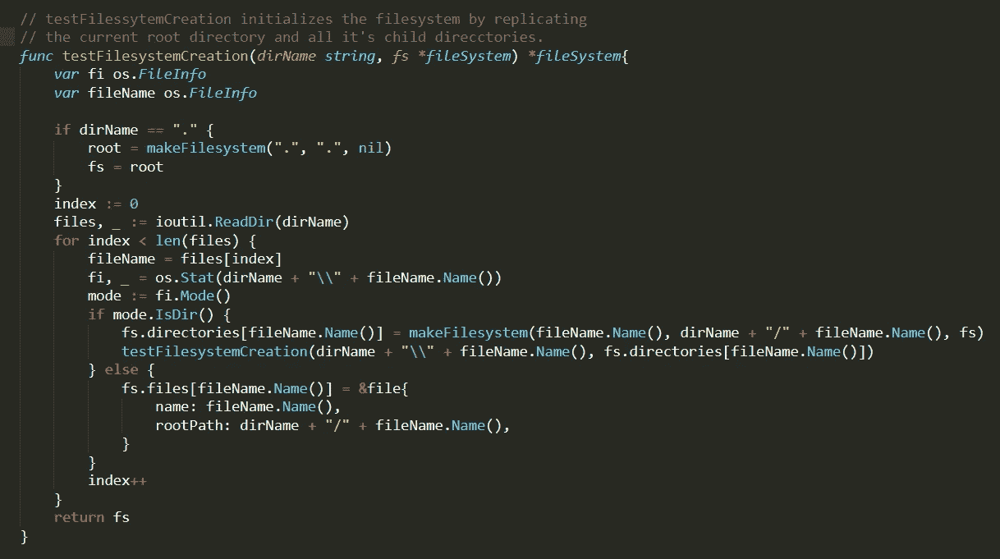
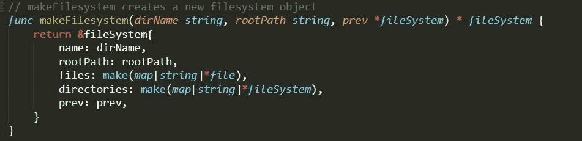
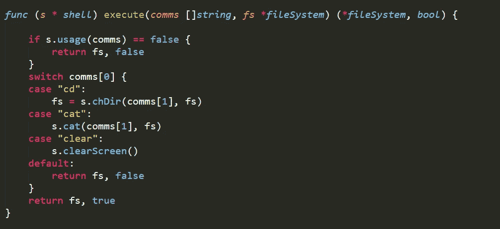
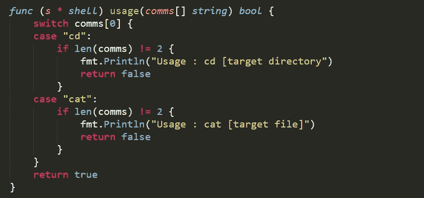
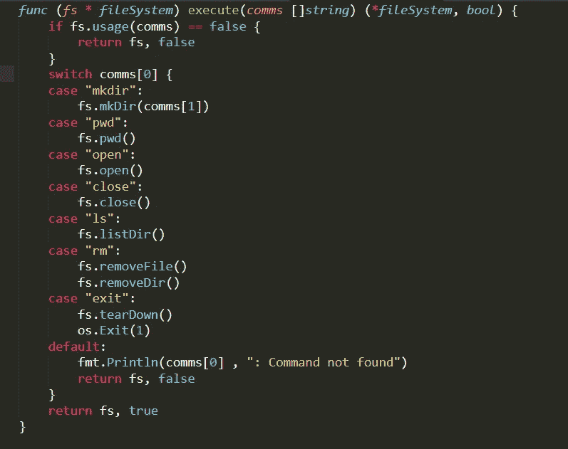
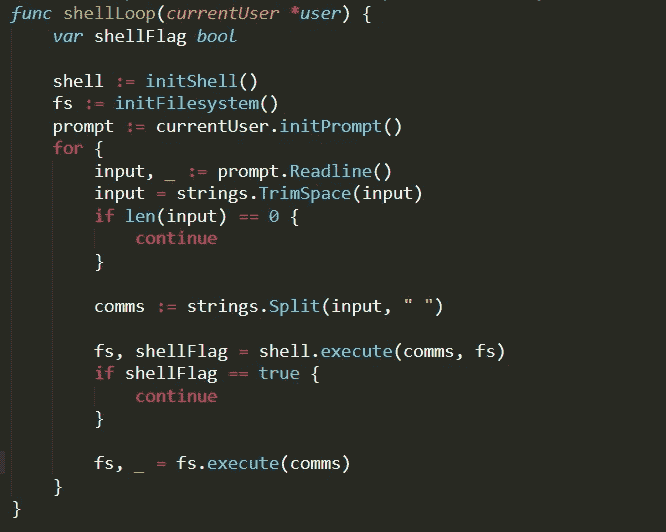
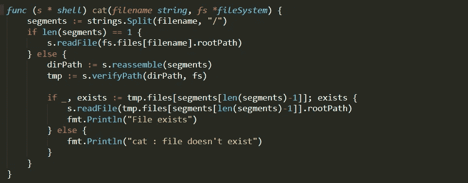

# 虚拟文件系统正在运行—完成文件系统初始化

> 原文：<https://itnext.io/virtual-filesystem-in-go-completing-filesystem-initialization-2470e3bd8243?source=collection_archive---------5----------------------->

它远没有标题所暗示的那么花哨。


这是我在网上找的一碗拉面。这个周末我吃面条了。他们太棒了。

这个周末，我在一家高级餐厅吃了第一碗高级拉面。然后我品尝了一些绿茶冰淇淋。我起初不喜欢它，但后来喜欢上了它，但为时已晚，我已经离开了餐馆。我一直带着这份遗憾。

前进到文章。

我们做到了，读者；我们终于完成了`initFilesystem()`。我终于完成了我说过我会做的事情(几乎是当我说我也会做的时候，但是 5/10 比 0 好)。我必须承认，这很振奋人心。运行它；信号提示要求我们的用户名，然后就有了；一个类似 Unix 的环境，里面有我们所有的文件和文件夹，完全可读。在我的 Windows CMD 中运行这个程序给人一种真正的 Linux 体验，它不是一个子系统，而是我的 CMD 中的 Linux。我终于做出了独特的东西。

尽管这个开头令人难以忍受地沾沾自喜，但这段代码完全是一场混乱的递归和字符串连接的车祸，只有完全疯狂的人才会对推进它们的回购感到舒服。但是很管用！现在，这就够了。:D

注视我们的文件系统！它活着！

顺便说一下，如果有人知道如何使这些在更高的质量，请让我知道:d。

现在，让我们打开过去一周的创伤。

## initFilesystem 终于到来了

`initFilesystem`终于奏效了。很多很多周以后。虽然才过了四年，但感觉我已经做了很久了。

让我们绕场一周，穿过我经历的所有恐怖，来到这里。

注意:本周我决定通过添加大代码块的截图来给这些文章注入一些色彩。如果你感兴趣并且是这些的热心读者，请让我知道这是否有效。好了继续。

这是:



`makeFilesystem`命令是对创建单个`fileSystem`对象的代码的重构。它采用的参数是要创建的目录的名称、目录的绝对路径和指向其父目录的指针(或者根目录的`nil`)。



`testFIlesystemCreation`(实名 TBA)中的第一段代码是这样的。

```
dirName == "." {
  root = makeFilesystem(".", ".", nil)
  fs := root 
```

它的功能本质上是原始`initFilsystem`主代码体的压缩版本。它只是创建一个文件对象，设置根目录并创建我们将在导航中使用的`fs`。

下一位代码`files,_ := ioutil.ReadDir(dirNmae)`；读取当前目录级别的所有文件和目录。这给了我们一个这个级别的目录名列表，然后我们开始循环。

遍历 for 循环，您会注意到在`os.Stat`方法中它接受的参数；`dirName + "\\" + fileName.Name()`。这里发生的是，为了访问关于目标文件名的实际文件信息，我们需要它的相对路径，相对于我们开始运行程序的位置。

如果目录`path/to/file/`中有一个文件`file1`，那么`fileName`中的`Name()`方法将只返回`file1`，因此`Stat`将在我们当前所在的目录中寻找`file1`，而不是它实际存储的目录。所以我们需要在前面加上它所在的目录名，在我们的例子中是`dirName`,由于令人困惑的递归原因，我很难解释清楚。

注意:这段代码中使用的`\\`是 Windows 中如何形成路径的，我将在调试时添加一个检查来适应 Linux/OSX 系统。

在目标文件上运行`os.Stat`之后，我们能够提取关于文件的各种信息；如果你愿意，这是统计数据。我们可以获取任何信息，从时间戳到文件权限，到目标名称是文件还是目录，但是由于我们在版本 1 中，我们将只对最后一个细节感兴趣；目标文件是否确实是一个目录。

一旦我们运行`fi.Mode()`，变量`mode`就会有这个信息。所以剩下的就是使用`IsDir`来检查目标文件是否是一个目录。如果它是一个文件，我们只需将它添加到`fileSystem`对象的`files`列表中。如果是一个目录，创建新的目录并递归调用`testFilesystemCreation`对我们刚刚创建的子目录做同样的事情。

对于`initFilesystem`来说差不多就是这样了。终于起作用了。最终结果是一个意想不到的工作良好的文件系统，有一个 shell 与之交互。

## 其他的事情

本周的更新中还有其他内容。对主 shell 循环的另一个新的新的新的变化和对`shell`对象处理它自己的内置的方式的一个重构。

还增加了一些功能；这些也从单纯的调试支持升级到完全成熟的功能；这些实用程序是`cat`命令和`shell`自己的`usage/execute`功能。

`execute`对于`shell`的对象如下。



而`usage`对它来说是；



这些函数的行为基本上与您在`fileSystem`对象中找到的那些函数相同，但是有它们自己独特的实用程序和对其返回时间的更新(现在也返回一个布尔值)；



它们在主`shellLoop`中的新修改用法如下:



每当有命令输入时，它会首先传递给`shell`的执行函数。如果它不是一个 shell 可执行文件，那么它将最终被传递给`fileSystem`的执行函数。如果不存在，将会抛出错误消息。正确的命令可以由`shell.execute()`或`fs.execute()`捕获，此时程序将运行，循环在该点结束。

## 添加 CAT 实用程序

这是本周最后一个大的增加。将文件内容转储到终端屏幕的能力。Linux 和 OSX 用户将会识别语法；`cat filename`而 Windows CMD 用户会使用`type filename`作为他们的等价物。

最初这只是为了调试，以确保文件及其正确的内容被复制到系统中的`file`结构中，但后来我决定为什么不这样做/实现起来有多难。

当然是著名的遗言。

`cat`的代码如下:



这个函数使用了很多助手函数，我们不需要详细描述，因为它们的功能非常简单。基本的控制流程是传递给程序的参数是一个有效的文件。如果名字中有任何表示可能需要目录遍历的`/`，我们就使用旧的帮助函数`verifyPath`。这可以确保在尝试读取文件内容之前，文件名前面的路径已经存在。

如果路径存在，`verifyPath`将返回一个临时的`fileSystem`对象，指向我们试图转储的文件所在的目录。然后我们验证文件名是否存在于那个`fileSystem`对象的`files`数组中，如果存在，我们打印出它的内容。

这里要注意的一点是，现在，你会注意到当`testFilesystemCreation`创建一个文件时，它只保存文件名和它的路径。里面没有储存任何东西。我仍然在确定在文件系统运行时将每个文件保存在内存中与在编辑完文件后只保存文件内容的权衡，确保我们只真正读取我们想要改变的内容。这样做的好处是加载文件系统很快，但保存虚拟副本可能需要更长时间，因为保存的副本无论如何都必须读取每个文件。

## 结论——继续第 5 部分

本周是具有挑战性的一周，我的心不在这篇文章上，主要是因为我贡献的使文件系统工作的代码很乱，我认为我可以做得更好，但在我个人的最后期限之前也无法找出如何做。我尝试了一种新的风格，希望能让阅读更大的代码块变得更容易忍受，但是请让我知道你的想法。

但是，唉，我觉得我们已经快完成版本 1 了。下一个巨大的挑战是找到一种可靠的方法来编辑文档；一种用于文件系统的文本编辑器。对于什么是虚拟文件系统，如果您不能编辑。还有一种文件格式标准，当我们完成时，我们保存图像并从中读取以加载该系统的版本。

文件格式？我是不是在暗示一个我很快就会发布的超级酷的小项目，它与逆向工程和二进制补丁有关？我猜你只能等着看:d。

你知道规矩。接下来是自述文件，要修复的错误和要进行的单元测试。有几件事我没注意到，只是事后才发现。本周的另一个灾难是，这里的一些代码可能与回购中的代码不一致，因为在编写本文的中途发生了许多热修复。

是的，我想就是这样。

本作的工作当然:[https://github . com/alyson bee/govirtualfile system/tree/master/src/04](https://github.com/AlysonBee/GoVirtualFilesystem/tree/master/src/04)