# 虚拟 Kubelet 和使用 Azure Kubernetes 服务(AKS)管理物联网边缘设备

> 原文：<https://itnext.io/virtual-kubelet-and-managing-iot-edge-devices-with-azure-kubernetes-service-aks-97ad531e5ad8?source=collection_archive---------3----------------------->

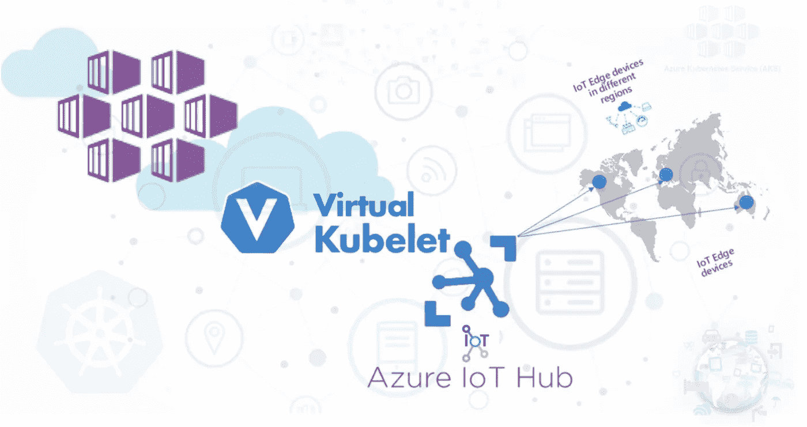

虚拟 Kubelet 和 Azure 物联网中心—连接边缘

Virtual Kubelet 是一个应用程序，它运行在当前集群中的一个容器内，并将自己伪装成一个节点。它通过 Kubernetes API 创建一个节点资源来实现这一点。然后，它会像实际的 Kubelet 一样监控预定的 pod。这是事情开始不同的地方。虚拟 Kubelet 不是与主机和主机上的容器运行时交互，而是具有模块化的嵌入式后端，称为提供者。

每当 pod 生命周期事件发生时，核心 Virtual Kubelet 逻辑就调用提供者，以通知提供者它需要处理 Pod 的创建、更新、删除等。这为 Kubernetes 集群中的节点提供了多种可能的支持。提供者本身不需要担心注入配置图和秘密，或者实现协调循环来确定是否需要创建、更新或删除某些东西。这都是由 Virtual Kubelet 处理的，以尽可能无缝地实现提供者。

虚拟库伯莱实现

# AKS 虚拟 Kubelet 实现

AKS 虚拟节点建立在虚拟 Kubelet 之上。虚拟 Kubelet 的 Azure 容器实例提供程序将 ACI 实例配置为任何 Kubernetes 集群中的一个节点。当使用虚拟 Kubelet ACI 提供程序时，可以在 ACI 实例上安排 pods，就好像 ACI 实例是标准的 Kubernetes 节点一样。

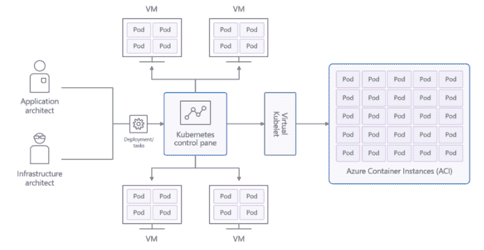

AKS 虚拟 Kubelet 实现

当对 Azure 容器实例使用虚拟 Kubelet 提供程序时，Linux 和 Windows 容器都可以在容器实例上调度，就像它是一个标准的 Kubernetes 节点一样。这种配置允许您利用 Kubernetes 的功能以及容器实例的管理价值和成本优势。Azure 容器实例(ACI)为在 Azure 中运行容器提供了一个托管环境。使用 ACI 时，不需要管理底层计算基础设施，Azure 会为您处理这种管理。

例如，下面显示的三节点 Kubernetes 集群由三个物理节点(azure 虚拟机)组成，并配置有 Azure 高级网络模式:

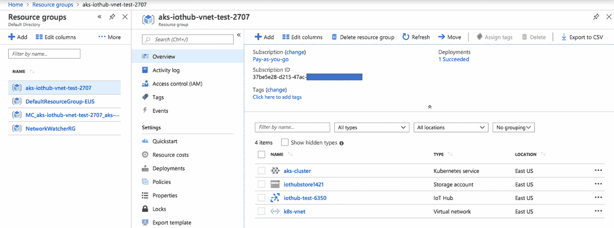

Azure 上的 AKS 集群

用户可以使用 Azure CLI 或 Azure Portal 来激活集群上的虚拟节点。该激活在集群上创建了一个虚拟 Kubelet 节点，如下所示:

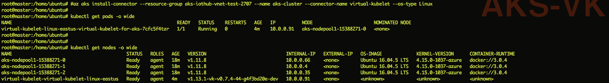

激活 AKS 上的虚拟节点

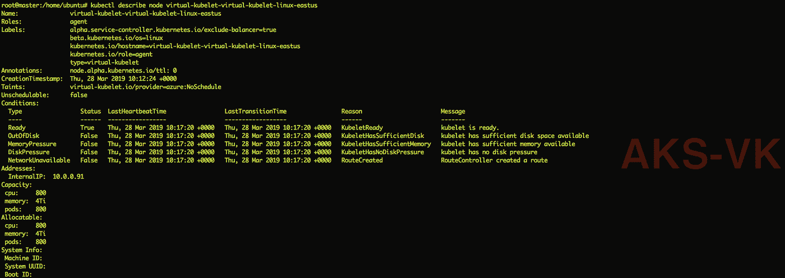

AKS 上的虚拟库伯莱

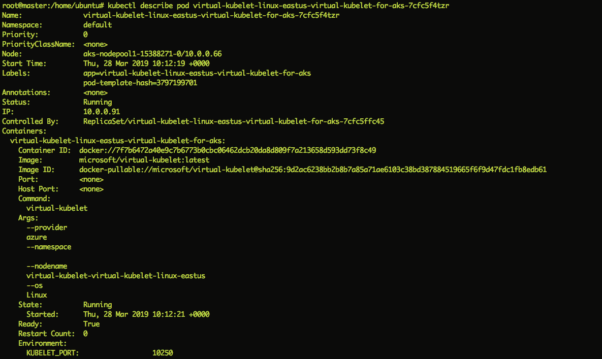

注册为 Pod 的虚拟 Kubelet

如上所示，用于基于 Linux 的实例的 Virtual-Kubelet pod 被创建为一个 pod，它被注册为 Kubernetes 集群中的一个节点。在清单中部署了一个带有特定节点选择器规范的示例应用程序，允许将工作负载部署在 virtual-kubelet 节点上。

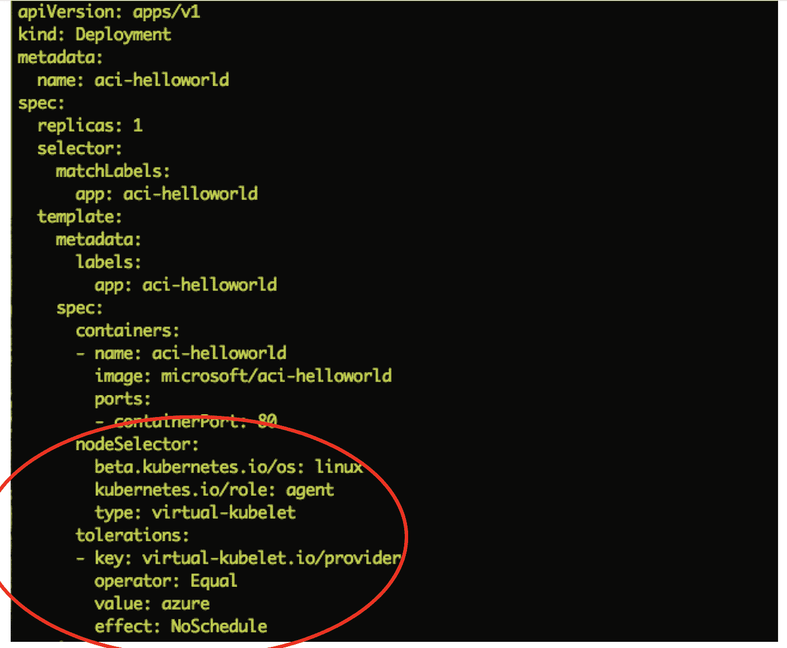

节点选择器-在虚拟节点上部署

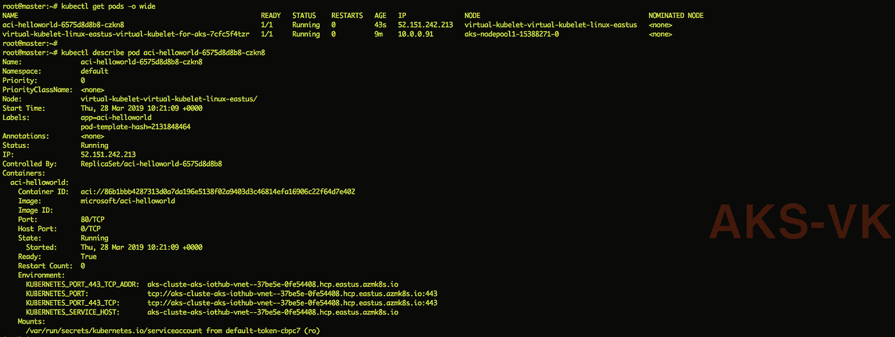

虚拟 Kubelet 节点上的 pod，具有可公开访问的 IP

如上所示，pod 是在 virtual-kubelet 节点上创建的，高级网络会自动创建连接并为应用程序提供一个 public_ip。这种配置允许用户利用 Kubernetes 的功能以及容器实例的管理价值和成本优势(按使用量收费)。

同样被认为是 Azure 中的容器实例:

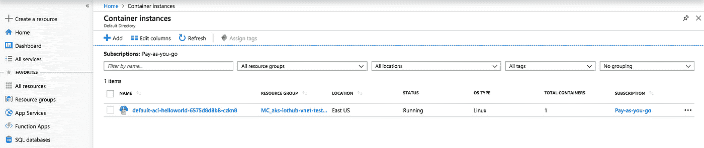

容器实例— Azure

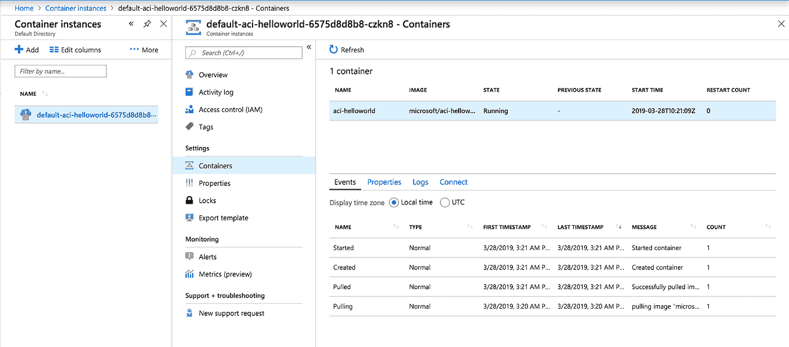

容器实例

用户可以使用高级网络提供的 public_ip 像所有其他普通应用程序一样访问该应用程序。到目前为止，在虚拟 kubelet 中创建的 pods 不共享其他 Kubernetes pods 的网络空间。这意味着虚拟 kubelet 中的 pods 不能与其他节点上的 pods 对话，反之亦然。

虚拟节点上的应用程序

借助 AKS 虚拟节点，用户能够通过准确分配所需的额外容器数量，在几秒钟内对峰值负载做出响应，而不是等待其他基于虚拟机的节点运转。

# 面向 Kubernetes 的 Azure 物联网边缘连接器

Azure IoT Edge Connector 利用 Virtual Kubelet 来提供由 Azure IoT hub 支持的虚拟 Kubernetes 节点。该连接器将 Kubernetes 对象(pod/deployment)规范转换为物联网边缘部署，并将其提交给后台物联网中心。简单来说，用户可以通过在 Kubernetes 上部署所需的代码来控制/部署到任何边缘站点。边缘部署包含设备选择器查询，该查询控制部署将应用到边缘设备的哪个子集。

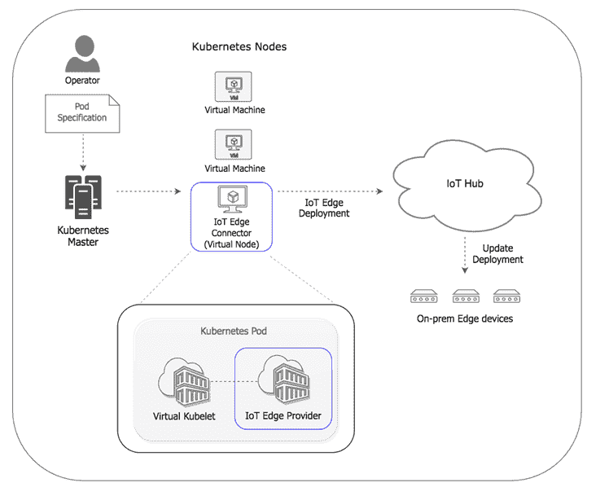

物联网边缘连接器实施

# 说明

如下所示，一个名为“aks-iot”的“资源组”包含一个名为“k8s-iot-edge”的单节点 AKS (Azure Kubernetes 服务)Kubernetes 集群和一个名为“k8s-iot-hub”的“IoT Hub”。

1.  AKS Kubernetes 单节点集群

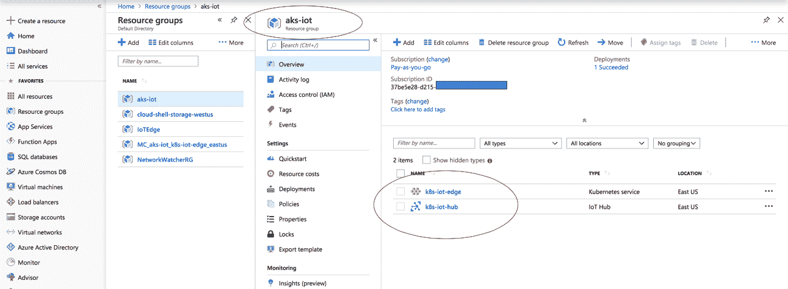

AKS 单节点集群

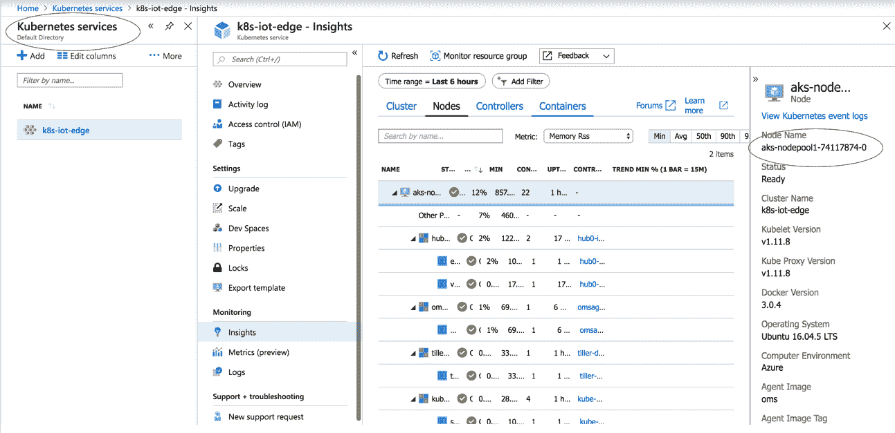

蓝色库伯内特服务

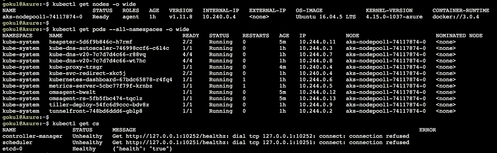

AKS 集群

2.Azure 物联网中心

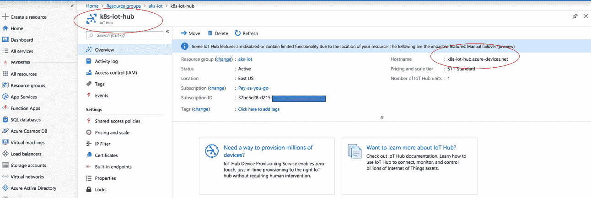

Azure 物联网中心服务

如前所述，边缘连接器利用虚拟库伯勒，在这种情况下，边缘连接器本身是一个虚拟库伯勒节点，它使用连接字符串(连接密码)与上面创建的物联网集线器进行交互。

3.部署 Azure 物联网边缘连接器

如下图所示，edge-connector 作为一个 pod 部署在 Kubernets 集群上，该集群将自己注册为一个虚拟 kubelet 节点。

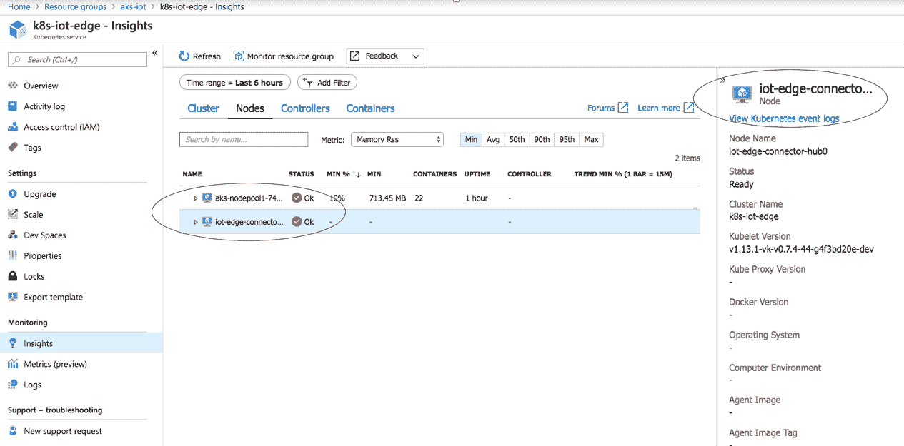

物联网边缘连接器部署

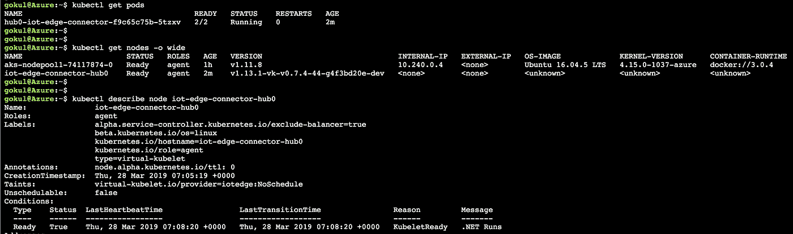

作为虚拟 Kubelet 对象的物联网边缘连接器部署

edge-connector pod 由两个容器“edgeprovider”和“virtualkubelet”本身组成，前者处理物联网集线器连接和转换。

边缘容器——虚拟 Kubelet 和 Edgeprovider

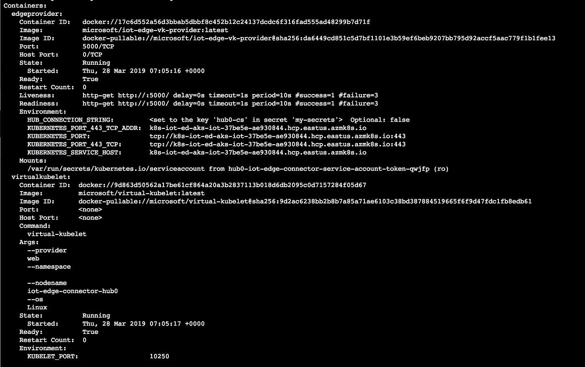

边缘容器—组件/容器

“k8s-iot-hub”的连接字符串作为 Kubernetes 的秘密提供给 edge-connector:

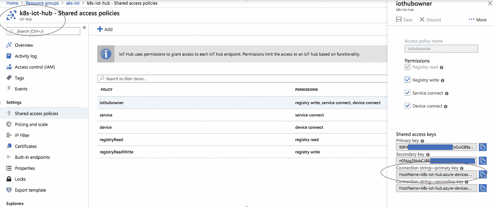

将边缘设备连接到 Azure IoT 的连接字符串

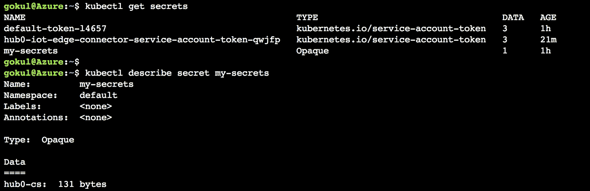

Kubernetes 上作为秘密的连接字符串

4.设置边缘设备

在这个例子中，两个基于 ARM 的设备:一个树莓 Pi Model-3 和一个香蕉 Pi M3 被用作边缘设备。这两款设备都使用 [Azure IoT Edge Runtime](https://docs.microsoft.com/en-us/azure/iot-edge/how-to-install-iot-edge-linux-arm) 和 Docker 来托管应用程序。这两块板具有互联网连接，它们可以通过 iotedge.config 文件中配置的连接字符串到达上面创建的 Azure 上的 IoT Hub。

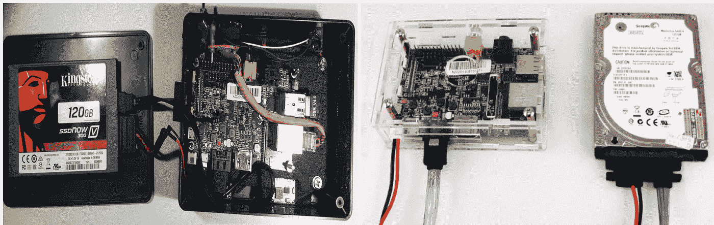

边缘设备—树莓派和香蕉派

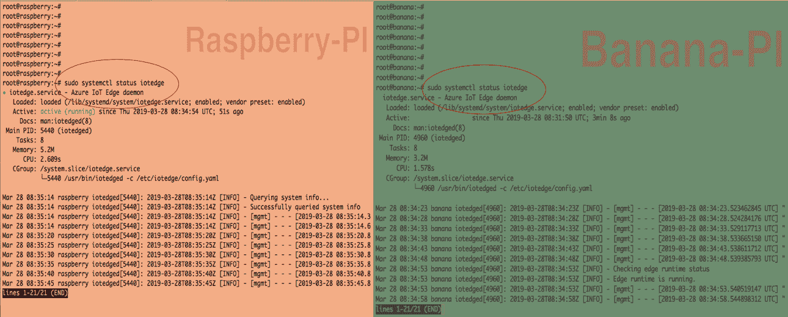

具有物联网边缘运行时的边缘设备

5.向上面创建的 k8s-IoT-hub 注册设备

使用“设备 id”创建设备标识，并为两个设备创建单独的标识字符串。

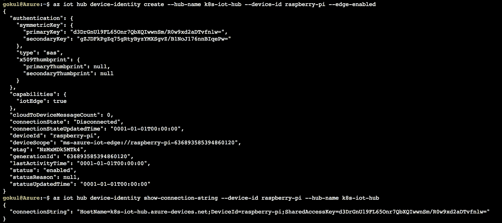

集线器设备身份创建

这些标识字符串是在“/etc/iotedge/config.yaml”中配置的:

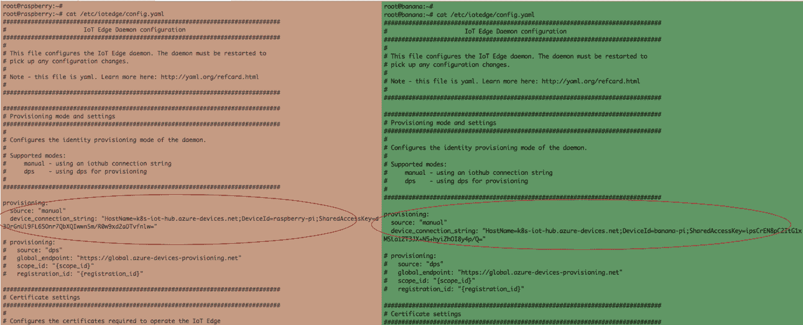

边缘设备配置

设备注册后，将在设备上安装一个 edgeAgent，将设备与 Azure IoT Hub 联系起来。

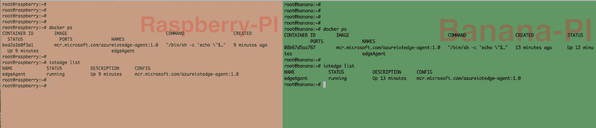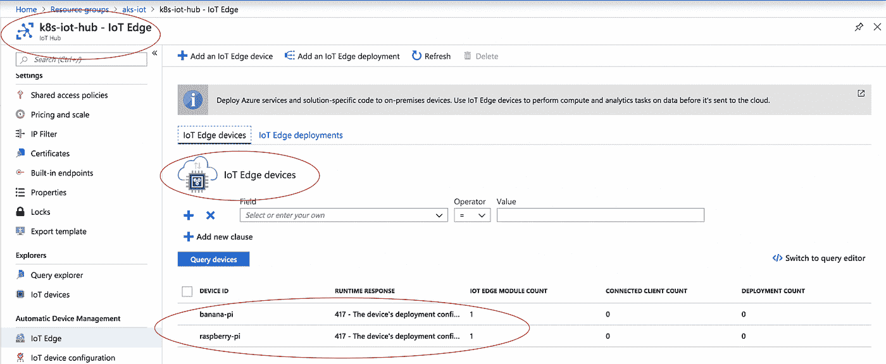

将设备注册到物联网中心

5.使用 DeviceID 部署到 Raspberry-Pi 和 Banana-Pi

示例温度传感器部署在 AKS 集群的两个边缘站点上，作为 pod 运行传感器应用程序

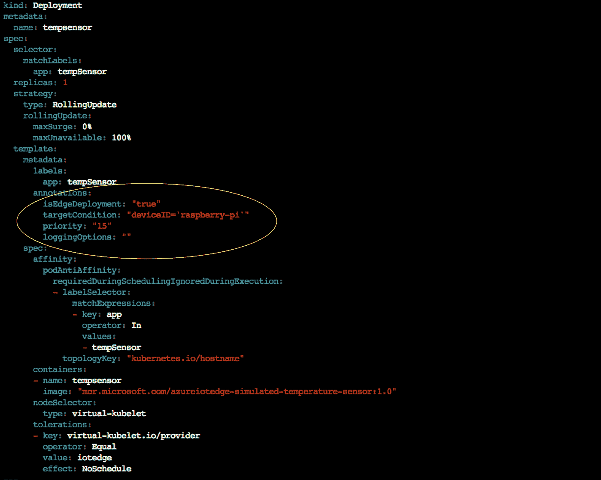

从 AKS-Kubernetes 集群部署到边缘设备

如上所示，温度传感器被部署到 Raspberry-Pi 设备上。一旦这被部署在 Kubernetes 上，由于清单具有容差和节点选择器集，应用程序将被调度到 virtual-kubelet 节点(iot-edge-connector-hub0)上，如下所示。

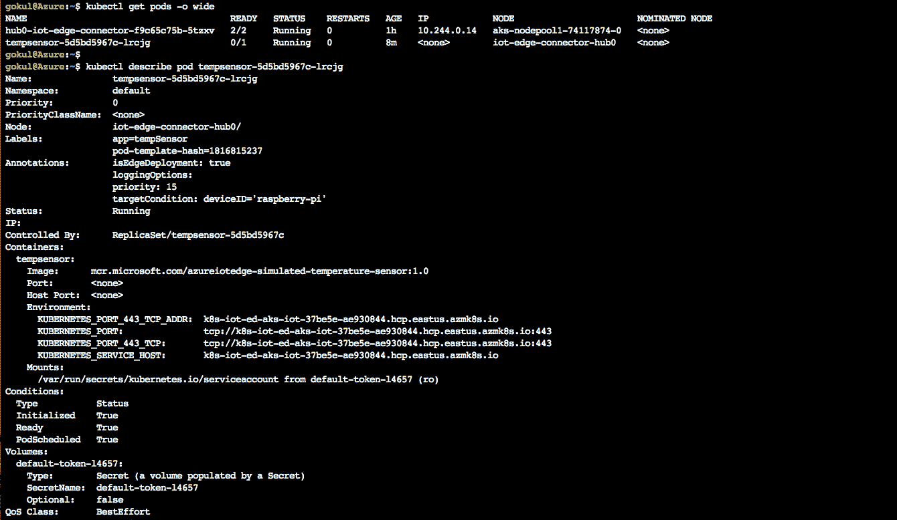

温度传感器部署示例

现在，边缘连接器将活动传递给物联网集线器，物联网集线器进而旋转订阅了“k8s-iot-hub”的 raspberry-pi 设备上的温度传感器。

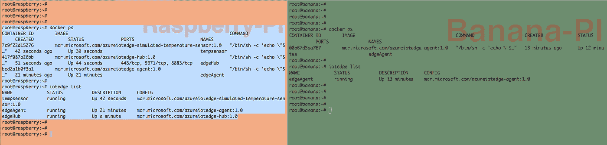

部署在边缘设备上的应用

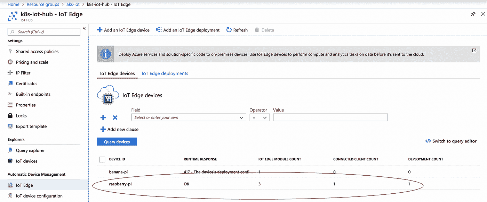

部署到边缘设备后显示模块的物联网中心

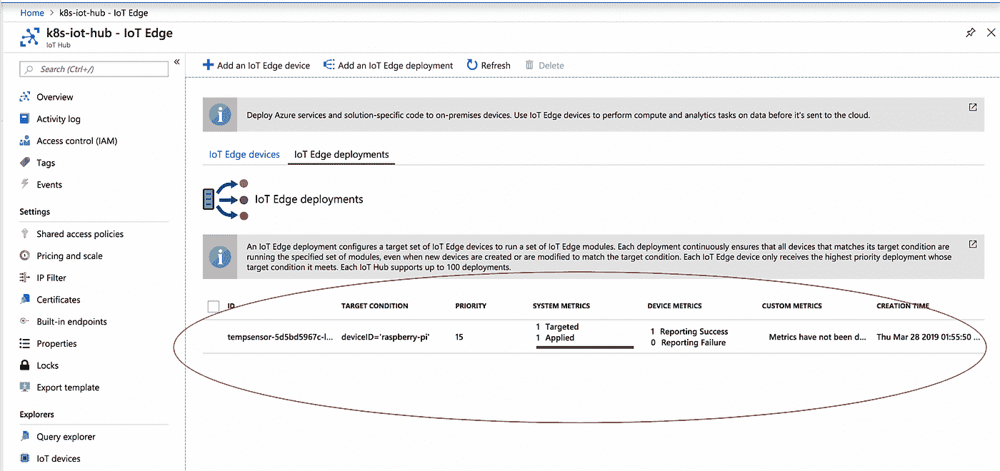

物联网集线器上的温度传感器应用示例

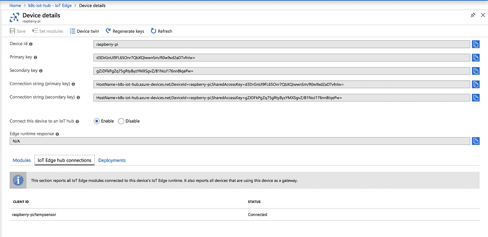

物联网中心上显示的边缘设备

类似地，可以在 banana-pi 上部署相同的应用程序，在部署规范中更改 DeviceID。

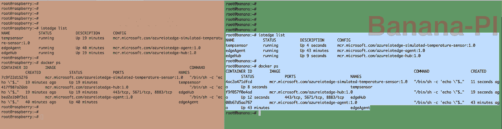

在边缘设备上部署

现在，从 AKS 部署到远程 edge_sites 的温度传感器应用程序开始根据应用程序设置报告数据。

从边缘设备报告数据的温度传感器应用示例

所有基于 Kubernetes 的操作，如缩放副本、滚动更新、重新创建和升级，都可以在控制 edge_site 应用程序的资源上执行。这使得用户能够使用托管在 AKS 上的单个 Kubernetes 控制集群来管理和控制多个 edge_sites。

*******************************************************************

Virtual-kubelet 带来了巨大的好处，可以跨多个用例使用。Kubernetes 环境可以管理多个物联网中心，保持云和边缘软件配置之间的一致性，以及跨不同地理位置的边缘站点的无缝部署。除了物联网之外，带有 ACI 连接器的 virtual-kubelet 还可以极大地有益于其他使用情形，例如运行批处理作业——最大限度地降低硬件要求、CI/CD——基于大量提交日的自动扩展、无服务器、突发——自动扩展等。

当然还有一些有争议的挑战，如网络空间(虚拟 kubelet 不共享其他 kubernetes pods 的网络空间)和互操作性(kubectl exec 等 kube TL 命令不能在虚拟 kubelet 创建的 pods 上工作)。尽管存在现阶段的不足，但虚拟 kubelet 是一个很棒的项目，潜力巨大。