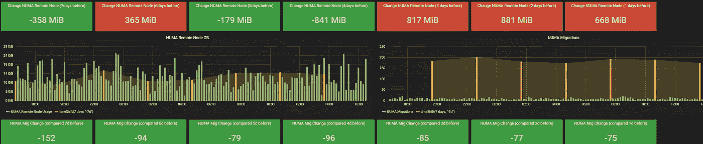
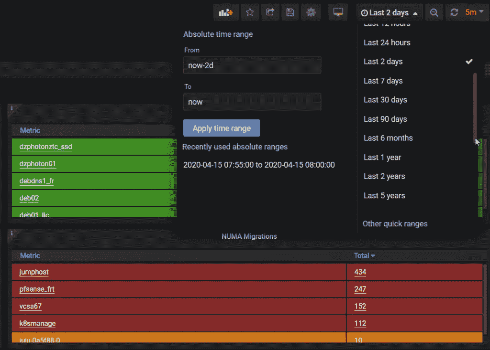
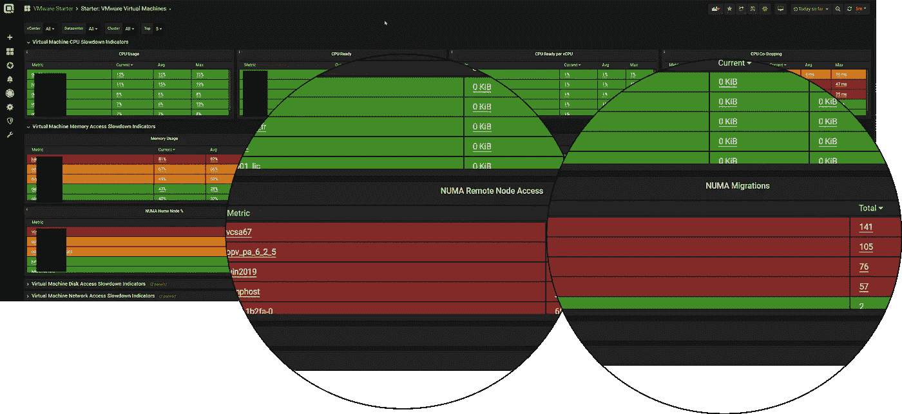
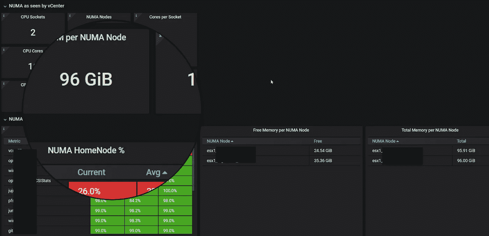
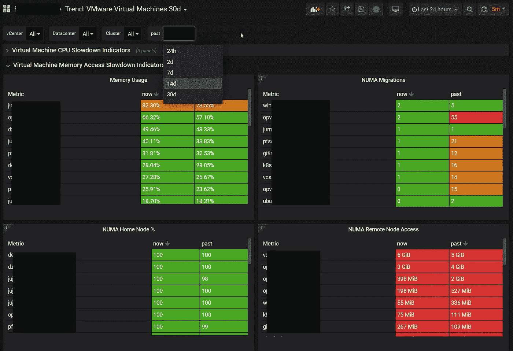

# 虚拟机性能趋势

> 原文：<https://itnext.io/virtual-machine-performance-trends-7575af0ba2b?source=collection_archive---------2----------------------->

在这个非常时期，我们收到的客户咨询比以往任何时候都多。由于越来越多的人在家工作，世界各地的客户不得不应对性能问题和服务器响应时间下降的问题。利用现有资源部署了大量新的虚拟桌面。

## [免费试用 Opvizor】](http://Try Performance Analyzer)

当然，您可以用更多的可用资源来应对这些新的资源请求。但是缺乏预算和交付时间通常是找到快速解决方案的障碍。幸运的是，很多时候我们可以通过更好地利用现有资源来提供帮助——找到并消除严重降低性能的讨厌的配置问题。

最重要的是… NUMA (NUMA 远程节点使用、NUMA 迁移)。您的系统很容易遭受超过 50%的性能下降——如果每个人都在使用您的数据库，那就太严重了。

由于有许多不同的方法来优化 NUMA 内存的使用，我们认为一些真正有用的东西。我们希望展示一种趋势，而不是只检测糟糕的 NUMA 配置和跟踪 NUMA 性能指标。通过这种方式，您可以进行更改，并跟踪单个虚拟机、ESXi 主机或整个群集在一段时间内的影响。

# 要检查的主要 NUMA 指标

在我们研究趋势之前，让我们从导致更好或更差 NUMA 排列的最重要的配置开始。

每位 VMware vSphere 管理员都应该关注哪些主要的 NUMA 指标:

*   NUMA 主节点使用
*   NUMA 远程节点使用情况
*   NUMA 本地节点迁移

所有这些指标都受到以下因素的影响:

**主机配置**

*   VMware ESXi 版本(选项越高越好)
*   CPU 插座
*   每个插槽的 NUMA 节点数
*   NUMA 节点内存大小
*   BIOS NUMA 节点交错(一些糟糕的配置启用了 NUMA 节点交错=非常糟糕的想法)
*   BIOS 电源管理(如果您希望获得最高性能，请不要选择平衡)——【https://kb.vmware.com/s/article/1018206 

**虚拟机配置**

*   虚拟机硬件版本
*   CPU 插座(过度消费会造成伤害)
*   每个插槽的 CPU 内核数(应与底层硬件一致)
*   内存大小(不要配置超过 NUMA 节点的容量)或确保 vNUMA 处于活动状态
*   CPU/内存热添加已激活(对 NUMA 来说没有好结果—甚至扼杀了 VMkernel 正确 NUMA 对齐的最佳意图)；小心点
*   vNUMA (9 个 vcpu 和更高版本激活 vNUMA，或一个高级选项 numa.vcpu.min)

我肯定还有更多值得关注的，但这些是我们在过去几年中发现的最常见的事情。

# 基准

当您开始优化您的环境以更好地利用资源和减少资源浪费时，设置一个基准是很重要的。我建议使用 PowerCLI 脚本来记录最重要的配置，这样您就可以开始与它们进行比较。

**一些好的脚本是库存和 NUMA 检查**

vSphere 的清单报告:

【https://github.com/AsBuiltReport/AsBuiltReport. VMware.vSphere

虚拟机计算优化器报告:

【https://flings.vmware.com/virtual-machine-compute-optimizer 

在你开始优化之前，一定要创建一个，这样有助于你保持跟踪。

使用 Opvizor Performance Analyzer 的众多好处之一是，它可以存储几个月甚至几年的常见配置和性能数据，因此通过选择过去的时间范围来内置基准。**顺便说一句。我们正在努力开发一项新功能，以比较特定更改前后的虚拟机性能。**

# 性能趋势

开箱即用，您可以获得许多不同的与性能相关的控制面板，这些控制面板有助于您发现 NUMA 失调以及由此导致的性能下降。根据经验，NUMA 迁移越高越糟糕，NUMA 远程节点使用率越高越糟糕。

当然，当虚拟机被迁移时，这些计数器会暂时上升，但不会永久上升或一天上升数百(或数 GB)。

控制面板可让您快速了解受影响最大的虚拟机:

**入门:VMware 虚拟机**

**ESXi 详细信息:VMware 性能:ESXi 主机**

# 检查趋势

现有客户可以在客户入口网站中访问这些控制面板。如果您想在试用期间测试它们，请联系我们的销售团队。

可以针对单个虚拟机、ESXi 主机、群集，甚至跨多个 vCenter 进行性能比较。比较的时间范围也很灵活，您可以选择 2 天、7 天或 30 天(或任何其他时间)。

要从 NUMA 远程节点使用或 NUMA 迁移的角度比较整个环境以及每天的变化，请查看我们的 NUMA 专用控制面板。

# 结果

我们的客户找到了很多方法来从他们现有的环境中获得更高的性能，并通过消除性能障碍节省了一千万、几百甚至有时一百万美元的新硬件成本。

检查您的 NUMA 指标——您可能会惊讶有多少性能问题都源于此。

## [免费试用 Opvizor](http://Try Performance Analyzer)