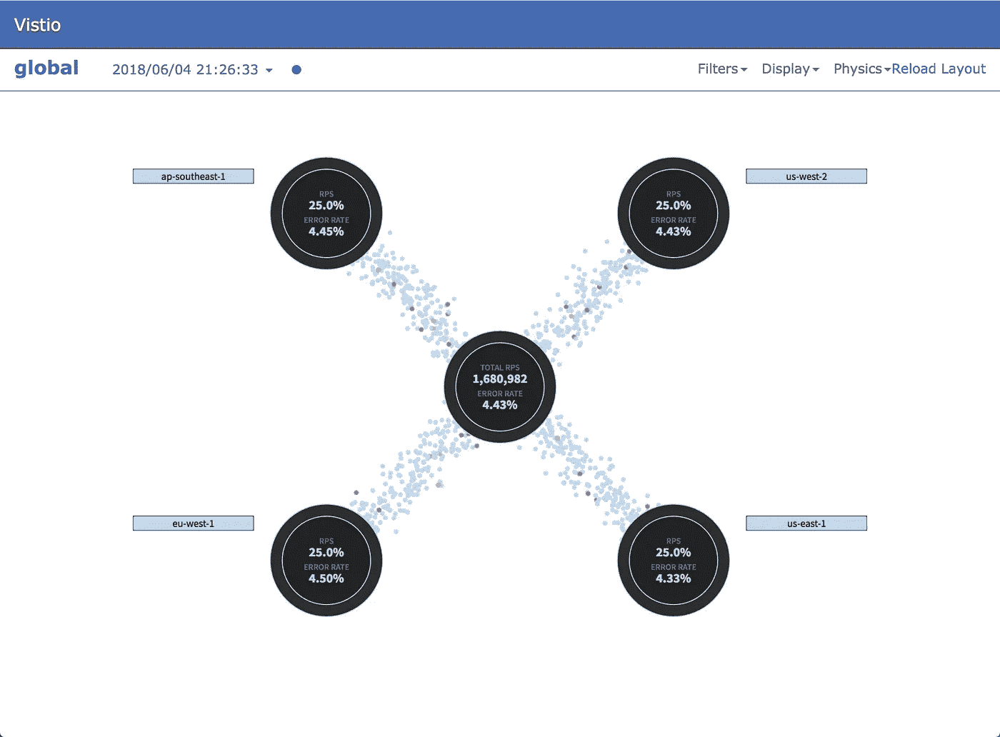
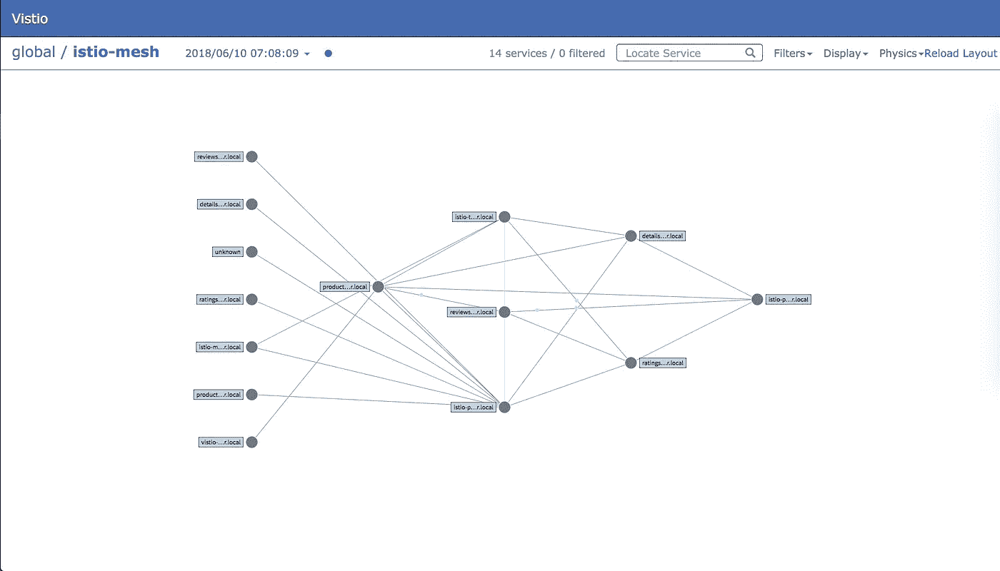
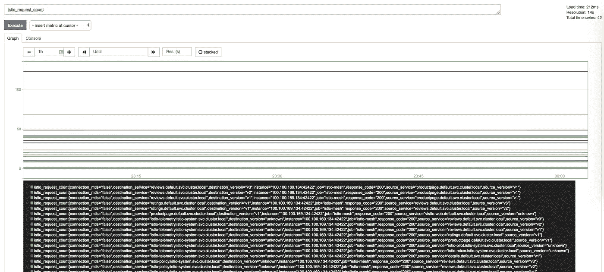
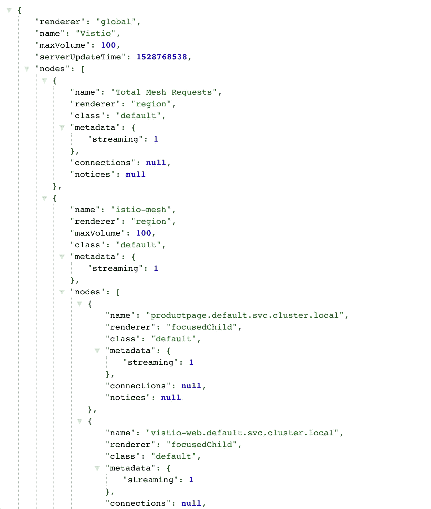
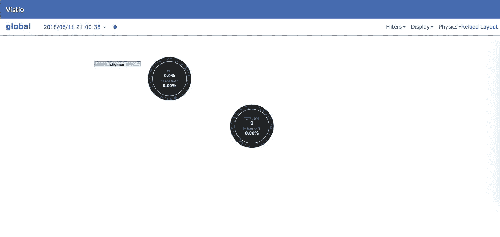
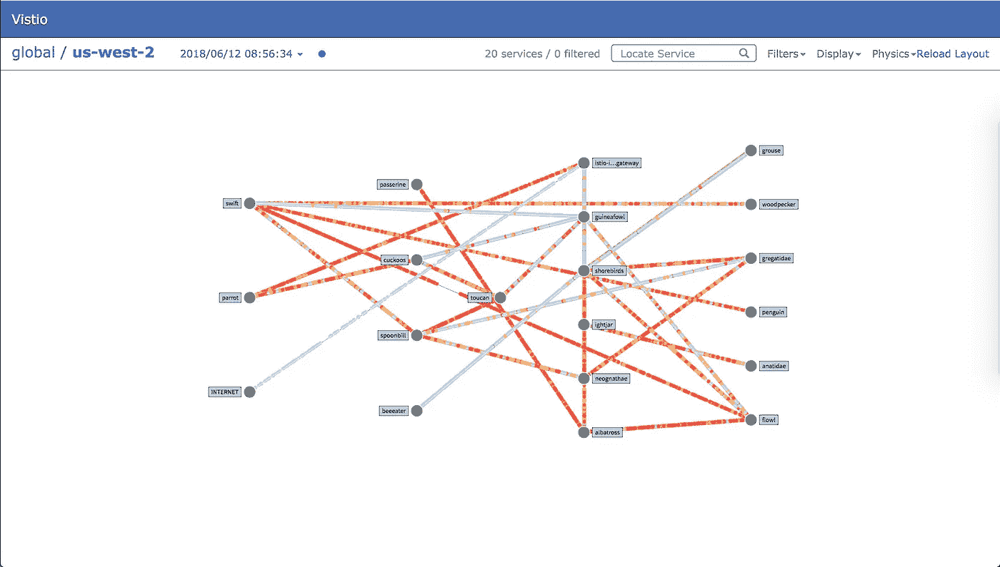
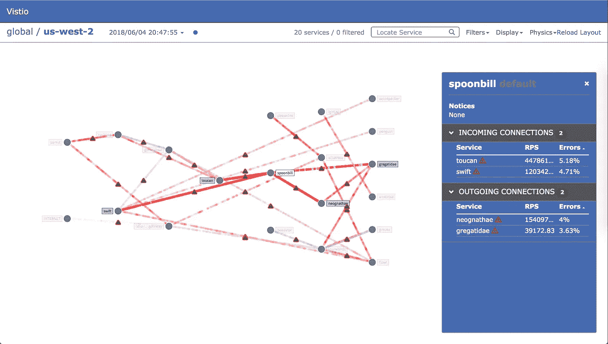
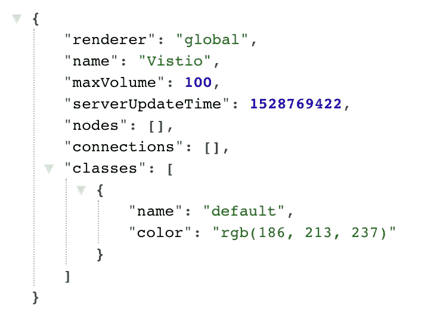

# vistio——使用网飞的 Vizceral 可视化您的 istio 网格

> 原文：<https://itnext.io/vistio-visualize-your-istio-mesh-using-netflixs-vizceral-b075c402e18e?source=collection_archive---------3----------------------->



Vistio 全球级可视化

> GitHub Link—[https://github.com/nmnellis/vistio](https://github.com/nmnellis/vistio)

Vistio 演示

[Vizceral](https://github.com/Netflix/vizceral) 是网飞发布的一个开源项目，用于近乎实时地监控应用程序和集群之间的网络流量。Vistio 是 Vizceral 的改编版，用于 istio 和网格监控。它利用 Istio Mixer 生成的指标，然后将这些指标输入 Prometheus。Vistio 查询 Prometheus 并在本地存储该数据，以允许重播流量。

Vizceral 提供了两种主要的可视化功能，全局级和集群级。在全局级别(如上所示),您可以通过一个入口点(如 Istio 入口网关)显示从互联网到 Istio mesh 的网络流量，也可以显示 Istio mesh 内的总网络流量。

在集群级别(如下所示)，您可以可视化内部网格的流量。通过设置警告和错误级别警报，您可以快速检测应用程序何时出现问题。



Vistio 集群级可视化

# 为 istio 网格设置视景

**要求**

*   普罗米修斯
*   Istio => 0.7

**假设**
为了便于部署，下面的演示做了这些假设。如果您的环境设置不同，您可能需要在本地签出代码并编辑一些文件。

*   Prometheus 在 istio-system 名称空间中运行，可通过[http://Prometheus . istio-system:9090](http://prometheus.istio-system:9090)访问
*   Istio 混音器启用了 istio_request_count 指标
*   您的 kubernetes 集群有一个“标准”存储类
*   头盔安装方便部署(可选)

**前言**
如果您的 mesh 当前没有部署，您可以按照这里的指示[ [Istio Bookinfo Demo](https://istio.io/docs/guides/bookinfo/) ]来部署 Istio 及其示例应用程序。您将需要能够产生应用程序之间的流量。要测试指标是否正确地从 mixer 发送到 Prometheus，您可以运行下面的 Prometheus 查询" *istio_request_count"* ，应该会看到多个条目。



普罗米修斯查询 istio_request_count

# 部署 Vistio

你可以选择通过 *kubectl* 或者 [Helm](https://github.com/kubernetes/helm) 来部署 Vistio，这两个方向都有。根据您的环境，有些值可能需要修改。

**结帐 Vistio(可选)**

如果你想通过 Helm 部署 Vistio，你需要签出项目以获得 Helm 模板。此外，如果上述假设之一不符合您的需求(例如 prometheus url 不同)，您应该手动签出并编辑文件。

```
git clone [https://github.com/nmnellis/vistio.git](https://github.com/nmnellis/vistio.git)
```

**通过 kubectl 部署**

```
kubectl apply -f [https://raw.githubusercontent.com/nmnellis/vistio/v0.1.2/vistio-mesh-only.yaml](https://raw.githubusercontent.com/nmnellis/vistio/v0.1.2/vistio-mesh-only.yaml) -n default
```

**通过头盔展开**

cd 进入 Vistio 项目的根目录，运行一个" *helm install"*

```
helm install helm/vistio -f helm/vistio/values-mesh-only.yaml --name vistio --namespace default
```

# 验证并公开 Vistio Web/API

验证应用程序已启动并正在运行。我们通过" *kubectl port-forward* "公开应用程序。

**验证 vistio-api**

```
kubectl describe statefulset vistio-api -n default
```

**可选检查日志**

您应该能够从日志中的 vistio-api 查看到 Prometheus 是否有连接/查询错误。

```
kubectl logs -n default -c vistio-api $(kubectl -n default get pod -l app=vistio-api -o jsonpath='{.items[0].metadata.name}')
```

**验证 vistio-web**

```
kubectl describe deployment vistio-web -n default
```

**公开 vistio-api**

我们将使用" *kubectl port-forward* "向 [http://localhost:9091](http://localhost:9091) 公开 vistio-api

```
kubectl -n default port-forward $(kubectl -n default get pod -l app=vistio-api -o jsonpath='{.items[0].metadata.name}') 9091:9091 &
```

验证 vistio-api

vistio-api 由 vistio-web 调用来渲染你的网格。您应该会看到类似下面的输出

```
[http://localhost:9091/graph](http://localhost:9091/graph)
```



预期的 vistio-api 输出

曝光远景

在另一个终端窗口中，暴露 [http://localhost:8080](http://localhost:8080) 上的 Vizceral UI。

```
kubectl -n default port-forward $(kubectl -n default get pod -l app=vistio-web -o jsonpath='{.items[0].metadata.name}') 8080:8080 &
```

**打开 Vistio**

如果到目前为止一切正常，你应该能够加载 Vistio UI 并开始探索你的网状网络。您应该会看到类似下图的内容。

```
[http://localhost:8080](http://localhost:8080)
```



主视图

# 探索

在全局级别，您将看到您的 Istio mesh 中所有请求的总和。如果您部署了 istio-Ingres Gateway，您可以选择使用其他配置显示您从网格外部接收的流量[ [使用入口网关部署 Vistio](https://github.com/nmnellis/vistio#deploy-vistio-with-istio-ingress-gateway-helm)

如果您点击 istio-mesh 气泡，您将能够查看您的网状网络。



Istio Mesh 的网络流量

在您的 Istio mesh 中，有许多可视化工具可以帮助您找出有问题的应用程序。



查明网络问题

使用屏幕右上角的过滤器，您可以快速过滤出高错误率的应用程序。通过高级配置，您还可以在错误率超过特定值时触发警报。警报将向您显示给定应用程序的错误率的当前趋势。

# 解决纷争

如果您看到 vistio-api 的以下输出，您将会知道有些地方工作不正常。正确的输出显示在上面的教程中。

```
[http://localhost:9091/graph](http://localhost:9091/graph)
```



vistio-api 的输出不正确

1.  检查 vistio-api 日志中的错误—在大多数情况下，vistio-api 会记录与 Prometheus 通信时出现的任何问题。

```
kubectl logs -n default -c vistio-api $(kubectl -n default get pod -l app=vistio-api -o jsonpath='{.items[0].metadata.name}')
```

2.验证 Prometheus 查询—vistio-API 使用以下查询来检索其数据。您应该确保 Prometheus 中存在这两者的数据。

```
# Global Level Query
sum(rate(istio_request_count[1m])) by (response_code)# Cluster Level Query
sum(rate(istio_request_count[1m])) by (source_service,destination_service,response_code)
```

3.提交问题——如果您遇到困难，请随时提交和发布！[https://github.com/nmnellis/vistio/issues](https://github.com/nmnellis/vistio/issues)

GitHub 链接—【https://github.com/nmnellis/vistio 