# C#异步/等待可视化指南

> 原文：<https://itnext.io/visual-guide-to-csharp-async-await-bc85db77f36a?source=collection_archive---------0----------------------->

## C#中异步等待的可视化解释

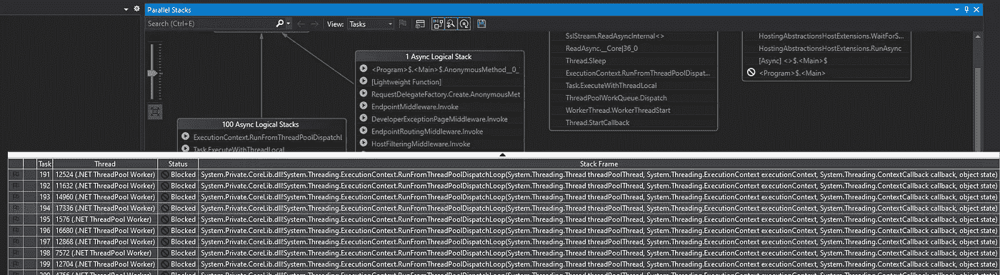

微软早在 2011 年就在 C# 5.0 中首次引入了`async/await`模式。我认为这是对异步编程的最大贡献之一——在语言层面上——这导致了其他编程语言的跟进，比如 Python 和 JavaScript 等等。它使异步代码更具可读性，更像普通的同步代码。还记得 C# 1.0 中那些老派的 [*异步编程模型/APM*](https://docs.microsoft.com/en-us/dotnet/standard/asynchronous-programming-patterns/asynchronous-programming-model-apm) 中的`BeginXxx` / `EndXxx`吗？我仍然记得在 2002 年用 Visual Studio 写的那些。NET 2002。

[](https://docs.microsoft.com/en-us/dotnet/standard/asynchronous-programming-patterns/asynchronous-programming-model-apm) [## 异步编程模型(APM)

### 使用 IAsyncResult 设计模式的异步操作实现为两个名为…

docs.microsoft.com](https://docs.microsoft.com/en-us/dotnet/standard/asynchronous-programming-patterns/asynchronous-programming-model-apm) 

足够前言。你还记得斯蒂芬·克利里著名的“[没有线索](https://blog.stephencleary.com/2013/11/there-is-no-thread.html)”帖子吗？

[](https://blog.stephencleary.com/2013/11/there-is-no-thread.html) [## 没有线

### 这是 async 最纯粹的一个基本事实:没有线程。反对这一真理的人数不胜数…

blog.stephencleary.com](https://blog.stephencleary.com/2013/11/there-is-no-thread.html) 

如果你是 C#新手，去读一下吧。我会等的。或许，我应该说`await ReadAsync()`？😆

好吧，我很高兴你还在。这篇文章是我试图帮助 C#开发者更好地理解 async/await 是怎么一回事。

# 同步码

先说同步版。

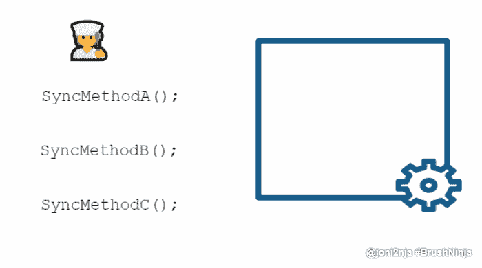

可视化:C#中普通的同步方法调用

这里没什么特别的。我想这非常简单明了。

# 异步代码

接下来，异步的。

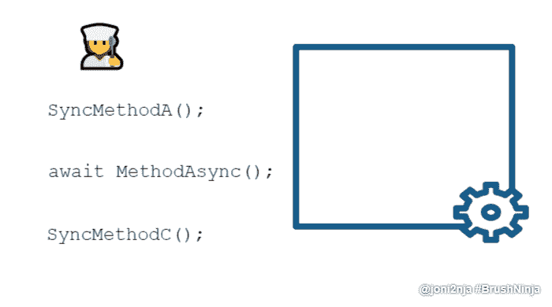

可视化:C#中的异步方法调用

如您所见，我们的异步厨师将`await MethodAsync()`放入厨房，然后不等🍜(`Task<🍜>`)做好准备。相比之下，我们的同步厨师将会在附近徘徊，也许永远在厨房里，等待🍜。

我们的异步厨师离开厨房，回到他的 ***家*** (线程 ***池*** )，和他可爱的 ***家人*** (线程池 ***线程*** )一边等着门开着(假设`ConfigureAwait(false)`；试图在此模拟“无[同步上下文](https://docs.microsoft.com/en-us/dotnet/api/system.threading.synchronizationcontext)”。此时，我们处于所谓的“没有线程”状态。厨房里没有人。我们的🍜仍在微波炉中(正在进行的 I/O 操作)。*抱歉让你失望了，我亲爱的读者，是方便面*😂。

一旦它被加热，我们超级智能的人工智能供电的警报形状的无人机(I/O 完成端口-IOCP)就会飞到我们的厨师家通知他们。记住门是开着的(同样，没有[同步上下文](https://docs.microsoft.com/en-us/dotnet/api/system.threading.synchronizationcontext))，但是我们的厨师在厕所里🚽所以他请他的妻子——碰巧也是厨师——去继续他的工作。她继续她丈夫剩余的任务，从她丈夫停止的地方开始(继续`AsyncStateMachine`)。其余同同步版。

# 使用 Visual Studio 可视化

动画 gif 是为了说明我们这个几乎真实的世界中的类比。让我们尝试使用 Visual Studio 将其可视化。

我们将使用下面的代码，一个[最小 API](https://devblogs.microsoft.com/aspnet/asp-net-core-updates-in-net-6-preview-4/#introducing-minimal-apis)，新的。NET 6。

[](https://devblogs.microsoft.com/aspnet/asp-net-core-updates-in-net-6-preview-4/#introducing-minimal-apis) [## ASP。NET 核心更新。NET 6 预览版 4

### NET 6 Preview 4 现已推出，它包含了许多对 ASP.NET 核心的重大改进。

devblogs.microsoft.com](https://devblogs.microsoft.com/aspnet/asp-net-core-updates-in-net-6-preview-4/#introducing-minimal-apis) 

```
var builder = WebApplication.CreateBuilder(args);
await using var app = builder.Build();if (app.Environment.IsDevelopment())
{
  app.UseDeveloperExceptionPage();
}app.MapGet("/sleep", (CancellationToken cancellationToken) =>
{
  while (!cancellationToken.IsCancellationRequested)
  {
    Enumerable.Range(1, 100).Select(x => x).ToList().ForEach(x =>
    {
      //WARNING: BAD CODE
      Task.Run(() => Thread.Sleep(3 * 60 * 1_000), cancellationToken);
    });
    Thread.Sleep(2 * 60 * 1_000);
  }
  return "Done.";
});app.MapGet("/delay", async (CancellationToken cancellationToken) =>
{
  while (!cancellationToken.IsCancellationRequested)
  {
    Enumerable.Range(1, 100).Select(x => x).ToList().ForEach(x =>
    {
      //WARNING: BAD CODE
      Task.Run(async () => await Task.Delay(3 * 60 * 1_000, cancellationToken), cancellationToken);
    });
    await Task.Delay(2 * 60 * 1_000, cancellationToken);
  }
  return "Done.";
});await app.RunAsync();
```

# 同步码

首先，我们将检查同步版本。转到*https://localhost:5001/sleep*。使用[过程浏览器](https://docs.microsoft.com/en-us/sysinternals/downloads/process-explorer)检查过程。

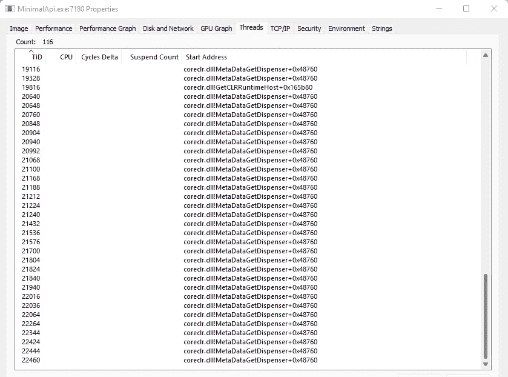

使用流程浏览器检查

我们可以看到我们正在启动 **100 个线程**。注意到滚动条了吗？我们有很多线索。

> *📝即使我们在呼叫`Thread.Sleep`，这仍然是一种资源浪费。*

让我们回到 Visual Studio，使用 **Break All** 来暂停应用程序的执行。


在 Visual Studio 中全部中断

> *📝*你可以用`Debugger.Break`来达到同样的效果。详情:[https://docs . Microsoft . com/en-us/dot net/API/system . diagnostics . debugger . break](https://docs.microsoft.com/en-us/dotnet/api/system.diagnostics.debugger.break)

查看**平行堆栈**窗口。

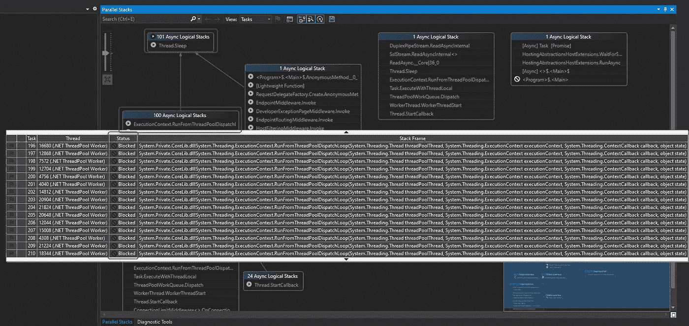

并行堆栈窗口

大量休眠线程处于“阻塞”状态。这就像我们的同步厨师在厨房里什么也不做，除了等待🍜用微波炉加热。

现在，将**视图**切换到**线程**视图，看看它看起来如何，按线程分组。几百根线！

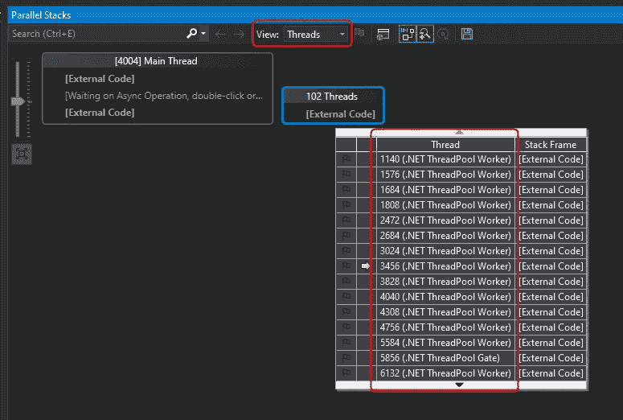

按线程查看。

让我们看看**线程**窗口。注意到滚动条了吗？

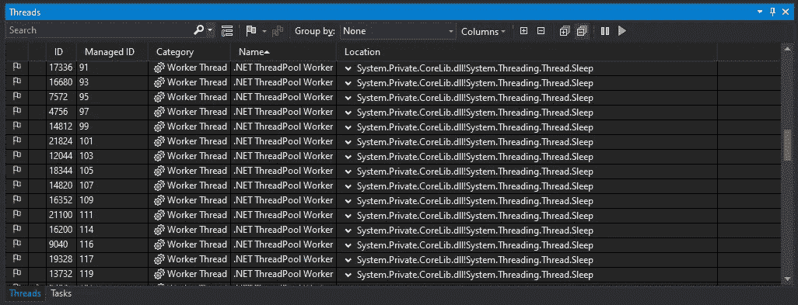

线程窗口

# 异步代码

接下来，我们来看异步版本。转到*https://localhost:5001/delay*。使用[过程浏览器](https://docs.microsoft.com/en-us/sysinternals/downloads/process-explorer)检查过程。

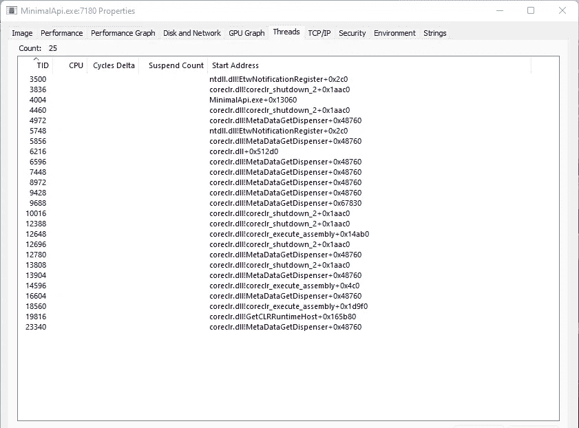

使用流程浏览器检查

我们已经开始了 100 个任务，但是没有滚动条！

返回 Visual Studio，暂停应用程序执行。


在 Visual Studio 中全部中断

查看**平行堆栈**窗口。

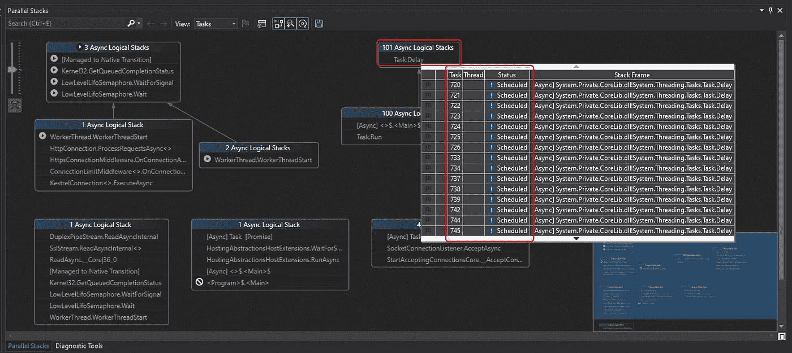

平行堆栈窗口。一堆任务处于“预定”状态。

许多*任务*处于“已调度”状态；计划在未来被解雇。在**螺纹**栏中，可以看到**没有螺纹信息，没有螺纹 ID** 。

你刚才是不是向上滚动查看同步版的截图了？欢迎回来！😆

现在，将**视图**切换到**线程**视图，看看它是如何按线程分组的。

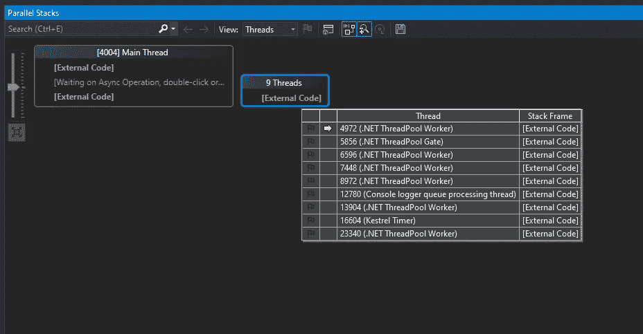

按线程查看。

不到 10 个线程，大部分是框架线程。

让我们看看**螺纹**窗口。请注意，这里没有滚动条。

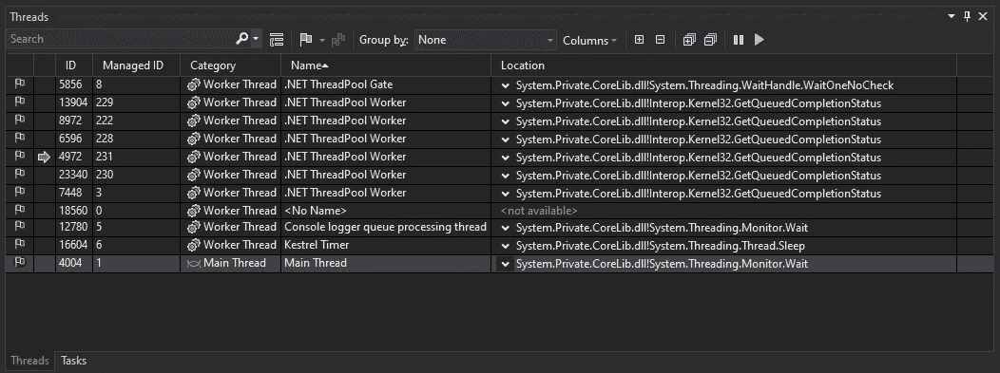

线程窗口

所以没错，这里就有**【无螺纹】**。准确地说，没有用户代码线程。没有线，就没有厨师。就像我们的异步厨师，他不是在厨房里等待，而是回到他甜蜜的家。

就是这样！

那么这意味着什么呢？对于 ASP.NET 来说，这种"**无线程"**将转化为**可伸缩性的提高**，因为我们不会阻塞我们宝贵的线程池线程；阻塞可能会导致线程池饥饿。这里有个类比。我们只有五个厨师。他们现在都在厨房里等着，无所事事。我们不能再处理额外的烹饪订单。但是，如果他们不只是简单地在厨房里等待，他们就可以只用两个厨师来处理同样数量的订单。鉴于厨房里有两个忙碌的厨师，我们仍然有三个剩余的厨师闲着，等待新的额外烹饪订单。

# 源代码

你可以在我的 [GitHub 库](https://github.com/jo-ninja/visual-guide-async-await) *找到源代码。*