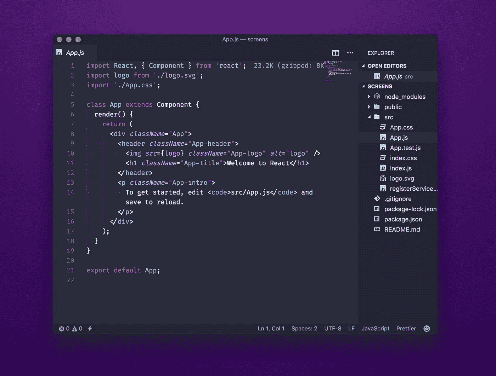
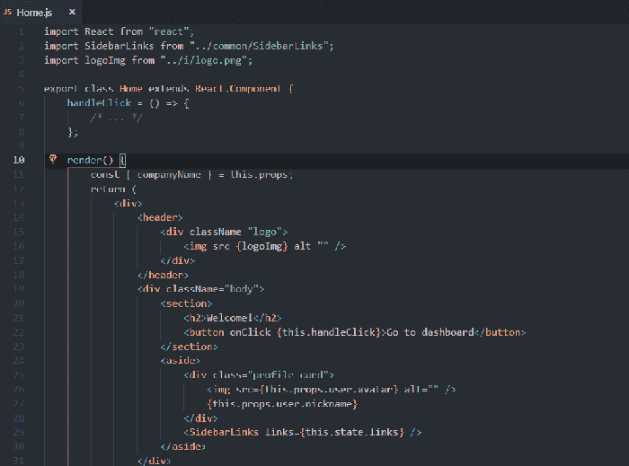
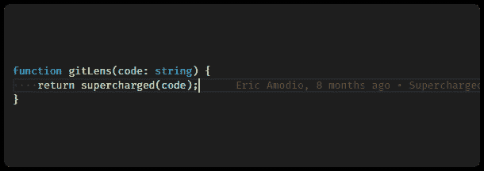
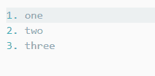
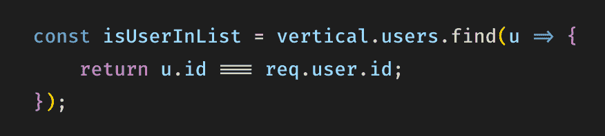

# 用于更快 JavaScript 开发的 Visual Studio 代码设置和扩展

> 原文：<https://itnext.io/visual-studio-code-settings-and-extensions-for-faster-javascript-development-12f6d382b060?source=collection_archive---------1----------------------->

## 提高工作效率的扩展和设置



🥰喜欢这个编辑

我使用 [Visual Studio 代码](https://code.visualstudio.com/)已经两年多了，当时我从 Sublime Text 跳到了它上面。

我每天花大约 5-6 个小时在 VS 代码上，所以它必须适合我的需求，尽可能地提高我的工作效率。多年来，我尝试了许多扩展和设置，但现在我觉得我已经解决了，所以值得谈论它们。

# 扩展ˌ扩张

## [漂亮的代码格式器](https://marketplace.visualstudio.com/items?itemName=esbenp.prettier-vscode)

我在我所有的项目中使用更漂亮的代码格式，我已经设置了这个扩展，这样当我点击⌘ + S 时，它会自动格式化我的 HTML/CSS/JS。这允许我摆脱特定语言的代码格式化程序。

## [npm](https://marketplace.visualstudio.com/items?itemName=eg2.vscode-npm-script)

我使用这个扩展和 npm intellisense(如下)来确保我的`package.json`是最新的，并且不会被我没有使用的模块所膨胀。

## [npm 智能感知](https://marketplace.visualstudio.com/items?itemName=christian-kohler.npm-intellisense)

这个扩展索引了我的 package.json，并允许我在需要模块时自动完成我的`import`语句。


## [支架对着色机](https://marketplace.visualstudio.com/items?itemName=CoenraadS.bracket-pair-colorizer)

这个扩展用颜色对我所有的括号进行编码，让我可以快速看到每个代码块的开始和结束位置。

## [反应重构](https://marketplace.visualstudio.com/items?itemName=planbcoding.vscode-react-refactor)

这是最新的扩展，我已经添加到我的阿森纳，我真的很喜欢它。它允许您选择一些 JSX，并将其重构为自定义的 React 类、函数或钩子。



## [自动关闭标签](https://marketplace.visualstudio.com/items?itemName=formulahendry.auto-close-tag)

另一个简单的扩展做好了一件事:自动关闭我的 JSX 标签。

## [GitLens](https://github.com/eamodio/vscode-gitlens)

我最近从 VSCode 的原生源代码控制设置转移到了 Gitlens。我喜欢这个扩展，因为它让我:

*   自动查看当前行的 git 错误
*   在悬停时查看更详细的历史记录
*   通过装订线重置更改



## [简单的反应片段](https://marketplace.visualstudio.com/items?itemName=burkeholland.simple-react-snippets)

我写了太多的 React 代码，以至于我需要一个扩展来帮助我节省一些时间。我现在使用这个扩展来填充编写 React 组件时附带的一些样板文件。

## [降价销售一体](https://marketplace.visualstudio.com/items?itemName=yzhang.markdown-all-in-one)

这个扩展在我写 READMEs 或者其他 Markdown 文档时帮了我很大的忙。我特别喜欢它处理列表、表格和目录的方式。



# 用户设置

除了扩展之外，定制 VS 代码体验的另一个方面是用户设置。我在下面分享了我的完整设置文件，但这里有一些重要的部分:

## 字体设置

我真的很喜欢带连字的字体。如果您不熟悉连字，它们是分析和连接多个字符的特殊字符。我主要使用 [Fira 代码](https://github.com/tonsky/FiraCode)作为我的编程字体。下面是它呈现 JavaScript 的方式:



我的完整字体堆栈是:

```
"editor.fontFamily": "'Fira Code', 'Operator Mono', 'iA Writer Duospace', 'Source Code Pro', Menlo, Monaco, monospace", "editor.fontLigatures": true,
```

为了检测缩进，我也喜欢这些设置:

```
"editor.detectIndentation": true, 
"editor.renderIndentGuides": false,
```

为了帮助管理我的导入，我更喜欢这些:

```
// Enable auto-updating of import paths when you rename a file. "javascript.updateImportsOnFileMove.enabled": "always",
```

## 蚂蚁

Emmet 现在包含在 VS 代码中，但是为了让它和 React 一起工作，我不得不更新一些设置。

```
"emmet.includeLanguages": { 
  "javascript": "javascriptreact", 
  "jsx-sublime-babel-tags": "javascriptreact"
}, 
"emmet.triggerExpansionOnTab": true, "emmet.showExpandedAbbreviation": "never",
```

[这是我的完整](https://gist.github.com/tilomitra/e1bb62d389b3798d8d381db7ac929570) `user-settings.json`

关于 Visual Studio 代码的更多提示和技巧，我推荐查看 [VSCode 可以做到这一点](http://vscodecandothat.com/)。

*原载于 2019 年 2 月 19 日*[*tilomitra.com*](http://tilomitra.com/vs-code-settings-and-extensions-for-faster-javascript-development/)*。*