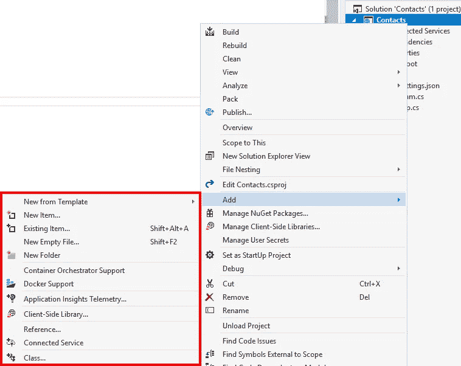
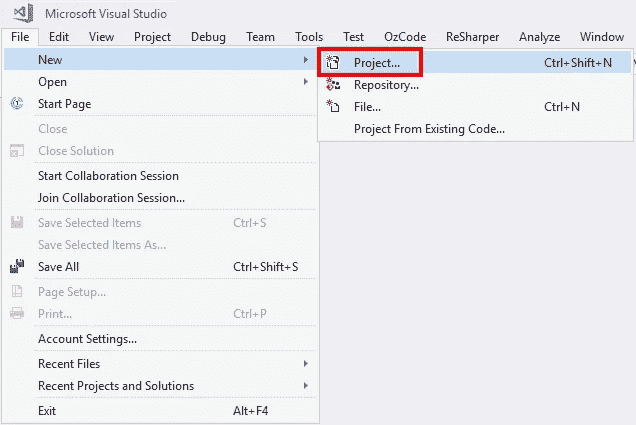
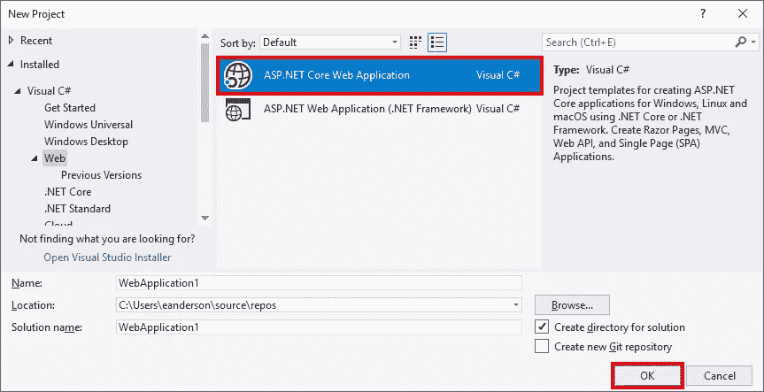
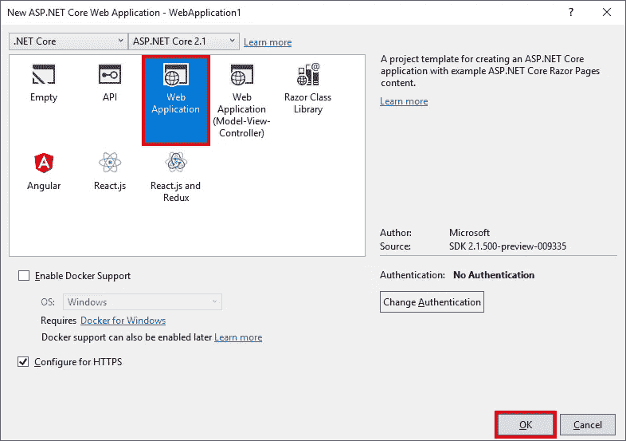
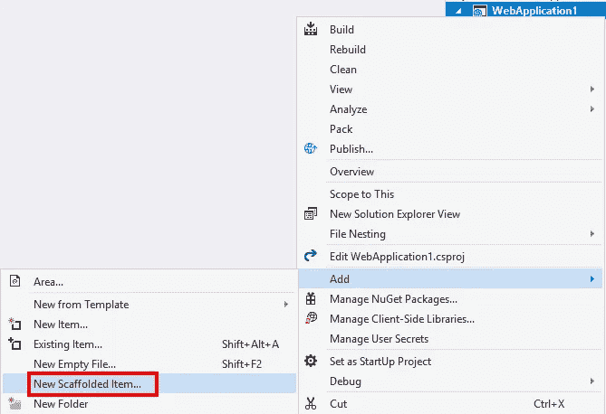

# Visual Studio 缺少 ASP.NET 核心的脚手架

> 原文：<https://itnext.io/visual-studio-missing-scaffolding-for-asp-net-core-4b7ad31c5bab?source=collection_archive---------0----------------------->

今天早上，我开始尝试作为 ASP.NET 2.1 版本的一部分添加的脚手架身份选项。这个功能的[文档](https://docs.microsoft.com/en-us/aspnet/core/security/authentication/scaffold-identity?view=aspnetcore-2.1)非常好，所以我不认为我会有任何问题，但我错了。

## 示例应用程序

首先，我使用了。NET CLI 创建一个新的应用程序。

```
dotnet new razor
```

然后，我在 Visual Studio 中打开了该项目。然后在文件之后，我右键单击项目并展开**添加**选项，但是**新脚手架项目**不见了。



## 示例应用程序 2

由于使用 CLI 创建的项目没有选项，我想我会尝试在 Visual Studio 中创建新项目。从 Visual Studio 中使用**文件>新建>项目**。



在 **Visual C# > Web** 下选择**ASP.NET 核心 Web 应用**并点击 **OK** 。



选择 **Web 应用**然后点击**确定**。



创建过程完成后，我右键单击该项目并展开**添加**选项，然后**新的脚手架项目**就在那里了。



## 有什么区别？

在尝试了很多不同的东西之后，我终于开始查看两个项目的 csproj 文件。这是来自 Visual Studio create 项目的 csproj。

```
<Project Sdk="Microsoft.NET.Sdk.Web">
  <PropertyGroup>
    <TargetFramework>netcoreapp2.1</TargetFramework>
  </PropertyGroup>

  <ItemGroup>
    <PackageReference Include="Microsoft.AspNetCore.App" />
    <PackageReference Include="Microsoft.AspNetCore.Razor.Design" Version="2.1.2" PrivateAssets="All" />
  </ItemGroup>
</Project>
```

和来自 CLI 创建的项目的 csproj。

```
<Project Sdk="Microsoft.NET.Sdk.Web">
  <PropertyGroup>
    <TargetFramework>netcoreapp2.2</TargetFramework>
  </PropertyGroup>

  <ItemGroup>
    <PackageReference Include="Microsoft.AspNetCore.App" />
    <PackageReference Include="Microsoft.AspNetCore.Razor.Design" Version="2.2.0-preview3-35497" PrivateAssets="All" />
  </ItemGroup>
</Project>
```

请注意，CLI 创建的项目是针对。NET Core 2.2，在撰写本文时它还处于预览阶段。毫不奇怪，Visual Studio 对使用预览位能做什么有一些限制。

## 包扎

我不能相信我让预览位安装导致我再次出现问题。我猜大多数人不会安装预览版，所以希望这不是你们大多数人必须处理的问题。

如果您确实希望使用 CLI 创建针对特定版本的应用程序。NET Core 可以使用一个 **global.json** 文件来完成。检查[控制。NET Core 的 SDK 版本](https://elanderson.net/2018/09/controlling-net-cores-sdk-version/)了解更多信息。

*原载于* [*埃里克·安德森*](https://elanderson.net/2018/12/visual-studio-missing-scaffolding-for-asp-net-core/) *。*