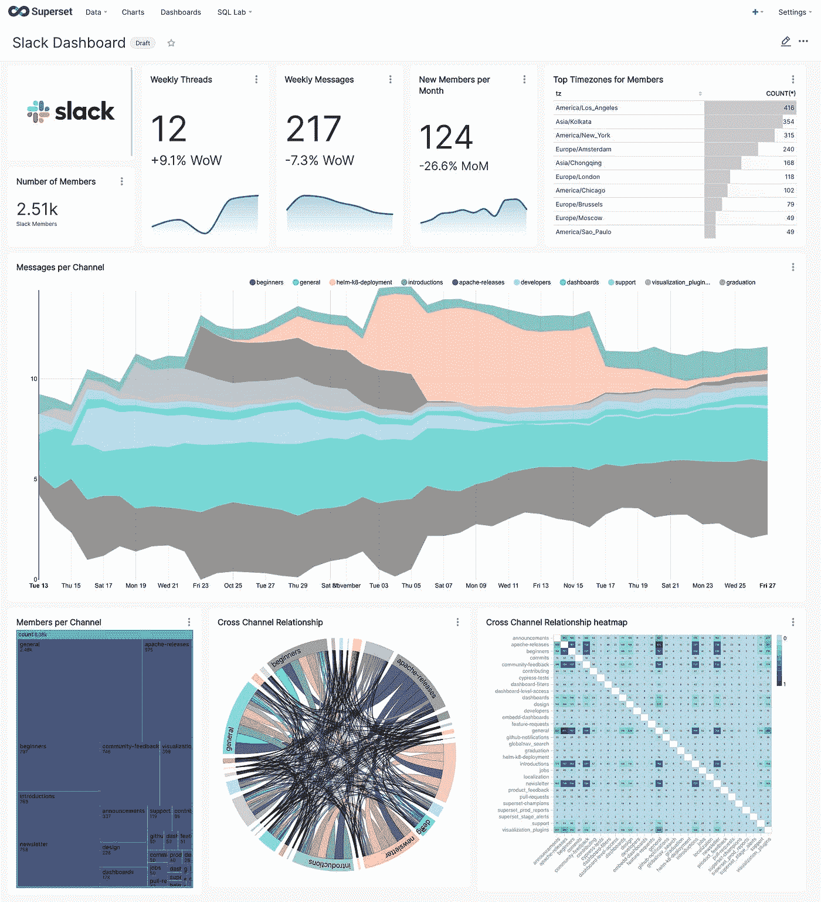
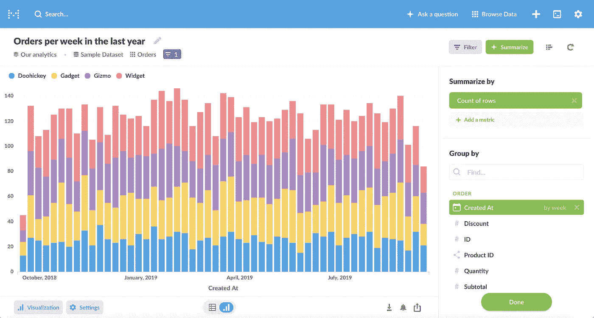
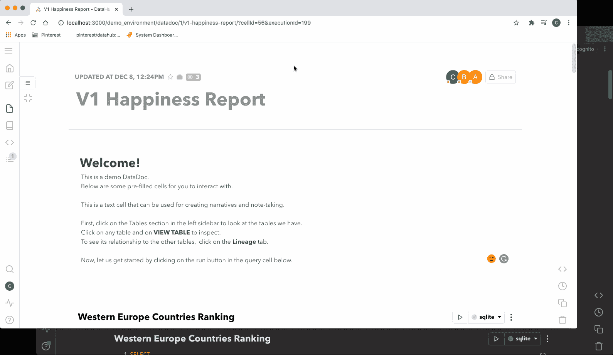
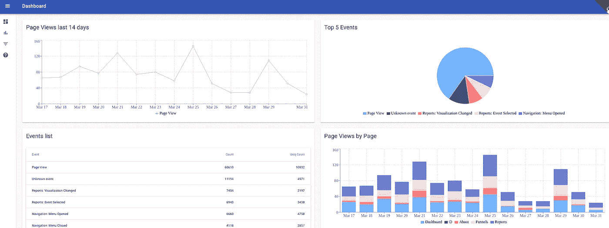
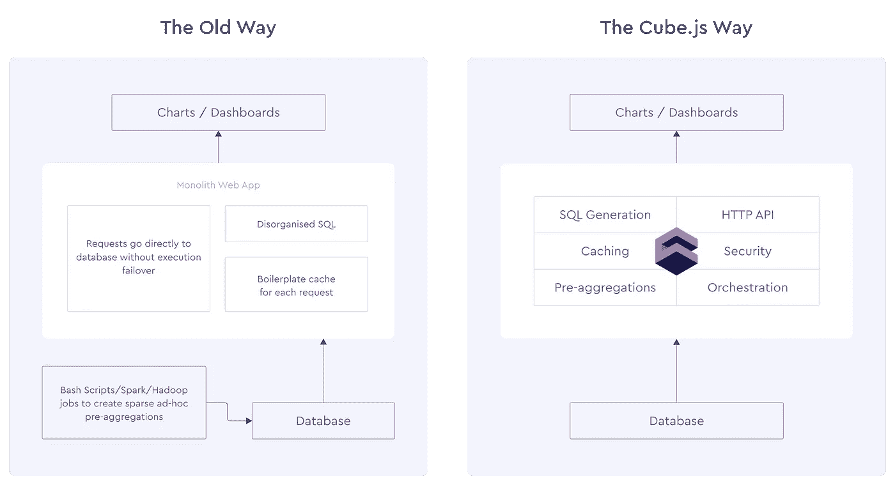
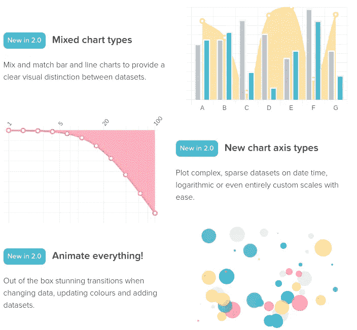
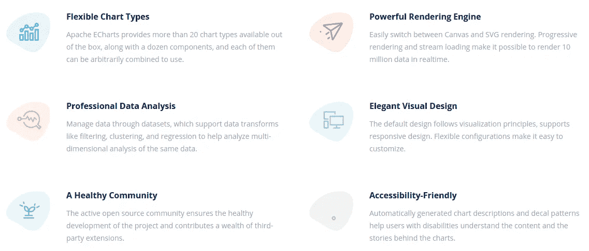

# 大数据的可视化工具

> 原文：<https://itnext.io/visualization-tools-for-big-data-c3361241a67e?source=collection_archive---------0----------------------->

照片由[贾科莫·卡拉](https://unsplash.com/@giacomocarra?utm_source=medium&utm_medium=referral)在 [Unsplash](https://unsplash.com?utm_source=medium&utm_medium=referral) 上拍摄

# **简介**

在我的[上一篇**文章**](/big-data-pipeline-recipe-c416c1782908) 中，我几乎没有接触到**可视化工具**的概念。前端是数据管道的关键部分，因为它是分析平台的可见部分。无论你的数据管道有多好，它都需要可靠且**高性能的**可视化工具来实现它的目的:**提供有意义的见解，以便利益相关者可以做出重要的数据驱动的决策。**

在本文中，我将简要介绍在运行您的**数据** [**管道**](/big-data-pipeline-recipe-c416c1782908) 后，可用于您的已处理数据的不同可视化选项。我将重点关注**开源**解决方案，它们是**更便宜、更便携的**选项。公共**云提供商**有几个关于 [**BI**](https://en.wikipedia.org/wiki/Business_intelligence) 和数据可视化的选项，我建议您研究一下，但这超出了本文的范围。总的来说，使用这些云服务非常简单明了，但是比使用开源解决方案更昂贵。

你可能会考虑的一些**商业解决方案**有 [**Qlik**](https://www.qlik.com/us) **，**[**Looker**](https://looker.com/)**或**[**Tableau**](https://www.tableau.com/)**，**这些也不在本文的讨论范围之内。

## 可视化选项

根据您的使用案例，您可以考虑两个宽泛的**类别**用于可视化:

*   [**BI**](https://en.wikipedia.org/wiki/Business_intelligence) **工具**:在这一类别中，您拥有组织内部使用的工具**来满足不同利益相关者的分析需求，例如业务用户、数据科学家、工程师和经理。这些工具可以在本地部署或云中使用。尽管可以向客户授予访问权限，但他们往往会被您的公司使用，而不会向您的用户公开分析。**
*   ****可视化工具**:在这个类别中，我们有专注于创建可视化前端应用的工具。这些包括图表库和用于**前端**应用的分析 API。这些工具主要用于集成现有产品，如**面向客户的**网站。**

**简单地说，认为 **BI 工具**主要是作为**内部**分析工具，多租户**一体化**解决方案；另一方面，把**可视化工具**主要看作是面向客户的，**前端**，通常是单租户和单一用途的解决方案。*我们来回顾一下其中的一些吧！***

# ****BI 工具****

**在本节中，我们将回顾一些提供以下功能的解决方案:**

*   **能够连接到许多数据源**
*   **可视化:仪表板和图表**
*   **查询生成器**
*   **报告和警报**

## ****超集****

**[**超集**](https://github.com/apache/superset) 是最**流行的**开源 [BI](https://en.wikipedia.org/wiki/Business_intelligence) 可视化工具。它基于 **Python** ，可以从任何使用 SQL 的数据存储或数据引擎(如 [Presto](https://prestodb.io/) 或 AWS [Athena](https://aws.amazon.com/athena/) )中查询数据，这些数据存储或数据引擎都有 Python DB-API 驱动程序和 [SQLAlchemy](https://www.sqlalchemy.org/) 方言。**

****

**超集可视化**

**它支持**大范围的** [**图表**](https://superset.apache.org/gallery/) 进行可视化，还可以创建丰富的 [**仪表盘**](https://superset.apache.org/docs/creating-charts-dashboards/first-dashboard) 。它还有一个运行*特定*查询的接口。非常好用，性能也很棒。用户可以配置自动警报和报告发送给电子邮件收件人或 *Slack* 通道:**

*   **当达到 SQL 条件时，会发送警报**
*   **报告按计划发送**

****

**超集仪表板**

**根据他们的文档，这些是主要的**功能**:**

*   **用于可视化数据集和制作交互式仪表盘的直观界面**
*   **展示您的数据的各种美丽的可视化**
*   **用于提取和呈现数据集的无代码可视化构建器**
*   **一个世界级的 SQL IDE，用于为可视化准备数据，包括一个丰富的元数据浏览器**
*   **轻量级语义层，支持数据分析师快速定义自定义维度和指标**
*   **对大多数 SQL 语言数据库的现成支持**
*   **无缝的内存异步缓存和查询**
*   **一个可扩展的安全模型，允许配置非常复杂的规则，规定谁可以访问哪些产品功能和数据集。**
*   **与主要认证后端(数据库、OpenID、LDAP、OAuth、REMOTE_USER 等)集成**
*   **添加自定义可视化插件的能力**
*   **用于编程定制的 API**
*   **为扩展而从头设计的云原生架构**

**[入门 Docker](https://superset.apache.org/docs/installation/installing-superset-using-docker-compose) 相对容易。它有许多配置选项，并支持使用 **Redis** 的[内存缓存](https://superset.apache.org/docs/installation/cache)。如果您需要任何开箱即用不支持的特殊可视化，您可以创建自己的[视图](https://superset.apache.org/docs/installation/building-custom-viz-plugins)。**

****超集**功能丰富，流行，有很大的支持，并且**易于使用**。它支持[大量数据库](https://superset.apache.org/docs/databases/installing-database-drivers)，包括云数据库、传统数据库和 NoSQL 数据存储。它还可以很好地与 NewRelic、StatsD 和 DataDog 等服务配合使用。**

**Superset 目前正在许多公司大规模运行，如 AirBnB。**

## ****元数据库****

**[**元数据库**](https://github.com/metabase/metabase) 是超集的替代方案，它更容易设置并具有相似的特性:**

*   **丰富漂亮的[仪表盘](https://metabase.com/docs/latest/users-guide/06-sharing-answers.html)具有自动刷新和全屏功能**
*   **[面向分析师和数据专家的 SQL 模式](https://www.metabase.com/docs/latest/users-guide/writing-sql.html)**
*   **创建规范的[细分和度量](https://metabase.com/docs/latest/administration-guide/07-segments-and-metrics.html)供您的团队使用**
*   **使用[仪表板订阅按计划向 Slack 或电子邮件发送数据](https://www.metabase.com/docs/latest/users-guide/dashboard-subscriptions.html)**
*   **一个 [lerts](https://www.metabase.com/docs/latest/users-guide/15-alerts.html) 和报告。**

****

**它还支持许多官方或社区的数据库。最酷的是，如果需要，它有[企业支持](https://www.metabase.com/)，甚至还有一个非常容易使用的[云产品](https://www.metabase.com/start/hosted/)。**

**我喜欢**元数据库**的一点是，使用它不需要成为 BI 专家。它有一个非常简单易用的 [**查询生成器**](https://www.metabase.com/docs/latest/users-guide/04-asking-questions.html#asking-a-simple-question) 和许多可视化功能；您可以非常快速轻松地创建仪表板[共享](https://www.metabase.com/learn/developing-applications/advanced-metabase/embedding-charts-and-dashboards.html)它们。按照这个简单的[指南](https://www.metabase.com/learn/getting-started/getting-started/tour-of-metabase.html)开始。**

## **查询书**

**[**Querybook**](https://www.querybook.org/) 是一款**开源大数据****IDE/笔记本**。它与之前的工具有些不同，因为它的主要目标是帮助你分析、记录和分享你的分析查询和可视化。类似于[**Jupyter**](https://jupyter.org/)[**笔记本**](https://jupyter.org/) 但是侧重于**大数据。****

****

**Querybook 运行中**

**它使用了 **DataDoc** 的概念，使用可以包含文档或查询的单元格。这样，您可以创建笔记本来描述您的查询和可视化。当编写查询时，**智能编辑器**知道你的数据源，并提供自动完成、语法高亮等等。**

**它提供了**图表**，如折线图、条形图、堆积面积图、饼图、水平条形图、圆环图、散点图和表格。因此，您可以在一个地方记录、查询和可视化数据。它还有一个很棒的**模板引擎**让你的查询保持干爽。**

**您可以使用**调度器**刷新笔记本数据，以保持数据最新。Querybook 还可以向外部应用发送计划更新。**

**最后，Querybook 自动分析已执行的查询，以提供数据沿袭、示例查询、频繁用户信息、搜索/自动完成排名。**

**使用**对接器**很容易[开始](https://www.querybook.org/docs/setup_guide/quick_setup)。它还支持许多[数据源](https://www.querybook.org/docs/)、元存储、认证提供商，并集成到许多云提供商，以将查询结果导出到 **S3** 或 **GCS** 。**

****Querybook** 目标受众与其他工具略有不同，因为它更侧重于**数据分析和发现**；主要面向**数据科学家和数据分析师。****

# ****可视化工具****

**在这一节中，我们的重点是当您想要为您的用户提供分析时的用例，通常是通过将图表、小部件和其他数据嵌入到您现有的产品中。在这种情况下，您需要一个 API 来管理查询和一个 UI 框架。**

**你可以实现自己的 API 来服务你的前端应用，但是这需要大量的工作，特别是对于**大数据**。您不想直接查询数据库，主要有两个原因:**

*   **你的数据库可能会改变，这就是我们使用 API 的原因。此外，很可能您有多个数据库，这增加了复杂性。**
*   **您将需要进行大量的性能优化，以便能够生成可靠的图表和仪表板。**

**建议您使用提供以下功能的 API:**

*   **一个友好的**语义** **API** 来构建仪表板，该仪表板抽象底层数据存储并在度量、维度、分段等方面公开标准 BI 模式；**隐藏底层复杂性**或实现细节。请记住，您可能会查询不同类型的数据库，如 SQL 或 NoSQL。**
*   **内存中的**高速缓存**。**
*   ****多租户**支持。因此，您可以以安全的方式查询不同客户/用户的数据。**
*   **查询优化。**
*   **预聚合，如复杂聚合的汇总。**
*   **例如，认证支持使用 [**JWT**](https://jwt.io/) 令牌。**

**许多 [**OLAP 引擎**](/olap-query-engines-for-big-data-5f17b88d6ebc) 像 [**德鲁伊**](https://druid.apache.org/) 提供了 REST APIs，这样你就可以从 UI 中查询数据，但是即使在这种情况下，如果你有多个数据源，需要认证等，建议使用另一个抽象级别。因此，除非您只致力于一个数据源，否则可以考虑有一个额外的层。**超集**和**元数据库**已经这样做了，它们在一个工具中提供了 API 和可视化。**

**在本节中，我们将关注您想要拥有前端应用程序的用例，因此您将需要一个**分析 API。**对于这个用例，我推荐 [**立方体**](https://cube.dev/) **。js** ，*我们来看看…***

## ****Cube.js****

**[**Cube.js**](https://cube.dev/docs/introduction) 是一个 [**开源的**](https://github.com/cube-js/cube.js) **分析 API 平台**，使得访问你的原始数据变得非常容易和高效；它不提供可视化，但它有许多[模板](https://cube.dev/docs/frontend-introduction)，模块和例子[让你很快上手](https://cube.dev/docs/frontend-introduction)。**这是根据设计**，因此您可以选择自己喜欢的库，并与任何前端框架或图表库集成。**

**你只需要遵循 3 个简单的步骤:**

*   **[**安装 Cube**](https://cube.dev/docs/getting-started)**【js】**它可以在任何地方运行:Kubernetes、Serverless、on-prem 等。**
*   **[**连接到数据源**](https://cube.dev/docs/connecting-to-the-database) 。它支持许多不同类型的数据源，从无服务器云数据仓库到传统的 RDBMs。您可以连接到许多信号源。**
*   **构建您的前端。 Cube.js 可以生成一个 [Dashboard App](https://cube.dev/docs/dashboard-app) 供你入门，然后你可以随心所欲地定制它，并将其与你的产品/网站集成。**

***就是这样！*，Cube.js 处理剩下的。**

****

**Cube.js 示例仪表板**

**它提供了我们上面提到的所有功能，并且非常容易[开始使用](https://cube.dev/docs/getting-started)。您还可以使用 Cube.js 作为您的内部分析 API，特别是当您需要自己的前端应用程序时。**

**简而言之，Cube.js 就是问题的答案:*好的，我有完美的数据管道，有价值的数据存储在某个地方，如何才能使用它并从中获得价值？***

****Cube.js** 在你的数据之上添加了一个**语义 API 层**来加速你的可视化开发；Cube.js 还管理访问控制、缓存和聚合数据。它可以与谷歌 BigQuery 和 AWS Athena 等**无服务器**数据仓库协同工作。因为 Cube.js 与可视化无关，所以您可以使用任何前端库来构建自己的定制 UI。**

****

**Cube.js 为任何严重依赖缓存和预聚合层的分析应用程序提供了必要的基础架构，以在几分钟内从原始数据中提供见解，并为多达万亿个数据点提供亚秒级响应时间的 API。如果你必须自己实施，这将很难实现。查看论文 [**示例**](https://cube.dev/docs/examples) 感受 Cube.js 的功能和卓越特性。**

****架构****

**Cube.js 充当分析后端，在管理缓存、队列和数据库连接的基础上，将业务逻辑(指标和维度)转换为 **SQL** 。**

**Cube.js 客户端向 REST API 发送符合[查询格式](https://cube.dev/docs/query-format)的查询。服务器使用模式来生成 SQL 查询，该查询由您选择的数据库执行。服务器处理所有数据库连接，以及预聚合和缓存层。然后，结果被发送回客户端。客户端本身是可视化无关的，可以很好地与任何图表库一起工作。**

****

****Cube.js** 提供了高效访问所有数据源所需的后端，以及从您的网站或移动应用程序安全查询这些数据所需的前端客户端。最重要的是，它有模板和库来帮助您构建前端，而不管您使用的框架(React、Angular、Vue……)或您想要使用的图表库。**

**现在已经有了 API 和带有 Cube.js 的前端客户端，最后一步是决定使用哪个图表库。**

***让我们回顾一下一些选项……***

## ****图表库****

**决定您应该使用哪个库是至关重要的，您不希望在可视化数据时响应缓慢或浏览器标签崩溃。这个最后的任务，UI，是你的[数据管道](/big-data-pipeline-recipe-c416c1782908)旅程的最后一步，也可以说是最**重要的**一步；如果你想避免用户沮丧和最终的项目失败，做好这一点是非常重要的。**

**您应该考虑以下几点:**

*   ****你的数据量**。有些库比其他库更擅长处理大型数据集。**
*   **您想要使用的**可视化类型**。有些库比其他库功能更丰富。**
*   **低层次和高层次的抽象。低级别的库会给你更多的控制，通常会有更好的性能，但有更难使用，它将需要更多的时间来开发。**
*   ****手机 App 支持。**有些图书馆比其他图书馆更容易与本地移动应用集成。此外，一些图书馆比其他图书馆反应更快。**
*   **[**SVG vs 画布**](https://www.sitepoint.com/canvas-vs-svg/) 。有些库是基于 SVG 的，有些是基于 Canvas 的。SVG 具有更低的内存占用和更好的性能，这使它成为移动设备的一个很好的选择，但是由于 SVG 是 DOM 的一部分，它可能难以处理大型数据集，因此 Canvas 是一个更好的选择。有些库同时支持这两种渲染选项。**

**我建议在做决定之前，做一些测试，并对一些库进行比较。有很多可用的库，在这篇文章中我将简单介绍一下我最喜欢的库。你可以在这个由 **Cube.js** 团队创建的 [**文章**](https://cube.dev/blog/dataviz-ecosystem-2021/) 中找到更多的库和选项。我将只关注开源库。**

## **[Chart.js](https://www.chartjs.org/)**

**这是最受欢迎的图书馆，它易于使用，并有足够的图表让你开始，这是一个很好的选择，介绍自己进入这个世界。它是响应式的，使用 HTML5 canvas，而且是开源的；问题是它只有 8 种类型的图表。**

****

**chart.js 功能**

## **[充值](https://recharts.org/en-US/)**

**如果你正在用 **React** 构建你的前端，这是一个很好的选择。它是围绕 [**D3**](https://www.d3-graph-gallery.com/) 库的高级包装器，抽象了 D3 低级 API 的复杂性，并通过公开简单的 React 组件使其非常容易与 React 应用程序集成。它支持**主题**并且很容易定制。**

**这是开始使用 React 的最佳库。**

## **[Nivo](https://nivo.rocks/)**

****Nivo** 是围绕 [**D3**](https://www.d3-graph-gallery.com/) 的另一个 React 包装器。它有比 Recharts 更多的图表，并且支持 SVG 和画布。它支持主题，很容易定制。**

## **[D3](https://www.d3-graph-gallery.com/)**

**这可能是**最著名的**数据可视化图表库。它非常灵活，高性能，有许多[图表](https://observablehq.com/@d3/gallery)，并且高度可定制。**

**规模缩小是因为**很难使用**，你需要团队中的专家来利用它提供的低级功能。此外，绘制图表需要更多时间。**

## **[电子海图](https://echarts.apache.org/en/index.html)**

**Apache[**ECharts**](https://echarts.apache.org/en/index.html)是另一个开源库，它有很多[图表](https://echarts.apache.org/examples/en/index.html)，性能很好，而且相对容易使用。它是高度可定制的，并且有很好的文档。**

**它使用一个名为 [**zrender**](https://github.com/ecomfe/zrender) 的高性能渲染引擎，提供了许多优化。最酷的是，如果你想使用 **SVG 或画布**来呈现你的图表，你可以在运行时选择。这是一个很棒的功能，因为使用相同的代码，您可以根据数据大小或平台在引擎之间切换。**

**它很容易与任何 UI 框架集成，并且背后有一个很好的社区。许多公司正在生产环境中使用它。它的性能和 D3 一样好，但是更容易使用。例如，**超集**现在正在向 ECharts 移动。**

****

**电子海图特征**

**总之，我推荐使用 **Chart.js** 或 **Recharts** 开始，使用 [**ECharts**](https://echarts.apache.org/en/index.html) 进行更复杂的可视化。**

# ****结论****

**我已经谈了很多关于 [**大数据**](/big-data-pipeline-recipe-c416c1782908) **，**但是我和许多工程师都容易犯的一个错误是忘记了**前端**。这是**至关重要的**，这是用户与数据交互并挖掘存储在源数据库中的价值的方式。**

**您需要根据您的用例为工作选择**最佳工具。如果您只需要一个 **BI 工具**，请从可用的商业工具中选择任何一个，或者部署一个强大的开源工具，如 [**超集**](https://superset.apache.org/) 或 [**元数据库**](https://github.com/metabase/metabase) ，它们运行起来会更便宜并适应您的需求。对于**数据探索、发现和分析**考虑 [**QueryBook**](https://www.querybook.org/) 。如果你非常依赖你的云提供商，也要检查他们的产品。****

**我们还讨论了面向客户的分析选项，以及在您的网站或产品中嵌入分析查询和可视化而不是使用一体化 BI 解决方案的可能性。在这种情况下，我们讨论了抽象层对分析 API 的需求，我们使用了 T21 立方体。js 为例。这种抽象允许我们以高效和安全的方式连接到许多数据源，同时保持 API **UI 框架不可知**，因此您可以使用您在产品上使用的相同堆栈。**

**最后，对于 **UI** 我们回顾了一些我最喜欢的图表库，我们提到对于 Vanilla JS 来说[**【chart . JS】**](https://www.chartjs.org/)是很好的开始，对于 React 来说 [**ReCharts**](https://recharts.org/en-US/) 是很好的开始，但是我真的很喜欢 [**ECharts**](https://echarts.apache.org/en/index.html) 的力量和功能。**

***记得给* ***拍*** *如果你喜欢这篇文章和*****跟着*******me****或*[***subscribe***](https://javier-ramos.medium.com/membership)****

*****[**订阅**](https://javier-ramos.medium.com/subscribe) 获得**通知**当我发表一篇文章和 [**加入 Medium.com**](https://javier-ramos.medium.com/membership)访问百万或文章！*****