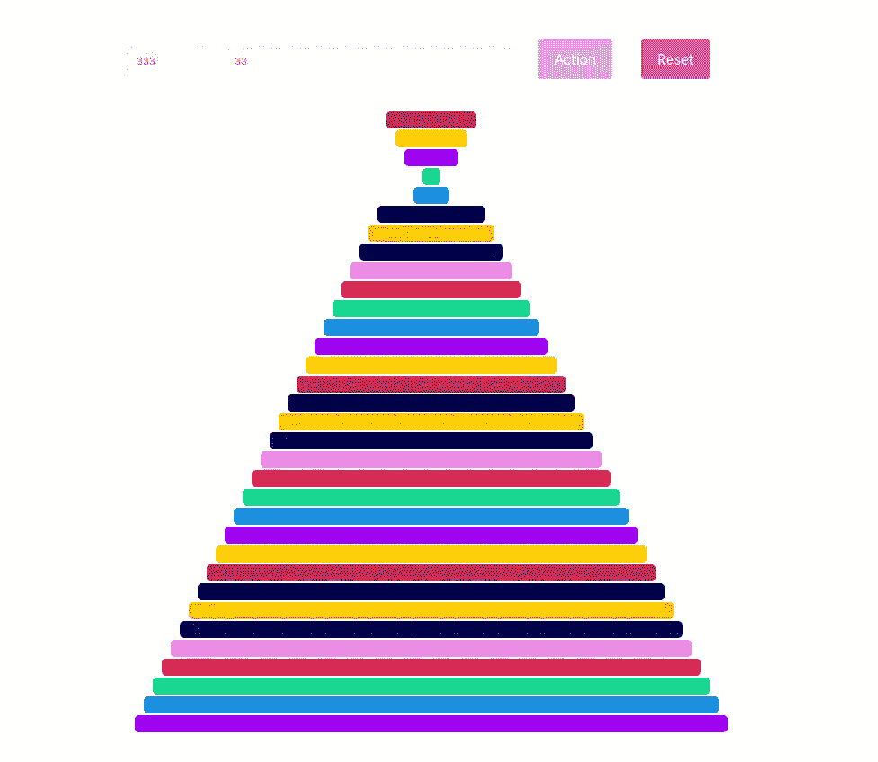

# 用 React 和 Popmotion.io 可视化煎饼算法

> 原文：<https://itnext.io/visualize-pancakes-algorithm-with-react-and-popmotion-io-91683b554609?source=collection_archive---------9----------------------->

煎饼算法可视化

你将在下面看到的应该是我在一次编码挑战中给出的一个练习的解决方案的一部分。那是几个月前的事了，我已经签到了。由于不可预见的因素，我还没有走到最后。现在，在那个时间和挑战结束后，我可以在这里分享它。

这不是一个循序渐进的教程。而是快速回顾一下我们如何使用 React 和 Popmotion.io 这样的框架和算法。并为同样的算法创建一个很好的可视化。不知何故感觉很好！🤓

所谓的[煎饼排序算法](https://en.wikipedia.org/wiki/Pancake_sorting)很有名(还是不出名？)排序算法，有兴趣的话可以在网上看很多。它的性质超出了本文的范围。多亏了 [Popmotion.io](https://popmotion.io/pose/) ，在这里我们只能看到它的动画效果。

这是你可以玩的[现场演示](https://pancakes-algorithm.herokuapp.com/)。这里的[是你可以找到它的源代码的地方。可以随意查看，仔细看看。你可以试着修改我做的动画。我会非常有兴趣看到你的版本:)](https://gitlab.com/mihailgaberov/pancake-algorithm-visualizer)

仅此而已。好看又短，非常适合夏天！☀️ 🏖

🔥感谢阅读！🔥